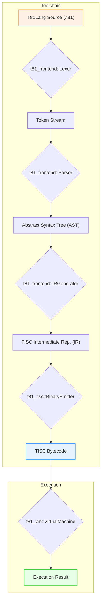

# T81 Foundation: Architecture Overview

This document provides a high-level map of the T81 C++ codebase, its components, and the data flow from source code to execution.

______________________________________________________________________

## 1. Guiding Principles

- **Specification is the Source of Truth:** The `/spec` directory contains the formal, normative definition of the system. The C++ implementation must conform to the spec. If there is a discrepancy, the spec is considered correct.
- **Layered & Decoupled Components:** The system is organized into distinct libraries with clear responsibilities and dependencies, managed by CMake.
- **Header-Only Core Types:** Core data types in `t81_core` are often header-only for portability and performance, while more complex logic is in compiled `.cpp` files.

______________________________________________________________________

## 2. Component Overview (CMake Libraries)

The C++ codebase is structured as a set of static libraries that depend on each other. Understanding these libraries is key to understanding the architecture.

| Library          | Path (`/src`, `/include`) | Responsibilities                                                                        | Core Dependencies |
| ---------------- | ------------------------- | --------------------------------------------------------------------------------------- | ----------------- |
| `t81_core`       | `core/`, `hanoi/`, etc.   | Foundational data types (`T81Int`, `Fraction`, `Tensor`), stubs (CanonFS, Axion), VM state. | (none)            |
| `t81_io`         | `io/`                     | I/O utilities, primarily for loading tensors from disk.                                 | `t81_core`        |
| `t81_tisc`       | `tisc/`                   | TISC data structures, pretty-printing, and binary encoding/decoding (`BinaryEmitter`).  | `t81_core`        |
| `t81_frontend`   | `frontend/`               | The T81Lang compiler: Lexer, Parser, AST, Symbol Table, and IR Generator.               | `t81_tisc`        |
| `t81_vm`         | `vm/`                     | The TISC virtual machine interface and interpreter-based execution loop.                | `t81_core`        |

The main executable target, `t81`, acts as a command-line driver that integrates these components.

______________________________________________________________________

## 3. Compilation and Execution Flow

The central purpose of the T81 toolchain is to compile high-level T81Lang source code into low-level TISC bytecode, which is then executed by the virtual machine.

This process flows through several distinct stages, each handled by a different component:

1.  **Lexing (`Lexer`):** The raw source code string is converted into a sequence of tokens (e.g., identifiers, keywords, operators).
2.  **Parsing (`Parser`):** The token stream is parsed to build an Abstract Syntax Tree (AST), a hierarchical representation of the code's structure. The parser is a recursive-descent implementation.
3.  **IR Generation (`IRGenerator`):** The AST is traversed in a "post-order" fashion (visiting children before the parent). For each node, the generator emits one or more TISC instructions in a simple, linear Intermediate Representation (IR).
4.  **Binary Emission (`BinaryEmitter`):** The textual/structured IR is encoded into its final, compact binary bytecode format. This involves a two-pass process to resolve jump labels into concrete addresses.
5.  **Execution (`VirtualMachine`):** The VM loads the TISC bytecode and executes it instruction by instruction in a simple fetch-decode-execute loop.

______________________________________________________________________

## 4. Key Architectural Boundaries

- **Frontend vs. TISC:** The `t81_frontend` library is responsible for all source language processing. Its sole output is the TISC IR. It has no knowledge of the VM or binary formats.
- **TISC vs. VM:** The `t81_tisc` library defines the *format* of the instruction set. The `t81_vm` library provides the *implementation* that executes that format. This separation allows for different backends (e.g., an interpreter, a JIT compiler) to target the same stable TISC representation.
- **Core vs. Everything:** The `t81_core` library is foundational and must not depend on any higher-level components like the frontend or TISC. It provides the universal data structures used by all other parts of the system.
