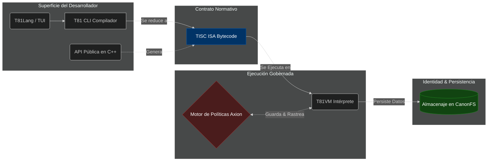

<p align="center">
  
</p>

# T81: Una Arquitectura Ternaria Determinista

<p align="center">
  <a href="https://github.com/t81dev/t81-foundation/releases/latest"></a>
  <a href="https://github.com/t81dev/t81-foundation/actions/workflows/ci.yml"></a>
  <a href="./LICENSE"></a>
  
</p>

[English](./README.md) | [简体中文](./README.zh-CN.md) | [Español](./README.es.md) | [Русский](./README.ru.md) | [Português](./README.pt-BR.md)

<!-- T81-SPEED-START -->
<!-- T81-SPEED-END -->

T81 Foundation es una pila de computación **nativa ternaria y de determinismo primero**, diseñada específicamente para la reproducibilidad matemática exacta, el manejo de datos criptográficamente canónicos y la gobernanza activa de políticas de tiempo de ejecución.

Proporcionamos una pila de ejecución vertical diseñada para investigadores, programadores de sistemas y entornos de seguridad crítica donde el no-determinismo, el comportamiento indefinido y las fallas no reportadas son inaceptables. En nuestro núcleo hay un paradigma ternario en base 81 (`T81`) que logra propiedades de escalado ternario nativas al mismo tiempo que utiliza vectorización SWAR para un rendimiento de última hora en el hardware binario estándar.

---

### 🚀 [Guía de Inicio Rápido: Compilación e Instalación](docs/user-guide/quickstart/INSTALL.md)

---

## 🏛️ Arquitectura del Ecosistema

La mayoría de las pilas tecnológicas modernas abordan el determinismo, las auditorías y las protecciones de seguridad como abstracciones secundarias añadidas tras los propios sistemas caóticos. **T81 invierte totalmente este enfoque.** Cada capa se ejecuta de forma rigurosamente alineada a representaciones canónicas salvaguardadas por el motor de núcleo Axion.



### 🧩 Pilares Principales

| Sistema | Rol | Estado de Madurez | Paradima del Diseño | 
| :--- | :--- | :--- | :--- |
| **`TISC` ISA** | **Estructura del Conjunto de Instrucciones** | **Congelado** | Contrato seguro de serialización de operaciones para la fluidez estructural, manejo matemático riguroso y enrutamiento puro de los datos. |
| **`T81VM`** | **La Senda Principal de Ejecución** | **Beta** | Máquina virtual codificada expresamente para ejecutar `TISC`. Limita matemáticamente hasta último punto los trit de cálculos perjudiciales. |
| **`Axion`** | **El Motor de Políticas Base** | **Beta** | Entorno de marco para contingencias dinámicas operando dentro de un ciclo principal, dando validez formal a todo paso ejecutado y rastreándolo activamente. |
| **`CanonFS`**| **Estructura de Ficheros e Identidad** | **Beta** | Manejo del archivo matriz en arreglos predeterminados de `.tisc` orientados al hash para dar lugar y control sin precedentes previniendo intentos de adulterar datos. |
| **`T81Lang`**| **Norte del Frontend de Desarrollo** | **Beta** | Fachada del TISC, entregando programación orientada hacia funciones de Tensores, enumeración controlada o seguridad nativa. |


## 👀 Programando con T81Lang

T81Lang rinde fachada hacia nuestras directrices del modelo general TISC ISA. Toma conceptos matemáticos y maneja matrices enterizas por de forma natural. 

```t81
// Define una función exenta a errores de respuesta
func parse_safe(opt_input: Option<Int32>) -> Int32 {
    match opt_input {
        Some(v) => { v * 2 }
        None => { 0 }
    }
}

// Control explícito de fallos
func calculate_checked(val: Int32) -> Result<Int32, String> {
    if val < 0 {
        return Err("Bajo la normativa general en uso los montos deben ser positivos u orgánicos")
    }
    return Ok(val * 81)
}
```

## 🛠️ Utilizando la API de C++

Si requieres crear una funcionalidad general de C++, el entorno predefinido funciona armónicamente a lo interno del ecosistema en su totalidad.

```cpp
#include <iostream>
#include <t81/types/T81Int.hpp>
#include <t81/types/bigint.hpp>

int main() {
    // Trazos exactos del representación total
    t81::T81Int<9> canonical_val(42);
    std::cout << "Se obtiene el perfil general C++: " << canonical_val.to_int64() << "\n";
    
    // Matemática pura exacta bit a bit
    t81::core::types::T81BigInt big("2145326462463276537653242");
    std::cout << big.to_string() << "\n";
}
```

## 🧭 Mapa de Documentación

Todo documento técnico referencial se desarrolla apegado a dictámenes.
- **[Aprende a Compilar & Empezar (INSTALL)](docs/user-guide/quickstart/INSTALL.md)**
- **[Análisis y Arquitectura General](docs/architecture/OVERVIEW.md)**
- **[El Eje Principal de Controles y Estado](docs/status/PROJECT_CONTROL_CENTER.md)**
- **[Instrucciones Técnicas de Comandos por CLI](docs/user-guide/reference/cli-user-manual.md)**
- **[Registro Formal y Especificaciones de Autoría](spec/)**
- **[Lectura Complementaria Extensiva T81](book/book-en/README.md)**

## 🤝 Contribuciones a Código Abierto e Interacción Comunitaria

Abrazamos toda asistencia que siga expresamente las filosofías que dieron origen de este sistema:
1. **Autoridad Primero-la-Especificación (Spec-First):** El directorio `/spec` rige la implementación a un nivel canónico de C++.
2. **Determinismo Primero:** Todo arreglo y reubicación debe apegarse al código núcleo (Perfil Principal Determinista (DCP)) equitativo.
3. **Malla de Seguridad Base:** Modelologías e intefaz general cognitiva paralela u experimental NO tiene o puede dar cabida interactuando en niveles canónicos.

Ve al portal de contacto [`CONTRIBUTING.md`](CONTRIBUTING.md) antes de publicar su intención, como también a repasar [`SECURITY.md`](SECURITY.md) del reporte seguro y confidencial.

---
*La entrega completa o el aporte principal de codificación nativa del software T81 Foundation corresponde enteramente con la Licencia General [MIT License](LICENSE).*

> **Note:** All determinism guarantees are strictly bounded by the [Determinism Surface Registry](docs/governance/DETERMINISM_SURFACE_REGISTRY.md).
