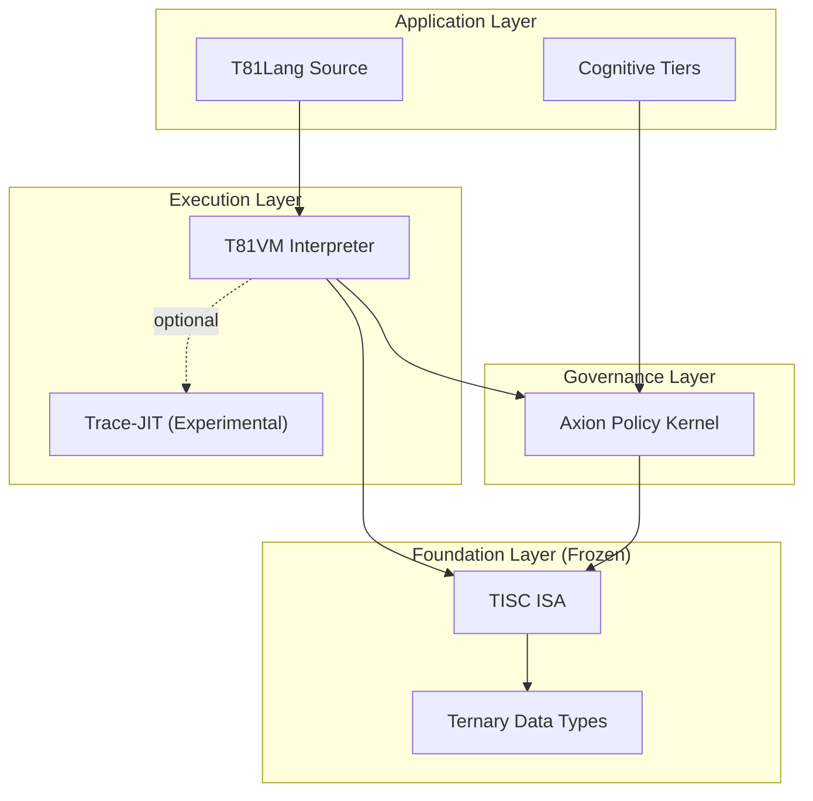

<p align="center">
  
</p>

<p align="center">
  <a href="https://github.com/t81dev/t81-foundation/releases/latest"></a>
  <a href="https://github.com/t81dev/t81-foundation/actions/workflows/ci.yml"></a>
  <a href="https://github.com/t81dev/t81-foundation/blob/main/LICENSE"></a>
  <a href="https://en.cppreference.com/w/cpp/23"></a>
</p>

<p align="center">
  <strong>La pila de computación ternaria determinista</strong><br>
  <em>Reproducibilidad bit a bit. Lógica nativa ternaria. Gobernanza de IA auditable.</em>
</p>

<p align="center">
  <a href="README.md">English</a> •
  <a href="README.zh-CN.md">简体中文</a> •
  <a href="README.es.md">Español</a> •
  <a href="README.ru.md">Русский</a> •
  <a href="README.pt-BR.md">Português</a>
</p>

---

## Características

### ¿Qué es T81?

**T81** es una pila de computación soberana construida desde cero para la **determinación** y la **lógica ternaria**. Reduce el no determinismo en superficies explícitamente verificadas y proporciona una base matemáticamente rigurosa para IA de alto riesgo, criptografía y modelado científico.

Donde los sistemas tradicionales divergen entre arquitecturas, T81 apunta a reproducibilidad bit a bit en superficies explícitamente verificadas, con garantías acotadas por el registro de determinismo y el perfil del núcleo.

### La promesa central: determinismo verificado

| Característica | El problema (Binario/IEEE 754) | La solución T81 |
| :--- | :--- | :--- |
| **Aritmética** | Deriva de punto flotante entre arquitecturas CPU/GPU. | **Soft-float determinista (acotado):** Comportamiento bit a bit en superficies explícitamente verificadas bajo el registro/perfil de determinismo. |
| **Lógica** | Booleano (Verdadero/Falso) pierde matices. | **Ternario balanceado:** {-1, 0, +1} para árboles de decisión eficientes y sin deriva. |
| **Seguridad** | Los modelos de IA son cajas negras sin garantías de ejecución. | **Kernel Axion:** Políticas de gobernanza aplicables y auditables a nivel de opcode. |
| **Estabilidad** | Cambios incompatibles constantes y caos de dependencias. | **Especificaciones congeladas:** TISC ISA y Tipos de Datos son estándares inmutables. |

---

## Arquitectura

T81 está organizado en capas estrictas de autoridad y abstracción.



*   **Capa base:** El núcleo "congelado". `T81BigInt`, `T81Float` y la ISA **TISC** (Ternary Instruction Set Computer). Los cambios aquí requieren un incremento de versión mayor.
*   **Capa de ejecución:** **T81VM** ejecuta bytecode TISC. Incluye un intérprete determinista y un Trace-JIT experimental, con reclamos de determinismo acotados a superficies gobernadas/verificadas.
*   **Capa de gobernanza:** El **Kernel Axion** intercepta la ejecución para aplicar políticas de seguridad, límites de recursos y guardrails éticos definidos en la configuración.

---

## Inicio Rápido

Construye la pila T81 desde el código fuente.

### Requisitos previos
*   **CMake** 3.16+
*   **Compilador C++** con soporte C++20/23 (probado en AppleClang 17+, Clang 18+, GCC 14+, MSVC)

### Instalación

```bash
# 1. Clonar el repositorio
git clone https://github.com/t81dev/t81-foundation.git
cd t81-foundation

# 2. Configurar y compilar
cmake -S . -B build -DCMAKE_BUILD_TYPE=Release
cmake --build build --parallel

# 3. Verificar instalación (ejecuta la compuerta de determinismo)
python3 scripts/ci/t81lang_repro_gate.py --t81-bin build/t81 --check
```

### Hello World (estilo ternario)

Crea un archivo llamado `hello.t81`:

```t81
fn main() {
    print("Hello, Deterministic World!");
    let a: trit = 1;
    let b: trit = -1;
    print(a + b); // Muestra "0"
}
```

Compila y ejecuta:

```bash
# Compilar a bytecode TISC
./build/t81 compile hello.t81 -o hello.tisc

# Ejecutar en la VM
./build/t81 run hello.tisc
```

---

## Plataformas Soportadas

| Plataforma | Arq | Compilador | Estado |
| :--- | :--- | :--- | :--- |
| **Linux** | x86_64 | Clang 18+, GCC 14+ | ✅ Verificado |
| **Linux** | ARM64 | Clang 18+ | ✅ Verificado |
| **macOS** | Intel | Apple Clang / GCC | ✅ Verificado |
| **macOS** | Apple Silicon | Apple Clang | ✅ Verificado |

## Ejemplos CLI

```bash
# Desarrollo
./build/t81 compile src.t81 -o out.tisc
./build/t81 run out.tisc
./build/t81 disasm out.tisc

# Diagnóstico y calidad
./build/t81 doctor --json
./build/t81 test --list
./build/t81 fmt --check src.t81
```

---

## 📚 Documentación

El ecosistema T81 está documentado en varios niveles de autoridad.

| Recurso | Descripción | Autoridad |
| :--- | :--- | :--- |
| **[The Monograph](book/book-en/README.md)** | El libro definitivo sobre filosofía, arquitectura y uso de T81. **Empieza aquí.** | Alta |
| **[Normative Specs](spec/)** | Fuente normativa de verdad de las especificaciones. Define la ISA TISC, Tipos de Datos y comportamiento de VM. | **Absoluta** |
| **[Architecture](docs/architecture/OVERVIEW.md)** | Documento "North Star" que define límites del sistema e invariantes. | Alta |
| **[Status Dashboard](docs/status/PROJECT_CONTROL_CENTER.md)** | Seguimiento en vivo de salud del sistema, compuertas activas y superficies verificadas. | En vivo |
| **[Governance](docs/governance/)** | Políticas de deriva de especificaciones, disciplina de release y modelos de amenazas. | Alta |

### Temas clave
*   **[TISC Instruction Set](spec/tisc-spec.md)** - Especificación de ISA congelada.
*   **[Ternary Data Types](spec/t81-data-types.md)** - Entender `trit`, `tryte` y `T81Float`.
*   **[Axion Policy Engine](spec/axion-kernel.md)** - Configuración de seguridad en ejecución.

## Mapa de Autoridad Documental

La autoridad normativa está en `spec/`; el estado operativo y de gobierno se rastrea en `docs/status/` y `docs/governance/`.

---

## 🧩 Componentes y estado

| Componente | Estado | Descripción |
| :--- | :--- | :--- |
| **TISC ISA** | 🧊 **Congelado** | El conjunto de instrucciones está verificado e inmutable (v1). |
| **Tipos de Datos** | 🧊 **Congelado** | Los tipos aritméticos del núcleo son estables; las garantías bit a bit están acotadas a superficies deterministas verificadas. |
| **T81VM** | 🚧 **Beta** | La superficie de runtime está activa y bajo verificación continua. |
| **Axion** | ⚠️ **Alpha** | El motor de políticas está activo con cobertura parcial sobre superficies en borrador. |
| **T81Lang** | 🚧 **Beta** | La madurez de implementación es Beta; la especificación normativa del lenguaje sigue en Draft. |
| **Trace-JIT** | 🧪 **Experimental** | Compilación JIT para rendimiento (opt-in). |
| **Hanoi Kernel** | 🗃️ **Concepto archivado** | Concepto histórico experimental mantenido solo como referencia de diseño. |

> **Nota:** Los componentes "congelados" tienen garantía contractual de no cambiar sin un incremento de versión mayor (por ejemplo, 2.0).

---

## 🤝 Comunidad y contribución

Damos la bienvenida a colaboradores que compartan nuestra pasión por sistemas rigurosos y deterministas.

*   **[Contributing Guide](CONTRIBUTING.md):** Léelo antes de abrir un PR.
*   **[Code of Conduct](CODE_OF_CONDUCT.md):** Seguimos un estándar estricto de conducta profesional.
*   **[Discussions](https://github.com/t81dev/t81-foundation/discussions):** Haz preguntas y comparte ideas.

### La "Repro Gate"
Los checks requeridos de Pull Request aplican compuertas de reproducibilidad y conformidad para superficies deterministas acotadas. Si tu cambio altera salidas deterministas gobernadas, la compuerta correspondiente debe fallar. Esto es una feature, no un bug.

---

## 📄 Licencia

T81 es software de código abierto bajo la **[Licencia MIT](LICENSE)**.

Copyright © 2024-2026 T81 Foundation.
