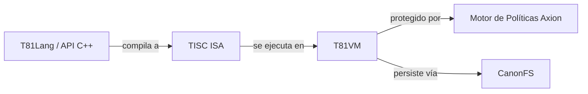

<p align="center">
  
</p>

# T81: Una Arquitectura Ternaria Determinista

<p align="center">
  <a href="https://github.com/t81dev/t81-foundation/releases/latest"></a>
  <a href="https://github.com/t81dev/t81-foundation/actions/workflows/ci.yml"></a>
  <a href="./LICENSE"></a>
  
</p>

[English](./README.md) | [简体中文](./README.zh-CN.md) | [Español](./README.es.md) | [Русский](./README.ru.md) | [Português](./README.pt-BR.md)

<!-- T81-SPEED-START -->
<!-- T81-SPEED-END -->

T81 Foundation es una pila de computación nativa ternaria y determinista diseñada para ingenieros, investigadores y programadores de sistemas que requieren una ejecución matemáticamente reproducible, un manejo de datos canónico y políticas de tiempo de ejecución aplicables.

Combina un conjunto de instrucciones estable, una máquina virtual gobernada, un frontend de lenguaje y una API pública de C++ en un solo repositorio. El proyecto está dirigido a aquellos que construyen tiempos de ejecución (runtimes), herramientas de lenguaje, sistemas con auditorías exhaustivas y experimentos reproducibles.

## ¿Por qué T81?

La mayoría de las pilas tecnológicas modernas tratan el determinismo, la auditabilidad y la gobernanza como preocupaciones secundarias, añadiéndolas después de que el tiempo de ejecución ya existe. T81 adopta el enfoque opuesto:
- **Construido para el Determinismo:** Construimos en torno a representaciones canónicas y comportamientos de falla explícitos desde el principio.
- **Nativo Ternario:** El sistema ternario balanceado y las codificaciones en base 81 son parte de la base. A través de la vectorización SWAR y los *trits* empaquetados en 2 bits, T81 logra semánticas ternarias nativas con alto rendimiento en hardware binario.
- **Ejecución Consciente de Políticas:** El motor de políticas Axion hace cumplir las decisiones dinámicamente en tiempo de ejecución dentro del flujo de ejecución, asegurando que la gobernanza no sea solo una verificación consultiva.
- **Límites Estrictos:** Las afirmaciones de determinismo están explícitamente limitadas al **Perfil Principal Determinista (DCP)**. Las características experimentales están rígidamente aisladas para prevenir comportamientos indefinidos.

## Arquitectura y Estado del Sistema

T81 está integrado verticalmente, desde APIs de lenguajes de alto nivel hasta un sustrato de ejecución gobernado. Nuestra madurez es explícita: los límites principales están *Congelados*, mientras que las superficies experimentales están claramente marcadas. T81 se encuentra en desarrollo activo con madurez mixta en toda la pila.

| Componente | Rol | Estado de Madurez |
| :--- | :--- | :--- |
| **`include/t81/`** | Superficie de la API pública de C++ para consumidores y compilaciones *downstream*. | **Mixto** |
| **Data Types** | Números principales, representaciones canónicas (`core/types/`). | **Congelado** (Verificado DCP) |
| **TISC ISA** | El contrato estable de la máquina para serialización y ejecución. | **Congelado** (Verificado DCP) |
| **T81VM** | La ruta de tiempo de ejecución de referencia para la ejecución reproducible. | **Beta** |
| **CanonFS** | Persistencia determinista y límites de identidad. | **Beta** |
| **T81Lang** | Frontend que compila hacia TISC ISA. | **Beta** |
| **Axion** | Motor de políticas de tiempo de ejecución integrado en la ruta de pasos de la máquina virtual. | **Alpha** |



*Las cadenas de herramientas (toolchains) compatibles actualmente verificadas en CI incluyen Ubuntu 24.04 con GCC 14 y Clang 18, Ubuntu 24.04 ARM64 con Clang 18, macOS 14 ARM64 con Apple Clang y Windows Server 2022 con MSVC sobre una base de mejor esfuerzo (best-effort).*

## Estructura del Repositorio

- [`./include/t81/`](./include/t81/) contiene los encabezados públicos para los consumidores de la biblioteca.
- [`./examples/`](./examples/) contiene demostraciones de C++, ejemplos de T81Lang y ejemplos de consumidores.
- [`./docs/`](./docs/) es el centro de documentación para guías de inicio rápido, arquitectura, estado y gobernanza.
- [`./book/`](./book/) contiene material más extenso en forma de monografía y de estilo tutorial.
- [`./spec/`](./spec/) contiene las especificaciones normativas y RFCs.
- [`./tests/`](./tests/) contiene las pruebas unitarias, de integración, de conformidad y orientadas al determinismo.
- [`./core/`](./core/) contiene los módulos del tipo principal, implementación de ISA y VM.
- [`./src/`](./src/) contiene componentes de tiempo de ejecución como códecs, E/S (IO) y CanonFS.
- [`./tooling/`](./tooling/) contiene CLI y código de herramientas de modelos utilizados en los flujos de trabajo enviados para desarrolladores.
- [`./.github/workflows/`](./.github/workflows/) contiene automatización para CI, reproducibilidad, documentación, evaluación comparativa (benchmarks) y lanzamientos (releases).

## Empezando

### Requisitos previos
- CMake 3.16+
- Un compilador con capacidad para C++23 (C++20 soportado mediante `-DT81_USE_CXX23=OFF`)
- Python 3.10+ (para puertas de reproducibilidad)
- Ninja o Make

### Clonar y Construir
```bash
git clone https://github.com/t81dev/t81-foundation.git
cd t81-foundation
cmake -S . -B build -G Ninja -DCMAKE_BUILD_TYPE=Release
cmake --build build --parallel
```

### Ejecutar Pruebas y Verificar Determinismo
```bash
# Ejecutar el conjunto de pruebas principal
ctest --test-dir build --output-on-failure

# Verificar la puerta de reproducibilidad
mkdir -p build/t81lang-repro
python3 scripts/ci/t81lang_repro_gate.py \
  --t81-bin build/t81 \
  --fixtures-dir tests/fixtures/t81lang_determinism \
  --workdir build/t81lang-repro \
  --hash-out build/t81lang-repro/hash.txt \
  --expected-hash-file tests/fixtures/t81lang_determinism/t81lang_repro_hash.txt
```

### Ejecutar Ejemplos Incluidos
```bash
./build/t81_demo
./build/t81_tensor_ops
./build/t81_ir_roundtrip
```

### Compilar y ejecutar un ejemplo de T81Lang
```bash
./build/t81 code check examples/hello_world.t81
./build/t81 code build examples/hello_world.t81 -o build/hello_world.tisc
./build/t81 code run build/hello_world.tisc
```

*Otros puntos de entrada comunes incluyen `./build/t81 project init`, `./build/t81 env doctor`, `./build/t81 weights ...`, `./build/t81 trace ...`, `./build/t81 canonfs ...`, `./build/t81 determinism ...`, `./build/t81 vm ...`, `./build/t81 tisc ...` e `./build/t81 ir ...`. Consulte [`./docs/user-guide/reference/cli-user-manual.md`](./docs/user-guide/reference/cli-user-manual.md) para ver la superficie actual de comandos.*

### Ejemplo Mínimo de Consumidor (C++)

```cpp
#include <iostream>
#include <t81/types/T81Int.hpp>

int main() {
  t81::T81Int<9> value(42);
  std::cout << value.to_int64() << "\n";
}
```

Para el uso de CMake intermedio, consulte [`./examples/consumer_cmake/`](./examples/consumer_cmake/).

**Instalar y consumir como un paquete de CMake**

```bash
cmake --install build --prefix /tmp/t81_install
cmake -S examples/consumer_cmake -B /tmp/t81_consumer_build -DCMAKE_PREFIX_PATH=/tmp/t81_install
cmake --build /tmp/t81_consumer_build --parallel
/tmp/t81_consumer_build/t81_consumer
```

```cmake
find_package(T81Foundation CONFIG REQUIRED)
target_link_libraries(t81_consumer PRIVATE T81::t81_core)
```

## Ejemplos

- [`./examples/hello_world.t81`](./examples/hello_world.t81) es el ejemplo de compilación y ejecución de T81Lang de extremo a extremo más pequeño.
- [`./examples/option_result_match.t81`](./examples/option_result_match.t81) demuestra control de flujo con tipo estático con `Option` y `Result`.
- [`./examples/tensor_ops.cpp`](./examples/tensor_ops.cpp) demuestra remodelar (reshape), dividir (slice), transponer tensores y otras operaciones relacionadas.
- [`./examples/axion_policy_runner.cpp`](./examples/axion_policy_runner.cpp) destaca la ejecución consciente de políticas y la generación de seguimientos (traces).
- [`./examples/system-integration/inference.t81`](./examples/system-integration/inference.t81) junto con [`./examples/system-integration/secure_model.apl`](./examples/system-integration/secure_model.apl) muestra un flujo de trabajo más completo de T81Lang + Axion.
- [`./examples/tisc/`](./examples/tisc/) contiene muestras precompiladas `.tisc` para desensamblaje, depuración e inspección del tiempo de ejecución.
- [`./examples/consumer_cmake/`](./examples/consumer_cmake/) muestra cómo un proyecto de CMake *downstream* puede consumir los encabezados y *targets* públicos.

## Pruebas de Rendimiento (Benchmarks)

T81 incluye un conjunto de pruebas de rendimiento (benchmarks) para números centrales, rutas de tensores, trabajo SIMD/base81, CanonFS y *kernels* de la VM. El ejecutor ahora tiene perfiles locales explícitos: `smoke` de forma predeterminada, `full` acotado para uso humano y `deep` exhaustivo para investigaciones o ejecuciones nocturnas.

```bash
cmake --build build --target benchmark_runner
```

```bash
# Perfil smoke de forma predeterminada: genera un archivo JSON. Los informes Markdown 
# solo se escriben si se establece T81_BENCHMARK_WRITE_REPORTS=1.
./build/benchmarks/benchmark_runner \
  --benchmark_format=json \
  --benchmark_out=bench.json
```

```bash
# Perfil full para uso humano:
T81_BENCHMARK_PROFILE=full ./build/benchmarks/benchmark_runner \
  --benchmark_format=json \
  --benchmark_out=bench-full.json

# Perfil deep exhaustivo para investigación/ejecución nocturna:
T81_BENCHMARK_PROFILE=deep ./build/benchmarks/benchmark_runner \
  --benchmark_format=json \
  --benchmark_out=bench-deep.json

# Iteración local con filtrado personalizado:
./build/benchmarks/benchmark_runner \
  --benchmark_filter='BM_(ArithThroughput|NegationSpeed|RoundtripAccuracy|overflow|PackingDensity|MemoryBandwidth|Add_1024_bit|Add_2048_bit|T81LangCompile|LimbArithThroughput|LimbAdd_T81Native|LimbAdd_T81Limb|LimbAdd_Int128|vs_).*' \
  --benchmark_format=json \
  --benchmark_out=bench-smoke.json

# o por medio de la envoltura (wrapper) CLI
./build/t81 internal benchmark --benchmark_filter='BM_(ArithThroughput|T81LangCompile).*'

# La envoltura CLI mantiene por defecto apagada la generación de reportería
T81_BENCHMARK_WRITE_REPORTS=1 ./build/t81 internal benchmark --benchmark_filter='BM_(ArithThroughput|T81LangCompile).*'
```

Para metodología y notas específicas sobre las pruebas de rendimiento, consulte [`./benchmarks/README.md`](./benchmarks/README.md) y [`./docs/developer-guide/tools/README.md`](./docs/developer-guide/tools/README.md).

## Documentación

T81 mantiene una jerarquía de documentación estricta. **El directorio `/spec` es normativo.**
- **Visión General de la Arquitectura:** [`docs/architecture/OVERVIEW.md`](docs/architecture/OVERVIEW.md)
- **Estado y Centro de Control:** [`docs/status/PROJECT_CONTROL_CENTER.md`](docs/status/PROJECT_CONTROL_CENTER.md)
- **Manual de Usuario CLI:** [`docs/user-guide/reference/cli-user-manual.md`](docs/user-guide/reference/cli-user-manual.md)
- **Guía de Reproducibilidad:** [`docs/reference/REPRODUCIBILITY.md`](docs/reference/REPRODUCIBILITY.md)
- **Especificaciones Formales:** [`spec/`](spec/)
- **Libro extenso:** [`book/book-en/README.md`](book/book-en/README.md)

## Contribuciones

Las contribuciones son bienvenidas, pero por favor tenga en cuenta nuestra filosofía principal:
1. **Autoridad Primero-la-Especificación (Spec-First):** El directorio `/spec` dicta la implementación, y no al revés.
2. **Determinismo Primero:** Cualquier cambio debe preservar el comportamiento canónico y pasar compuertas de reproducibilidad estrictas.
3. **Gobernanza Acotada:** Las características experimentales (como las Capas Cognitivas) no deben filtrarse dentro del Perfil Determinista Principal (DCP).

Comience leyendo [`CONTRIBUTING.md`](CONTRIBUTING.md) y [`CODE_OF_CONDUCT.md`](CODE_OF_CONDUCT.md). Para detalles sobre gobernanza, revise el material en [`docs/governance/`](docs/governance/). Para reportes privados de vulnerabilidades, siga [`SECURITY.md`](SECURITY.md).

## Licencia

La Fundación T81 se publica bajo la Licencia MIT. Consulte [`LICENSE`](LICENSE).
