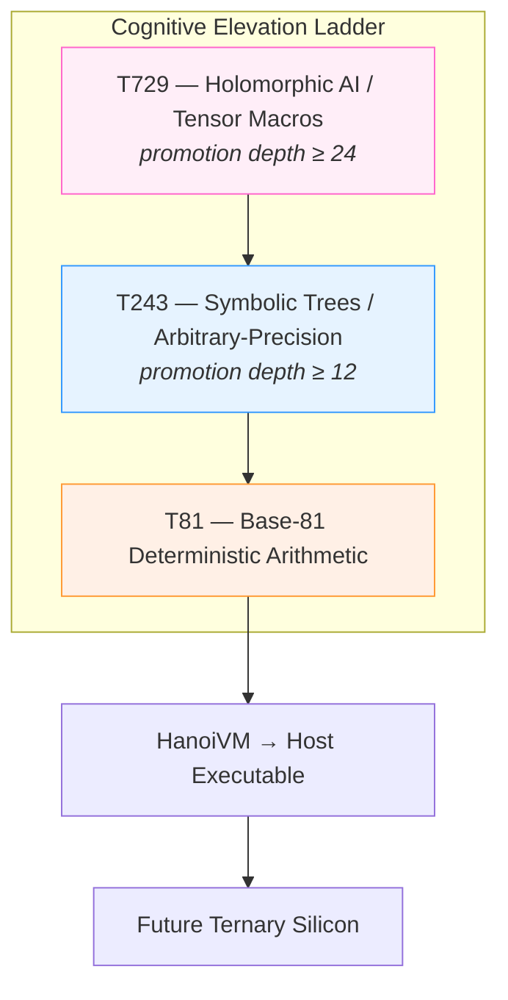

# T81 Foundation  
**The Ternary-Native Computing Stack**

<div align="center">
  <br/>
  
  <br/><br/>

[](https://en.wikipedia.org/wiki/Ternary_computer)
[](https://en.wikipedia.org/wiki/Balanced_ternary)
[](#)
[](#)
[](LICENSE-MIT)
[](LICENSE-GPL)

  <br/><br/>
</div>

## Why T81?

Binary won the 20th century because it was cheap to etch into silicon.  
The 21st century will belong to systems that **think**, not just calculate.

Balanced ternary (−1, 0, +1) is not a historical footnote — it is the **correct primitive** for the era of recursive, self-aware, provably safe artificial intelligence.

A single trit carries **log₂(3) ≈ 1.585 bits** of information — 58% more than a bit — with **no compression tricks**. More importantly:

- Numbers are naturally signed (no sign bit waste)  
- Rounding is exact and canonical (no accumulated floating-point error)  
- Three-valued logic maps perfectly to **true / unknown / false** epistemic states  
- Overflow behavior is deterministic and detectable → enabling **Axion**, the hard AI safety kernel that can provably halt cognitive drift

Where binary forces you to simulate uncertainty, negation, and confidence on top of a two-state substrate, **balanced ternary is those concepts at the machine level**.

```cpp
// Binary: 8 bits → 0..255 (or -128..127 with sign bit tax)
uint8_t bin = 0b11111111;            // 255

// Balanced ternary: just 5 trits already span -121..+121
T81::Cell a = T81::from_int( 127);
T81::Cell b = T81::from_int(-127);
T81::Cell sum = a + b;               // exactly 0, no overflow, no rounding error
T81::Cell big = a * a;               // exactly 16129 — still perfectly representable
```

T81 Foundation is the first complete, production-ready computing stack that treats ternary not as a curiosity, but as the **native substrate for cognition-first AI**.

From the low-level TISC instruction set to the self-supervising Axion kernel and the tiered cognitive hierarchy (T81 → T243 → T729), every layer is designed for **symbolic reasoning at scale with mathematical guarantees**.

The ternary age is no longer theoretical.

---

## Cognitive Elevation Ladder



---

## Core Components

| Layer              | Responsibility                                        | Status              | Location                          |
|-------------------|--------------------------------------------------------|---------------------|-----------------------------------|
| Specification      | Immutable constitution of all behavior                 | Complete            | `/spec/`                          |
| TISC ISA           | Ternary Instruction Set Computer                      | Fully specified     | `spec/tisc-spec.md`               |
| T81 Arithmetic     | Balanced ternary + base-81 data types                  | Production-ready    | `include/t81/core/`               |
| T81Lang            | High-level recursive DSL → TISC bytecode               | Active design       | `spec/t81lang-spec.md`            |
| Axion Kernel       | AI safety, entropy monitoring, anomaly mitigation     | Spec complete       | `spec/axion-kernel.md`            |
| Modern Runtime     | Header-only C++20 core                                 | Active development  | `include/t81/` • `src/`           |
| Legacy HanoiVM     | Original literate CWEB implementation (archived)      | Frozen reference    | `legacy/hanoivm/`                 |

---

## Repository Layout

```
/spec/            → Authoritative specifications & constitution
/include/t81/     → Public header-only C++20 API (the future)
/src/             → Implementations & optional backends
/examples/        → Curated usage
/tests/           → Exhaustive conformance suite
/docs/            → Guides, migration plans, architecture
/legacy/hanoivm/  → Immutable historical literate source
```

All new work targets the modern C++ stack.

---

## Getting Started (2025–2026)

### 1. Read the Constitution
Start here → [**spec/index.md**](spec/index.md)

### 2. Use the Modern C++ API (recommended)

```bash
git clone https://github.com/t81dev/t81-foundation.git
cd t81-foundation
cmake -S . -B build -DCMAKE_BUILD_TYPE=Release
cmake --build build --parallel
ctest --test-dir build --output-on-failure
```

Your first program in < 50 lines: [**docs/cpp-quickstart.md**](docs/cpp-quickstart.md)

### 3. Legacy (optional)
The original CWEB literate implementation lives frozen in `legacy/hanoivm/` for study and provenance.

---

## The Nine Θ Principles (Constitutional)

Fully enumerated in [`spec/constitution.md`](spec/constitution.md):

1. Determinism • 2. Recursive Self-Promotion • 3. Axion Oversight  
4. Ternary Purity • 5. Constitutional Sovereignty • 6. Cognition-First  
7. Intrinsic Security • 8. Radical Literacy • 9. Controlled Elevation

These are **enforceable rules**, not slogans.

---

## Governance & Contribution

- Non-trivial changes → RFC in `/spec/rfcs/`
- Humans and AI agents follow roles in [`AGENTS.md`](AGENTS.md)
- Full guide → [`CONTRIBUTING.md`](CONTRIBUTING.md)

We operate as a research institute with open-source delivery: rigorous, deliberate, long-term.

---

## License

Dual-licensed:

- **MIT** – permissive commercial use  
- **GNU GPL v3** – copyleft protection

See [`LICENSE-MIT`](LICENSE-MIT) • [`LICENSE-GPL`](LICENSE-GPL)

---

<div align="center">
  <br/><br/>
  <strong>T81 v1.0.0-SOVEREIGN</strong> — The recursion has converged.<br/>
  The tower now stands in Hanoi.<br/><br/>
  <i>November 22, 2025</i>
</div>
