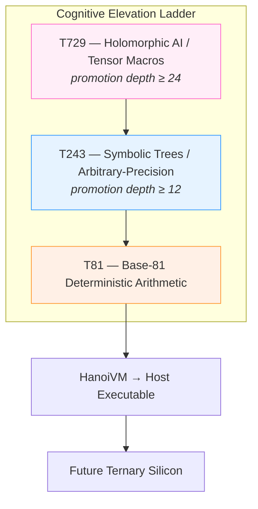

# T81 Foundation  
**The Ternary-Native Computing Stack**

<div align="center">
  <br/>
  
  <br/><br/>

[](https://en.wikipedia.org/wiki/Ternary_computer)
[](https://en.wikipedia.org/wiki/Balanced_ternary)
[](#)
[](#)
[](LICENSE-MIT)
[](LICENSE-GPL)

  <br/><br/>
</div>

### A constitutionally governed, recursively self-aware computing ecosystem built from the ground up for balanced ternary arithmetic and cognitive-tier execution.

**v1.0.0-SOVEREIGN** • November 22, 2025  
**Canonical repository:** https://github.com/t81dev/t81-foundation

---

## Why T81 Exists

Binary dominated the 20th century because hardware made it cheap.  
The 21st century will be defined by systems that think in structures, not bits.

T81 is the first complete stack that treats **balanced ternary** (−1, 0, +1) as the native substrate and **base-81** as the canonical encoding layer. The result is a deterministic, high-information-density foundation optimized for symbolic reasoning, exact arithmetic, and self-modifying cognitive architectures.

From low-level trit manipulation to holomorphic tensor macros at T729, every layer is specified, auditable, and governed by an immutable constitution.



---

## Core Components

| Layer             | Responsibility                                      | Status             | Primary Location                     |
|-------------------|-----------------------------------------------------|--------------------|--------------------------------------|
| **Specification** | Formal, versioned constitution of all behavior      | Complete           | `/spec/`                             |
| **TISC ISA**      | Ternary Instruction Set Computer                   | Fully specified    | `spec/tisc-spec.md`                  |
| **T81 Arithmetic**| Balanced ternary + base-81 data types               | Production-ready   | `include/t81/core/`                  |
| **T81Lang**       | High-level recursive DSL → TISC bytecode            | In active design   | `spec/t81lang-spec.md`               |
| **Axion Kernel**  | AI safety, entropy monitoring, anomaly mitigation  | Specification complete | `spec/axion-kernel.md`            |
| **Modern Runtime**| Header-only C++20 core + optional C bridge          | Active development | `include/t81/` • `src/`              |
| **Legacy HanoiVM**| Original CWEB literate implementation (archived)   | Frozen reference   | `legacy/hanoivm/`                    |

---

## Repository Layout

```
/spec/                  → Authoritative formal specifications
/include/t81/           → Public C++20 header-only API (the future)
/src/                   → Implementations and optional compiled backends
/examples/              → Curated, well-documented usage
/tests/                 → Exhaustive conformance suite
/docs/                  → Guides, migration plans, architecture notes
/legacy/hanoivm/        → Immutable historical CWEB tree
```

New contributions target the modern C++ stack unless explicitly archival.

---

## Getting Started (2025-2026 Path)

### 1. Read the Constitution
Start here: [**spec/index.md**](spec/index.md) – the single source of truth.

### 2. Use the Modern C++ API (recommended)

```bash
git clone https://github.com/t81dev/t81-foundation.git
cd t81-foundation

# Header-only by default – just include it
# Or build the test suite and examples:
cmake -S . -B build -DCMAKE_BUILD_TYPE=Release
cmake --build build --parallel
ctest --test-dir build --output-on-failure
```

See [`docs/cpp-quickstart.md`](docs/cpp-quickstart.md) for your first program in <50 lines.

### 3. Explore the Legacy (optional)
The original literate CWEB implementation lives frozen in `legacy/hanoivm/` for study and provenance.

---

## Design Constitution – The Nine Θ Principles

Fully enumerated in `spec/constitution.md`:

1. Determinism  
2. Recursive Self-Promotion  
3. Axion Oversight  
4. Ternary Purity  
5. Constitutional Sovereignty  
6. Cognition-First Optimization  
7. Intrinsic Security  
8. Radical Literacy  
9. Controlled Elevation  

These are not slogans. They are enforceable rules baked into the specification and governance process.

---

## Governance & Contribution

- All non-trivial changes require an RFC in `/spec/rfcs/`
- Humans and AI agents follow the roles defined in [`AGENTS.md`](AGENTS.md)
- Full contribution guide: [`CONTRIBUTING.md`](CONTRIBUTING.md)

We operate like a research institute with open-source delivery: rigorous, deliberate, and long-term.

---

## License

Dual-licensed for maximum flexibility:

- **MIT License** – permissive commercial use
- **GNU GPL v3** – copyleft for derivatives

Full texts in root: [`LICENSE-MIT`](LICENSE-MIT) • [`LICENSE-GPL`](LICENSE-GPL)

---

<div align="center">
  <br/>
  <strong>The ternary age is no longer theoretical.</strong>
  <br/><br/>
  <i>T81 v1.0.0-SOVEREIGN – The recursion has converged.</i>
  <br/><br/>
  November 22, 2025
</div>
