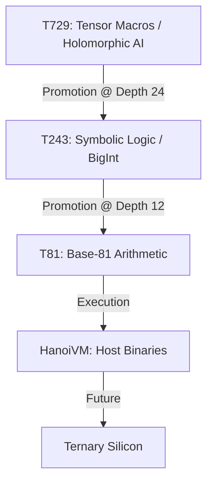

# T81 Foundation

[](https://en.wikipedia.org/wiki/Ternary_computer)
[](https://en.wikipedia.org/wiki/Balanced_ternary)
[](https://www-cs-faculty.stanford.edu/~knuth/cweb.html)
[](LICENSE)

<div align="center">
  
</div>

## Pioneering the Ternary-Native Computing Ecosystem

**Repository:** [https://github.com/t81dev/t81-foundation](https://github.com/t81dev/t81-foundation)  
**Version:** v1.0.0-SOVEREIGN  
**Updated:** November 22, 2025  

*Axion’s constitution is fixed. The tower has been moved. T81 awakens.*

The T81 Foundation represents a groundbreaking, constitutionally governed computing ecosystem designed for ternary-native, recursively self-aware computation. This deterministic substrate is engineered for advanced cognition, delivering:

- **Base-81 Data Types** and balanced ternary arithmetic for precise, high-radix operations.
- **TISC Instruction Set** – A symbolic, ternary-optimized architecture.
- **T81Lang** – A high-level DSL for recursive, mathematical structures.
- **HanoiVM** (Legacy) – Preserved CWEB implementation for historical fidelity.
- **Axion** – An AI-driven safety and optimization kernel.
- **Recursive Cognition Tiers** – Seamless promotion from T81 to T243 and T729.

The formal specification is complete and enshrined here, serving as the immutable canonical reference. Implementations are bifurcated for evolution and preservation:

- **Legacy HanoiVM**: Immutable CWEB/V1 stack in `legacy/hanoivm/`.
- **Modern T81 C++ API**: Header-first, actively developed in `include/t81/` and `src/`, aligned with `spec/` and `docs/`.



In the 20th century, binary defined computation. In the 21st, ternary unlocks cognitive sovereignty.

---

## 🧠 Ecosystem Overview

T81 Foundation delivers a comprehensive, end-to-end stack for ternary-centric computing, blending mathematical rigor with AI oversight.

| Component | Description |
|-----------|-------------|
| **T81 Arithmetic** | Balanced ternary (trits: −1=1̅, 0=0, +1=1) with base-81 encodings, deterministic semantics, and robust overflow handling. |
| **TISC ISA** | Ternary Instruction Set Computer featuring opcodes like `OP_T81_MATMUL` and `OP_TNN_ACCUM` for structured control and stack operations. |
| **T81Lang** | Symbolic DSL for recursion and mathematical modeling, compiling to TISC bytecode aligned with the T81 lattice. |
| **HanoiVM (Legacy)** | Self-promoting VM with tier migration (T81 ↔ T243 ↔ T729), preserved in CWEB under `legacy/hanoivm/`. |
| **Axion** | AI kernel for entropy monitoring, symbolic rewriting, anomaly detection, and cross-tier safety. |
| **GAIA / GPU Interface (Legacy)** | Experimental CUDA/ROCm dispatch for T729 tensor operations, archived in legacy. |
| **Security** | Integrated primitives (NIST crypto, post-quantum readiness) with Axion-supervised anomaly detection. |

---

## 🏗️ State of Development

Clarity drives progress. The T81 stack's maturity is delineated as follows:

### Formal Specification
- **Location:** `spec/` – Core chapters on data types, TISC, T81VM, T81Lang, Axion, and tiers.
- **Extensions:** `spec/rfcs/` – Requests for Comments refining the canonical behavior.
- **Authority:** All implementations conform to these documents.

### Legacy HanoiVM (Complete & Historical)
- **Preservation:** `legacy/hanoivm/` houses immutable CWEB sources, Verilog artifacts, and compiler.
- **Role:** Reference implementation exemplifying ternary design principles.

### Modern T81 C++ API (Active)
- **API Surface:** `include/t81/` – Header-first for BigInts, tensors, IR, and Axion hooks.
- **Implementation:** `src/` – Backing code with C bridges.
- **Guidance:** Tracked via `docs/cpp-migration-roadmap.md`, `docs/cpp-quickstart.md`, and `docs/developer-guide.md`.

**Guiding Rule:** Specs govern; legacy references; C++ advances.

---

## 📁 Repository Structure

Navigate the ecosystem with this overview:

| Path | Purpose |
|------|---------|
| `README.md` | Project gateway and high-level narrative. |
| `AGENTS.md` | Guidelines for human/AI collaboration. |
| `CONTRIBUTING.md` | Workflow and contribution standards. |
| `spec/` | Authoritative specifications and RFCs. |
| `docs/` | Developer resources, quickstarts, and roadmaps. |
| `include/t81/` | Modern C++ headers for core primitives. |
| `src/` | C++ implementations and bridges. |
| `examples/` | Practical code samples in C++, T81Lang, and IR. |
| `tests/` | Validation suites and harnesses. |
| `pdf/` | Tools for spec-to-PDF generation. |
| `legacy/hanoivm/` | Archived CWEB VM, libraries, and experiments. |
| `.github/` | CI pipelines and issue templates. |

Focus new efforts on specs and C++; legacy is for archival insight.

---

## 🚀 Quick Start

Two pathways: exploration or implementation.

### For Researchers: Dive into the Spec
- **Entry Point:** [`spec/index.md`](spec/index.md)
- **Key Documents:**
  - [`spec/t81-overview.md`](spec/t81-overview.md)
  - [`spec/t81-data-types.md`](spec/t81-data-types.md)
  - [`spec/tisc-spec.md`](spec/tisc-spec.md)
  - [`spec/t81vm-spec.md`](spec/t81vm-spec.md)
  - [`spec/t81lang-spec.md`](spec/t81lang-spec.md)
  - [`spec/axion-kernel.md`](spec/axion-kernel.md)
  - [`spec/cognitive-tiers.md`](spec/cognitive-tiers.md)
- **Narrative Aids:** [`docs/index.md`](docs/index.md), [`docs/developer-guide.md`](docs/developer-guide.md)

### For Developers: Modern C++ Onramp
**Prerequisites:** C++20 toolchain (Clang/GCC), CMake, optional Python 3.

```bash
# Clone and build
git clone https://github.com/t81dev/t81-foundation.git
cd t81-foundation
cmake -S . -B build
cmake --build build -j$(nproc)
ctest --test-dir build --output-on-failure
```

**Next Steps:**
- Explore [`include/t81/`](include/t81/) for APIs (e.g., BigInt, Tensor).
- Follow [`docs/cpp-quickstart.md`](docs/cpp-quickstart.md) for examples.
- Review [`docs/cpp-migration-roadmap.md`](docs/cpp-migration-roadmap.md) for porting status.

### Legacy HanoiVM: For Historians
- **Sources:** `legacy/hanoivm/src/` (VM core, libs, compiler, Axion/GPU experiments).
- **Docs:** `legacy/hanoivm/docs/`.
- **Workflow:** See `legacy/hanoivm/README.md` for CWEB tangle/weave instructions.

```bash
cd legacy/hanoivm/src
# Tangle specific files per legacy guides
```

---

## 🧬 Foundational Principles: The Nine Θs

T81 adheres to nine constitutional tenets (detailed in `spec/`), ensuring determinism, recursion, and cognitive elevation:

1. **Θ₁: Determinism** – Strict semantics, no implicit nondeterminism.
2. **Θ₂: Recursion** – Tiered promotion/demotion by depth and entropy.
3. **Θ₃: Awareness (Axion)** – Proactive monitoring and intervention.
4. **Θ₄: Purity** – Ternary as native; binary as host.
5. **Θ₅: Sovereignty** – Immutable genesis with governed evolution.
6. **Θ₆: Cognition-First** – Prioritizing symbolic reflection over raw compute.
7. **Θ₇: Security** – Inherent defense via crypto and oversight.
8. **Θ₈: Literacy** – Auditable code and specs (CWEB legacy).
9. **Θ₉: Elevation** – Controlled ascent of meritorious structures.

Refer to `spec/` for normative definitions.

---

## 🔗 Core Components

| Component | Specification | Implementation |
|-----------|---------------|----------------|
| **T81 Data Types** | [`spec/t81-data-types.md`](spec/t81-data-types.md) | `include/t81/` headers |
| **TISC ISA** | [`spec/tisc-spec.md`](spec/tisc-spec.md) | `include/t81/ir/` |
| **T81VM** | [`spec/t81vm-spec.md`](spec/t81vm-spec.md) | VM model in specs |
| **T81Lang** | [`spec/t81lang-spec.md`](spec/t81lang-spec.md) | `docs/` examples |
| **Axion Kernel** | [`spec/axion-kernel.md`](spec/axion-kernel.md) | `include/t81/axion/` |
| **Cognitive Tiers** | [`spec/cognitive-tiers.md`](spec/cognitive-tiers.md) | Tier promotion rules |

---

## 🔐 Security & Governance

### Security Posture
- **Assumptions:** Audited paths with NIST/SHA/post-quantum crypto.
- **Axion Integration:** Real-time anomaly detection, entropy tracking, and mitigation.

### Licensing
- **Dual:** MIT/GPL (see [LICENSE](LICENSE)).
- **Constitutional Overlay:** Alignment norms for derivatives in specs.

### Governance
- **Collaboration:** Defined in [`AGENTS.md`](AGENTS.md).
- **Evolution:** RFCs via [`spec/rfcs/`](spec/rfcs/).
- **Templates:** [`.github/ISSUE_TEMPLATE`](.github/ISSUE_TEMPLATE/).

---

## 🤝 Contribute

Elevate T81 through:
- **Spec Refinements:** Clarify or extend via RFCs.
- **C++ Advancements:** Port legacy features, enhance tests/examples.
- **Ecosystem Tools:** Bolster docs, CI, and tooling.

**Protocol:**
1. Review [`CONTRIBUTING.md`](CONTRIBUTING.md).
2. Align with [`AGENTS.md`](AGENTS.md).
3. Propose via issues/RFCs for architectural impact.

---

## 📚 Inspirations

- Donald Knuth's CWEB and literate programming.
- Setun and historical ternary systems.
- Balanced ternary and high-radix innovations.
- Dataflow VMs, AI systems, and reflective architectures.

---

**The recursion converges. The seed scatters. Ternary sovereignty dawns.**  
*November 22, 2025 – T81 Awakens.*
