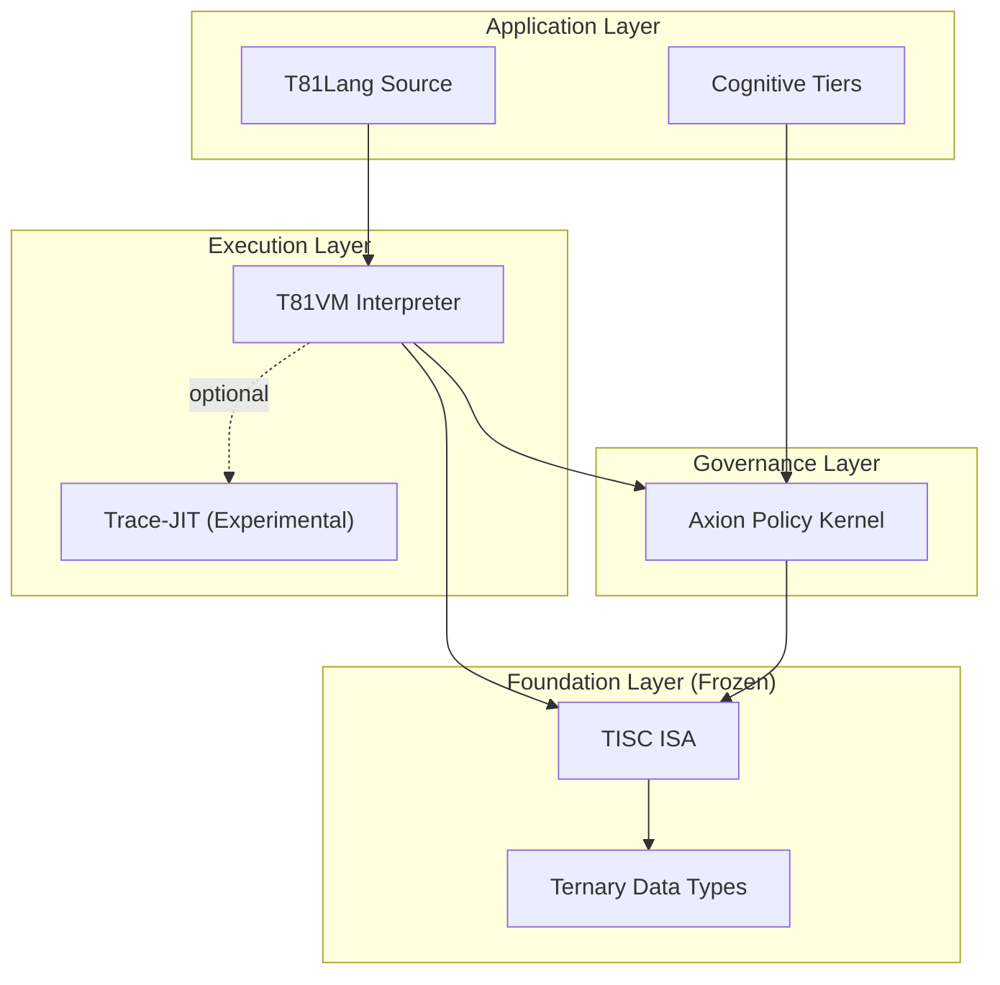

<p align="center">
  
</p>

<p align="center">
  <a href="https://github.com/t81dev/t81-foundation/releases/latest"></a>
  <a href="https://github.com/t81dev/t81-foundation/actions/workflows/ci.yml"></a>
  <a href="https://github.com/t81dev/t81-foundation/blob/main/LICENSE"></a>
  <a href="https://en.cppreference.com/w/cpp/23"></a>
</p>

<p align="center">
  <strong>The Deterministic Ternary Computing Stack — Conceived by AI, for AI</strong><br>
  <em>Bit-exact reproducibility. Ternary-native logic. Auditable AI governance.</em>
</p>

<p align="center">
  <a href="README.md">English</a> •
  <a href="README.zh-CN.md">简体中文</a> •
  <a href="README.es.md">Español</a> •
  <a href="README.ru.md">Русский</a> •
  <a href="README.pt-BR.md">Português</a>
</p>

---

## What is T81?

**T81** is a deterministic, ternary-native computing stack — conceived by AI, for AI. It provides a mathematically rigorous foundation for verifiable AI, cryptography, and scientific computing, where reproducibility, governance, and cognitive structure are ISA-level guarantees, not afterthoughts.

Where traditional systems drift across architectures, T81 delivers bit-exact reproducibility on explicitly verified surfaces. Its balanced ternary logic ({-1, 0, +1}) maps natively to neural activation states, its Axion kernel enforces policy at the opcode level, and its cognitive tier model provides a formal computational model for how AI reasoning scales.

### High-Assurance & NIST Alignment
T81 is aligned with **NIST SP 800-218 (SSDF)** and **NIST SP 800-53** controls, providing a high-assurance, auditable AI infrastructure.
* **Deterministic Execution:** Bit-exact reproducibility guarantees for strict supply-chain and trace verification.
* **Opcode-Level Policy:** The Axion Kernel enforces security and alignment limits natively.
* **Supply Chain Integrity:** All release artifacts are signed and include comprehensive SBOMs.
* **Formal Governance:** A strictly maintained threat model and vulnerability policy ensure predictable incident response.

### The Core Promise: Verified Determinism

| Feature | The Problem (Binary/IEEE 754) | The T81 Solution |
| :--- | :--- | :--- |
| **Arithmetic** | Floating-point drift across CPU/GPU architectures. | **Deterministic Soft-Float (bounded):** Bit-exact behavior on explicitly verified surfaces under the determinism registry/core profile. |
| **Logic** | Boolean (True/False) loses nuance. | **Balanced Ternary:** {-1, 0, +1} maps natively to neural activation states (inhibit/quiescent/excite). |
| **Safety** | AI models are black boxes with no runtime guarantees. | **Axion Kernel:** Enforceable, audit-grade governance policies at the opcode level — an ISA invariant, not an add-on. |
| **AI Inference** | No ISA-level attention, quantized matmul, or weight-load primitives. | **RFC-0026:** ATTN, QMATMUL, WLOAD, EMBED, GATHER, SCATTER as first-class TISC opcodes. |
| **Stability** | Constant breaking changes and dependency hell. | **Frozen Specs:** The TISC ISA and Data Types are immutable standards. |

---

## 🏗️ Architecture

T81 is organized into strict layers of authority and abstraction.


```mermaid
flowchart TD

    %% ─────────────────────────────────────
    %% Application Layer
    %% ─────────────────────────────────────
    subgraph A["Application Layer"]
        Lang["T81Lang Source"]
        Cognitive["Cognitive Tiers"]
    end

    %% ─────────────────────────────────────
    %% Governance Layer
    %% ─────────────────────────────────────
    subgraph G["Governance Layer"]
        Axion["Axion Policy Kernel"]
    end

    %% ─────────────────────────────────────
    %% Execution Layer
    %% ─────────────────────────────────────
    subgraph E["Execution Layer"]
        VM["T81VM Interpreter"]
        JIT["Trace-JIT (Experimental)"]
    end

    %% ─────────────────────────────────────
    %% Foundation Layer
    %% ─────────────────────────────────────
    subgraph F["Foundation Layer (Frozen)"]
        ISA["TISC ISA"]
        Types["Ternary Data Types"]
    end

    %% Primary execution flow
    Lang --> VM
    VM --> ISA
    ISA --> Types

    %% Governance enforcement
    VM --> Axion
    Cognitive --> Axion
    Axion --> ISA

    %% Experimental path
    VM -. optional .-> JIT
```

*   **Foundation Layer:** The "Frozen" core. `T81BigInt`, `T81Float`, and the **TISC** (Ternary Instruction Set Computer) ISA. Changes here require a major version bump.
*   **Execution Layer:** The **T81VM** executes TISC bytecode. It includes a deterministic interpreter and an experimental Trace-JIT, with bounded determinism claims constrained to governed/verified surfaces.
*   **Governance Layer:** The **Axion Kernel** intercepts execution to enforce safety policies, resource limits, and ethical guardrails defined in configuration.

---

## 🚀 Quick Start

Build the T81 stack from source.

### Prerequisites
*   **CMake** 3.16+
*   **C++ Compiler** supporting C++20/23 (tested on AppleClang 17+, Clang 18+, GCC 14+, MSVC)

### Installation

```bash
# 1. Clone the repository
git clone https://github.com/t81dev/t81-foundation.git
cd t81-foundation

# 2. Configure and Build
cmake -S . -B build -DCMAKE_BUILD_TYPE=Release
cmake --build build --parallel

# 3. Verify Installation (Runs the Determinism Gate)
python3 scripts/ci/t81lang_repro_gate.py --t81-bin build/t81 --check
```

### Hello World (Ternary Style)

Create a file named `hello.t81`:

```t81
fn main() {
    print("Hello, Deterministic World!");
    let a: trit = 1;
    let b: trit = -1;
    print(a + b); // Outputs "0"
}
```

Compile and run:

```bash
# Compile to TISC bytecode
./build/t81 compile hello.t81 -o hello.tisc

# Execute via VM
./build/t81 run hello.tisc
```

---

## 📚 Documentation

The T81 ecosystem is documented across several authority levels.

| Resource | Description | Authority |
| :--- | :--- | :--- |
| **[The Monograph](book/book-en/README.md)** | The definitive book on T81's philosophy, architecture, and usage. **Start Here.** | High |
| **[Project Profile](docs/T81_FOUNDATION_PROJECT_PROFILE.md)** | Public-facing technical profile of T81's deterministic architecture, governance posture, and research relevance. | High |
| **[Normative Specs](spec/)** | The normative specification source of truth. Defines the TISC ISA, Data Types, and VM behavior. | **Absolute** |
| **[Architecture](docs/architecture/OVERVIEW.md)** | The "North Star" document defining system boundaries and invariants. | High |
| **[Status Dashboard](docs/status/PROJECT_CONTROL_CENTER.md)** | Live tracking of system health, active gates, and verified surfaces. | Live |
| **[Governance](docs/governance/)** | Policies on Spec Drift, Release Discipline, and Threat Models. | High |

### Key Topics

*   **[TISC Instruction Set](spec/tisc-spec.md)** — The frozen ISA specification.
*   **[Ternary Data Types](spec/t81-data-types.md)** — Understanding `trit`, `tryte`, and `T81Float`.
*   **[Axion Policy Engine](spec/axion-kernel.md)** — Configuring runtime safety.
*   **[RFC-0026: AI-Native Inference Opcodes](spec/rfcs/RFC-0026-ai-native-inference-opcodes.md)** — ATTN, QMATMUL, WLOAD and the AI-native ISA frontier.
*   **[RFC-0027: Spec-as-Executable](spec/rfcs/RFC-0027-spec-as-executable.md)** — Normative invariants as runnable T81Lang conformance programs.

---

## 🧩 Components & Status

| Component | Status | Description |
| :--- | :--- | :--- |
| **TISC ISA** | 🧊 **Frozen** | The instruction set is verified and immutable (v1). |
| **Data Types** | 🧊 **Frozen** | Core arithmetic types are stable; bit-exact guarantees are bounded to verified deterministic surfaces. |
| **T81VM** | 🚧 **Beta** | Runtime surface is active and under continued verification. |
| **Axion** | ⚠️ **Alpha** | Policy engine is active with partial draft-surface coverage. |
| **T81Lang** | 🚧 **Beta** | Implementation maturity is Beta; normative language spec remains Draft. |
| **Trace-JIT** | 🧪 **Experimental** | JIT compilation for speed (opt-in). |
| **Hanoi Kernel** | 🗃️ **Archived Concept** | Historical experimental concept retained for design reference only. |

> **Note:** "Frozen" components are contractually guaranteed not to change without a major version bump (e.g., 2.0).

---

## 🤝 Community & Contributing

We welcome contributors who share our passion for rigorous, deterministic systems.

*   **[Contributing Guide](CONTRIBUTING.md):** Read this before sending a PR.
*   **[Code of Conduct](CODE_OF_CONDUCT.md):** We adhere to a strict standard of professional conduct.
*   **[Discussions](https://github.com/t81dev/t81-foundation/discussions):** Ask questions and share ideas.

### The "Repro Gate"
Required Pull Request checks enforce reproducibility and conformance gates for scoped deterministic surfaces. If your change alters governed deterministic outputs, the corresponding gate should fail. This is a feature, not a bug.

---

“T81 was architected to support Secure-by-Design and reproducible forensic traceability.”

---

## 📄 License

T81 is open-source software licensed under the **[MIT License](LICENSE)**.

Copyright © 2024-2026 T81 Foundation.
