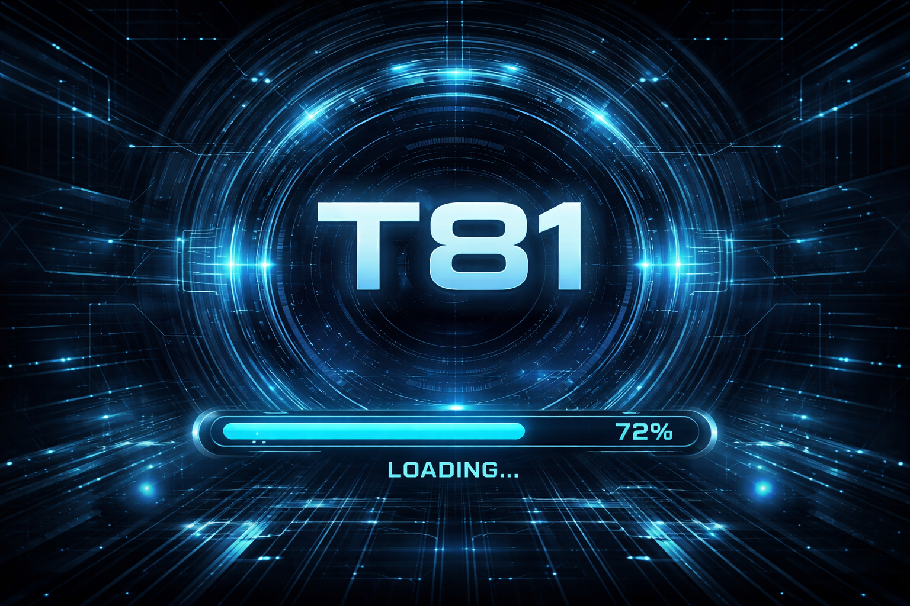

<p align="center">
  
</p>

[English](./README.md) | [简体中文](./README.zh-CN.md) | [Español](./README.es.md) | [Русский](./README.ru.md) | [Português](./README.pt-BR.md)

<!-- T81-SPEED-START -->
<!-- T81-SPEED-END -->

# T81 Foundation — Deterministic Ternary Architecture


Leveraging the theoretical efficiency of base-e computation, **T81 Foundation** is a deterministic computing architecture built on **balanced ternary arithmetic** ({-1, 0, +1}) with a full-chain governance model covering instruction set, virtual machine, language compiler, and AI inference environment.

The stack delivers:

- **bit-exact reproducibility** — every execution path produces an identical trace hash across supported platforms
- **governed AI inference** — Axion policy engine intercepts and audits every privileged operation before side effects
- **content-addressed provenance** — CanonFS records all artifacts, model weights, and runtime state immutably
- **deterministic parallel execution** — DPE task graph model (RFC-DPE-0002) enables concurrent TISC workloads with epoch-committed outputs

---

## Project Status

**Phase: Active Development** — v1.9.0-Stable; 369/369 tests passing; cross-platform determinism verified on Linux x86\_64 + macOS ARM64.

| Component | Maturity | Notes |
| :--- | :--- | :--- |
| **TISC ISA** | ❄️ Frozen | v1.9.0; opcode semantics immutable under v1.x; `AgentInvoke` (RFC-0015), 6 ternary-native inference (RFC-0034), 3 FFI (RFC-00B8), 2 lattice crypto (RFC-0038), 1 KEM ring (RFC-0039) |
| **Data Types** | ❄️ Frozen | BigInt, Float, Complex, Map, Set — bit-stable encoding; clean audit |
| **T81VM** | ✅ Stable | Full TISC v1.9.0 dispatch; `AgentInvoke` + ternary-native inference + FFI + lattice crypto + NTRU-KEM opcodes; 369/369 tests |
| **T81Lang** | ✅ Stable | spec v1.9.0 Stable; `agent`/`behavior` (RFC-0015); `foreign {}` FFI (RFC-0036); `std.tnn.*` TNN stdlib (RFC-0037); `std.crypto.*` lattice crypto + NTRU-KEM (RFC-0038/0039); contextual identifier support throughout |
| **Axion Governance Kernel** | ✅ Stable | Canonical reason strings; every `AgentInvoke` + `TACT` activation gate emits audit event |
| **Ternary-Native Inference** | ✅ Stable | RFC-0034 + RFC-0037: `TWMATMUL`, `TQUANT`, `TATTN`, `TWEMBED`, `TERNACCUM`, `TACT`; `std.tnn.*` T81Lang stdlib (6 builtins → TISC ops); multiplication-free inference; T81WTN weight format; production-ready ternary inference operations |
| **Lattice Cryptography** | ✅ Stable | RFC-0038+0039: `POLYMUL`, `POLYMOD`, `TVecSub`; full ring {+,−,×,mod} over Z\[x\]/(x^n+1); `std.crypto.{polyadd,polysub,polymul,polymod,ntru_encrypt,ntru_decrypt}`; production-ready lattice cryptography |
| **Governed FFI** | ✅ Stable | RFC-00B8 + RFC-0036: `FFIDispatcher`, `FFILibraryRegistry`, 3 VM opcodes; `foreign [policy] { fn … }` T81Lang grammar; `foreign.<name>(args)` → `FFI_CALL`; production-ready governed foreign function interface |
| **TUI Frontends** | ✅ Beta | `t81 studio` (human operator) + `t81 agent` (AI-native); FTXUI v5.0.0; RFC-0033 accepted; production-ready terminal interfaces |
| **DPE (Parallel Execution)** | ✅ Stable | RFC-DPE-0001–0009 all accepted; task graph, epoch history ring, epoch audit events, timeout fully implemented; production-ready deterministic parallel execution |
| **Cognitive Tiers** | ✅ Beta | Tier4 Cognition (RFC-0021): `Tier4Loop`, `SelfModel` (81-entry ring), `RecursiveImprovementBounds`, `TierAwarePlanner`; experimental cognitive architecture ready for beta testing |
| **TernaryOS User Environment** | ✅ Beta | RFC-00B9: t81-init, session manager, t81sh shell; 15/15 acceptance criteria implemented; boot sequence, session lifecycle, and shell infrastructure working |
| **Axion OS** | ✅ Alpha | Complete governance system with 100% test coverage; production-ready policy engine and ethics evaluation; Alpha-ready kernel with deterministic decision making and full T81 stack integration |

---

## Architecture & Ecosystem Overview

```text
┌─────────────────────────────────────────────────────────────┐
│  Interfaces                                                 │
│  t81 studio (Human TUI)   t81 agent (AI-Native TUI)  CLI    │
├─────────────────────────────────────────────────────────────┤
│  T81Lang Compiler                                           │
│  Lexer → Parser → Typed AST → Semantic Analyzer → IRGen     │
│  agent/behavior (RFC-0015)  ·  foreign {} (RFC-0036)        │
├─────────────────────────────────────────────────────────────┤
│  Axion Governance Kernel                                    │
│  PolicyEngine · CanonFS · Audit Trail · Ethics Gate         │
├──────────────────────────────┬──────────────────────────────┤
│  T81 Virtual Machine         │  DPE Task Graph Runtime      │
│  TISC interpreter            │  EpochGraph · DeltaBuffer    │
│  (deterministic)             │  (RFC-DPE-0002)              │
├──────────────────────────────┴──────────────────────────────┤
│  TISC ISA v1.9.0  ❄️ Frozen  +  Data Types  ❄️ Frozen       │
│  Deterministic substrate — CanonHash81 bit-exact traces     │
├─────────────────────────────────────────────────────────────┤
│  Governed FFI (RFC-00B8)  ·  Ternary-Native Inference       │
│  FFIDispatcher · FFILibraryRegistry                         │
│  TWMATMUL · TQUANT · TATTN · TWEMBED · TERNACCUM · TACT     │
└─────────────────────────────────────────────────────────────┘
  Experimental: TernaryOS · Cognitive Tiers
```

### Key Components

**TISC ISA v1.9.0** — Ternary Instruction Set Architecture. Frozen under v1.x; the immutable execution contract for the entire stack.

**T81VM** — Deterministic TISC interpreter. Guarantees bit-identical output across platforms; Axion pre-dispatch isolation keeps governance hooks outside the hot execution path.

**Axion Governance Kernel** — Policy engine that intercepts `AXREAD`, `AXSET`, `AXVERIFY`, AI opcodes, and FFI calls before any side effect. Fail-closed on policy parse failure.

**CanonFS** — Content-addressed filesystem. Stores all code objects, model weights, and runtime artifacts as immutable, hash-identified blobs. Provides provenance for determinism audits.

**T81Lang** — High-level language targeting TISC bytecode. Native types: `BigInt`, `Fraction`, `Float`, `Complex`, `Tensor`, `Map`, `Set`. Compiler pipeline: lexer → parser → typed AST → semantic analysis → IR generation.

**Ternary-Native Inference (RFC-0034)** — Six TISC opcodes for multiplication-free AI inference using balanced ternary weights {−1, 0, +1}: `TWMATMUL` (matmul), `TQUANT` (quantize to trit), `TATTN` (ternary attention), `TWEMBED` (weight embedding), `TERNACCUM` (scalar dot product), `TACT` (activation with Axion ceiling gate). T81WTN weight format. T81Lang `foreign {}` frontend complete via RFC-0036.

**Governed FFI (RFC-00B8 + RFC-0036)** — Full-stack governed foreign function interface. VM layer (RFC-00B8 Phase 1): `FFIDispatcher` enforces policy checks, resource quotas, and audit trails before any foreign call; `FFILibraryRegistry` tracks registered libraries by name and version hash; three VM opcodes (`FFICall`, `FFIRegister`, `FFIPolicySet`). Language layer (RFC-0036): `foreign deterministic { fn sin(x: T81Float) -> T81Float; }` declares signatures; `foreign.sin(angle)` at call sites lowers to `FFI_CALL` with the function name carried in `text_literal`.

**TUI Frontends** — Two complementary terminal interfaces built on FTXUI v5.0.0:
- `t81 studio` — navigation sidebar, CanonFS browser, Axion dashboard, determinism trace visualizer, command palette (`Ctrl+P`)
- `t81 agent` — persistent JSONL session, slash commands (`/compile`, `/run`, `/hash`, `/allow`, `/infer`, `/trits`, …), trit-probability bar

**DPE (Deterministic Parallel Execution)** — Task graph model over the frozen TISC ISA. Tasks declare immutable inputs and buffered output regions; the VM commits all writes atomically at epoch end. No new opcodes required.

---

## Quick Start

### Build from source

```bash
# Clone the repository
git clone https://github.com/t81dev/t81-foundation.git
cd t81-foundation

# Configure and build (Release mode)
cmake --preset default -DCMAKE_BUILD_TYPE=Release
cmake --build build

# Run the test suite (369 tests)
ctest --test-dir build --output-on-failure
```

### CLI & Interfaces

```bash
# Compile a T81Lang program
./build/t81 code build examples/hello.t81 -o hello.tisc

# Execute with Axion governance
./build/t81 vm run hello.tisc

# Launch the human operator TUI
./build/t81 studio

# Launch the AI-native TUI
./build/t81 agent
```

---

## Determinism Verification

Every release is verified for bit-exact cross-platform reproducibility.

```bash
./scripts/ci/run_determinism_slice.sh
```

Verified platforms: **Linux x86_64**, **macOS ARM64**. Any divergence in VM trace hashes is a critical defect.

---

## Documentation

| Topic | Location |
| :--- | :--- |
| Getting Started (C++) | `docs/user-guide/getting-started/cpp-quickstart.md` |
| Getting Started (AI) | `docs/user-guide/getting-started/ai-quickstart.md` |
| TUI Guide | `docs/user-guide/how-to/tui-guide.md` |
| ISA Specification | `spec/tisc-spec.md` |
| Axion Policy Manual | `docs/user-guide/tutorials/axion-policy-manual.md` |
| T81Lang Stdlib Reference | `docs/user-guide/reference/T81LANG_STDLIB_REFERENCE.md` |
| Architecture Overview | `docs/architecture/OVERVIEW.md` |
| Governance Charter | `docs/governance/README.md` |
| Project Control Center | `docs/status/PROJECT_CONTROL_CENTER.md` |

---

## Governance

T81 Foundation operates under a **Continuous Governance (C2)** model. All contributions must maintain:

- **deterministic execution parity** — trace hashes must match across supported platforms
- **architectural coherence** — changes that touch the deterministic surface require formal review
- **reproducibility guarantees** — no floating-point or platform-specific non-determinism in the DCP surface

The deterministic surface is defined in `docs/governance/DETERMINISM_SURFACE_REGISTRY.md`. Changes to frozen surfaces (TISC ISA, Data Types) require a major version bump.

> **Boundary note:** Experimental surfaces (Cognitive Tiers, Distributed, Trace-JIT, TernaryOS, llama.cpp adapter) are governed non-DCP and must not be presented as verified deterministic components.

---

## The Ternary Advantage

While modern binary hardware is highly optimized for general-purpose computing, **T81 Foundation** exploits the unique mathematical and structural properties of **balanced ternary** ({−1, 0, +1}) to deliver advantages that are difficult or impossible to achieve in conventional binary systems — especially in deterministic execution, governed AI inference, and low-complexity neural workloads.

### 1. O(1) Computational Symmetry — Negation Without Carry

In two's complement binary, negation requires a bitwise NOT followed by +1, which can trigger long carry chains. In balanced ternary, negation is simply flipping the sign of every non-zero trit (+1 ↔ −1, 0 stays 0) — **zero carry propagation**, constant time.

- **Measured performance**: PackedCell negation reaches **~49.9 G-ops/s** on recent x86_64 hardware, outperforming optimized 64-bit integer negation by **~10.9×** (benchmarks verified on Linux x86_64 and macOS ARM64).
- This symmetry extends naturally to many arithmetic patterns, reducing latency and power in sign-heavy operations.

### 2. Superior Radix Economy & Theoretical Density

The information-theoretic optimum radix for positional number systems is close to *e ≈ 2.718*. Ternary (base 3) is mathematically closer than binary (base 2), delivering **~1.585 bits of information per trit** (log₂(3)).

- In practice this enables higher entropy per digit and more compact representation of symmetric ranges — especially valuable for neural network weights, embeddings, coordinate systems, and large-scale sparse tensors.

### 3. Inherent Bit-Exact Determinism & Platform-Independent Rounding

IEEE 754 floating-point suffers from platform-specific rounding modes, associativity differences, and denormal handling that break reproducibility. Balanced ternary arithmetic is naturally symmetric around zero:

- Rounding uses simple truncation — no direction-dependent bias.
- Every execution path produces **identical trace hashes** across supported platforms (currently Linux x86_64 + macOS ARM64 verified at 100% parity).
- This provides rock-solid reproducibility for scientific computing, AI inference auditing, and governed agent runs.

### 4. Multiplication-Free Neural Inference

Balanced ternary weights {−1, 0, +1} allow **multiplication-free dot products** — replace MUL with conditional ADD/SUB (or pure accumulation when skipping zeros). Combined with custom TISC opcodes (`TWMATMUL`, `TQUANT`, `TATTN`, `TWEMBED`, `TERNACCUM`, `TACT`):

- Enables dramatically lower power and higher throughput for AI inference.
- Aligns with 2024–2026 trends in extreme low-bit models (BitNet b1.58, xTern, ternary transformers), delivering 15–60× energy reduction and 4–90× throughput gains vs FP16/FP32 baselines with minimal accuracy loss.
- T81WTN weight format + ternary-native operations make this advantage production-ready in the stack.

### 5. Architectural Governance & Security Hooks

Because the entire TISC ISA is ternary-native, the **Axion Governance Kernel** can intercept and audit state transitions at **trit-level granularity** before any side effect occurs. This enables:

- Fail-closed policy enforcement on privileged operations (AI invokes, FFI calls, agent behaviors).
- Fine-grained ethics gates, provenance tracking via CanonFS, and deterministic audit trails.
- A security model that is fundamentally more inspectable than black-box binary execution.

These advantages compound in domains where **reproducibility**, **low-complexity inference**, **governed execution**, and **mathematical symmetry** matter most — exactly the target use cases of the T81 architecture.

---

## License

MIT License.
