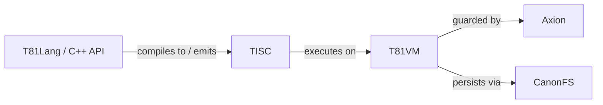

# T81 Foundation

<p align="center">
  <a href="https://github.com/t81dev/t81-foundation/releases/latest"></a>
  <a href="https://github.com/t81dev/t81-foundation/actions/workflows/ci.yml"></a>
  <a href="./LICENSE"></a>
  
</p>

[English](./README.md) | [简体中文](./README.zh-CN.md) | [Español](./README.es.md) | [Русский](./README.ru.md) | [Português](./README.pt-BR.md)

<!-- T81-SPEED-START -->
<!-- T81-SPEED-END -->

T81 Foundation is a deterministic, ternary-native computing stack for engineers and researchers who need reproducible execution, canonical data handling, and enforceable runtime policies. It combines a stable instruction set, a governed virtual machine, a language frontend, and a public C++ API in one repository. The project is aimed at people building runtimes, language tooling, audit-heavy systems, and reproducible experiments.

## Overview

Most modern stacks treat determinism, auditability, and governance as secondary concerns layered on after the runtime already exists. T81 takes the opposite approach. Instead of retrofitting reproducibility around a conventional runtime, it builds around canonical representations, explicit fault behavior, and reproducibility gates from the start.

The repository spans the full stack: C++ headers, core numeric and ISA layers, the T81VM interpreter, the Axion policy engine, the T81Lang frontend, and the documents that define and explain them.

T81 also matters because it is careful about what it does and does not guarantee. Determinism claims are scoped to verified surfaces in the project’s documented registry and core profile. Experimental areas such as cognitive tiers, trace/JIT work, and some AI integration paths are present, but they are clearly separated from the governed core.

The main entry points today are the installable CMake package, the public headers under `include/t81/`, and the `t81` CLI for build, run, policy, trace, and reproducibility workflows.

## Key Ideas

- Balanced ternary and canonical base-81/base-243 encodings are part of the substrate, not an afterthought.
- TISC provides a stable machine contract for serialization, decoding, and execution semantics.
- T81VM is the reference runtime path for governed, reproducible execution.
- Axion enforces runtime policy decisions in the execution flow rather than relying on advisory checks outside the VM.
- CanonFS and trace artifacts support replay, audit, and provenance-oriented workflows.
- The project is spec-first: `/spec` is normative, with architecture and docs layered beneath it.
- Maturity is explicit: frozen or stable core boundaries are separated from beta, alpha, and experimental surfaces.

## Project Architecture

At a high level, T81 moves from language and public APIs down to a stable execution substrate. T81Lang compiles to TISC, T81VM executes TISC programs, Axion participates in guarded execution decisions, and CanonFS provides deterministic persistence and identity boundaries where storage is involved. The C++ library surface in `include/t81/` exposes these building blocks directly for downstream consumers.

| Component | Role |
| :--- | :--- |
| `include/t81/` | Public C++ API surface for consumers and downstream builds |
| `core/` + `src/` | Core numerics, ISA, VM helpers, codecs, IO, and CanonFS implementation |
| `lang/` | T81Lang frontend and standard-library-related language work |
| `kernel/axion/` | Runtime policy engine and governance hooks |
| `spec/` | Normative specifications for the ISA, VM, language, data types, and related contracts |
| `docs/` | Architecture, tutorials, governance, status, and reference material |


```mermaid
flowchart LR
    A[T81Lang / C++ API] -->|compiles to / emits| B[TISC]
    B -->|executes on| C[T81VM]
    C -->|guarded by| D[Axion]
    C -->|persists via| E[CanonFS]
```

## Repository Structure

- [`./include/t81/`](./include/t81/) contains the public headers for library consumers.
- [`./examples/`](./examples/) contains C++ demos, T81Lang samples, and consumer examples.
- [`./docs/`](./docs/) is the documentation hub for quickstarts, architecture, status, and governance.
- [`./book/`](./book/) contains the longer-form monograph and tutorial-style material.
- [`./spec/`](./spec/) holds the normative specifications and RFCs.
- [`./tests/`](./tests/) contains the unit, integration, conformance, and determinism-oriented tests.
- [`./core/`](./core/) contains core type, ISA, and VM implementation modules.
- [`./src/`](./src/) contains runtime components such as codecs, IO, and CanonFS.
- [`./tooling/`](./tooling/) contains CLI and model-tooling code used by the shipped developer workflows.
- [`./.github/workflows/`](./.github/workflows/) contains CI, reproducibility, documentation, benchmarking, and release automation.

## Getting Started

**Prerequisites**

- CMake 3.16+
- A C++23-capable compiler by default; C++20 remains a compatibility lane with `-DT81_USE_CXX23=OFF`
- Python 3.10+ for reproducibility gates and supporting tooling
- Ninja or Make

**Clone and build**

```bash
git clone https://github.com/t81dev/t81-foundation.git
cd t81-foundation
cmake -S . -B build -G Ninja -DCMAKE_BUILD_TYPE=Release
cmake --build build --parallel
```

**Run tests**

```bash
ctest --test-dir build --output-on-failure
```

**Optional: verify the reproducibility gate**

```bash
python3 scripts/ci/t81lang_repro_gate.py --t81-bin build/t81 --check
```

**Run a shipped example**

```bash
./build/t81_demo
./build/t81_tensor_ops
./build/t81_ir_roundtrip
```

**Compile and run a T81Lang sample**

```bash
./build/t81 code check examples/hello_world.t81
./build/t81 code build examples/hello_world.t81 -o build/hello_world.tisc
./build/t81 code run build/hello_world.tisc
```

Other common entry points include `./build/t81 project init`, `./build/t81 env doctor`, `./build/t81 weights ...`, and `./build/t81 trace ...`. See [`./docs/guides/cli-user-manual.md`](./docs/guides/cli-user-manual.md) for the current command surface.

**Minimal consumer example**

```cpp
#include <iostream>
#include <t81/types/T81Int.hpp>

int main() {
  t81::T81Int<9> value(42);
  std::cout << value.to_int64() << "\n";
}
```

For downstream CMake usage, see [`./examples/consumer_cmake/`](./examples/consumer_cmake/).

**Install and consume as a CMake package**

```bash
cmake --install build --prefix /tmp/t81_install
cmake -S examples/consumer_cmake -B /tmp/t81_consumer_build -DCMAKE_PREFIX_PATH=/tmp/t81_install
cmake --build /tmp/t81_consumer_build --parallel
/tmp/t81_consumer_build/t81_consumer
```

```cmake
find_package(T81Foundation CONFIG REQUIRED)
target_link_libraries(t81_consumer PRIVATE T81::t81_core)
```

## Examples

- [`./examples/hello_world.t81`](./examples/hello_world.t81) is the smallest end-to-end T81Lang compile and run example.
- [`./examples/option_result_match.t81`](./examples/option_result_match.t81) demonstrates typed control flow with `Option` and `Result`.
- [`./examples/tensor_ops.cpp`](./examples/tensor_ops.cpp) demonstrates tensor reshape, slice, transpose, and related operations.
- [`./examples/axion_policy_runner.cpp`](./examples/axion_policy_runner.cpp) highlights policy-aware execution and trace generation.
- [`./examples/system-integration/inference.t81`](./examples/system-integration/inference.t81) with [`./examples/system-integration/secure_model.apl`](./examples/system-integration/secure_model.apl) shows a fuller T81Lang + Axion workflow.
- [`./examples/tisc/`](./examples/tisc/) contains precompiled `.tisc` samples for disassembly, debugging, and runtime inspection.
- [`./examples/consumer_cmake/`](./examples/consumer_cmake/) shows how a downstream CMake project can consume the public headers and targets.

## Benchmarks

T81 ships a benchmark suite for core numerics, tensor paths, SIMD/base81 work, CanonFS, and VM kernels. The default runner is a full performance pass, not a quick smoke test: on this Apple Silicon machine, the suite reached `BM_TensorMatMul_Naive/64` only after roughly 11 minutes, and the remaining tensor matmul sizes are substantially more expensive. For local iteration, start with a filtered subset and reserve the full run for perf-focused environments.

```bash
cmake --build build --target benchmark_runner
```

```bash
# Full suite: generates JSON and benchmark reports under docs/reference/
./build/benchmarks/benchmark_runner \
  --benchmark_format=json \
  --benchmark_out=bench.json
```

```bash
# Faster local iteration: a subset that completed quickly on this machine
./build/benchmarks/benchmark_runner \
  --benchmark_filter='BM_(ArithThroughput|NegationSpeed|RoundtripAccuracy|overflow|PackingDensity|MemoryBandwidth|Add_1024_bit|Add_2048_bit|T81LangCompile|LimbArithThroughput|LimbAdd_T81Native|LimbAdd_T81Limb|LimbAdd_Int128|vs_).*' \
  --benchmark_format=json \
  --benchmark_out=bench-smoke.json

# or through the CLI wrapper
./build/t81 benchmark --benchmark_filter='BM_(ArithThroughput|T81LangCompile).*'
```

For methodology and benchmark-specific notes, see [`./benchmarks/README.md`](./benchmarks/README.md) and [`./docs/benchmarks/README.md`](./docs/benchmarks/README.md). Treat published benchmark snapshots as trend data rather than hard guarantees for every platform or configuration.

## Documentation

- General docs: [`./docs/index.md`](./docs/index.md)
- CLI manual: [`./docs/guides/cli-user-manual.md`](./docs/guides/cli-user-manual.md)
- Public C++ API overview: [`./docs/guides/public-api-overview.md`](./docs/guides/public-api-overview.md) and generated Doxygen via `cmake --build build --target docs`
- CMake consumption guide: [`./docs/guides/CONSUMING_T81_CMAKE.md`](./docs/guides/CONSUMING_T81_CMAKE.md)
- Reproducibility guide: [`./docs/reference/REPRODUCIBILITY.md`](./docs/reference/REPRODUCIBILITY.md)
- Formal specs: [`./spec/`](./spec/)
- Long-form book: [`./book/book-en/README.md`](./book/book-en/README.md)
- Architecture overview: [`./docs/architecture/OVERVIEW.md`](./docs/architecture/OVERVIEW.md)
- Status and maturity tracking: [`./docs/status/PROJECT_CONTROL_CENTER.md`](./docs/status/PROJECT_CONTROL_CENTER.md)
- Support channels: [`./docs/reference/SUPPORT.md`](./docs/reference/SUPPORT.md)
- Governance and policy documents: [`./docs/governance/`](./docs/governance/)

## Project Status

T81 is in active development with mixed maturity across the stack.

- Core specification and ISA boundaries are treated as stable or frozen.
- T81Lang and the CLI are Beta.
- T81VM is Beta.
- CanonFS is Beta.
- Axion is Alpha.
- Experimental areas are present, but they are outside the deterministic core profile by default.

Supported toolchains currently verified in CI include Ubuntu 24.04 with GCC 14 and Clang 18, Ubuntu 24.04 ARM64 with Clang 18, macOS 14 ARM64 with Apple Clang, and Windows Server 2022 with MSVC on a best-effort basis.

Roadmap priorities include hardening the reproducibility surface, expanding cognitive-tier logic, improving performance, and keeping CLI/docs/examples aligned. For current status and roadmap detail, see [`./docs/reference/STATUS.md`](./docs/reference/STATUS.md) and [`./docs/roadmaps-plans/ROADMAP.md`](./docs/roadmaps-plans/ROADMAP.md).

## Contributing

Contributions are welcome, but this is a spec-first and determinism-first repository. Changes are expected to preserve canonical behavior, keep tests and examples up to date, and respect the authority model where `/spec` is normative. Start with [`./CONTRIBUTING.md`](./CONTRIBUTING.md), then review [`./CODE_OF_CONDUCT.md`](./CODE_OF_CONDUCT.md) and the governance material under [`./docs/governance/`](./docs/governance/). Help with edge-case determinism tests and spec clarifications is especially useful. For questions and bug reports, use the channels in [`./docs/reference/SUPPORT.md`](./docs/reference/SUPPORT.md). For private vulnerability reports, follow [`./SECURITY.md`](./SECURITY.md).

## License

T81 Foundation is released under the MIT License. See [`./LICENSE`](./LICENSE).
