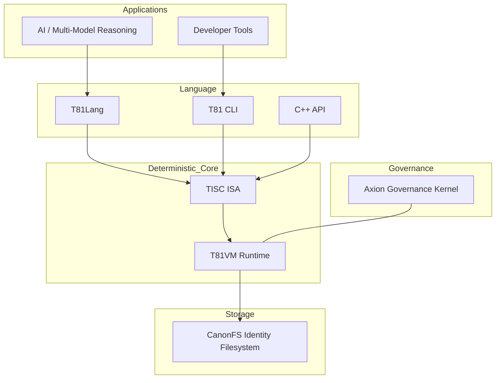
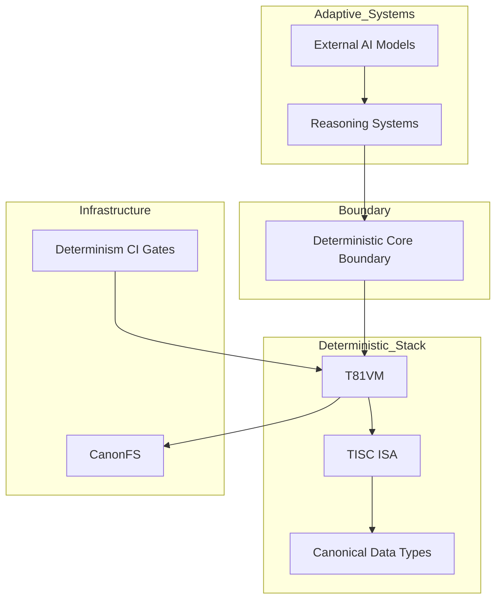

# T81 Foundation

## Deterministic Ternary Computing Architecture

<p align="center">

</p>

<p align="center">
  <a href="https://github.com/t81dev/t81-foundation/releases/latest">
    
  </a>
  <a href="https://github.com/t81dev/t81-foundation/actions/workflows/ci.yml">
    
  </a>
  <a href="./LICENSE">
    
  </a>
  
</p>

[English](./README.md) | [简体中文](./README.zh-CN.md) | [Español](./README.es.md) | [Русский](./README.ru.md) | [Português](./README.pt-BR.md)

---

# Project Status

**March 2026 Release Decision: GO**

The T81 Foundation has completed the **March 2026 Release Readiness Audit**, confirming that the deterministic execution baseline and repository documentation meet release criteria.

**Key milestone**

* **TISC v1.1.0 — Architecture Frozen**
* Determinism gate validation completed
* Cross-platform execution traces verified across supported targets

This milestone establishes the first **stable architectural baseline** for the T81 stack.

---

# What is T81?

**T81 Foundation** is an experimental computing architecture exploring how **balanced ternary mathematics**, **canonical data identity**, and **runtime governance** can form the basis of a verifiable computing environment.

The project provides a vertically integrated stack designed for environments where:

* execution must be reproducible
* system behavior must be auditable
* policy enforcement must occur inside the runtime itself

Example applications include:

* safety-critical AI systems
* verifiable computation pipelines
* deterministic inference engines
* high-integrity operating system research

T81 implements a **base-81 ternary computation model** simulated efficiently on conventional binary hardware using SWAR vectorization techniques.

---

# System Architecture

The T81 stack aligns the **instruction set**, **runtime execution**, and **governance layer** under a single deterministic contract.


```mermaid
flowchart TB

subgraph Applications
AI[AI / Multi-Model Reasoning]
Tools[Developer Tools]
end

subgraph Language
T81Lang[T81Lang]
CLI[T81 CLI]
API[C++ API]
end

subgraph Deterministic_Core
TISC[TISC ISA]
VM[T81VM Runtime]
end

subgraph Governance
Axion[Axion Governance Kernel]
end

subgraph Storage
CanonFS[CanonFS Identity Filesystem]
end

AI --> T81Lang
Tools --> CLI
T81Lang --> TISC
CLI --> TISC
API --> TISC
TISC --> VM
Axion --- VM
VM --> CanonFS
```

This architecture produces a runtime where:

* instruction behavior is fully defined
* numeric representations are canonical
* execution traces are reproducible
* governance policies are enforced within the runtime

---

# Deterministic Core Boundary

T81 separates adaptive systems from deterministic execution using a clearly defined boundary.


```mermaid
flowchart TB

subgraph Adaptive_Systems
AI[External AI Models]
Cognition[Reasoning Systems]
end

subgraph Boundary
DCP[Deterministic Core Boundary]
end

subgraph Deterministic_Stack
VM[T81VM]
ISA[TISC ISA]
Types[Canonical Data Types]
end

subgraph Infrastructure
Build[Determinism CI Gates]
Storage[CanonFS]
end

AI --> Cognition
Cognition --> DCP
DCP --> VM
VM --> ISA
ISA --> Types
VM --> Storage
Build --> VM
```

Above the boundary:

* adaptive intelligence
* experimental reasoning systems

Below the boundary:

* deterministic execution
* canonical data structures
* governance-enforced runtime behavior

---

# Core Components

| Component   | Role                                                   | Status |
| ----------- | ------------------------------------------------------ | ------ |
| **TISC**    | Deterministic instruction set and serialization format | Frozen |
| **T81VM**   | Reference deterministic virtual machine                | Beta   |
| **CanonFS** | Content-addressed identity filesystem                  | Beta   |
| **Axion**   | Policy-governed operating system                       | Alpha  |
| **T81Lang** | High-level language compiling to TISC                  | Beta   |

---

# Axion — The T81 Operating System

**Axion** is the experimental operating system built on the T81 deterministic runtime.

Unlike traditional operating systems where policy enforcement is external, Axion integrates governance directly into the runtime execution environment.

Current implementation progress includes:

* deterministic kernel runtime scaffolding
* hosted kernel execution path
* early Axion shell
* CanonFS integration
* QEMU AArch64 boot artifacts

Current label:

```
Axion v0.1.0-alpha
```

Further documentation:

* `experimental/ternaryos/docs/README.md`
* `experimental/ternaryos/docs/review_summary.md`
* `experimental/ternaryos/docs/axion_shell_design.md`

---

# Documentation

The repository documentation is structured for engineering traceability.

| Area                | Location               | Description                         |
| ------------------- | ---------------------- | ----------------------------------- |
| System Status       | `docs/status`          | release readiness and system health |
| Technical Reference | `docs/reference`       | ISA manuals and API specifications  |
| Governance          | `docs/governance`      | determinism policies and contracts  |
| Developer Guide     | `docs/developer-guide` | architecture and build instructions |

Primary entry points:

* `docs/user-guide/quickstart/INSTALL.md`
* `docs/architecture/OVERVIEW.md`
* `docs/status/PROJECT_CONTROL_CENTER.md`
* `docs/user-guide/reference/cli-user-manual.md`
* `spec/`
* `book/book-en/README.md`

---

# Experimental Research

New systems are prototyped within the `/experimental` directory.

Current areas of research include:

* ternary-native kernel architecture
* governed interrupt and event models
* ternary tensor quantization
* deterministic multi-model reasoning evidence pipelines

Experimental components remain isolated until they satisfy determinism and maturity requirements.

---

# Quick Start

### Installation

```
docs/user-guide/quickstart/INSTALL.md
```

### C++ Integration

```
docs/user-guide/getting-started/cpp-quickstart.md
```

### Deterministic AI

```
docs/user-guide/getting-started/ai-quickstart.md
```

---

# Contribution Model

T81 follows a **spec-first development process**.

Key principles:

### Specification Authority

The `/spec` directory defines canonical system behavior.

### Determinism Preservation

All changes must maintain reproducible execution across supported platforms.

### Controlled Experimental Boundaries

Research components must not contaminate the deterministic core.

See:

* `CONTRIBUTING.md`
* `SECURITY.md`

---

# License

T81 Foundation is released under the **MIT License**.

---

> Deterministic computation is not merely a property of software.
> It is a property of the system architecture itself.

while remaining faithful to the actual state of the project.
