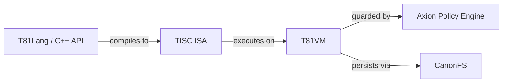

<p align="center">
  
</p>

# T81: A Deterministic Ternary Architecture

<p align="center">
  <a href="https://github.com/t81dev/t81-foundation/releases/latest"></a>
  <a href="https://github.com/t81dev/t81-foundation/actions/workflows/ci.yml"></a>
  <a href="./LICENSE"></a>
  
</p>

[English](./README.md) | [简体中文](./README.zh-CN.md) | [Español](./README.es.md) | [Русский](./README.ru.md) | [Português](./README.pt-BR.md)

<!-- T81-SPEED-START -->
<!-- T81-SPEED-END -->

T81 Foundation is a deterministic, ternary-native computing stack designed for engineers, researchers, and systems programmers who require mathematically reproducible execution, canonical data handling, and enforceable runtime policies. 

It combines a stable instruction set, a governed virtual machine, a language frontend, and a public C++ API in one repository. The project is aimed at those building runtimes, language tooling, audit-heavy systems, and reproducible experiments.

## Why T81?

Most modern technology stacks treat determinism, auditability, and governance as secondary concerns—layered on after the runtime already exists. T81 takes the opposite approach:
- **Built for Determinism:** We build around canonical representations and explicit fault behaviors from the start.
- **Ternary-Native:** Balanced ternary and base-81 encodings are part of the substrate. Through SWAR vectorization and 2-bit packed trits, T81 achieves native ternary semantics with high performance on binary hardware.
- **Policy-Aware Execution:** The Axion policy engine enforces runtime decisions dynamically within the execution flow, ensuring governance isn't just an advisory check.
- **Strict Bounding:** Determinism claims are explicitly scoped to the **Deterministic Core Profile (DCP)**. Experimental features are rigidly isolated to prevent undefined behavior.

## Architecture & System Status

T81 is vertically integrated, moving from high-level language APIs down to a governed execution substrate. Our maturity is explicit: core boundaries are *Frozen*, while experimental surfaces are clearly marked. T81 is in active development with mixed maturity across the stack.

| Component | Role | Maturity Status |
| :--- | :--- | :--- |
| **`include/t81/`** | Public C++ API surface for consumers and downstream builds. | **Mixed** |
| **Data Types** | Core numerics, canonical representations (`core/types/`). | **Frozen** (DCP Verified) |
| **TISC ISA** | The stable machine contract for serialization and execution. | **Frozen** (DCP Verified) |
| **T81VM** | The reference runtime path for reproducible execution. | **Beta** |
| **CanonFS** | Deterministic persistence and identity boundaries. | **Beta** |
| **T81Lang** | Frontend compiling down to the TISC ISA. | **Beta** |
| **Axion** | Runtime policy engine integrated into the VM step path. | **Alpha** |


```mermaid
flowchart LR
    A[T81Lang / C++ API] -->|compiles to| B[TISC ISA]
    B -->|executes on| C[T81VM]
    C -->|guarded by| D[Axion Policy Engine]
    C -->|persists via| E[CanonFS]
```

*Supported toolchains currently verified in CI include Ubuntu 24.04 with GCC 14 and Clang 18, Ubuntu 24.04 ARM64 with Clang 18, macOS 14 ARM64 with Apple Clang, and Windows Server 2022 with MSVC on a best-effort basis.*

## Repository Structure

- [`./include/t81/`](./include/t81/) contains the public headers for library consumers.
- [`./examples/`](./examples/) contains C++ demos, T81Lang samples, and consumer examples.
- [`./docs/`](./docs/) is the documentation hub for quickstarts, architecture, status, and governance.
- [`./book/`](./book/) contains longer-form monograph and tutorial-style material.
- [`./spec/`](./spec/) holds the normative specifications and RFCs.
- [`./tests/`](./tests/) contains the unit, integration, conformance, and determinism-oriented tests.
- [`./core/`](./core/) contains core type, ISA, and VM implementation modules.
- [`./src/`](./src/) contains runtime components such as codecs, IO, and CanonFS.
- [`./tooling/`](./tooling/) contains CLI and model-tooling code used by the shipped developer workflows.
- [`./.github/workflows/`](./.github/workflows/) contains CI, reproducibility, documentation, benchmarking, and release automation.

## Getting Started

### Prerequisites
- CMake 3.16+
- A C++23-capable compiler (C++20 supported via `-DT81_USE_CXX23=OFF`)
- Python 3.10+ (for reproducibility gates)
- Ninja or Make

### Clone and Build
```bash
git clone https://github.com/t81dev/t81-foundation.git
cd t81-foundation
cmake -S . -B build -G Ninja -DCMAKE_BUILD_TYPE=Release
cmake --build build --parallel
```

### Run Tests & Verify Determinism
```bash
# Run the core test suite
ctest --test-dir build --output-on-failure

# Verify the reproducibility gate
mkdir -p build/t81lang-repro
python3 scripts/ci/t81lang_repro_gate.py \
  --t81-bin build/t81 \
  --fixtures-dir tests/fixtures/t81lang_determinism \
  --workdir build/t81lang-repro \
  --hash-out build/t81lang-repro/hash.txt \
  --expected-hash-file tests/fixtures/t81lang_determinism/t81lang_repro_hash.txt
```

### Run Shipped Examples
```bash
./build/t81_demo
./build/t81_tensor_ops
./build/t81_ir_roundtrip
```

### Compile and run a T81Lang sample
```bash
./build/t81 code check examples/hello_world.t81
./build/t81 code build examples/hello_world.t81 -o build/hello_world.tisc
./build/t81 code run build/hello_world.tisc
```

*Other common entry points include `./build/t81 project init`, `./build/t81 env doctor`, `./build/t81 weights ...`, `./build/t81 trace ...`, `./build/t81 canonfs ...`, `./build/t81 determinism ...`, `./build/t81 vm ...`, `./build/t81 tisc ...`, and `./build/t81 ir ...`. See [`./docs/user-guide/reference/cli-user-manual.md`](./docs/user-guide/reference/cli-user-manual.md) for the current command surface.*

### Minimal Consumer Example (C++)

```cpp
#include <iostream>
#include <t81/types/T81Int.hpp>

int main() {
  t81::T81Int<9> value(42);
  std::cout << value.to_int64() << "\n";
}
```

For downstream CMake usage, see [`./examples/consumer_cmake/`](./examples/consumer_cmake/).

**Install and consume as a CMake package**

```bash
cmake --install build --prefix /tmp/t81_install
cmake -S examples/consumer_cmake -B /tmp/t81_consumer_build -DCMAKE_PREFIX_PATH=/tmp/t81_install
cmake --build /tmp/t81_consumer_build --parallel
/tmp/t81_consumer_build/t81_consumer
```

```cmake
find_package(T81Foundation CONFIG REQUIRED)
target_link_libraries(t81_consumer PRIVATE T81::t81_core)
```

## Examples

- [`./examples/hello_world.t81`](./examples/hello_world.t81) is the smallest end-to-end T81Lang compile and run example.
- [`./examples/option_result_match.t81`](./examples/option_result_match.t81) demonstrates typed control flow with `Option` and `Result`.
- [`./examples/tensor_ops.cpp`](./examples/tensor_ops.cpp) demonstrates tensor reshape, slice, transpose, and related operations.
- [`./examples/axion_policy_runner.cpp`](./examples/axion_policy_runner.cpp) highlights policy-aware execution and trace generation.
- [`./examples/system-integration/inference.t81`](./examples/system-integration/inference.t81) with [`./examples/system-integration/secure_model.apl`](./examples/system-integration/secure_model.apl) shows a fuller T81Lang + Axion workflow.
- [`./examples/tisc/`](./examples/tisc/) contains precompiled `.tisc` samples for disassembly, debugging, and runtime inspection.
- [`./examples/consumer_cmake/`](./examples/consumer_cmake/) shows how a downstream CMake project can consume the public headers and targets.

## Benchmarks

T81 ships a benchmark suite for core numerics, tensor paths, SIMD/base81 work, CanonFS, and VM kernels. The runner now has explicit local profiles: `smoke` by default, bounded `full` for human use, and exhaustive `deep` for research/nightly runs.

```bash
cmake --build build --target benchmark_runner
```

```bash
# Default local smoke profile: generates JSON output. Markdown reports are only
# written if T81_BENCHMARK_WRITE_REPORTS=1 is set.
./build/benchmarks/benchmark_runner \
  --benchmark_format=json \
  --benchmark_out=bench.json
```

```bash
# Human-usable full profile:
T81_BENCHMARK_PROFILE=full ./build/benchmarks/benchmark_runner \
  --benchmark_format=json \
  --benchmark_out=bench-full.json

# Exhaustive research/nightly profile:
T81_BENCHMARK_PROFILE=deep ./build/benchmarks/benchmark_runner \
  --benchmark_format=json \
  --benchmark_out=bench-deep.json

# Custom filtered local iteration:
./build/benchmarks/benchmark_runner \
  --benchmark_filter='BM_(ArithThroughput|NegationSpeed|RoundtripAccuracy|overflow|PackingDensity|MemoryBandwidth|Add_1024_bit|Add_2048_bit|T81LangCompile|LimbArithThroughput|LimbAdd_T81Native|LimbAdd_T81Limb|LimbAdd_Int128|vs_).*' \
  --benchmark_format=json \
  --benchmark_out=bench-smoke.json

# or through the CLI wrapper
./build/t81 internal benchmark --benchmark_filter='BM_(ArithThroughput|T81LangCompile).*'

# CLI wrapper keeps report generation off by default
T81_BENCHMARK_WRITE_REPORTS=1 ./build/t81 internal benchmark --benchmark_filter='BM_(ArithThroughput|T81LangCompile).*'
```

For methodology and benchmark-specific notes, see [`./benchmarks/README.md`](./benchmarks/README.md) and [`./docs/developer-guide/tools/README.md`](./docs/developer-guide/tools/README.md).

## Documentation

T81 maintains a rigid documentation hierarchy. **The `/spec` directory is normative.**
- **Architecture Overview:** [`docs/architecture/OVERVIEW.md`](docs/architecture/OVERVIEW.md)
- **Status & Control Center:** [`docs/status/PROJECT_CONTROL_CENTER.md`](docs/status/PROJECT_CONTROL_CENTER.md)
- **CLI User Manual:** [`docs/user-guide/reference/cli-user-manual.md`](docs/user-guide/reference/cli-user-manual.md)
- **Reproducibility Guide:** [`docs/reference/REPRODUCIBILITY.md`](docs/reference/REPRODUCIBILITY.md)
- **Formal Specifications:** [`spec/`](spec/)
- **Long-form book:** [`book/book-en/README.md`](book/book-en/README.md)

## Contributing

Contributions are welcome, but please be aware of our core philosophies:
1. **Spec-First Authority:** The `/spec` directory dictates the implementation, not the other way around.
2. **Determinism-First:** Any changes must preserve canonical behavior and pass strict reproducibility gates.
3. **Bounded Governance:** Experimental features (like Cognitive Tiers) must not bleed into the Deterministic Core Profile.

Start by reading [`CONTRIBUTING.md`](CONTRIBUTING.md) and [`CODE_OF_CONDUCT.md`](CODE_OF_CONDUCT.md). For governance details, review the material in [`docs/governance/`](docs/governance/). For private vulnerability reports, follow [`SECURITY.md`](SECURITY.md).

## License

T81 Foundation is released under the MIT License. See [`LICENSE`](LICENSE).
