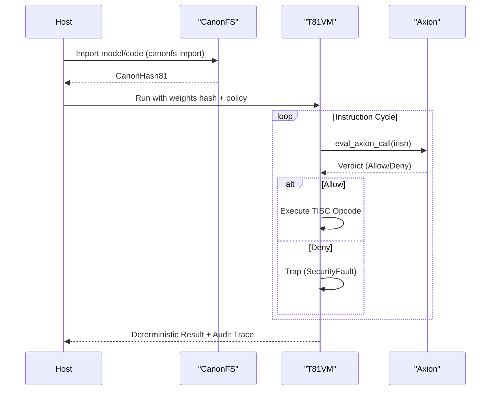

# T81 Foundation — Governed Runtime for Immutable, Deterministic Execution

<p align="center">
  
</p>

**Immutable, hash-verified artifacts • Pre-side-effect policy enforcement • Bit-exact reproducibility • Ternary-native execution**

[English](./README.md) | [简体中文](./README.zh-CN.md) | [Español](./README.es.md) | [Русский](./README.ru.md) | [Português](./README.pt-BR.md)


[](https://deepwiki.com/t81dev/t81-foundation)

## What is T81

T81 is a substrate for producing **canonical decision objects with identity** from governed AI tasks.

Instead of interpreting AI output, T81 consumes **durable decision bundles** that provide complete provenance, deterministic replayability, and cross-system portability.

Policies are evaluated deterministically and enforced before execution or materialization begins. Governance does not rely on runtime heuristics, anomaly scoring, or after-the-fact monitoring. T81 can be adopted incrementally via CanonFS + policy enforcement without requiring full stack adoption.

## Why This Matters

- **Decision objects over interpretation** - AI decisions become verifiable, consumable objects
- **Identity through provenance** - Every decision carries complete audit trail
- **Deterministic replayability** - Same inputs always produce identical bundles
- **Cross-system portability** - Decisions can be consumed without original execution environment
- **Policy-bound outcomes** - All decisions are validated against governance before materialization

## When to Use T81

- **When you need verifiable AI decisions** rather than interpretable output
- **When decisions must be portable** across different execution environments  
- **When complete provenance is required** for compliance or audit
- **When deterministic replay** of decisions is a security requirement

## Real-World Use Cases

- **Security governance** - Consume policy-approved decision bundles for access control
- **Compliance auditing** - Archive canonical decision objects with complete provenance
- **Cross-system handoff** - Transfer decisions between environments without losing context
- **Regulatory reporting** - Provide verifiable decision artifacts to auditors
- **Release gates** - Use bundles as canonical approval evidence for deployments

## Performance Characteristics

T81 prioritizes **decision integrity over raw throughput**. Bundle creation and consumption are optimized for deterministic verification, not maximum inference speed.

The system's advantages come from **identity and provenance guarantees**, not from emulated ternary arithmetic performance.

## System Guarantees

- **Identity by design** - Content-addressed bundles provide cryptographic proof of decision integrity
- **Deterministic replay** - Same inputs always produce identical decision objects
- **Policy enforcement** - All decisions validated against governance before materialization
- **Cross-system portability** - Bundles can be consumed without original execution environment
- **Complete provenance** - Full audit trail from input to decision is verifiable

When performance matters more than decision integrity, other runtimes may be better suited. When guarantees matter more than speed, T81 provides **verifiable, replayable, policy-bound decisions**.

### Architectural Pillars

1. **Canonical Decision Objects** — **Bundles** provide content-addressed, verifiable decision artifacts with complete provenance
2. **Policy Enforcement** — **Axion** validates decisions against governance before materialization
3. **Immutable Storage** — **CanonFS** provides hash-verified storage for decision chains and evidence
4. **Deterministic Execution** — Bit-identical decisions are guaranteed for identical inputs

T81 also has in-progress ternary hardware directions, but the usable form today is the **decision substrate**.

## Best Current Surfaces

If you want the clearest contributor-facing surfaces in the repo today, start here:

- **CanonFS interchange**: RFC-00D1 current draft contract:
  [RFC-00D1-canonfs-foreign-filesystem-interchange.md](spec/rfcs/RFC-00D1-canonfs-foreign-filesystem-interchange.md)
- bounded AI OS-object family status:
  [BOUNDED_AI_OS_OBJECT_FAMILY_STATUS.md](docs/status/BOUNDED_AI_OS_OBJECT_FAMILY_STATUS.md)
- canonical bundle consumption contract:
  [examples/ai-and-inference/model-load-canonfs/summarize_ai_bundle.sh](examples/ai-and-inference/model-load-canonfs/summarize_ai_bundle.sh)
- canonical bundle `.v1` versioning boundary:
  [AI_OS_OBJECT_BUNDLE_VERSIONING_BOUNDARY.md](docs/reference/AI_OS_OBJECT_BUNDLE_VERSIONING_BOUNDARY.md)

These are narrower and more buildable than the repo's longer-horizon OS and
hardware directions.

If you want the shortest practical “how do I actually use this today?” guide,
start here:

- [T81 Operator Guide](docs/explanation/T81_OPERATOR_GUIDE.md)

## Core Subsystems & Maturity (March 2026)

| Subsystem     | Role                                              | Maturity     |
|---------------|---------------------------------------------------|--------------|
| **TISC ISA**  | Frozen ternary instruction set (v1.9.0)           | **Frozen**   |
| **T81VM**     | Deterministic interpreter with Axion hooks        | **Stable**   |
| **Axion**     | Governance kernel mediating dispatch              | **Stable**   |
| **CanonFS**   | Immutable, hash-verified storage backend          | **Stable**   |
| **T81Lang**   | High-level language frontend for ternary logic    | **Stable**   |

The **Deterministic Core Profile (DCP)** (TISC ISA, core VM, and data types) is a **Verified Deterministic Surface**. Experimental areas (e.g., Cognitive Tiers, full Hanoi VM) sit outside the DCP.

## Execution Workflow

T81 ties immutable inputs to deterministic outcomes through a policy-gated pipeline:


```mermaid
sequenceDiagram
    participant Host
    participant CFS as "CanonFS"
    participant VM as "T81VM"
    participant AX as "Axion"

    Host->>CFS: Import model/code (canonfs import)
    CFS-->>Host: CanonHash81
    Host->>VM: Run with weights hash + policy
    loop Instruction Cycle
        VM->>AX: eval_axion_call(insn)
        AX-->>VM: Verdict (Allow/Deny)
        alt Allow
            VM->>VM: Execute TISC Opcode
        else Deny
            VM->>VM: Trap (SecurityFault)
        end
    end
    VM-->>Host: Deterministic Result + Audit Trace
```

## Why Ternary?

This is part of the longer-term systems direction, not the main reason a new
contributor should pick up T81 today.

Balanced ternary delivers structural advantages for verifiable inference:

- **Multiplication-free dot products** — Conditional additions yield significant energy/throughput gains.
- **Zero floating-point drift** — Truncation-only rounding ensures bit-exact **CanonHash81** traces.
- **Constant-time negation** — Simple digit flip (~10× faster than binary integer negation in benchmarks).
- **Trit-level policy interception** — Axion can gate individual operations before side effects.

See full benchmarks in [`benchmarks/results/`](benchmarks/results/).

## Quick Start

### 30-Second Proof: CanonFS + Axion

This shows that an artifact can be stored immutably and execution can be
denied before it runs.

Run this from the repo root after building:

```bash
tmp_root="$(mktemp -d)"
canon_root="$tmp_root/.t81_canonfs"

# 1. Import one artifact into CanonFS
./build/t81 canonfs import \
  examples/storage-and-canonfs/canonfs-interchange/v1/model.t81w \
  --canonfs-root "$canon_root" \
  --json

canon_hash="<imported_objects[0] from step 1>"

# 2. Export the same artifact back out by CanonFS hash
./build/t81 canonfs export \
  "$canon_hash" \
  --canonfs-root "$canon_root" \
  --out "$tmp_root/restored.t81w" \
  --json

# 3. Try the same import under a checked-in denying policy
./build/t81 canonfs import \
  examples/storage-and-canonfs/canonfs-interchange/v1/model.t81w \
  --canonfs-root "$canon_root" \
  --policy examples/storage-and-canonfs/canonfs-interchange/v1/policy-deny-all.apl \
  --json
```

What you should see:

- Step 1 returns `status: "ok"`
- Step 2 returns `status: "ok"`
- Step 3 returns `status: "error"` with `kind: "policy-failure"` and `reason: "policy_denied"`

## What Just Happened

- The artifact was stored as a hash-addressed CanonFS object.
- Import and export were both subject to Axion policy approval.
- The checked-in denying policy blocked the import before storage-side effects for that run.
- The JSON output shape and success/failure results are deterministic and reproducible.

## 60-Second Proof

See: [`examples/proofs/canonfs_policy_proof/`](examples/proofs/canonfs_policy_proof/)

This shows:
- artifact import -> hash identity
- allowed execution -> deterministic output
- denied execution -> no computation occurs

### Docker (easiest — ~60 seconds)

```bash
docker run --rm -it ghcr.io/t81dev/t81-foundation demo
```

Runs hello-world → ternary demo → determinism check → interactive REPL.

### Native Build (Linux/macOS)

```bash
git clone https://github.com/t81dev/t81-foundation.git
cd t81-foundation
cmake -B build -G Ninja -DCMAKE_BUILD_TYPE=Release
cmake --build build
ctest --test-dir build --output-on-failure
```

Key CMake flags:
- `T81_STRICT_DETERMINISTIC_FLOAT=ON` (default) — Enforces bit-exact float paths.
- `T81_HYBRID_MLP=OFF` — Keeps pure ternary invariants (requires Axion approval if enabled).

### Python Integration

```bash
pip install .
```

### First-Run Examples

```bash
# Compile and run T81Lang
t81 code build examples/core-language/hello_world.t81 -o hello.tisc
t81 vm run hello.tisc

# CanonFS + policy-gated execution example
t81 canonfs import model.t81w --json
t81 code run inference.t81 --weights-model model.t81w --policy secure_model.apl --trace
```

Current admitted bounded AI OS-object family examples:

```bash
bash examples/ai-and-inference/model-load-canonfs/run_assess_fixed_host_action.sh
```

That example ends on a stored bundle object, not just an AI task result. The
bundle is the top-level persisted object for the current assess-fixed chain and
links:

- the AI task result artifact
- the AI task provenance artifact
- the typed downstream record
- the host action artifact

Second admitted bounded composition using the same object model:

```bash
bash examples/ai-and-inference/model-load-canonfs/run_route_fixed_path_selection.sh
```

Third admitted bounded composition using the same object model:

```bash
bash examples/ai-and-inference/model-load-canonfs/run_classify_fixed_rule_selection.sh
```

Short explanation:
- [First Deterministic AI OS-Object Chain](docs/explanation/FIRST_DETERMINISTIC_AI_OS_OBJECT_CHAIN.md)

Current bounded composition catalog:
- [AI OS-Object Chain Catalog](docs/reference/AI_OS_OBJECT_CHAIN_CATALOG.md)

Maintainer-facing bounded family status:
- [Bounded AI OS-Object Family Status](docs/status/BOUNDED_AI_OS_OBJECT_FAMILY_STATUS.md)

Portable smoke path for the same chain:
- `./build/t81_ai_task_assess_fixed_composition_test ./build/t81`

The bounded family is now a protected subsystem. Treat these examples as the
current admitted family:

- `assess-fixed`
- `route-fixed`
- `classify-fixed`

If you want the bundle-first external-consumer path for that family, start
with:

- [AI OS-Object Bundle Consumption Contract](docs/reference/AI_OS_OBJECT_BUNDLE_CONSUMPTION_CONTRACT.md)
- [AI OS-Object Bundle Versioning Boundary](docs/reference/AI_OS_OBJECT_BUNDLE_VERSIONING_BOUNDARY.md)

### QEMU Boot Demo (OS-like experience)

```bash
# Install deps (Ubuntu example)
sudo apt-get install -y qemu-system-arm qemu-efi-aarch64 mtools parted

git clone https://github.com/t81dev/t81-foundation.git && cd t81-foundation
./drivers/qemu/scripts/boot_demo.sh
```

At the `t81>` prompt: `status`, `policy`, `help`.

## T81Lang + Policy Example

```t81
agent Inference {
  behavior run(prompt: String) -> Tensor {
    return Model.forward(prompt);  // gated by Axion
  }
}
```

```apl
# secure_model.apl
allow infer if model.hash in approved_models;
deny infer reason "unapproved-model";
```

## Project Status & Governance

As of March 2026, The T81 deterministic core (ISA, VM, data types) is stable and governed by a monthly C2 review cadence. Active risks, implementation matrix, and decision logs are tracked in [`docs/status/`](docs/status/).

- **Determinism claims** are bounded by the [Deterministic Core Profile](docs/status/SYSTEM_STATUS.md) and the [Determinism Surface Registry](docs/governance/DETERMINISM_SURFACE_REGISTRY.md), verified via CI gates.
- See the full [Project Roadmap & Governance Status](docs/status/ROADMAP.md) and [Getting Started & Installation](docs/user-guide/quickstart/INSTALL.md) for details.

## What T81 is Not (Yet)

- A drop-in replacement for general-purpose OSes
- Optimized for legacy binary software
- Dependent on real ternary hardware (emulated on conventional CPUs)
- A high-throughput AI inference platform for unconstrained workloads
- A general-purpose application runtime for broad software compatibility

T81 prioritizes verifiability, determinism, and governance over broad compatibility. When decision integrity matters more than raw throughput, T81 provides verifiable, replayable, policy-bound decisions.

## Architecture Overview

For deeper technical mapping (Natural Language Space → Code Entity Space), see the [Project Overview](docs/index.md) in the DeepWiki.

## Long-term direction

T81 is being developed toward a computing model where cognition becomes a first-class software substrate. Rather than treating model weights as opaque blobs behind external runtimes, T81 treats them as governed software artifacts: provenance-bound, policy-mediated, and executable within bounded cognitive tiers.

The long-term goal is an operating environment where cognitive software can be stored, invoked, composed, and governed with the same rigor applied today to code, processes, and files.

## License

Apache 2.0

---

Thanks for checking out T81. Early feedback, issues, and contributors are welcome!
