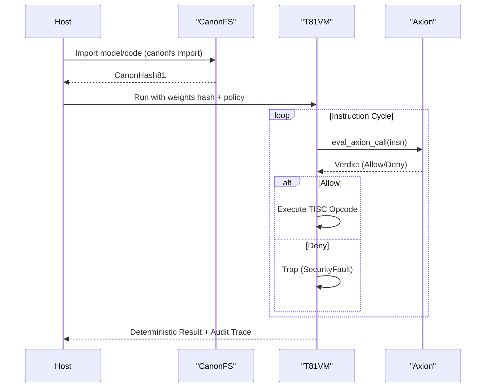

# T81 Foundation — Ternary-Native Runtime for Governed, Deterministic AI Inference

<p align="center">
  
</p>

**Bit-exact reproducibility • Pre-side-effect policy enforcement • Ternary-weight inference • Immutable, hash-verified artifacts**

[English](./README.md) | [简体中文](./README.zh-CN.md) | [Español](./README.es.md) | [Русский](./README.ru.md) | [Português](./README.pt-BR.md)


[](https://deepwiki.com/t81dev/t81-foundation)

## What is T81

T81 is a **ternary-native runtime** designed for **governed, deterministic AI inference**. It solves critical challenges in agentic and model-driven systems by guaranteeing bit-exact reproducibility and enforcing safety/ethics policies *before* any side effects occur.

Built on balanced ternary logic, T81 eliminates conventional binary floating-point drift. Identical inputs produce bit-identical outputs within the Deterministic Core Profile (DCP) across verified platforms (currently Linux x86_64 and macOS ARM64).

### Architectural Pillars

1. **Deterministic Execution** — Bit-identical traces guaranteed within the Deterministic Core Profile (DCP).
2. **Policy Enforcement** — The **Axion** governance engine mediates all operations and enforces rules pre-dispatch.
3. **Immutable Artifacts** — **CanonFS** provides content-addressed, hash-verified storage for models, code, and audit evidence.
4. **Ternary-Native Paths** — Efficient inference via ternary-weight dot products (conditional ±1 additions instead of FP multiplies).

T81 also serves as the foundation for an in-progress bare-metal kernel and guest OS (TernaryOS), but its primary usable form today is as a governed runtime for auditable inference.

## Core Subsystems & Maturity (March 2026)

| Subsystem     | Role                                              | Maturity     |
|---------------|---------------------------------------------------|--------------|
| **TISC ISA**  | Frozen ternary instruction set (v1.9.0)           | **Frozen**   |
| **T81VM**     | Deterministic interpreter with Axion hooks        | **Stable**   |
| **Axion**     | Governance kernel mediating dispatch              | **Stable**   |
| **CanonFS**   | Immutable, hash-verified storage backend          | **Stable**   |
| **T81Lang**   | High-level language frontend for ternary logic    | **Stable**   |

The **Deterministic Core Profile (DCP)** (TISC ISA, core VM, and data types) is a **Verified Deterministic Surface**. Experimental areas (e.g., Cognitive Tiers, full Hanoi VM) sit outside the DCP.

## Execution Workflow

T81 ties immutable inputs to deterministic outcomes through a policy-gated pipeline:


```mermaid
sequenceDiagram
    participant Host
    participant CFS as "CanonFS"
    participant VM as "T81VM"
    participant AX as "Axion"

    Host->>CFS: Import model/code (canonfs import)
    CFS-->>Host: CanonHash81
    Host->>VM: Run with weights hash + policy
    loop Instruction Cycle
        VM->>AX: eval_axion_call(insn)
        AX-->>VM: Verdict (Allow/Deny)
        alt Allow
            VM->>VM: Execute TISC Opcode
        else Deny
            VM->>VM: Trap (SecurityFault)
        end
    end
    VM-->>Host: Deterministic Result + Audit Trace
```

## Why Ternary?

Balanced ternary delivers structural advantages for verifiable inference:

- **Multiplication-free dot products** — Conditional additions yield significant energy/throughput gains.
- **Zero floating-point drift** — Truncation-only rounding ensures bit-exact **CanonHash81** traces.
- **Constant-time negation** — Simple digit flip (~10× faster than binary integer negation in benchmarks).
- **Trit-level policy interception** — Axion can gate individual operations before side effects.

See full benchmarks in [`benchmarks/results/`](benchmarks/results/).

## Quick Start

### Docker (easiest — ~60 seconds)

```bash
docker run --rm -it ghcr.io/t81dev/t81-foundation demo
```

Runs hello-world → ternary demo → determinism check → interactive REPL.

### Native Build (Linux/macOS)

```bash
git clone https://github.com/t81dev/t81-foundation.git
cd t81-foundation
cmake -B build -G Ninja -DCMAKE_BUILD_TYPE=Release
cmake --build build
ctest --test-dir build --output-on-failure
```

Key CMake flags:
- `T81_STRICT_DETERMINISTIC_FLOAT=ON` (default) — Enforces bit-exact float paths.
- `T81_HYBRID_MLP=OFF` — Keeps pure ternary invariants (requires Axion approval if enabled).

### Python Integration

```bash
pip install .
```

### First-Run Examples

```bash
# Compile and run T81Lang
t81 code build examples/hello_world.t81 -o hello.tisc
t81 vm run hello.tisc

# CanonFS + governed inference
t81 canonfs import model.t81w --json
t81 code run inference.t81 --weights-model model.t81w --policy secure_model.apl --trace
```

### QEMU Boot Demo (OS-like experience)

```bash
# Install deps (Ubuntu example)
sudo apt-get install -y qemu-system-arm qemu-efi-aarch64 mtools

git clone https://github.com/t81dev/t81-foundation.git && cd t81-foundation
./drivers/qemu/scripts/boot_demo.sh
```

At the `t81>` prompt: `status`, `policy`, `help`.

## T81Lang + Policy Example

```t81
agent Inference {
  behavior run(prompt: String) -> Tensor {
    return Model.forward(prompt);  // gated by Axion
  }
}
```

```apl
# secure_model.apl
allow infer if model.hash in approved_models;
deny infer reason "unapproved-model";
```

## Project Status & Governance

As of March 2026, The T81 deterministic core (ISA, VM, data types) is stable and governed by a monthly C2 review cadence. Active risks, implementation matrix, and decision logs are tracked in [`docs/status/`](docs/status/).

- **Determinism claims** are bounded by the [Determinism Surface Registry](docs/governance/DETERMINISM_SURFACE_REGISTRY.md) and verified via CI gates.
- See the full [Project Roadmap & Governance Status](docs/status/ROADMAP.md) and [Getting Started & Installation](docs/user-guide/quickstart/INSTALL.md) for details.

## What T81 is Not (Yet)

- A drop-in replacement for general-purpose OSes
- Optimized for legacy binary software
- Dependent on real ternary hardware (emulated on conventional CPUs)

T81 prioritizes **verifiability, determinism, and governance** over broad compatibility.

## Architecture Overview

For deeper technical mapping (Natural Language Space → Code Entity Space), see the [Project Overview](docs/index.md) in the DeepWiki.

## Long-term direction

T81 is being developed toward a computing model where cognition becomes a first-class software substrate. Rather than treating model weights as opaque blobs behind external runtimes, T81 treats them as governed software artifacts: provenance-bound, policy-mediated, and executable within bounded cognitive tiers.

The long-term goal is an operating environment where cognitive software can be stored, invoked, composed, and governed with the same rigor applied today to code, processes, and files.

## License

Apache 2.0

---

Thanks for checking out T81. Early feedback, issues, and contributors are welcome!
