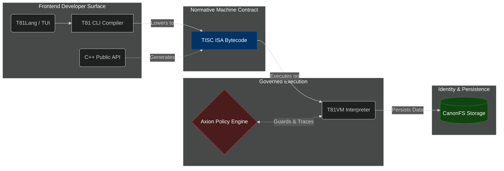

<p align="center">
  
</p>

# T81: A Deterministic Ternary Architecture

<p align="center">
  <a href="https://github.com/t81dev/t81-foundation/releases/latest"></a>
  <a href="https://github.com/t81dev/t81-foundation/actions/workflows/ci.yml"></a>
  <a href="./LICENSE"></a>
  
</p>

[English](./README.md) | [简体中文](./README.zh-CN.md) | [Español](./README.es.md) | [Русский](./README.ru.md) | [Português](./README.pt-BR.md)

<!-- T81-SPEED-START -->
<!-- T81-SPEED-END -->

T81 Foundation is a **determinism-first, ternary-native computing stack** engineered for exact mathematical reproducibility, cryptographically canonical data handling, and active runtime policy governance.

We provide a vertical stack designed for researchers, systems programmers, and safety-critical environments where non-determinism, undefined behaviors, and unspoken rules are unacceptable. At our core is a base-81 ternary (`T81`) paradigm that achieves native ternary scaling properties while utilizing SWAR vectorization for extreme throughput on standard binary computing hardware.

---

### 🚀 [Quickstart: Compile & Install Instructions](docs/user-guide/quickstart/INSTALL.md)

---

## 🏛️ Ecosystem Architecture

Most modern technology stacks treat determinism, auditability, and guardrails as secondary abstractions layered on top of chaotic systems. **T81 reverses this approach.** Every layer executes explicitly against canonical representations guarded by the Axion kernel engine.


```mermaid
%%{init: {'theme': 'dark', 'themeVariables': { 'fontFamily': 'inter' }}}%%
graph LR
    subgraph Frontend [Frontend Developer Surface]
        Lang(T81Lang / TUI) --> Compiler[T81 CLI Compiler]
        Api(C++ Public API)
    end
    
    subgraph ISA [Normative Machine Contract]
        TISC[TISC ISA Bytecode]
        Compiler -->|Lowers to| TISC
        Api -.->|Generates| TISC
    end

    subgraph Runtime [Governed Execution]
        TISC -->|Executes on| T81VM(T81VM Interpreter)
        Axion{Axion Policy Engine} <-.->|Guards & Traces| T81VM
    end

    subgraph Data [Identity & Persistence]
        T81VM -->|Persists Data| CanonFS[(CanonFS Storage)]
    end

    style TISC fill:#003366,stroke:#0055aa,color:#fff
    style Axion fill:#4a1c1c,stroke:#aa3333,color:#fff
    style CanonFS fill:#114411,stroke:#228822,color:#fff
```

### 🧩 The Core Pillars

| System | Role | Maturity | Design Paradigm |
| :--- | :--- | :--- | :--- |
| **`TISC` ISA** | **The Instruction Set Structure** | **Frozen** | The stable serialization format and operations contract for data routing, structural flow, and mathematical operations. |
| **`T81VM`** | **The Reference Runtime Path** | **Beta** | A custom virtual machine executing `TISC`. Mathematically bounds execution down to the trit (base-3). |
| **`Axion`** | **The Kernel Policy Engine** | **Beta** | A dynamic constraint framework executing directly within the VM dispatch loop, allowing absolute enforcement over recursion, operations, and ethics limits. |
| **`CanonFS`**| **The Identity Filesystem** | **Beta** | Files exist as hash-addressed `.tisc` byte arrays, providing flawless structural verification and tampering prevention. |
| **`T81Lang`**| **The Language Frontend** | **Beta** | An ergonomic wrapper compiling strictly into `TISC`, exposing strongly-typed tensor behaviors, options, and numeric safety. |


## 👀 Writing T81Lang

T81Lang is our modern facade to the TISC ISA. It natively handles tensors, canonical types, and mathematical abstractions. Here is a brief look at `Option` and `Result` pattern matching inside the language:

```t81
// Define an infallible parser fallback
func parse_safe(opt_input: Option<Int32>) -> Int32 {
    match opt_input {
        Some(v) => { v * 2 }
        None => { 0 }
    }
}

// Ensure error traces are explicitly managed
func calculate_checked(val: Int32) -> Result<Int32, String> {
    if val < 0 {
        return Err("Value cannot be negative under this policy")
    }
    return Ok(val * 81)
}
```

## 🛠️ Leveraging the C++ API

If you are building your own tools, inference engines, or deterministic subsystems, T81 operates beautifully inside downstream CMake projects.

```cpp
#include <iostream>
#include <t81/types/T81Int.hpp>
#include <t81/types/bigint.hpp>

int main() {
    // Exact canonical representation in base-81
    t81::T81Int<9> canonical_val(42);
    std::cout << "Canonical Trace: " << canonical_val.to_int64() << "\n";
    
    // Arbitrary precision with guaranteed bit-exact math limits
    t81::core::types::T81BigInt big("2145326462463276537653242");
    std::cout << big.to_string() << "\n";
}
```

## 🧭 Documentation Map

All normative systems behavior is written spec-first. 
- **[Installation Guide](docs/user-guide/quickstart/INSTALL.md)**
- **[Architectural Overview](docs/architecture/OVERVIEW.md)**
- **[Project Status & Control Center](docs/status/PROJECT_CONTROL_CENTER.md)**
- **[CLI Reference Manual](docs/user-guide/reference/cli-user-manual.md)**
- **[Formal Specifications Tree](spec/)**
- **[The T81 Book (Long-Form Monograph)](book/book-en/README.md)**

## 🤝 Open Contribution & Governance

We embrace open participation, provided it adheres to our philosophy:
1. **Spec-First Authority:** The `/spec` directory dictates the C++ implementation.
2. **Determinism-First:** Any modification to the `Deterministic Core Profile` (DCP) must mathematically preserve parity across all CPU targets.
3. **Bounded Safety:** Experimental features and Cognitive Tier models must not permeate bounded, canonical execution planes.

See [`CONTRIBUTING.md`](CONTRIBUTING.md) and [`SECURITY.md`](SECURITY.md) to report vulnerabilities or propose protocol enhancements.

---
*T81 Foundation is released as Open Source under the [MIT License](LICENSE).*

> **Note:** All determinism guarantees are strictly bounded by the [Determinism Surface Registry](docs/governance/DETERMINISM_SURFACE_REGISTRY.md).
