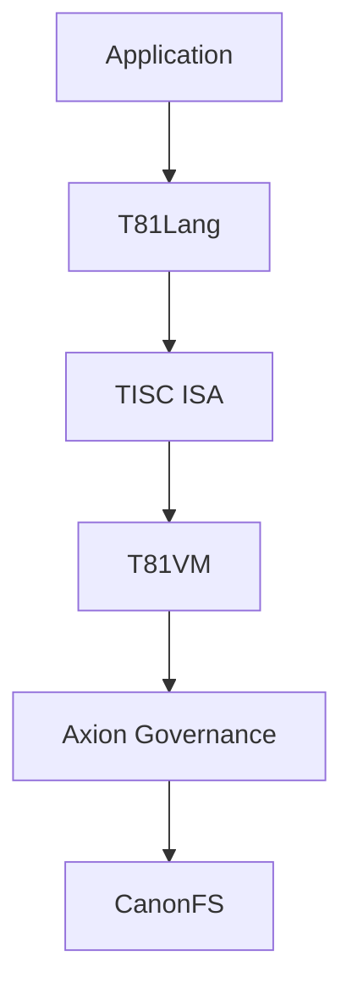

# T81 Foundation

<p align="center">
  
</p>

<p align="center">
  <a href="https://github.com/t81dev/t81-foundation/releases/latest">
    
  </a>
  <a href="https://github.com/t81dev/t81-foundation/actions/workflows/ci.yml">
    
  </a>
  <a href="./LICENSE">
    
  </a>
  
</p>

### A deterministic ternary computing architecture for verifiable systems and governed AI.

---

## What is T81?

**T81 Foundation** is a deterministic ternary computing architecture designed to explore how balanced ternary mathematics, canonical data identity, and runtime governance can form the basis of a verifiable computing environment.

The project provides a vertically integrated stack that simulates a **base-81 ternary computation model** efficiently on conventional binary hardware using SWAR (SIMD within a Register) vectorization techniques. It is engineered for environments where bit-level reproducibility across architectures is a hard requirement.

## Key Principles

- **Deterministic Execution**: Guaranteed bit-identical results across all supported hardware and compilers.
- **Canonical Data Identity**: Content-addressed bytecode and data structures ensure the integrity of the entire execution trace.
- **Ternary Logic**: Leverages balanced ternary (-1, 0, +1) for efficient mathematical representation and symmetric logic.
- **Runtime Governance**: Direct integration of policy enforcement within the execution boundary via the Axion kernel.

## Architecture Overview

The T81 stack provides a clear separation between high-level logic and deterministic hardware simulation.


```mermaid
graph TD
    App[Application] --> Lang[T81Lang]
    Lang --> ISA[TISC ISA]
    ISA --> VM[T81VM]
    VM --> Gov[Axion Governance]
    Gov --> Storage[CanonFS]
```

## Core Components

| Component | Description | Maturity |
| :--- | :--- | :--- |
| **TISC** | Ternary Instruction Set Computer: Frozen ISA specification. | **Frozen** |
| **T81VM** | Deterministic Virtual Machine: Reference execution implementation. | **Beta** |
| **CanonFS** | Identity Filesystem: Content-addressed storage for bytecode. | **Beta** |
| **Axion** | Policy-governed OS: Experimental runtime governance kernel. | **Alpha** |
| **T81Lang** | High-level Language: Ergonomic frontend for TISC bytecode. | **Beta** |

## Quick Start

### 1. Clone the Repository
```bash
git clone https://github.com/t81dev/t81-foundation.git
cd t81-foundation
```

### 2. Build with CMake
```bash
cmake -S . -B build -G Ninja -DCMAKE_BUILD_TYPE=Release
cmake --build build
```

### 3. Run Determinism Verification Gate
```bash
ctest --test-dir build --output-on-failure
python3 scripts/ci/t81lang_repro_gate.py \
  --t81-bin build/t81 \
  --fixtures-dir tests/fixtures/t81lang_determinism \
  --hash-out build/hash.txt \
  --expected-hash-file tests/fixtures/t81lang_determinism/t81lang_repro_hash.txt
```

## Example Program

T81Lang provides a C-family syntax with native support for ternary types and deterministic arithmetic.

```t81
// Balanced ternary arithmetic verification
fn main() -> i32 {
    let a = 1;
    let b = 1;
    let c = a + b; // Result is 2 in base-10, represented natively in T81

    if (c == 2) {
        print("Ternary verification: 1 + 1 = 2");
    }

    return 0;
}
```

## Documentation Map

Detailed documentation is available in the following directories:

- [`spec/`](./spec/): Formal specifications for TISC, T81VM, and CanonFS.
- [`docs/architecture/`](./docs/architecture/): Deep dives into the system design.
- [`docs/status/`](./docs/status/): Real-time implementation and drift dashboards.
- [`docs/governance/`](./docs/governance/): Policy frameworks and Axion specifications.
- [`book/`](./book/): The "T81 Book" — a comprehensive guide to the ecosystem.

## Project Status

T81 uses a strict maturity model for its components:
- **Frozen**: Specification is locked; changes require a formal RFC and major version bump.
- **Beta**: Feature-complete but undergoing stabilization and performance tuning.
- **Alpha**: Functional prototype with evolving APIs.
- **Experimental**: Research-phase explorations.

## Contributing

T81 follows a **spec-first contribution model**. All architectural changes must begin with an RFC in the `docs/rfcs` directory and must pass all determinism gates before being merged. See [CONTRIBUTING.md](./CONTRIBUTING.md) for details.

## License

T81 Foundation is released under the [MIT License](./LICENSE).
