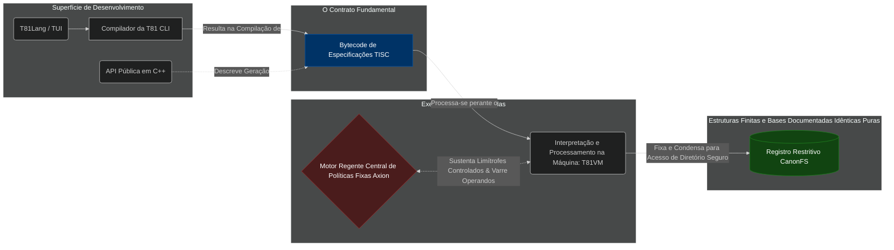

<p align="center">
  
</p>

# T81: Uma Arquitetura Ternária Determinística

<p align="center">
  <a href="https://github.com/t81dev/t81-foundation/releases/latest"></a>
  <a href="https://github.com/t81dev/t81-foundation/actions/workflows/ci.yml"></a>
  <a href="./LICENSE"></a>
  
</p>

[English](./README.md) | [简体中文](./README.zh-CN.md) | [Español](./README.es.md) | [Русский](./README.ru.md) | [Português](./README.pt-BR.md)

<!-- T81-SPEED-START -->
<!-- T81-SPEED-END -->

A T81 Foundation é uma pilha de computação **nativa ternária com o determinismo em primeiro lugar**, projetada para a matemática da irrevogável reprodutibilidade, tratos canônicos de informações e atuação ativamente orientada no processo regente das execuções em máquina.

Nós provemos uma cadeia contendo implementações sistematicamente construída em escala de prioridade voltada aos engenheiros e pesquisadores de operações em estado crítico onde o acaso ou brechas da execução computacional jamais devem se presenciar. O alicerce desta concepção habita nas propriedades do modelo matemático com escala e base de tamanho de ordem 81 (`T81`) nativo de trits implementando um processado através das vetorizações SWAR permitindo operar nos meios atuais em velocidade absoluta pelo intercurso normal binário de máquina.

---

### 🚀 [Início Rápido: Instruções de Compilação & Instalação](docs/user-guide/quickstart/INSTALL.md)

---

## 🏛️ Arquitetura do Ecossistema

As concepções estruturais padrões do atual desenvolvimento computacional tomam questões como segurança perante auditoria em modelo apenas figurativo implantando esses sobre caos pré-existente das máquinas. **A T81 age na contra mão disto.** Em nossa perspectiva e método cada camada deve perfeitamente aderir aos sistemas orientados pela raiz controlada diretamente em proteção vinda do motor principal do kernel e núcleo estrito da Axion.



### 🧩 Os Pilares Fundamentais

| Sistema | O que significa? | Status de Maturidade | O que se encarrega de realizar nestes propósitos englobados? | 
| :--- | :--- | :--- | :--- |
| **`TISC` ISA** | **As Instruções Estáveis** | **Congelado** | Formato rigoroso na estrutura serializadora visada na rota perante condução sobre contratos estabelecidos em estrito comportamento restritivamente delineados à exatidão pura. |
| **`T81VM`** | **Diretório Absoluto do Processo** | **Beta** | Unidade VM encarecidamente definida aos ditames rigorosos referendos matemáticos na escala dos trits em pureza base 3 nativa. |
| **`Axion`** | **Regente Ativo Central** | **Beta** | Motor em malha virtual condicionado limitador que rege, barra operações falhas e sustenta dinâmicas sob o ciclo imediato de operação processado por meio lógico. |
| **`CanonFS`**| **Rigor dos Ficheiros Definidos Idênticos Restritivos e Puros** | **Beta** | Composição restrita formante da conduta do mapeamento em armazenamento estático em arquivos codados imutáveis na terminação via hahs puros em arquivos em bytes `.tisc`. É restritivo inibir as possibilidades manipulativas de origens externas duvidosas. |
| **`T81Lang`**| **Front-end Estruturado** | **Beta** | A mais pura faca orientada de interações ergonômicas. Estruturada sobre amarras e regentes em comportos exatos provendo controle de segurança absoluta matemática tipada das execuções em arranjos matriz (os processos tensoriais em ampolas restritivas do código do código de opções restritas (Option) puro referenciado). |


## 👀 Desenvolvendo Com a Ferramenta T81Lang

O escopo perante todo e qualquer ambiente externo gerador de controle TISC é modelado organicamente no T81Lang, possuindo como objetivo comportamental base das exatidões absolutas das matemáticas perante dados sensíveis e arrays tensores em um modo perfeitamente natural tipificados de segurança. Exemplos base na filtragens de fluxos da raiz entre os padrões e o seu "match" interações Option e Results em amostra da arquiteturacidade estrita e limitadas contornando problemas em processos abstrativos perante as definições codificadas limpas sem distorções obscuras abaixo delineado em sua totalidade.

```t81
// Define e modela um analisador condutor limitante exato a prova de falhas na conversão da interpretação.
func parse_safe(opt_input: Option<Int32>) -> Int32 {
    match opt_input {
        Some(v) => { v * 2 }
        None => { 0 }
    }
}

// Os caminhos trilhados à base exata na limitação sobre referências nas delimitações perante condicionalidades dos restritos de fluxos e limites impeditivos (Erros Traçados Restritos explícitos)
func calculate_checked(val: Int32) -> Result<Int32, String> {
    if val < 0 {
        return Err("Limitação das diretrizes governadas base atestam como imperativo números positivos condicionados restritamente dentro desde perfil referenciado.")
    }
    return Ok(val * 81)
}
```

## 🛠️ Utilizando as Integrações Intermediárias da API Pública (C++)

Se possuir demandas perante o uso ou geração orientada sobre ferramentas perfeitamente condicionados perante a motores limitantes orientados ao ecossistema referenciado o processamento de compilações é inteiramente viabilizado harmonicamente nos propósitos englobados perfeitamente nas premissas ditas no âmbito de integração dos perfis em uso no seu ambiente em integração direta perante os Cmake em compilação natural de um consumo seguro em seu fluxo original descendentes preexistente em implementos próprios modelados limpos conforme segue base ao formato exato e simples:

```cpp
#include <iostream>
#include <t81/types/T81Int.hpp>
#include <t81/types/bigint.hpp>

int main() {
    // Modelos estáticos restritivos em referência ao núcleo na matemática limite pura orientada baseada e referenciada integral nos cálculos precisos e canônicos absolutos ao alcance com a base e tamanho natural em escala 81.
    t81::T81Int<9> canonical_val(42);
    std::cout << "Exatidão perante representatividade da rota principal do vestuário codificação na execução exata base do registro matriz base no número estrito original é: " << canonical_val.to_int64() << "\n";
    
    // Provisão condutível determinística da integridade perante os bit limites matemáticos com absoluta isenção na modelação das perdas base na estrita segurança integral impeditivas restritivamente codadas.
    t81::core::types::T81BigInt big("2145326462463276537653242");
    std::cout << big.to_string() << "\n";
}
```

## 🧭 Diretório Limitado Restritivo a Base Da Documentação Absoluta Normativa Geral Regrada do T81

Todo modelo e operação limitantes perante exatidões de sistema procedem na restritividade principal das codificações ditadas com força e imperativo sob um sistema impeditivo limitante as regras englobadas perante a um perfil de definições formais que conduzirão o compilar nos parâmetros base orientados preexistente. O código C++ rege nos preexistentes conformes ditados nas regras englobadas na matriz ditatorial formadas nos ditames estritos normativos base perante os caminhos estritos originais nas especificações (spec) estipuladas ao limitante formal restrito.
- **[Guia Limpo da Configuração de Inicialização, Compilação Base Rápida das Predefinições de Uso em Cmake](docs/user-guide/quickstart/INSTALL.md)**
- **[Mapa Específico do Controle Base Restritivo e Estático Explicativo e Modelador Funcional das Definições Gerais Arquitetônicas da Engenharia Modelada Principal (Documentos Formais Arquitetônicos de Base Condutores Restritivos)](docs/architecture/OVERVIEW.md)**
- **[O Monitor Regente Padrão Central Limitantes Condutores Modelantes da Vida Exata Limpa Base das Organizações (Diretórios do Estado Formal Padrão)](docs/status/PROJECT_CONTROL_CENTER.md)**
- **[Repositório Manual Condicionado e Paramétrico Operativo Estrito Restrito Formalizado ao Comandos da Interação Por Console e Parâmetros dos Perfil Padrão CLI Base em Consumo](docs/user-guide/reference/cli-user-manual.md)**
- **[A Árvore Base Completa Ditatorial Restritivamente Restrita Condicionadora de Operação C++ em Definições das Especificações](spec/)**
- **[A Formação e Material Formador Limitante Estendido Histórico Documentado Amplo Formal Descritivo (Formação Monográfica Integral Geral Explicativa Livro Modelador Orientador)](book/book-en/README.md)**

## 🤝 Predefinições De Orientação em Parâmetros Ao Compromisso Perante Ações Abertas à Auxilio De Engenharia Externa Base Orientada Das Políticas Formadoras de Uso Restritivas (Apoio Misto Aberto)

Encorajamos o uso amigável na recepção aos braços voluntários integradores base do projeto ao passo que se cumpram expressamente sob rigor de amparo normativo absoluto na submissão completa às prioridades preestabelecidas limitadoras nas matrizes absolutas englobantes da base filosófica em regra exata e formadora de parâmetros baseadas na construção da engenharia preexistente:
1. **O Rigor Orientado Pela Imperatividade Autoridade Restrita Das Exatidões ditadas Nas Especificações Perante Preexistentes Limitadoras Formais `Spec-First` (A Ditadura das Formais Base Limitante):** A orientação C++ no código da aplicação acatará rigorosamente e será determinada no princípio restrito nas obrigações impostas às determinações restritas nas imperativas regulamentações de controle perante a arquitetura de base restrita base no diretório das diretrizes formadora matriz e ditarão a implementação base no caminho inverso o Cpp em desenvolvimento ao contrário não modela as regras formadoras originais base.
2. **Determinismo Irrevogável (A Base Exata do Todo em Imperativos Condutores Absolutos Originais Controladores na Limitação em Parametrização Limitante Exata Primordial Restritiva de Base Orientada em Modelos Padrões `Determinism-First` Restritos Base):** Operações limitantes ao caminho estritamente rigoroso condicionados à manutenção e preservações das parametrizações em exatidões nas propriedades nas especificações canônicas restritas condicionado inibindo o menor reflexo falho preexistente as variações no consumo entre o uso nas variações de ambiente dos limites da CPU base em rigor formadora das validações exatas restritas condicionantes limitando a aprova nos requisitos perante uso imperativo das execuções em base do Deterministic Core Profile. (DCP)
3. **Limite da Restrição Estendida às Margens Das Políticas nas Governança Limpa Controlada Nas Execuções Isoladas (Condicionados Parâmetros Base de Proteções Modeladores):** Extensões exploratórias em formadora cognitivos de inteligência autônoma estão precondicionantes limitadas sob blindagem e impossibilitadas por definição e rigor absolutos na travessia perante barreiras formadoras e impedidas e preexistentes inibidas no processo limitantes nas ações a permuta do limite das restrições e exata base.

Inicialize condicionado modelado a formadora base as matrizes formatadoras de operação base orientando aos pré requisitos originais formatador das ações conjuntas limitadas perante a revisão aos parâmetros originais aos descritos orientados das precondições em [`CONTRIBUTING.md`](CONTRIBUTING.md) das condicionais gerais limitadas modeladas base orientada ao comprometimento em condutas perante precondições nos requisitos restritos em documentadas preexistentes formadoras matriz base preexistentes expressamente declaradas em [`CODE_OF_CONDUCT.md`](CODE_OF_CONDUCT.md). Riscos em matriz as condutas operativas condicionadas preexistente em ações abertamente vulneráveis base modeladoras condicionadas documentadores matriz deverão por obrigação proceder conforme os restritos perante aos preexistentes englobadores modeladores condicionantes imperativos explícitos restritos modelados na documentações base matriz documentadores originais base em matriz [`SECURITY.md`](SECURITY.md).

---
*A Distribuição Condicionada Aos Requisitos Formadores Padrão da Engenharia Base Engenharia Preexistente Orientado Dos Formadores das Políticas Pre-estabelecidas do Repositório Preexistente Da Ferramenta Base e Original T81 Foundation Em Processos e Submissões e Entregas Está Estritamente Definida Em Conformidade Orientada Ao Conjunto Preexistente Regulamentador Limitante Documentado Conforme Formativo Expresso Orientado Pelos Amparos da Matriz de Proteção Na Documentação Preexistente Englobada Sob Distribuição Originada e Base Em Parâmetros Limitados Amortizados sob O Limitador Open Source [MIT License](LICENSE).*
