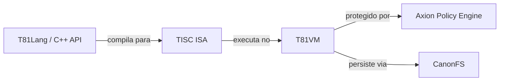

<p align="center">
  
</p>

# T81: Uma Arquitetura Ternária Determinística

<p align="center">
  <a href="https://github.com/t81dev/t81-foundation/releases/latest"></a>
  <a href="https://github.com/t81dev/t81-foundation/actions/workflows/ci.yml"></a>
  <a href="./LICENSE"></a>
  
</p>

[English](./README.md) | [简体中文](./README.zh-CN.md) | [Español](./README.es.md) | [Русский](./README.ru.md) | [Português](./README.pt-BR.md)

<!-- T81-SPEED-START -->
<!-- T81-SPEED-END -->

A T81 Foundation é uma pilha de computação nativa ternária e determinística projetada para engenheiros, pesquisadores e programadores de sistemas que exigem execução matematicamente reproduzível, tratamento de dados canônico e políticas de tempo de execução aplicáveis.

Ela combina um conjunto de instruções estável, uma máquina virtual governada, um frontend de linguagem e uma API pública C++ em um único repositório. O projeto é voltado para aqueles que constroem tempos de execução (runtimes), ferramentas de linguagem, sistemas sujeitos a auditoria rigorosa e experimentos reprodutíveis.

## Por que a T81?

A maioria das pilhas de tecnologia modernas trata o determinismo, a auditabilidade e a governança como preocupações secundárias — adicionadas depois que o tempo de execução já existe. A T81 adota a abordagem oposta:
- **Construída para o Determinismo:** Construímos em torno de representações canônicas e comportamentos explícitos de falha desde o início.
- **Nativa Ternária:** O sistema ternário balanceado e as codificações em base 81 fazem parte da base. Por meio da vetorização SWAR e trits empacotados em 2 bits, a T81 alcança semânticas ternárias nativas com alto desempenho em hardware binário.
- **Execução Consciente de Políticas:** O motor de políticas Axion aplica dinamicamente decisões em tempo de execução dentro do fluxo de execução, garantindo que a governança não seja apenas uma verificação consultiva.
- **Limites Estritos:** As alegações de determinismo são explicitamente limitadas ao **Perfil Central Determinístico (DCP)**. Funcionalidades experimentais são rigidamente isoladas para prevenir comportamentos indefinidos.

## Arquitetura e Status do Sistema

A T81 é integrada verticalmente, passando de APIs de linguagem de alto nível até um substrato de execução governado. Nossa maturidade é explícita: os limites centrais são *Congelados*, enquanto as superfícies experimentais são marcadas claramente. A T81 está em desenvolvimento ativo com maturidade mista em toda a pilha.

| Componente | Papel | Status de Maturidade |
| :--- | :--- | :--- |
| **`include/t81/`** | Superfície pública de API C++ para consumidores e builds adjacentes (*downstream*). | **Misto** |
| **Data Types** | Numéricos centrais, representações canônicas (`core/types/`). | **Congelado** (Verificado DCP) |
| **TISC ISA** | O contrato de máquina estável para serialização e execução. | **Congelado** (Verificado DCP) |
| **T81VM** | O caminho de execução de referência para a execução reproduzível. | **Beta** |
| **CanonFS** | Persistência determinística e limites de identidade. | **Beta** |
| **T81Lang** | Frontend compilando para a TISC ISA. | **Beta** |
| **Axion** | Motor de política de execução integrado no passo da máquina virtual. | **Alpha** |



*As cadeias de ferramentas suportadas que atualmente são verificadas no CI incluem Ubuntu 24.04 com GCC 14 e Clang 18, Ubuntu 24.04 ARM64 com Clang 18, macOS 14 ARM64 com Apple Clang e Windows Server 2022 com MSVC, testado conforme a disponibilidade de melhor esforço (*best-effort*).*

## Estrutura do Repositório

- [`./include/t81/`](./include/t81/) contém os cabeçalhos públicos para os consumidores da biblioteca.
- [`./examples/`](./examples/) contém demonstrações em C++, exemplos de T81Lang e exemplos de integração.
- [`./docs/`](./docs/) é a central de documentação com manuais de início rápido, arquitetura, status e governança.
- [`./book/`](./book/) contém material mais longo em formato de monografia ou tutorial.
- [`./spec/`](./spec/) armazena as especificações normativas e os RFCs.
- [`./tests/`](./tests/) abriga testes de unidade, integração, adequação e testes baseados no determinismo.
- [`./core/`](./core/) envolve estruturas primárias de tipo, implementação do conjunto de instruções (ISA) e componentes para a máquina virtual (VM).
- [`./src/`](./src/) compreende os componentes de tempo de execução como codecs, sistema de entrada/saída (IO) e CanonFS.
- [`./tooling/`](./tooling/) compreende utilitários de CLI e código de suporte a geração modelos utilizados nos fluxos de envio ao desenvolvedor.
- [`./.github/workflows/`](./.github/workflows/) contém a automatização para integração contínua (CI), reprodutibilidade, documentação, benchmarks e lançamentos (*releases*).

## Começando

### Pré-requisitos
- CMake 3.16+
- Um compilador com suporte a C++23 (C++20 compatível através da flag `-DT81_USE_CXX23=OFF`)
- Python 3.10+ (para portas de reprodutibilidade)
- Ninja ou Make

### Clonando e Compilando
```bash
git clone https://github.com/t81dev/t81-foundation.git
cd t81-foundation
cmake -S . -B build -G Ninja -DCMAKE_BUILD_TYPE=Release
cmake --build build --parallel
```

### Executando Testes e Verificando o Determinismo
```bash
# Executa a principal suíte de testes
ctest --test-dir build --output-on-failure

# Verifica o portão de reprodutibilidade
mkdir -p build/t81lang-repro
python3 scripts/ci/t81lang_repro_gate.py \
  --t81-bin build/t81 \
  --fixtures-dir tests/fixtures/t81lang_determinism \
  --workdir build/t81lang-repro \
  --hash-out build/t81lang-repro/hash.txt \
  --expected-hash-file tests/fixtures/t81lang_determinism/t81lang_repro_hash.txt
```

### Executando Exemplos Inclusos
```bash
./build/t81_demo
./build/t81_tensor_ops
./build/t81_ir_roundtrip
```

### Compilar e rodar um código T81Lang
```bash
./build/t81 code check examples/hello_world.t81
./build/t81 code build examples/hello_world.t81 -o build/hello_world.tisc
./build/t81 code run build/hello_world.tisc
```

*Outros pontos de entrada comuns incluem `./build/t81 project init`, `./build/t81 env doctor`, `./build/t81 weights ...`, `./build/t81 trace ...`, `./build/t81 canonfs ...`, `./build/t81 determinism ...`, `./build/t81 vm ...`, `./build/t81 tisc ...`, e `./build/t81 ir ...`. Confira [`./docs/user-guide/reference/cli-user-manual.md`](./docs/user-guide/reference/cli-user-manual.md) para conhecer a atual superfície de comandos.*

### Exemplo Mínimo de Consumo (C++)

```cpp
#include <iostream>
#include <t81/types/T81Int.hpp>

int main() {
  t81::T81Int<9> value(42);
  std::cout << value.to_int64() << "\n";
}
```

Para o uso de CMake intermediário (*downstream*), acesse [`./examples/consumer_cmake/`](./examples/consumer_cmake/).

**Instale e consuma através de um pacote CMake**

```bash
cmake --install build --prefix /tmp/t81_install
cmake -S examples/consumer_cmake -B /tmp/t81_consumer_build -DCMAKE_PREFIX_PATH=/tmp/t81_install
cmake --build /tmp/t81_consumer_build --parallel
/tmp/t81_consumer_build/t81_consumer
```

```cmake
find_package(T81Foundation CONFIG REQUIRED)
target_link_libraries(t81_consumer PRIVATE T81::t81_core)
```

## Exemplos

- [`./examples/hello_world.t81`](./examples/hello_world.t81) é o menor exemplo ponta a ponta de compilação e execução em T81Lang.
- [`./examples/option_result_match.t81`](./examples/option_result_match.t81) demonstra controle de fluxo tipado com `Option` e `Result`.
- [`./examples/tensor_ops.cpp`](./examples/tensor_ops.cpp) demonstra remodelamento (reshape), fatiamento (slice), transposição de tensores e operações relacionadas.
- [`./examples/axion_policy_runner.cpp`](./examples/axion_policy_runner.cpp) destaca a execução consciente de políticas e a geração de rastreios (traces).
- [`./examples/system-integration/inference.t81`](./examples/system-integration/inference.t81) junto de [`./examples/system-integration/secure_model.apl`](./examples/system-integration/secure_model.apl) mostra um fluxo de trabalho T81Lang + Axion mais completo.
- [`./examples/tisc/`](./examples/tisc/) incorpora amostras pré-compiladas `.tisc` para desmontagem (disassembly), depuração e inspeção em tempo de execução.
- [`./examples/consumer_cmake/`](./examples/consumer_cmake/) retrata um modelo prático na qual um projeto CMake adjacente pode consumir cabeçalhos públicos e alvos (*targets*).

## Benchmarks

A T81 dispõe de um conjunto de testes de desempenho (benchmarks) para números centrais, caminhos de tensores, trabalho SIMD/base81, CanonFS e *kernels* da VM. O executor agora possui perfis locais explícitos: `smoke` como padrão, `full` em modo delimitado para uso humano e `deep` para análises exaustivas envolvendo laboratórios/processos noturnos.

```bash
cmake --build build --target benchmark_runner
```

```bash
# Perfil local padrão smoke: gera resultado JSON. Relatórios Markdown 
# só são criados caso T81_BENCHMARK_WRITE_REPORTS=1 esteja definido.
./build/benchmarks/benchmark_runner \
  --benchmark_format=json \
  --benchmark_out=bench.json
```

```bash
# Perfil full para uso humano:
T81_BENCHMARK_PROFILE=full ./build/benchmarks/benchmark_runner \
  --benchmark_format=json \
  --benchmark_out=bench-full.json

# Perfil deep exaustivo para pesquisa e instâncias noturnas:
T81_BENCHMARK_PROFILE=deep ./build/benchmarks/benchmark_runner \
  --benchmark_format=json \
  --benchmark_out=bench-deep.json

# Iteração local filtrada customizada:
./build/benchmarks/benchmark_runner \
  --benchmark_filter='BM_(ArithThroughput|NegationSpeed|RoundtripAccuracy|overflow|PackingDensity|MemoryBandwidth|Add_1024_bit|Add_2048_bit|T81LangCompile|LimbArithThroughput|LimbAdd_T81Native|LimbAdd_T81Limb|LimbAdd_Int128|vs_).*' \
  --benchmark_format=json \
  --benchmark_out=bench-smoke.json

# ou por intermédio da CLI
./build/t81 internal benchmark --benchmark_filter='BM_(ArithThroughput|T81LangCompile).*'

# O wrapper CLI preserva desativada a geração de relatores nativamente
T81_BENCHMARK_WRITE_REPORTS=1 ./build/t81 internal benchmark --benchmark_filter='BM_(ArithThroughput|T81LangCompile).*'
```

Para detalhes metodológicos e considerações fundamentais específicas de referências, confira [`./benchmarks/README.md`](./benchmarks/README.md) e [`./docs/developer-guide/tools/README.md`](./docs/developer-guide/tools/README.md).

## Documentação

A T81 mantém uma rígida hierarquia de documentação. **O diretório `/spec` é normativo.**
- **Visão Geral da Arquitetura:** [`docs/architecture/OVERVIEW.md`](docs/architecture/OVERVIEW.md)
- **Status e Central de Controle:** [`docs/status/PROJECT_CONTROL_CENTER.md`](docs/status/PROJECT_CONTROL_CENTER.md)
- **Manual do Usuário CLI:** [`docs/user-guide/reference/cli-user-manual.md`](docs/user-guide/reference/cli-user-manual.md)
- **Guia de Reprodutibilidade:** [`docs/reference/REPRODUCIBILITY.md`](docs/reference/REPRODUCIBILITY.md)
- **Especificações Formais:** [`spec/`](spec/)
- **Livro formato-longo:** [`book/book-en/README.md`](book/book-en/README.md)

## Contribuição

Contribuições são muito bem-vindas, porém pedimos que tenha em mente nossas filosofias fundamentais:
1. **Autoridade da Especificação (Spec-First):** O diretório `/spec` determina a implementação, não o inverso.
2. **Determinismo Acima de Tudo:** Todas as mudanças obrigam-se a conservar o comportamento canônico estritamente definido atestando nas portas de reprodutibilidade exatas.
3. **Governança Restrita:** Atributos de cunho experimental (como Camadas Cognitivas) jamais deverão expandir para os sub-limites restritos através do Perfil Central Determinístico (DCP).

Comece inicialmente explorando [`CONTRIBUTING.md`](CONTRIBUTING.md) e [`CODE_OF_CONDUCT.md`](CODE_OF_CONDUCT.md). Em caso de considerações detalhadas a envolver métodos para de governança veja nos aspectos presentes no [`docs/governance/`](docs/governance/). Tratando sobre relatos de cunho confidencial ou particular e deficiências relacionadas a invulnerabilidades, proceda cautelosamente sobre regras através de [`SECURITY.md`](SECURITY.md).

## Licença

A T81 Foundation é disponibilizada publicamente através da Licença MIT. Favor consultar em [`LICENSE`](LICENSE).
