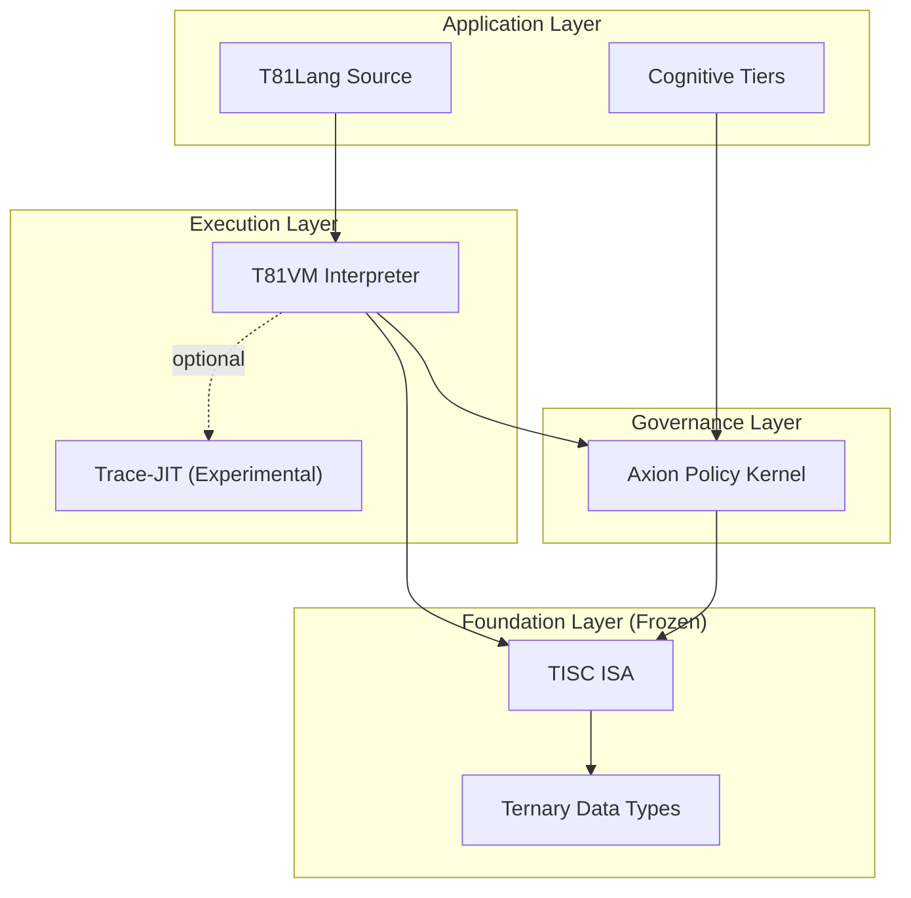

<p align="center">
  
</p>

<p align="center">
  <a href="https://github.com/t81dev/t81-foundation/releases/latest"></a>
  <a href="https://github.com/t81dev/t81-foundation/actions/workflows/ci.yml"></a>
  <a href="https://github.com/t81dev/t81-foundation/blob/main/LICENSE"></a>
  <a href="https://en.cppreference.com/w/cpp/23"></a>
</p>

<p align="center">
  <strong>A stack de computação ternária determinística</strong><br>
  <em>Reprodutibilidade bit a bit. Lógica ternária nativa. Governança de IA auditável.</em>
</p>

<p align="center">
  <a href="README.md">English</a> •
  <a href="README.zh-CN.md">简体中文</a> •
  <a href="README.es.md">Español</a> •
  <a href="README.ru.md">Русский</a> •
  <a href="README.pt-BR.md">Português</a>
</p>

---

## Recursos

### O que é T81?

**T81** é uma stack de computação soberana construída do zero para **determinismo** e **lógica ternária**. Ela reduz o não determinismo em superfícies explicitamente verificadas e fornece uma base matematicamente rigorosa para IA de alto risco, criptografia e modelagem científica.

Onde sistemas tradicionais divergem entre arquiteturas, o T81 busca reprodutibilidade bit a bit em superfícies explicitamente verificadas, com garantias limitadas pelo registro de determinismo e pelo perfil do núcleo.

### A promessa central: determinismo verificado

| Recurso | O problema (Binário/IEEE 754) | A solução T81 |
| :--- | :--- | :--- |
| **Aritmética** | Deriva de ponto flutuante entre arquiteturas CPU/GPU. | **Soft-float determinístico (limitado):** Comportamento bit a bit em superfícies explicitamente verificadas sob o registro/perfil de determinismo. |
| **Lógica** | Booleano (Verdadeiro/Falso) perde nuance. | **Ternário balanceado:** {-1, 0, +1} para árvores de decisão eficientes e sem deriva. |
| **Segurança** | Modelos de IA são caixas-pretas sem garantias de runtime. | **Kernel Axion:** Políticas de governança aplicáveis e auditáveis em nível de opcode. |
| **Estabilidade** | Quebras constantes e inferno de dependências. | **Specs congeladas:** TISC ISA e Tipos de Dados são padrões imutáveis. |

---

## Arquitetura

O T81 é organizado em camadas estritas de autoridade e abstração.



*   **Camada de fundação:** O núcleo "congelado". `T81BigInt`, `T81Float` e a ISA **TISC** (Ternary Instruction Set Computer). Mudanças aqui exigem aumento de versão major.
*   **Camada de execução:** A **T81VM** executa bytecode TISC. Inclui um interpretador determinístico e um Trace-JIT experimental, com alegações de determinismo limitadas a superfícies governadas/verificadas.
*   **Camada de governança:** O **Kernel Axion** intercepta a execução para aplicar políticas de segurança, limites de recursos e guardrails éticos definidos em configuração.

---

## Início Rápido

Construa a stack T81 a partir do código-fonte.

### Pré-requisitos
*   **CMake** 3.16+
*   **Compilador C++** com suporte a C++20/23 (testado em AppleClang 17+, Clang 18+, GCC 14+, MSVC)

### Instalação

```bash
# 1. Clone o repositório
git clone https://github.com/t81dev/t81-foundation.git
cd t81-foundation

# 2. Configure e construa
cmake -S . -B build -DCMAKE_BUILD_TYPE=Release
cmake --build build --parallel

# 3. Verifique a instalação (executa o gate de determinismo)
python3 scripts/ci/t81lang_repro_gate.py --t81-bin build/t81 --check
```

### Hello World (estilo ternário)

Crie um arquivo chamado `hello.t81`:

```t81
fn main() {
    print("Hello, Deterministic World!");
    let a: trit = 1;
    let b: trit = -1;
    print(a + b); // Mostra "0"
}
```

Compile e execute:

```bash
# Compilar para bytecode TISC
./build/t81 compile hello.t81 -o hello.tisc

# Executar via VM
./build/t81 run hello.tisc
```

---

## Plataformas Suportadas

| Plataforma | Arq | Compilador | Status |
| :--- | :--- | :--- | :--- |
| **Linux** | x86_64 | Clang 18+, GCC 14+ | ✅ Verificado |
| **Linux** | ARM64 | Clang 18+ | ✅ Verificado |
| **macOS** | Intel | Apple Clang / GCC | ✅ Verificado |
| **macOS** | Apple Silicon | Apple Clang | ✅ Verificado |

## Exemplos CLI

```bash
# Desenvolvimento
./build/t81 compile src.t81 -o out.tisc
./build/t81 run out.tisc
./build/t81 disasm out.tisc

# Diagnóstico e qualidade
./build/t81 doctor --json
./build/t81 test --list
./build/t81 fmt --check src.t81
```

---

## 📚 Documentação

O ecossistema T81 é documentado em vários níveis de autoridade.

| Recurso | Descrição | Autoridade |
| :--- | :--- | :--- |
| **[The Monograph](docs/developer-guide/book/book-en/README.md)** | O livro definitivo sobre filosofia, arquitetura e uso do T81. **Comece aqui.** | Alta |
| **[Normative Specs](spec/)** | Fonte normativa de verdade das especificações. Define TISC ISA, Tipos de Dados e comportamento da VM. | **Absoluta** |
| **[Architecture](docs/architecture/OVERVIEW.md)** | Documento "North Star" que define limites e invariantes do sistema. | Alta |
| **[Status Dashboard](docs/status/PROJECT_CONTROL_CENTER.md)** | Acompanhamento em tempo real da saúde do sistema, gates ativos e superfícies verificadas. | Ao vivo |
| **[Governance](docs/governance/)** | Políticas sobre deriva de especificação, disciplina de release e modelos de ameaça. | Alta |

### Tópicos principais
*   **[TISC Instruction Set](spec/tisc-spec.md)** - Especificação da ISA congelada.
*   **[Ternary Data Types](spec/t81-data-types.md)** - Entenda `trit`, `tryte` e `T81Float`.
*   **[Axion Policy Engine](spec/axion-kernel.md)** - Configuração de segurança em runtime.

## Mapa de Autoridade Documental

A autoridade normativa está em `spec/`; o status operacional e de governança é acompanhado em `docs/status/` e `docs/governance/`.

---

## 🧩 Componentes e status

| Componente | Status | Descrição |
| :--- | :--- | :--- |
| **TISC ISA** | 🧊 **Congelado** | O conjunto de instruções é verificado e imutável (v1). |
| **Tipos de Dados** | 🧊 **Congelado** | Os tipos aritméticos do núcleo são estáveis; garantias bit a bit são limitadas a superfícies determinísticas verificadas. |
| **T81VM** | 🚧 **Beta** | A superfície de runtime está ativa e sob verificação contínua. |
| **Axion** | ⚠️ **Alpha** | O motor de políticas está ativo com cobertura parcial de superfícies em draft. |
| **T81Lang** | 🚧 **Beta** | A maturidade de implementação é Beta; a especificação normativa da linguagem permanece em Draft. |
| **Trace-JIT** | 🧪 **Experimental** | Compilação JIT para desempenho (opt-in). |
| **Hanoi Kernel** | 🗃️ **Conceito arquivado** | Conceito histórico experimental mantido apenas como referência de design. |

> **Nota:** Componentes "congelados" têm garantia contratual de não mudar sem aumento de versão major (ex.: 2.0).

---

## 🤝 Comunidade e contribuição

Recebemos contribuições de quem compartilha nossa paixão por sistemas rigorosos e determinísticos.

*   **[Contributing Guide](CONTRIBUTING.md):** Leia antes de abrir um PR.
*   **[Code of Conduct](CODE_OF_CONDUCT.md):** Seguimos um padrão estrito de conduta profissional.
*   **[Discussions](https://github.com/t81dev/t81-foundation/discussions):** Faça perguntas e compartilhe ideias.

### O "Repro Gate"
Checks obrigatórios de Pull Request aplicam gates de reprodutibilidade e conformidade para superfícies determinísticas delimitadas. Se sua mudança alterar saídas determinísticas governadas, o gate correspondente deve falhar. Isso é um recurso, não um bug.

---

## 📄 Licença

T81 é software open-source licenciado sob a **[Licença MIT](LICENSE)**.

Copyright © 2024-2026 T81 Foundation.
