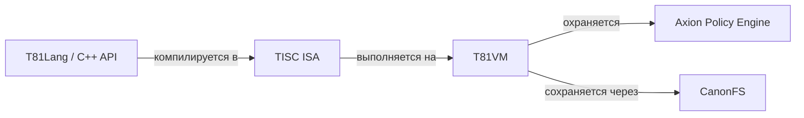

<p align="center">
  
</p>

# T81: Детерминированная троичная архитектура

<p align="center">
  <a href="https://github.com/t81dev/t81-foundation/releases/latest"></a>
  <a href="https://github.com/t81dev/t81-foundation/actions/workflows/ci.yml"></a>
  <a href="./LICENSE"></a>
  
</p>

[English](./README.md) | [简体中文](./README.zh-CN.md) | [Español](./README.es.md) | [Русский](./README.ru.md) | [Português](./README.pt-BR.md)

<!-- T81-SPEED-START -->
<!-- T81-SPEED-END -->

T81 Foundation — это детерминированный стек вычислений с нативной поддержкой троичной логики, разработанный для инженеров, исследователей и системных программистов, которым требуется математически воспроизводимое выполнение, каноническая обработка данных и применяемые политики времени выполнения.

Он объединяет в себе стабильный набор инструкций, управляемую виртуальную машину, фронтенд языка и публичный C++ API в одном репозитории. Проект нацелен на разработчиков времени выполнения (runtimes), языковых инструментов, систем с жестким аудитом и воспроизводимых экспериментов.

## Почему T81?

Большинство современных технологических стеков рассматривают детерминизм, возможность аудита и управление как второстепенные задачи, накладывая их уже после создания среды выполнения. T81 придерживается противоположного подхода:
- **Создан для детерминизма:** Мы выстраиваем архитектуру вокруг канонических представлений и явного поведения при сбоях с самого начала.
- **Нативная троичная логика:** Сбалансированная троичная система и кодировки по основанию 81 являются частью основы. Благодаря векторизации SWAR и 2-битным упакованным тритам, T81 достигает нативной троичной семантики с высокой производительностью на двоичном оборудовании.
- **Выполнение с учетом политик:** Механизм политик Axion динамически применяет решения во время выполнения внутри потока выполнения, гарантируя, что управление не будет просто рекомендательной проверкой.
- **Строгие ограничения:** Заявления о детерминизме явно ограничены **Детерминированным базовым профилем (DCP)**. Экспериментальные функции жестко изолированы для предотвращения неопределенного поведения.

## Архитектура и статус системы

T81 интегрирован по вертикали, переходя от высокоуровневых языковых API к управляемой среде выполнения. Уровень нашей готовности заявлен явно: базовые границы *Заморожены*, в то время как экспериментальные поверхности четко отмечены. T81 находится в стадии активной разработки с различной степенью зрелости по всему стеку.

| Компонент | Роль | Статус готовности |
| :--- | :--- | :--- |
| **`include/t81/`** | Поверхность публичного C++ API для потребителей и последующих сборок. | **Смешанный** |
| **Типы данных (Data Types)** | Базовая числовая логика, канонические представления (`core/types/`). | **Заморожен** (DCP Verified) |
| **TISC ISA** | Стабильный машинный контракт для сериализации и выполнения. | **Заморожен** (DCP Verified) |
| **T81VM** | Эталонный путь выполнения для воспроизводимого выполнения. | **Бета** |
| **CanonFS** | Детерминированное хранение и границы идентичности. | **Бета** |
| **T81Lang** | Фронтенд, компилируемый в TISC ISA. | **Бета** |
| **Axion** | Механизм политик времени выполнения, интегрированный в пошаговый путь VM. | **Альфа** |



*Поддерживаемые наборы инструментов (toolchains), в настоящее время проверяемые в CI, включают Ubuntu 24.04 с GCC 14 и Clang 18, Ubuntu 24.04 ARM64 с Clang 18, macOS 14 ARM64 с Apple Clang и Windows Server 2022 с MSVC на основе наилучших усилий (best-effort).*

## Структура репозитория

- [`./include/t81/`](./include/t81/) содержит публичные заголовки для потребителей библиотеки.
- [`./examples/`](./examples/) содержит примеры C++, примеры T81Lang и демонстрации для потребителей.
- [`./docs/`](./docs/) является центром документации для быстрых стартов, архитектуры, статуса и управления.
- [`./book/`](./book/) содержит более объемные монографии и материалы в стиле руководств.
- [`./spec/`](./spec/) хранит нормативные спецификации и RFC.
- [`./tests/`](./tests/) содержит модульные, интеграционные тесты, тесты на соответствие требованиям и детерминизм.
- [`./core/`](./core/) содержит основные типы, реализацию ISA и модули VM.
- [`./src/`](./src/) содержит компоненты времени выполнения, такие как кодеки, ввод-вывод (IO) и CanonFS.
- [`./tooling/`](./tooling/) содержит код CLI и инструменты для работы с моделями, используемые в поставляемых рабочих процессах для разработчиков.
- [`./.github/workflows/`](./.github/workflows/) содержит автоматизацию CI, воспроизводимости, документации, бенчмаркинга и релизов.

## Начало работы

### Предварительные требования
- CMake 3.16+
- Компилятор с поддержкой C++23 (C++20 поддерживается через `-DT81_USE_CXX23=OFF`)
- Python 3.10+ (для шлюзов воспроизводимости)
- Ninja или Make

### Клонирование и сборка
```bash
git clone https://github.com/t81dev/t81-foundation.git
cd t81-foundation
cmake -S . -B build -G Ninja -DCMAKE_BUILD_TYPE=Release
cmake --build build --parallel
```

### Запуск тестов и проверка детерминизма
```bash
# Запуск основного набора тестов
ctest --test-dir build --output-on-failure

# Проверка шлюза воспроизводимости
mkdir -p build/t81lang-repro
python3 scripts/ci/t81lang_repro_gate.py \
  --t81-bin build/t81 \
  --fixtures-dir tests/fixtures/t81lang_determinism \
  --workdir build/t81lang-repro \
  --hash-out build/t81lang-repro/hash.txt \
  --expected-hash-file tests/fixtures/t81lang_determinism/t81lang_repro_hash.txt
```

### Запуск встроенных примеров
```bash
./build/t81_demo
./build/t81_tensor_ops
./build/t81_ir_roundtrip
```

### Компиляция и запуск примера T81Lang
```bash
./build/t81 code check examples/hello_world.t81
./build/t81 code build examples/hello_world.t81 -o build/hello_world.tisc
./build/t81 code run build/hello_world.tisc
```

*Другие распространенные точки входа включают `./build/t81 project init`, `./build/t81 env doctor`, `./build/t81 weights ...`, `./build/t81 trace ...`, `./build/t81 canonfs ...`, `./build/t81 determinism ...`, `./build/t81 vm ...`, `./build/t81 tisc ...` и `./build/t81 ir ...`. Ознакомьтесь с [`./docs/user-guide/reference/cli-user-manual.md`](./docs/user-guide/reference/cli-user-manual.md) для получения информации о текущей поверхности команд.*

### Минимальный пример использования (C++)

```cpp
#include <iostream>
#include <t81/types/T81Int.hpp>

int main() {
  t81::T81Int<9> value(42);
  std::cout << value.to_int64() << "\n";
}
```

Для использования CMake в нижестоящих проектах см. [`./examples/consumer_cmake/`](./examples/consumer_cmake/).

**Установка и использование в качестве пакета CMake**

```bash
cmake --install build --prefix /tmp/t81_install
cmake -S examples/consumer_cmake -B /tmp/t81_consumer_build -DCMAKE_PREFIX_PATH=/tmp/t81_install
cmake --build /tmp/t81_consumer_build --parallel
/tmp/t81_consumer_build/t81_consumer
```

```cmake
find_package(T81Foundation CONFIG REQUIRED)
target_link_libraries(t81_consumer PRIVATE T81::t81_core)
```

## Примеры

- [`./examples/hello_world.t81`](./examples/hello_world.t81) — это наименьший сквозной пример компиляции и выполнения T81Lang.
- [`./examples/option_result_match.t81`](./examples/option_result_match.t81) демонстрирует типизированный поток управления с использованием `Option` и `Result`.
- [`./examples/tensor_ops.cpp`](./examples/tensor_ops.cpp) демонстрирует изменение формы (reshape), срезы (slice), транспонирование тензоров и связанные операции.
- [`./examples/axion_policy_runner.cpp`](./examples/axion_policy_runner.cpp) подчеркивает выполнение с учетом политик и генерацию трассировок.
- [`./examples/system-integration/inference.t81`](./examples/system-integration/inference.t81) в сочетании с [`./examples/system-integration/secure_model.apl`](./examples/system-integration/secure_model.apl) показывает более полный рабочий процесс T81Lang + Axion.
- [`./examples/tisc/`](./examples/tisc/) содержит предварительно скомпилированные образцы `.tisc` для дизассемблирования, отладки и проверки во время выполнения.
- [`./examples/consumer_cmake/`](./examples/consumer_cmake/) показывает, как проект CMake нижнего уровня может использовать публичные заголовки и цели.

## Бенчмарки (Benchmarks)

В T81 предусмотрен набор тестов производительности для базовой числовой логики, тензорных операций, работы с SIMD/base81, CanonFS и ядер виртуальной машины. Теперь в системе запуска есть явные локальные профили: `smoke` по умолчанию, ограниченный `full` для использования человеком и исчерпывающий `deep` для исследовательских или ночных запусков.

```bash
cmake --build build --target benchmark_runner
```

```bash
# Локальный профиль smoke по умолчанию: генерирует вывод в формате JSON. Отчеты в формате Markdown
# создаются только если установлено T81_BENCHMARK_WRITE_REPORTS=1.
./build/benchmarks/benchmark_runner \
  --benchmark_format=json \
  --benchmark_out=bench.json
```

```bash
# Профиль full, пригодный для использования человеком:
T81_BENCHMARK_PROFILE=full ./build/benchmarks/benchmark_runner \
  --benchmark_format=json \
  --benchmark_out=bench-full.json

# Исчерпывающий профиль deep для исследований/ночных прогонов:
T81_BENCHMARK_PROFILE=deep ./build/benchmarks/benchmark_runner \
  --benchmark_format=json \
  --benchmark_out=bench-deep.json

# Пользовательская локальная итерация с фильтрацией:
./build/benchmarks/benchmark_runner \
  --benchmark_filter='BM_(ArithThroughput|NegationSpeed|RoundtripAccuracy|overflow|PackingDensity|MemoryBandwidth|Add_1024_bit|Add_2048_bit|T81LangCompile|LimbArithThroughput|LimbAdd_T81Native|LimbAdd_T81Limb|LimbAdd_Int128|vs_).*' \
  --benchmark_format=json \
  --benchmark_out=bench-smoke.json

# или через обертку CLI
./build/t81 internal benchmark --benchmark_filter='BM_(ArithThroughput|T81LangCompile).*'

# Обертка CLI по умолчанию отключает создание отчетов
T81_BENCHMARK_WRITE_REPORTS=1 ./build/t81 internal benchmark --benchmark_filter='BM_(ArithThroughput|T81LangCompile).*'
```

Методологию и специальные примечания по бенчмаркам см. в [`./benchmarks/README.md`](./benchmarks/README.md) и [`./docs/developer-guide/tools/README.md`](./docs/developer-guide/tools/README.md).

## Документация

T81 поддерживает строгую иерархию документации. **Каталог `/spec` является нормативным.**
- **Обзор архитектуры:** [`docs/architecture/OVERVIEW.md`](docs/architecture/OVERVIEW.md)
- **Статус и центр управления:** [`docs/status/PROJECT_CONTROL_CENTER.md`](docs/status/PROJECT_CONTROL_CENTER.md)
- **Руководство пользователя CLI:** [`docs/user-guide/reference/cli-user-manual.md`](docs/user-guide/reference/cli-user-manual.md)
- **Руководство по воспроизводимости:** [`docs/reference/REPRODUCIBILITY.md`](docs/reference/REPRODUCIBILITY.md)
- **Официальные спецификации:** [`spec/`](spec/)
- **Объемная книга:** [`book/book-en/README.md`](book/book-en/README.md)

## Внесение вклада

Вклады приветствуются, но, пожалуйста, помните о нашей основной философии:
1. **Первичность спецификации (Spec-First):** Каталог `/spec` диктует реализацию, а не наоборот.
2. **Детерминизм превыше всего:** Любые изменения должны сохранять каноническое поведение и проходить строгие проверки воспроизводимости.
3. **Ограниченное управление:** Экспериментальные функции (например, когнитивные уровни) не должны проникать в Детерминированный базовый профиль (DCP).

Начните с прочтения [`CONTRIBUTING.md`](CONTRIBUTING.md) и [`CODE_OF_CONDUCT.md`](CODE_OF_CONDUCT.md). Подробную информацию об управлении см. в материалах в [`docs/governance/`](docs/governance/). Для частных отчетов об уязвимостях следуйте [`SECURITY.md`](SECURITY.md).

## Лицензия

T81 Foundation выпускается под лицензией MIT. Смотрите [`LICENSE`](LICENSE).
