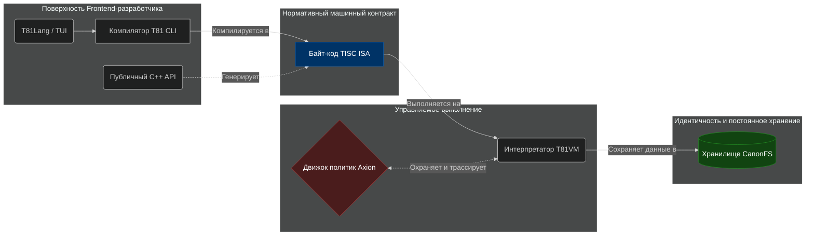

<p align="center">
  
</p>

# T81: Детерминированная троичная архитектура

<p align="center">
  <a href="https://github.com/t81dev/t81-foundation/releases/latest"></a>
  <a href="https://github.com/t81dev/t81-foundation/actions/workflows/ci.yml"></a>
  <a href="./LICENSE"></a>
  
</p>

[English](./README.md) | [简体中文](./README.zh-CN.md) | [Español](./README.es.md) | [Русский](./README.ru.md) | [Português](./README.pt-BR.md)

<!-- T81-SPEED-START -->
<!-- T81-SPEED-END -->

T81 Foundation — это **детерминированный стек вычислений с нативной поддержкой троичной логики**, разработанный для точной математической воспроизводимости, криптографически достоверной канонической обработки данных и активного контроля политик во время исполнения.

Мы предоставляем вертикально-интегрированный стек, созданный для исследователей, системных программистов и критичных к безопасности сред, где недетерминизм, неопределенное поведение и негласные правила недопустимы. В его основе лежит парадигма троичной системы счисления по основанию 81 (`T81`), которая обеспечивает встроенные свойства троичного масштабирования и одновременно использует векторизацию SWAR для достижения непревзойденной пропускной способности на стандартном бинарном оборудовании.

---

### 🚀 [Быстрый старт: Инструкция по сборке и установке](docs/user-guide/quickstart/INSTALL.md)

---

## 🏛️ Архитектура экосистемы

Большинство современных технологических стеков рассматривают детерминизм, возможность аудита и управление как второстепенные абстракции, накладываемые поверх уже готовых хаотичных систем. **T81 полностью меняет этот подход.** Каждый уровень системы функционирует строго в соответствии с каноническими представлениями, находясь под защитой движка ядра Axion.



### 🧩 Основные столпы

| Компонент | Роль | Статус готовности | Парадигма проектирования |
| :--- | :--- | :--- | :--- |
| **`TISC` ISA** | **Архитектура набора команд** | **Заморожен** | Выступает надежным форматом сериализации и контрактом операций для маршрутизации данных, контроля структурного потока и строгих математических вычислений. |
| **`T81VM`** | **Эталонный путь выполнения** | **Бета** | Пользовательская виртуальная машина, специально написанная для исполнения `TISC`. Она математически ограничивает выполнение вплоть до трита (база 3). |
| **`Axion`** | **Ядро механизма политик** | **Бета** | Среда динамических ограничений, работающая непосредственно внутри рабочего цикла виртуальной машины, что позволяет применять абсолютно жесткий контроль над рекурсией, операциями и границами. |
| **`CanonFS`**| **Идентификационная файловая система** | **Бета** | Все файлы представляют собой хэш-адресуемые байтовые массивы формата `.tisc`, что обеспечивает безупречную структурную верификацию и абсолютную защиту от незаконных изменений. |
| **`T81Lang`**| **Языковой фронтенд** | **Бета** | Эргономичная оболочка языка, компилируемая строго в формат `TISC`, предоставляющая безопасные типы значений, опции, а также мощный типизированный контроль тензорных поведений. |

## 👀 Программирование на T81Lang

T81Lang выступает современным интерфейсом к парадигме архитектуры TISC. Обладая встроенной поддержкой канонических структур, T81Lang органично работает с тензорными операциями. Приведем пример работы с типами `Option` и `Result` на уровне языка:

```t81
// Определение безотказного анализатора парсинга
func parse_safe(opt_input: Option<Int32>) -> Int32 {
    match opt_input {
        Some(v) => { v * 2 }
        None => { 0 }
    }
}

// Гарантированное явное управление следами ошибок
func calculate_checked(val: Int32) -> Result<Int32, String> {
    if val < 0 {
        return Err("В рамках данной политики значение не может быть отрицательным")
    }
    return Ok(val * 81)
}
```

## 🛠️ Использование C++ API

Если вы создаете собственные инструменты, движки вывода (inference engines) или любые другие детерминированные подсистемы, встроенные компоненты T81 отлично интегрируются в нижележащие проекты CMake.

```cpp
#include <iostream>
#include <t81/types/T81Int.hpp>
#include <t81/types/bigint.hpp>

int main() {
    // Высокоточное каноническое представление на основе 81
    t81::T81Int<9> canonical_val(42);
    std::cout << "Канонический след: " << canonical_val.to_int64() << "\n";
    
    // Безупречная математика бесконечной точности на битовом уровне
    t81::core::types::T81BigInt big("2145326462463276537653242");
    std::cout << big.to_string() << "\n";
}
```

## 🧭 Карта документации

Поведение нормативной системы описывается строгим приоритетом спецификаций. 
- **[Руководство по установке и сборке](docs/user-guide/quickstart/INSTALL.md)**
- **[Обзор архитектуры](docs/architecture/OVERVIEW.md)**
- **[Состояние проекта и Центр управления](docs/status/PROJECT_CONTROL_CENTER.md)**
- **[Справочник пользователя по CLI командам](docs/user-guide/reference/cli-user-manual.md)**
- **[Дерево официальных спецификаций](spec/)**
- **[Книга T81 (развернутая монография)](book/book-en/README.md)**

## 🤝 Внесение вклада в код и управление проектом

Мы рады приветствовать вклад в открытый проект при условии соблюдения философских концепций, заложенных в основу:
1. **Приоритет спецификации (Spec-First):** Техническая реализация на уровне C++ диктуется строго каталогом `/spec`.
2. **Детерминизм превыше всего:** Любые вносимые корректировки должны гарантировать сохранение канонического профиля (DCP) в строгих границах между любыми выбранными архитектурами процессора (CPU).
3. **Ограниченная безопасность:** Внешние экспериментальные возможности не должны пересекаться или влиять на работу детерминированных площадок ядра выполнения.

Перед внесением предложений ознакомьтесь с [`CONTRIBUTING.md`](CONTRIBUTING.md). Уязвимости и скрытые инциденты безопасности сообщаются приватно через руководство [`SECURITY.md`](SECURITY.md).

---
*T81 Foundation предоставляется по принципам Open Source под [лицензией MIT](LICENSE).*
