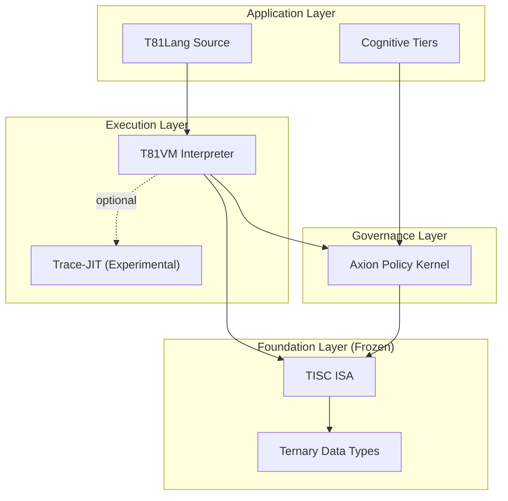

<p align="center">
  
</p>

<p align="center">
  <a href="https://github.com/t81dev/t81-foundation/releases/latest"></a>
  <a href="https://github.com/t81dev/t81-foundation/actions/workflows/ci.yml"></a>
  <a href="https://github.com/t81dev/t81-foundation/blob/main/LICENSE"></a>
  <a href="https://en.cppreference.com/w/cpp/23"></a>
</p>

<p align="center">
  <strong>Детерминированный троичный вычислительный стек</strong><br>
  <em>Побитовая воспроизводимость. Нативная троичная логика. Аудируемая AI-управляемость.</em>
</p>

<p align="center">
  <a href="README.md">English</a> •
  <a href="README.zh-CN.md">简体中文</a> •
  <a href="README.es.md">Español</a> •
  <a href="README.ru.md">Русский</a> •
  <a href="README.pt-BR.md">Português</a>
</p>

---

## Возможности

### Что такое T81?

**T81** — это суверенный вычислительный стек, созданный с нуля для **детерминизма** и **троичной логики**. Он снижает недетерминизм на явно верифицированных поверхностях и предоставляет математически строгую основу для высокорискового ИИ, криптографии и научного моделирования.

Там, где традиционные системы расходятся между архитектурами, T81 нацелен на побитовую воспроизводимость на явно верифицированных поверхностях, с гарантиями, ограниченными реестром детерминизма и профилем ядра.

### Ключевое обещание: верифицированный детерминизм

| Возможность | Проблема (Binary/IEEE 754) | Решение T81 |
| :--- | :--- | :--- |
| **Арифметика** | Дрейф вычислений с плавающей точкой между архитектурами CPU/GPU. | **Детерминированный soft-float (ограниченно):** Побитовое поведение на явно верифицированных поверхностях в рамках реестра/профиля детерминизма. |
| **Логика** | Булева логика (True/False) теряет нюансы. | **Сбалансированная троичная логика:** {-1, 0, +1} для эффективных деревьев решений без дрейфа. |
| **Безопасность** | AI-модели — «чёрные ящики» без гарантий выполнения. | **Ядро Axion:** Применяемые и аудитируемые политики управления на уровне опкодов. |
| **Стабильность** | Постоянные ломающие изменения и зависимостный хаос. | **Замороженные спецификации:** TISC ISA и типы данных — неизменяемые стандарты. |

---

## Архитектура

T81 организован в строгие слои полномочий и абстракций.



*   **Базовый слой:** «Замороженное» ядро. `T81BigInt`, `T81Float` и ISA **TISC** (Ternary Instruction Set Computer). Изменения здесь требуют увеличения major-версии.
*   **Слой исполнения:** **T81VM** исполняет TISC-байткод. Включает детерминированный интерпретатор и экспериментальный Trace-JIT; заявления о детерминизме ограничены управляемыми/верифицированными поверхностями.
*   **Слой управления:** **Ядро Axion** перехватывает выполнение, чтобы применять политики безопасности, лимиты ресурсов и этические guardrails, заданные в конфигурации.

---

## Быстрый Старт

Соберите стек T81 из исходников.

### Предварительные требования
*   **CMake** 3.16+
*   **Компилятор C++** с поддержкой C++20/23 (проверено на AppleClang 17+, Clang 18+, GCC 14+, MSVC)

### Установка

```bash
# 1. Клонировать репозиторий
git clone https://github.com/t81dev/t81-foundation.git
cd t81-foundation

# 2. Настроить и собрать
cmake -S . -B build -DCMAKE_BUILD_TYPE=Release
cmake --build build --parallel

# 3. Проверить установку (запускает determinism gate)
python3 scripts/ci/t81lang_repro_gate.py --t81-bin build/t81 --check
```

### Hello World (в троичном стиле)

Создайте файл `hello.t81`:

```t81
fn main() {
    print("Hello, Deterministic World!");
    let a: trit = 1;
    let b: trit = -1;
    print(a + b); // Выводит "0"
}
```

Скомпилируйте и запустите:

```bash
# Компиляция в TISC-байткод
./build/t81 compile hello.t81 -o hello.tisc

# Выполнение в VM
./build/t81 run hello.tisc
```

---

## Поддерживаемые Платформы

| Платформа | Архитектура | Компилятор | Статус |
| :--- | :--- | :--- | :--- |
| **Linux** | x86_64 | Clang 18+, GCC 14+ | ✅ Проверено |
| **Linux** | ARM64 | Clang 18+ | ✅ Проверено |
| **macOS** | Intel | Apple Clang / GCC | ✅ Проверено |
| **macOS** | Apple Silicon | Apple Clang | ✅ Проверено |

## Примеры CLI

```bash
# Разработка
./build/t81 compile src.t81 -o out.tisc
./build/t81 run out.tisc
./build/t81 disasm out.tisc

# Диагностика и качество
./build/t81 doctor --json
./build/t81 test --list
./build/t81 fmt --check src.t81
```

---

## 📚 Документация

Экосистема T81 документирована на нескольких уровнях полномочий.

| Ресурс | Описание | Полномочие |
| :--- | :--- | :--- |
| **[The Monograph](book/book-en/README.md)** | Ключевая книга по философии, архитектуре и использованию T81. **Начните здесь.** | Высокое |
| **[Normative Specs](spec/)** | Нормативный источник истины по спецификациям. Определяет TISC ISA, типы данных и поведение VM. | **Абсолютное** |
| **[Architecture](docs/architecture/OVERVIEW.md)** | Документ «North Star», определяющий границы системы и инварианты. | Высокое |
| **[Status Dashboard](docs/status/PROJECT_CONTROL_CENTER.md)** | Живое отслеживание состояния системы, активных gate’ов и верифицированных поверхностей. | Живое |
| **[Governance](docs/governance/)** | Политики по дрейфу спецификаций, дисциплине релизов и моделям угроз. | Высокое |

### Ключевые темы
*   **[TISC Instruction Set](spec/tisc-spec.md)** - Спецификация замороженной ISA.
*   **[Ternary Data Types](spec/t81-data-types.md)** - Понимание `trit`, `tryte` и `T81Float`.
*   **[Axion Policy Engine](spec/axion-kernel.md)** - Настройка безопасности во время выполнения.

## Карта Авторитетной Документации

Нормативный источник — `spec/`; операционный и управленческий статус отслеживается в `docs/status/` и `docs/governance/`.

---

## 🧩 Компоненты и статус

| Компонент | Статус | Описание |
| :--- | :--- | :--- |
| **TISC ISA** | 🧊 **Frozen** | Набор инструкций верифицирован и неизменяем (v1). |
| **Data Types** | 🧊 **Frozen** | Базовые арифметические типы стабильны; побитовые гарантии ограничены верифицированными детерминированными поверхностями. |
| **T81VM** | 🚧 **Beta** | Поверхность runtime активна и находится под постоянной верификацией. |
| **Axion** | ⚠️ **Alpha** | Движок политик активен с частичным покрытием draft-поверхностей. |
| **T81Lang** | 🚧 **Beta** | Зрелость реализации — Beta; нормативная спецификация языка остаётся в Draft. |
| **Trace-JIT** | 🧪 **Experimental** | JIT-компиляция для производительности (opt-in). |
| **Hanoi Kernel** | 🗃️ **Archived Concept** | Историческая экспериментальная концепция, сохранённая только как референс дизайна. |

> **Примечание:** «Замороженные» компоненты имеют контрактную гарантию не меняться без повышения major-версии (например, 2.0).

---

## 🤝 Сообщество и вклад

Мы приветствуем участников, разделяющих нашу страсть к строгим детерминированным системам.

*   **[Contributing Guide](CONTRIBUTING.md):** Прочитайте перед отправкой PR.
*   **[Code of Conduct](CODE_OF_CONDUCT.md):** Мы придерживаемся строгого стандарта профессионального поведения.
*   **[Discussions](https://github.com/t81dev/t81-foundation/discussions):** Задавайте вопросы и делитесь идеями.

### "Repro Gate"
Обязательные проверки Pull Request применяют gate’ы воспроизводимости и соответствия для ограниченных детерминированных поверхностей. Если ваше изменение меняет управляемые детерминированные выходы, соответствующий gate должен упасть. Это feature, а не bug.

---

## 📄 Лицензия

T81 — open-source ПО под лицензией **[MIT License](LICENSE)**.

Copyright © 2024-2026 T81 Foundation.
