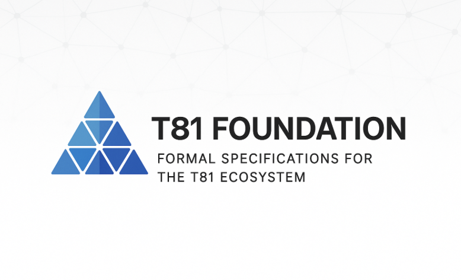

# T81 基金会：三进制原生计算栈

<div align="center">

<br/>



<br/><br/>

[](https://en.wikipedia.org/wiki/Ternary_computer) [](#) [](https://github.com/t81dev/t81-foundation/actions/workflows/ci.yml) [](#) [](LICENSE-MIT)

* * *

[](https://github.com/t81dev/t81-foundation/actions) [](https://github.com/t81dev/t81-foundation/actions) [](https://github.com/t81dev/t81-foundation/actions) [](https://github.com/t81dev/t81-foundation/actions)

* * *

[-brightgreen)](https://github.com/t81dev/t81-foundation/) [](https://github.com/t81dev/t81-foundation/) [](https://github.com/t81dev/t81-foundation/) [](https://github.com/t81dev/t81-foundation/)[!数学](https://img.shields.io/badge/Math-Perfect-yellow)](https://github.com/t81dev/t81-foundation/)

<br/><br/>

</div>

## 1. 简介

T81 是一个基于平衡三元 (-1, 0, +1) 构建的独立确定性技术栈。从核心算术类型到编译器、虚拟机、张量库和基准测试工具链，所有组件的设计都旨在证明，当与现代 C++ 和 SIMD 硬件结合使用时，三元运算可以做到精确、可审计且高效。

核心特性：

- **平衡三元原语**：`T81Int`、`T81Fraction`、`T81Float`、`T81Tensor` 等实现了精确的算术运算，没有隐藏进位、往返安全性，并且避免了 Axion 友好的陷阱。

- **T81Lang 编译器 + TISC 虚拟机**：解析 T81 代码，生成 TISC 字节码，并在 HanoiVM 中确定性地执行。

- **原生 + 经典基准测试**：比较基于 tryte（经典）和 AVX2 兼容（原生）的表示形式，并报告 Classic/Native/Binary 列以及延迟/带宽指标。

- **权重工具**：将 SafeTensors/GGUF 导入到 `t81w`，检查元数据，并将张量量化为 T3_K GGUF 模型（使用新的 CLI 命令 `weights quantize`）。

该技术栈目前处于 alpha 后期/beta 早期阶段，包含一系列高置信度的数值计算库（经过充分测试的核心库），并封装在一个实验性但可用的编译器/虚拟机流水线中。

## 2. 快速入门

### 构建与测试

```bash

git clone https://github.com/t81dev/t81-foundation.git

cd t81-foundation

cmake -S . -B build -DCMAKE_BUILD_TYPE=Release

cmake --build build --parallel

ctest --test-dir build --output-on-failure

```

### CLI 速查表

```text

t81 compile <file.t81> [-o <file.tisc>]

t81 run <file.t81|.tisc>

t81 check <file.t81>

t81 benchmark [benchmark flags]

t81 weights import <safetensors|gguf> [--format <safetensors|gguf>] [-o out.t81w]

t81 weights info <model.t81w>

t81 weights quantize <dir|file.safetensors> --to-gguf <out.gguf>

```

权重工具亮点：

- `weights import` 将 BitNet/SafeTensors/GGUF 转换为规范格式`.t81w` 文件包含 SHA3-512 元数据和密度统计信息。

- `weights info` 命令会打印 trit 值、limbs 值、存储容量（比特/trit）、稀疏度、格式、校验和以及 CanonFS 规范提示。

- `weights quantize … --to-gguf` 命令会运行 T3_K 量化器（128 元素 trit 块，每个块缩放），并生成一个支持 T3_K 的 GGUF 文件，供 llama.cpp 使用。

## 3. 命令概要

| 命令 | 功能 |

| --- | --- |

| `t81 compile` | 将 `.t81` 源文件编译为 TISC 字节码，并显示诊断信息。 |

| `t81 run` | 在 HanoiVM 中编译（如果需要）并执行 TISC 程序。 |

| `t81 check` | 对 T81 源文件进行快速的语法验证。 |

| `t81 基准测试` | 运行 `benchmarks/benchmark_runner`，更新 `docs/benchmarks.md` 文件，提供经典/原生/二进制版本的统计数据和亮点。 |

| `t81 权重导入` | 将 BitNet/SafeTensors/GGUF 导入到原生二进制文件 `.t81w` 中。
