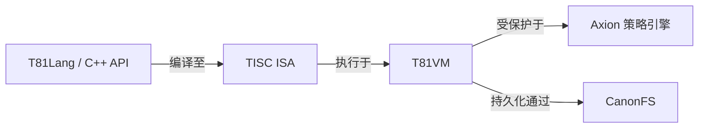

<p align="center">
  
</p>

# T81：一种确定性的三进制架构

<p align="center">
  <a href="https://github.com/t81dev/t81-foundation/releases/latest"></a>
  <a href="https://github.com/t81dev/t81-foundation/actions/workflows/ci.yml"></a>
  <a href="./LICENSE"></a>
  
</p>

[English](./README.md) | [简体中文](./README.zh-CN.md) | [Español](./README.es.md) | [Русский](./README.ru.md) | [Português](./README.pt-BR.md)

<!-- T81-SPEED-START -->
<!-- T81-SPEED-END -->

T81 Foundation 是一个确定性的、原生三进制的计算栈，专为需要数学上可重现的执行、规范的数据处理和可强制执行的运行时策略的工程师、研究人员和系统程序员而设计。

它在一个代码库中结合了稳定的指令集、受治理的虚拟机、语言前端和公共的 C++ API。该项目主要面向构建运行时、语言工具、具有严格审计的系统和可重现实验的开发者。

## 为什么选择 T81？

大多数现代技术栈在运行时已经存在之后，才将确定性、可审计性和治理视为次要关注点附加其上。T81 则采取了相反的方法：
- **为确定性而生：** 我们从一开始就围绕规范的数据表示和明确的故障行为进行构建。
- **原生三进制：** 平衡三进制和基底为 81 的编码是底层基础设施的一部分。通过 SWAR 向量化和 2-bit 打包的 trit，T81 在二进制硬件上实现了原生三进制语义，并具备高性能。
- **策略感知型执行：** Axion 策略引擎在执行流中动态地做出运行时决策，确保治理不仅仅是一种建议性的检查。
- **严格的有界性：** 确定性声明被明确限制在 **确定性核心配置文件（DCP）** 的范围内。实验性功能被严格隔离，以防止未定义行为。

## 架构与系统状态

T81 是垂直集成的，涵盖从高级语言 API 到受治理的执行底层。我们的成熟度是显式声明的：核心边界已被*冻结（Frozen）*，而实验性接口则有清晰的标记。T81 处于积极开发阶段，整个技术栈具有混合的成熟度。

| 组件 | 角色 | 成熟度状态 |
| :--- | :--- | :--- |
| **`include/t81/`** | 供消费者和下游构建使用的公共 C++ API 层。 | **混合** |
| **数据类型 (Data Types)** | 核心数值类型，规范数据表示（`core/types/`）。 | **已冻结** (经过 DCP 验证) |
| **TISC ISA** | 用于序列化和执行的稳定机器契约。 | **已冻结** (经过 DCP 验证) |
| **T81VM** | 可重现执行的参考运行时路径。 | **Beta** |
| **CanonFS** | 确定性持久化和身份边界。 | **Beta** |
| **T81Lang** | 编译到 TISC ISA 的语言前端。 | **Beta** |
| **Axion** | 集成在 VM 步进路径中的运行时策略引擎。 | **Alpha** |


```mermaid
flowchart LR
    A[T81Lang / C++ API] -->|编译至| B[TISC ISA]
    B -->|执行于| C[T81VM]
    C -->|受保护于| D[Axion 策略引擎]
    C -->|持久化通过| E[CanonFS]
```

*目前在 CI 中已验证支持的工具链包括 Ubuntu 24.04 配合 GCC 14 和 Clang 18，Ubuntu 24.04 ARM64 配合 Clang 18，macOS 14 ARM64 配合 Apple Clang，以及在尽力而为（best-effort）基础上的 Windows Server 2022 配合 MSVC。*

## 仓库结构

- [`./include/t81/`](./include/t81/) 包含库消费者的公共头文件。
- [`./examples/`](./examples/) 包含 C++ 演示、T81Lang 示例和消费者示例。
- [`./docs/`](./docs/) 快速入门、架构、状态和治理的文档中心。
- [`./book/`](./book/) 包含篇幅较长的专题著作和教程风格的材料。
- [`./spec/`](./spec/) 包含规范性的说明书和 RFC。
- [`./tests/`](./tests/) 包含单元测试、集成测试、一致性测试和以确定性为导向的测试。
- [`./core/`](./core/) 包含核心类型、ISA 和 VM 实施模块。
- [`./src/`](./src/) 包含诸如编解码器、IO 和 CanonFS 这样的运行时组件。
- [`./tooling/`](./tooling/) 包含提供的开发者工作流中使用的 CLI 以及模型工具代码。
- [`./.github/workflows/`](./.github/workflows/) 包含 CI、可重现性、文档、基准测试以及发布自动化的工作流。

## 快速上手

### 环境前提
- CMake 3.16+
- 具备 C++23 能力的编译器（通过 `-DT81_USE_CXX23=OFF` 也支持 C++20）
- Python 3.10+（用于可重现性检查）
- Ninja 或 Make

### 克隆并构建
```bash
git clone https://github.com/t81dev/t81-foundation.git
cd t81-foundation
cmake -S . -B build -G Ninja -DCMAKE_BUILD_TYPE=Release
cmake --build build --parallel
```

### 运行测试 & 验证确定性
```bash
# 运行核心测试套件
ctest --test-dir build --output-on-failure

# 验证可重现性关卡
mkdir -p build/t81lang-repro
python3 scripts/ci/t81lang_repro_gate.py \
  --t81-bin build/t81 \
  --fixtures-dir tests/fixtures/t81lang_determinism \
  --workdir build/t81lang-repro \
  --hash-out build/t81lang-repro/hash.txt \
  --expected-hash-file tests/fixtures/t81lang_determinism/t81lang_repro_hash.txt
```

### 运行附带的示例
```bash
./build/t81_demo
./build/t81_tensor_ops
./build/t81_ir_roundtrip
```

### 编译并运行一例 T81Lang 示例程序
```bash
./build/t81 code check examples/hello_world.t81
./build/t81 code build examples/hello_world.t81 -o build/hello_world.tisc
./build/t81 code run build/hello_world.tisc
```

*其他常用的通用入口包含 `./build/t81 project init`，`./build/t81 env doctor`，`./build/t81 weights ...`，`./build/t81 trace ...`，`./build/t81 canonfs ...`，`./build/t81 determinism ...`，`./build/t81 vm ...`，`./build/t81 tisc ...`，以及 `./build/t81 ir ...`。完整的当前 CLI 命令参考指南见：[`./docs/user-guide/reference/cli-user-manual.md`](./docs/user-guide/reference/cli-user-manual.md)。*

### 极简消费者示例（C++）

```cpp
#include <iostream>
#include <t81/types/T81Int.hpp>

int main() {
  t81::T81Int<9> value(42);
  std::cout << value.to_int64() << "\n";
}
```

关于下游的 CMake 使用案例，请参见 [`./examples/consumer_cmake/`](./examples/consumer_cmake/)。

**作为 CMake 包进行安装与使用**

```bash
cmake --install build --prefix /tmp/t81_install
cmake -S examples/consumer_cmake -B /tmp/t81_consumer_build -DCMAKE_PREFIX_PATH=/tmp/t81_install
cmake --build /tmp/t81_consumer_build --parallel
/tmp/t81_consumer_build/t81_consumer
```

```cmake
find_package(T81Foundation CONFIG REQUIRED)
target_link_libraries(t81_consumer PRIVATE T81::t81_core)
```

## 示例

- [`./examples/hello_world.t81`](./examples/hello_world.t81) 是规模最小的 T81Lang 端到端编译和运行实例。
- [`./examples/option_result_match.t81`](./examples/option_result_match.t81) 演示了基于 `Option` 和 `Result` 的显式类型的控制流。
- [`./examples/tensor_ops.cpp`](./examples/tensor_ops.cpp) 演示了张量的重塑（reshape）、切片（slice）、转置（transpose）及其相关操作。
- [`./examples/axion_policy_runner.cpp`](./examples/axion_policy_runner.cpp) 突出了策略感知型的执行及调试跟踪的生成方式。
- 将 [`./examples/system-integration/inference.t81`](./examples/system-integration/inference.t81) 与 [`./examples/system-integration/secure_model.apl`](./examples/system-integration/secure_model.apl) 结合，展示了一个更完整的 T81Lang + Axion 工作流。
- [`./examples/tisc/`](./examples/tisc/) 包含了经过预编译处理的 `.tisc` 样本，主要用于执行反汇编、调试与运行时的探查核对。
- [`./examples/consumer_cmake/`](./examples/consumer_cmake/) 展示了下游 CMake 项目消费公共库和目标的方式。

## 性能基准测试（Benchmarks）

T81 集成了一套分别适用于核心数域运算、张量路径测算、SIMD/基底81（base81）工作负载、CanonFS 以及各 VM 计算核心模块使用的基准检测套件。测试运行器现在具有明确的本地配置文件：默认的 `smoke`，便于人工阅读且运行有限的 `full`，以及面向深度剖析研究/隔夜构建的 `deep`。

```bash
cmake --build build --target benchmark_runner
```

```bash
# 本地缺省环境 smoke 配置文件：生成 JSON 格式报告。
# 仅当设置了 T81_BENCHMARK_WRITE_REPORTS=1 后，才会编写 Markdown 报告。
./build/benchmarks/benchmark_runner \
  --benchmark_format=json \
  --benchmark_out=bench.json
```

```bash
# 方便普通开发者快速运行排查的 full 配置文件环境：
T81_BENCHMARK_PROFILE=full ./build/benchmarks/benchmark_runner \
  --benchmark_format=json \
  --benchmark_out=bench-full.json

# 倾向实验室、深度解析研究与过夜计算的 deep 配置文件环境：
T81_BENCHMARK_PROFILE=deep ./build/benchmarks/benchmark_runner \
  --benchmark_format=json \
  --benchmark_out=bench-deep.json

# 配设筛件执行针对自定义滤镜本地循环测试操作方式：
./build/benchmarks/benchmark_runner \
  --benchmark_filter='BM_(ArithThroughput|NegationSpeed|RoundtripAccuracy|overflow|PackingDensity|MemoryBandwidth|Add_1024_bit|Add_2048_bit|T81LangCompile|LimbArithThroughput|LimbAdd_T81Native|LimbAdd_T81Limb|LimbAdd_Int128|vs_).*' \
  --benchmark_format=json \
  --benchmark_out=bench-smoke.json

# 或者由 CLI 工具代理调用
./build/t81 internal benchmark --benchmark_filter='BM_(ArithThroughput|T81LangCompile).*'

# CLI 封装命令行默认会关闭自动报告文本的导出生效操作
T81_BENCHMARK_WRITE_REPORTS=1 ./build/t81 internal benchmark --benchmark_filter='BM_(ArithThroughput|T81LangCompile).*'
```

要了解测评方法设计思路及特殊基准相关注释，参见 [`./benchmarks/README.md`](./benchmarks/README.md) 并查阅 [`./docs/developer-guide/tools/README.md`](./docs/developer-guide/tools/README.md)。

## 文档

T81 维持着严格保守的文档层次标准。**`/spec` 目录下的内容是规范性的（normative）。**
- **架构概览:** [`docs/architecture/OVERVIEW.md`](docs/architecture/OVERVIEW.md)
- **项目状态与控制中心:** [`docs/status/PROJECT_CONTROL_CENTER.md`](docs/status/PROJECT_CONTROL_CENTER.md)
- **CLI 用户手册:** [`docs/user-guide/reference/cli-user-manual.md`](docs/user-guide/reference/cli-user-manual.md)
- **可重现性指南:** [`docs/reference/REPRODUCIBILITY.md`](docs/reference/REPRODUCIBILITY.md)
- **正式规格说明书:** [`spec/`](spec/)
- **长篇专著材料:** [`book/book-en/README.md`](book/book-en/README.md)

## 参与贡献

我们始终热烈欢迎各位有识之士倾力参与并付出您的志愿协助，但请时刻铭记我们在贡献方面推行的核心准则哲理：
1. **规格说明优先的权威性 (Spec-First Authority):** `/spec` 目录下的设定决定着一切执行方面的构建实施逻辑，而不是反过来用实现定义规范。
2. **确定性第一 (Determinism-First):** 任何对于整体结构上的变动调整都必须完美保有最初规定的典范性行为模式，并顺利一次性跑通严密的可复现测试关卡。
3. **有界的治理 (Bounded Governance):** 凡划归实验性质尝试的内容（如认知层等方向事务）坚决不受准跨位越界突破且破坏进入了被封堵保护状态内的核心设定参数，即 确定性核心配置文件 (DCP)。

推荐新手第一步优先参读 [`CONTRIBUTING.md`](CONTRIBUTING.md) 和 [`CODE_OF_CONDUCT.md`](CODE_OF_CONDUCT.md)。如果需要了解关于治理机制的具体实施细节，请检阅 [`docs/governance/`](docs/governance/) 项目里的文献档案。若报告具高级机密隐疾性漏洞问题，务必直接通过 [`SECURITY.md`](SECURITY.md) 下给出的合法官方渠道。

## 开源协议许可

T81 Foundation 基于 MIT 开源协议开放使用。完整许可凭证请研读阅览详见 [`LICENSE`](LICENSE)。
