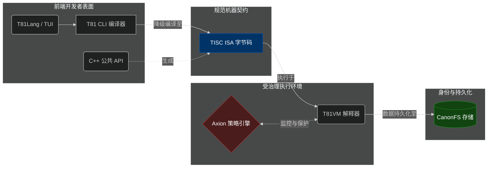

<p align="center">
  
</p>

# T81：一种确定性的三进制架构

<p align="center">
  <a href="https://github.com/t81dev/t81-foundation/releases/latest"></a>
  <a href="https://github.com/t81dev/t81-foundation/actions/workflows/ci.yml"></a>
  <a href="./LICENSE"></a>
  
</p>

[English](./README.md) | [简体中文](./README.zh-CN.md) | [Español](./README.es.md) | [Русский](./README.ru.md) | [Português](./README.pt-BR.md)

<!-- T81-SPEED-START -->
<!-- T81-SPEED-END -->

T81 Foundation 是一个**以确定性为首的原生三进制计算栈**，专为苛求精确数学可重现性、采用密码学规范数据处理机制及具有主动运行时策略治理能力的环境而设计。

我们为研究人员、系统程序员以及那些无法容忍非确定性、未定义行为和潜规则的安全关键型环境提供了一整套垂直堆栈。在我们的核心，是一个基底为 81 的三进制（`T81`）范式。这一范式不仅实现了原生的三进制缩放属性，而且通过利用 SWAR 向量化技术，在标准的二进制计算硬件上也达成了极高的吞吐量。

---

### 🚀 [快速上手：编译与安装指南](docs/user-guide/quickstart/INSTALL.md)

---

## 🏛️ 生态系统架构

大多数现代技术栈在运行时已经存在之后，才将确定性、可审计性和保护机制视为附加于混沌系统之上的次要抽象层。**T81 则彻底颠覆了这种做法。**
在这里，每一层都受 Axion 内核引擎的严密监控，并显式地针对规范表示进行执行。


```mermaid
%%{init: {'theme': 'dark', 'themeVariables': { 'fontFamily': 'inter' }}}%%
graph LR
    subgraph Frontend [前端开发者表面]
        Lang(T81Lang / TUI) --> Compiler[T81 CLI 编译器]
        Api(C++ 公共 API)
    end
    
    subgraph ISA [规范机器契约]
        TISC[TISC ISA 字节码]
        Compiler -->|降级编译至| TISC
        Api -.->|生成| TISC
    end

    subgraph Runtime [受治理执行环境]
        TISC -->|执行于| T81VM(T81VM 解释器)
        Axion{Axion 策略引擎} <-.->|监控与保护| T81VM
    end

    subgraph Data [身份与持久化]
        T81VM -->|数据持久化至| CanonFS[(CanonFS 存储)]
    end

    style TISC fill:#003366,stroke:#0055aa,color:#fff
    style Axion fill:#4a1c1c,stroke:#aa3333,color:#fff
    style CanonFS fill:#114411,stroke:#228822,color:#fff
```

### 🧩 核心支柱

| 系统 | 角色 | 成熟度状态 | 设计范式 | 
| :--- | :--- | :--- | :--- |
| **`TISC` ISA** | **指令集结构** | **已冻结** | 提供稳定可靠的序列化格式，并作为数据路由、结构流控制及数学运算的操作契约。 |
| **`T81VM`** | **参考运行时路径** | **Beta** | 专为执行 `TISC` 所定制的虚拟机，能在 Trit（基底 3）的细粒度上进行数学层面的执行限界管控。 |
| **`Axion`** | **内核策略引擎** | **Beta** | 一个直接于虚拟机（VM）调度循环内部运作的动态约束框架，它允许对计算的递归深度、操作合规性及伦理界限实施绝对强制执行力。 |
| **`CanonFS`**| **基于身份的文件系统** | **Beta** | 所有文件均以基于哈希寻址的 `.tisc` 字节数组形态存在，从而提供完美无瑕的结构验证功能，并防范任何篡改企图。 |
| **`T81Lang`**| **语言前端** | **Beta** | 一个符合人体工学的封装层，严格编译输出至 `TISC`，充分呈现强类型的张量行为、Option 以及数字运算的安全性。 |


## 👀 编写 T81Lang 代码

T81Lang 是我们面向 TISC ISA 的现代化接口。它原生支持对张量、规范类型以及数学抽象结构的处理。以下是在该语言中使用 `Option` 和 `Result` 进行模式匹配的示例：

```t81
// 定义一个绝对可靠的解析回退机制
func parse_safe(opt_input: Option<Int32>) -> Int32 {
    match opt_input {
        Some(v) => { v * 2 }
        None => { 0 }
    }
}

// 确保能显式且严格地管理报错追踪路径
func calculate_checked(val: Int32) -> Result<Int32, String> {
    if val < 0 {
        return Err("在此策略下，数值不允许为负。")
    }
    return Ok(val * 81)
}
```

## 🛠️ 利用 C++ API

无论您是在构建自定义工具、推理引擎还是需要绝对确定性的子系统，T81 的核心库都能以 CMake 包的形式无缝集成到您的下游项目中。

```cpp
#include <iostream>
#include <t81/types/T81Int.hpp>
#include <t81/types/bigint.hpp>

int main() {
    // 基于 81 的精确规范表示
    t81::T81Int<9> canonical_val(42);
    std::cout << "规范追踪: " << canonical_val.to_int64() << "\n";
    
    // 支持任意精度的数学计算，保证比特级别的精准极限
    t81::core::types::T81BigInt big("2145326462463276537653242");
    std::cout << big.to_string() << "\n";
}
```

## 🧭 文档结构导航

所有关于系统规范行为的文件皆秉持“规格说明先行 (spec-first)”的理念。
- **[安装构建指南](docs/user-guide/quickstart/INSTALL.md)**
- **[架构大纲](docs/architecture/OVERVIEW.md)**
- **[项目状态与控制中心](docs/status/PROJECT_CONTROL_CENTER.md)**
- **[CLI 命令行使用参考手册](docs/user-guide/reference/cli-user-manual.md)**
- **[全套规范说明专栏](spec/)**
- **[《T81 之书》(长篇专题巨著)](book/book-en/README.md)**

## 🤝 开放参与及治理

我们始终热烈欢迎各位有识之士倾力参与协助，但请时刻铭记贡献的核心准则：
1. **规格说明优先的权威性 (Spec-First Authority):** `/spec` 目录下的设定决定着 C++ 的构建实施逻辑。
2. **确定性第一 (Determinism-First):** 任何针对“确定性核心配置文件 (DCP)”做出的改动都必须在数学层面上保持所有 CPU 架构下的平等完美对应。
3. **安全边界 (Bounded Safety):** 划归实验性质尝试的内容和认知层不可跨位越野进入被严密封堵维护状态的规范执行层面。

请首先参阅 [`CONTRIBUTING.md`](CONTRIBUTING.md) 了解贡献细节。对于严重的安全漏斗隐患，请查悉 [`SECURITY.md`](SECURITY.md)。

---
*T81 Foundation 基于开源的 [MIT License](LICENSE) 证书发行。*

> **Note:** All determinism guarantees are strictly bounded by the [Determinism Surface Registry](docs/governance/DETERMINISM_SURFACE_REGISTRY.md).
