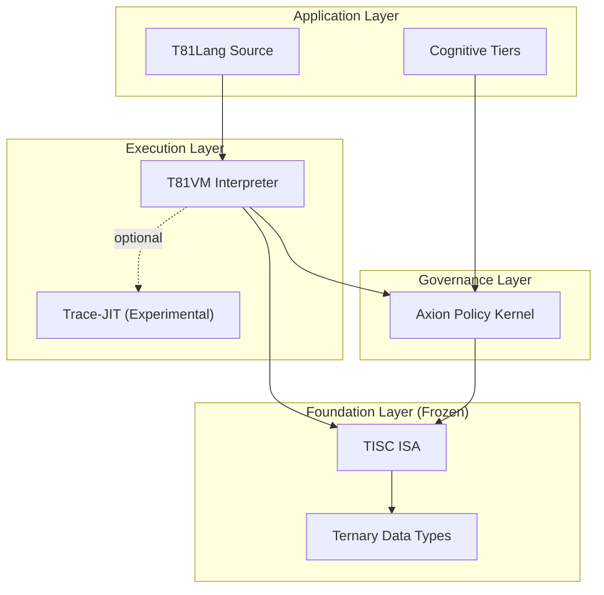

<p align="center">
  
</p>

<p align="center">
  <a href="https://github.com/t81dev/t81-foundation/releases/latest"></a>
  <a href="https://github.com/t81dev/t81-foundation/actions/workflows/ci.yml"></a>
  <a href="https://github.com/t81dev/t81-foundation/blob/main/LICENSE"></a>
  <a href="https://en.cppreference.com/w/cpp/23"></a>
</p>

<p align="center">
  <strong>确定性的三元计算栈</strong><br>
  <em>比特级可复现。原生三元逻辑。可审计的 AI 治理。</em>
</p>

<p align="center">
  <a href="README.md">English</a> •
  <a href="README.zh-CN.md">简体中文</a> •
  <a href="README.es.md">Español</a> •
  <a href="README.ru.md">Русский</a> •
  <a href="README.pt-BR.md">Português</a>
</p>

---

## 特性

### 什么是 T81？

**T81** 是一个从零构建、面向**确定性**与**三元逻辑**的主权计算栈。它在明确验证的表面上降低非确定性，并为高风险 AI、密码学和科学建模提供数学上严谨的基础。

传统系统会在不同架构上出现漂移，而 T81 的目标是在明确验证的表面上实现比特级可复现，其保证范围由确定性注册表与核心配置文件约束。

### 核心承诺：已验证的确定性

| 特性 | 问题（Binary/IEEE 754） | T81 方案 |
| :--- | :--- | :--- |
| **算术** | CPU/GPU 架构之间的浮点漂移。 | **确定性软浮点（有边界）：** 在确定性注册表/核心配置约束下，于明确验证的表面实现比特级行为。 |
| **逻辑** | 布尔（True/False）缺乏细粒度表达。 | **平衡三元：** {-1, 0, +1}，用于高效、无漂移的决策逻辑。 |
| **安全** | AI 模型是黑盒，缺乏运行时保证。 | **Axion 内核：** 在操作码级别执行可审计、可强制的治理策略。 |
| **稳定性** | 频繁破坏性变更与依赖混乱。 | **冻结规范：** TISC ISA 与数据类型为不可变标准。 |

---

## 架构

T81 以严格的权威层级与抽象边界组织。


```mermaid
 flowchart TD

    %% ─────────────────────────────────────
    %% Application Layer
    %% ─────────────────────────────────────
    subgraph A["Application Layer"]
        Lang["T81Lang Source"]
        Cognitive["Cognitive Tiers"]
    end

    %% ─────────────────────────────────────
    %% Governance Layer
    %% ─────────────────────────────────────
    subgraph G["Governance Layer"]
        Axion["Axion Policy Kernel"]
    end

    %% ─────────────────────────────────────
    %% Execution Layer
    %% ─────────────────────────────────────
    subgraph E["Execution Layer"]
        VM["T81VM Interpreter"]
        JIT["Trace-JIT (Experimental)"]
    end

    %% ─────────────────────────────────────
    %% Foundation Layer
    %% ─────────────────────────────────────
    subgraph F["Foundation Layer (Frozen)"]
        ISA["TISC ISA"]
        Types["Ternary Data Types"]
    end

    %% Primary execution flow
    Lang --> VM
    VM --> ISA
    ISA --> Types

    %% Governance enforcement
    VM --> Axion
    Cognitive --> Axion
    Axion --> ISA

    %% Experimental path
    VM -. optional .-> JIT

```

*   **基础层：** “冻结”核心。`T81BigInt`、`T81Float` 与 **TISC**（Ternary Instruction Set Computer）ISA。此层改动需要提升主版本号。
*   **执行层：** **T81VM** 执行 TISC 字节码。包含确定性解释器与实验性 Trace-JIT；确定性声明仅限于受治理/已验证表面。
*   **治理层：** **Axion 内核**拦截执行，执行配置中定义的安全策略、资源限制与伦理护栏。

---

## 快速开始

从源码构建 T81 栈。

### 前置要求
*   **CMake** 3.16+
*   **支持 C++20/23 的 C++ 编译器**（已在 AppleClang 17+、Clang 18+、GCC 14+、MSVC 上验证）

### 安装

```bash
# 1. 克隆仓库
git clone https://github.com/t81dev/t81-foundation.git
cd t81-foundation

# 2. 配置并构建
cmake -S . -B build -DCMAKE_BUILD_TYPE=Release
cmake --build build --parallel

# 3. 验证安装（运行确定性关卡）
python3 scripts/ci/t81lang_repro_gate.py --t81-bin build/t81 --fixtures-dir tests/fixtures/t81lang_determinism --workdir build/t81lang-repro --hash-out build/t81lang-repro/hash.txt --expected-hash-file tests/fixtures/t81lang_determinism/t81lang_repro_hash.txt
```

### Hello World（三元风格）

创建文件 `hello.t81`：

```t81
fn main() {
    print("Hello, Deterministic World!");
    let a: trit = 1;
    let b: trit = -1;
    print(a + b); // 输出 "0"
}
```

编译并运行：

```bash
# 编译为 TISC 字节码
./build/t81 code build hello.t81 -o hello.tisc

# 通过 VM 执行
./build/t81 code run hello.tisc
```

---

## 支持平台

| 平台 | 架构 | 编译器 | 状态 |
| :--- | :--- | :--- | :--- |
| **Linux** | x86_64 | Clang 18+, GCC 14+ | ✅ 已验证 |
| **Linux** | ARM64 | Clang 18+ | ✅ 已验证 |
| **macOS** | Intel | Apple Clang / GCC | ✅ 已验证 |
| **macOS** | Apple Silicon | Apple Clang | ✅ 已验证 |

## CLI 示例

```bash
# 开发
./build/t81 code build src.t81 -o out.tisc
./build/t81 code run out.tisc
./build/t81 tisc disasm out.tisc

# 诊断与质量
./build/t81 env doctor --json
./build/t81 code test --list
./build/t81 fmt --check src.t81
```

---

## 📚 文档

T81 生态文档按多个权威层级组织。

| 资源 | 描述 | 权威级别 |
| :--- | :--- | :--- |
| **[The Monograph](book/book-en/README.md)** | 关于 T81 哲学、架构与使用方式的权威书籍。**从这里开始。** | 高 |
| **[Normative Specs](spec/)** | 规范层面的事实来源。定义 TISC ISA、数据类型与 VM 行为。 | **绝对** |
| **[Architecture](docs/architecture/OVERVIEW.md)** | 定义系统边界与不变量的 “North Star” 文档。 | 高 |
| **[Status Dashboard](docs/status/PROJECT_CONTROL_CENTER.md)** | 实时追踪系统健康状态、活动关卡与已验证表面。 | 实时 |
| **[Governance](docs/governance/)** | 规范漂移、发布纪律与威胁模型相关策略。 | 高 |

### 关键主题
*   **[TISC Instruction Set](spec/tisc-spec.md)** - 冻结 ISA 规范。
*   **[Ternary Data Types](spec/t81-data-types.md)** - 理解 `trit`、`tryte` 与 `T81Float`。
*   **[Axion Policy Engine](spec/axion-kernel.md)** - 配置运行时安全策略。

## 文档权威地图

规范权威来源是 `spec/`；运行与治理状态在 `docs/status/` 与 `docs/governance/` 中追踪。

---

## 🧩 组件与状态

| 组件 | 状态 | 描述 |
| :--- | :--- | :--- |
| **TISC ISA** | 🧊 **Frozen** | 指令集已验证且不可变（v1）。 |
| **Data Types** | 🧊 **Frozen** | 核心算术类型稳定；比特级保证仅限于已验证的确定性表面。 |
| **T81VM** | 🚧 **Beta** | 运行时表面处于活跃状态并持续验证中。 |
| **Axion** | ⚠️ **Alpha** | 策略引擎已激活，但对 draft 表面的覆盖仍为部分。 |
| **T81Lang** | 🚧 **Beta** | 实现成熟度为 Beta；语言规范仍为 Draft。 |
| **Trace-JIT** | 🧪 **Experimental** | 用于性能优化的 JIT 编译（可选启用）。 |
| **Hanoi Kernel** | 🗃️ **Archived Concept** | 历史实验概念，仅作设计参考保留。 |

> **说明：**“冻结”组件受合同约束，不可在不提升主版本号的情况下变更（例如 2.0）。

---

## 🤝 社区与贡献

欢迎所有热爱严谨、确定性系统的贡献者。

*   **[Contributing Guide](CONTRIBUTING.md)：** 提交 PR 前请先阅读。
*   **[Code of Conduct](CODE_OF_CONDUCT.md)：** 我们遵循严格的专业行为准则。
*   **[Discussions](https://github.com/t81dev/t81-foundation/discussions)：** 欢迎提问与讨论。

### “Repro Gate”
Pull Request 的必需检查会在有边界的确定性表面上执行可复现性与一致性关卡。如果你的改动影响了受治理的确定性输出，对应关卡应当失败。这是特性，不是缺陷。

---

## 📄 许可证

T81 是在 **[MIT 许可证](LICENSE)** 下发布的开源软件。

Copyright © 2024-2026 T81 Foundation.
