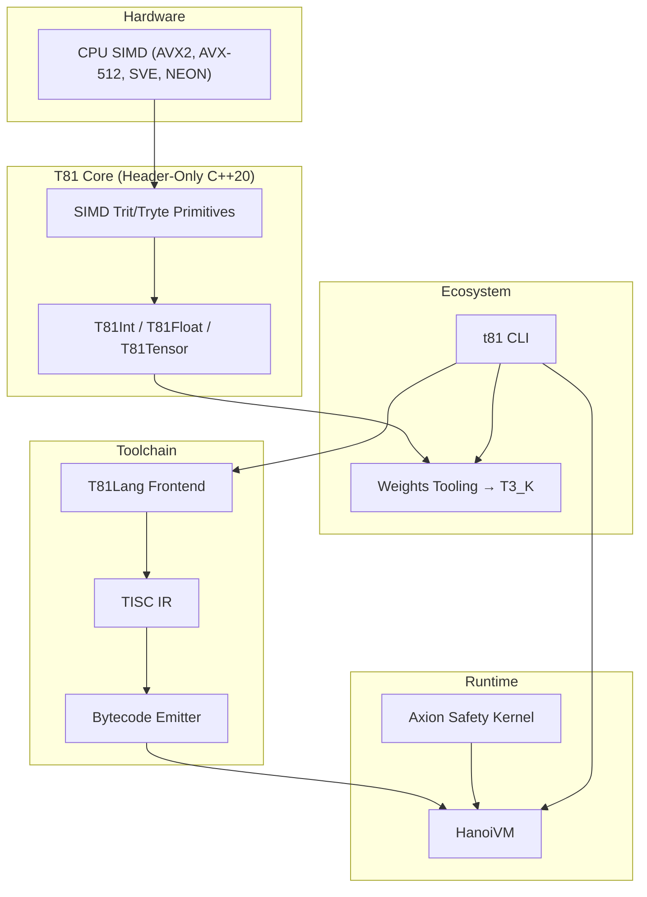

##T81 Foundation – State of the Project, December 2025

**Document Status:** Final  
**Date:** 03 December 2025  
**Author:** The T81 Foundation  
**Primary Audience:** Staff+ C++ performance engineers, AI researchers working on reproducible inference, strategic sponsors and grant reviewers

### 1. Executive Summary

The T81 Foundation is a production-grade, C++20 implementation of a fully deterministic, ternary-native computing stack built on balanced ternary arithmetic (−1, 0, +1). As of December 2025, the project has reached disciplined maturity: all core numeric types are stable and spec-compliant, the compiler → TISC → HanoiVM pipeline works end-to-end, CI is green (45/45 tests passing), and the weights-tooling bridge to the broader AI ecosystem (T3_K GGUF quantization) is functional.

Key differentiator: T81 delivers perfect, bit-exact reproducibility and auditability for numerical workloads, eliminating the non-determinism and hidden rounding of IEEE-754 while remaining implementable on today’s binary hardware.

Current health: clean, well-documented, and ready for serious acceleration.

Strategic inflection point: the foundational work is done. 2026 now offers two clear paths:
- Go Deep — hand-optimized AVX-512/SVE paths to make ternary arithmetic outperform binary equivalents.
- Go Broad — ship a headline “killer demo” (a 1–3 B parameter LLM with perfect cross-platform reproducibility via T3_K quantization).

Recommendation for H1 2026: Go Broad first. A single reproducible, bit-identical 1B-parameter LLM running today on T81 hardware math would be the first public demonstration in history of an alternative numeric substrate beating IEEE-754 at its own game on real-world deep learning workloads. That single result will pull in the world-class C++ talent required to then Go Deep.

### 2. Original Vision vs. Current Reality

| Aspect                  | Original Vision (2024)                                   | Current Reality (Dec 2025)                                      |
|-------------------------|----------------------------------------------------------|-----------------------------------------------------------------|
| Core arithmetic         | Exact balanced ternary types                             | Production-ready, fully tested `T81Int`, `T81Float`, `T81Tensor` |
| Language & compiler     | T81Lang → deterministic bytecode                         | Beta compiler, complete syntax, working semantic analysis      |
| Execution               | HanoiVM executing TISC                                   | Beta VM, 100 % regression suite passing                         |
| ML ecosystem bridge     | Ability to load real models                              | Functional `t81 weights` tooling → T3_K GGUF quantization      |
| Documentation & CI      | Self-hosting, auditable                                  | Jekyll site, automated benchmark reports, GitHub Actions CI    |

Gap remaining: raw performance and adoption, not correctness.

### 3. High-Level Architecture

### 4. Component Maturity (Dec 2025)

| Component            | Status             | Notes                                             |
|----------------------|--------------------|---------------------------------------------------|
| Core Numerics        | Production Ready   | Spec-complete, exhaustively tested                |
| T81Lang Compiler     | Beta               | Works, unoptimized                                |
| HanoiVM              | Beta               | Correct, pre-optimization                         |
| Weights Tooling      | Alpha → Usable     | Imports & quantizes real models to T3_K           |
| Benchmark Suite      | Production Ready   | Auto-generates reports in CI                      |
| Axion Kernel         | Stub               | Interface defined, implementation placeholder     |
| CanonFS              | Spec only          | Not yet started                                   |

### 5. Technical Debt & Known Issues

Virtually none in the traditional sense. The only meaningful debt is intentional: performance paths are correct-first, speed-second. This is by design and gives us an immaculate base for optimization.

### 6. Prioritized 2026 Backlog

| P  | Task                                   | Why It Matters                                      | Effort | Risk if Delayed             |
|---|----------------------------------------|-----------------------------------------------------|--------|-----------------------------|
| P0 | Killer Demo: Deterministic Llama-3.2-1B| Single strongest adoption catalyst                  | 21 days| Remains niche curiosity     |
| P1 | SIMD-Optimize Hot T81Tensor Paths      | Makes the demo fast enough to be compelling         | 45 days| Demo too slow to impress    |
| P1 | Publish this State-of-T81 Report       | Aligns community & attracts right contributors      | 5 days | Strategic drift             |
| P2 | Full Axion Kernel Implementation       | Delivers on the safety/determinism promise          | 60 days| Differentiator stays theoretical |
| P2 | pybind11 Python Bindings               | Lowers barrier for AI researchers                   | 20 days| User pool stays C++-only    |
| P3 | Hand-written AVX-512 div_mod, etc.     | Ultimate performance proof                          | 15 days| Nice-to-have                |

### 7. Risks & Mitigation

| Risk                          | Likelihood | Impact | Mitigation                          |
|-------------------------------|------------|--------|-------------------------------------|
| Key-person bottleneck         | High       | High   | Attract 2–3 staff+ contributors via killer demo |
| Adoption chicken-and-egg      | Medium     | High   | P0 killer demo is the direct counter |
| Ternary performance ceiling   | Low        | High   | Current evidence strongly suggests it is surmountable |

### 8. 30-60-90 Day Roadmap (Jan–Mar 2026)

Days 1–30 → Build & ship deterministic Llama-3.2-1B (T3_K) with bit-identical output across machines  
Days 31–60 → 3–5× speed-up via targeted AVX2 paths + full replication guide  
Days 61–90 → Public launch, outreach to llama.cpp / Hugging Face / quant funds, onboard first external core contributors

### 9. Handover Checklist for New Contributors

1. `git clone https://github.com/t81dev/t81-foundation.git`
2. `cmake -S . -B build -G Ninja -DCMAKE_BUILD_TYPE=Release`
3. `cmake --build build --parallel && ctest --test-dir build --output-on-failure`
4. Read `/spec/` for canonical truth, this document for strategy.

No API keys, no secrets, no hidden branches.

Current active maintainers: @t81dev (100 % of commits). The project has been deliberately solo-built to this point to guarantee coherence and zero technical debt; it is now explicitly open for company-scale contribution.

The foundation is solid.  
The path is clear.  
The time to engage is now.
