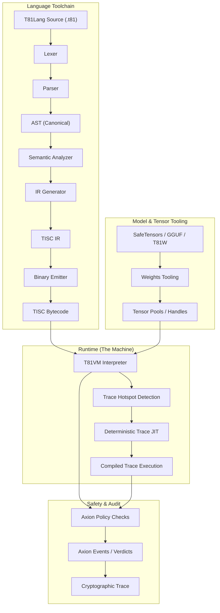

# 第 3 章：T81VM 架构

## 3.1 概述

**状态：稳定**

**T81 虚拟机 (T81VM)** 是 T81 栈的执行引擎。它强制执行编译与执行之间的严格分离，受明确的确定性和安全合约管辖。该架构由语言工具链、运行时 (VM) 和安全内核 (Axion) 之间的交互定义。

### 3.1.1 执行管线

从源代码到经过验证的执行，程序流程涉及规范化和验证的多个阶段。

## 3.2 运行时边界

**状态：已实现**

宿主环境与 T81 运行时之间的边界被严格定义。运行时充当**密封层**。
- **输入**：字节码、规范输入、策略配置。
- **输出**：规范结果、审计追踪、错误/陷阱。
- **副作用**：严格禁止，除非策略明确允许（例如，`MetaWrite` 或 `Gossip`）。

运行时合约 (`contracts/runtime-contract.json`) 确切规定了允许的输入和输出，确保没有隐藏状态（如环境变量或文件描述符）泄露到执行上下文中。

## 3.3 内存模型

**状态：已实现并测试**

VM 使用 **分段内存模型** 来保证内存安全并通过构造防止控制流劫持。与代码和数据混合的扁平地址空间不同，T81 强制执行严格的分离。

### 3.3.1 形式化状态定义
机器在任何时刻 $t$ 的状态定义为元组 $S_t = (\mathbf{R}, \mathbf{M}, \mathbf{K}, \mathbf{\Phi})$，其中：

*   **寄存器 ($\mathbf{R}$)**：一组 243 个通用寄存器 ($R_0 \dots R_{242}$)。每个寄存器保存一个带类型的 64 位值（整数有效载荷或句柄）和相应的 `ValueTag`。
*   **内存 ($\mathbf{M}$)**：不相交段的集合。
*   **控制栈 ($\mathbf{K}$)**：调用帧的栈，管理函数调用和返回地址。
*   **标志 ($\mathbf{\Phi}$)**：状态标志 $\{Z, N, P\}$，指示最后一次算术运算的结果（零、负、正）。

### 3.3.2 内存段
内存被划分为逻辑区域。没有特定的操作码，无法跨段边界访问内存。

| 段 | 访问 | 目的 |
| :--- | :--- | :--- |
| **代码 (Code)** | 只读 | 存储不可变的指令流。PC 指向此处。 |
| **栈 (Stack)** | 读/写 | 用于局部变量的 LIFO 存储。向下增长。 |
| **堆 (Heap)** | 托管 | 用于复杂对象的动态分配。由 GC 管理。 |
| **张量 (Tensor)** | 托管 | `T81Tensor` 对象的专用池。为 SIMD 对齐。 |
| **元数据 (Meta)** | 只读 | 反射数据、符号表和调试元数据。 |

### 3.3.3 句柄与间接
为了防止内存损坏和指针算术攻击，VM 使用 **不透明句柄**。
- 寄存器不存储原始指针 `0x7fff...`。
- 相反，它存储一个句柄 `TensorHandle(42)`。
- VM 将张量段中的 `Index[42]` 解析为实际内存位置。
- 如果只有 42 个张量存在，尝试访问 `TensorHandle(43)` 会导致立即的 `Trap::SegFault`。

## 3.4 指令集 (TISC)

**状态：已实现并测试**

**三进制精简指令集计算机 (TISC)** 是 VM 的原生语言。它是一种面向栈的 ISA，具有对三进制逻辑和高层认知操作的专门支持。

### 3.4.1 指令周期
对于每条指令，VM 执行严格的循环：

1.  **取指 (Fetch)**：获取 `Code[PC]` 处的操作码。
2.  **译码 (Decode)**：解析操作数（寄存器、立即数）。
3.  **策略检查 (Policy Check)**：Axion 内核评估 $\alpha(S, \text{Op})$。如果是 `Deny`，引发 `SecurityFault`。
4.  **执行 (Execute)**：执行状态转换 $S' = \delta(S, \text{Op})$。
5.  **退休 (Retire)**：增加 `PC`，更新追踪，如果满足分配触发条件则运行垃圾回收。

### 3.4.2 操作码类别
*   **算术**：`Add`, `Mul`, `Div` (三进制)，`FAdd`, `FMul` (软浮点)。
*   **控制流**：`Jump`, `Branch`, `Call`, `Ret`。
*   **数据移动**：`Load`, `Store`, `Move`。
*   **认知操作**：
    *   `Recurse`：进入递归作用域（第 3 层）。
    *   `Reflect`：快照当前状态（第 2 层）。
    *   `Gossip`：与对等点交换状态（第 4 层）。
    *   `InfExpand`：实例化无限形式（第 5 层）。
*   **张量操作**：`TensorAdd`, `TensorMul`, `MatMul`, `BroadCast`。

> **参考**：参见 `spec/tisc-spec.md` 获取完整的指令集参考。

## 3.5 JIT 编译 (Trace-JIT)

**状态：实验性 / 部分实现**

为了调和“严格确定性”与“高性能”之间的冲突，T81 采用了 **确定性 Trace JIT**。

### 3.5.1 追踪过程
1.  **分析 (Profiling)**：解释器计数循环迭代。当循环超过阈值 (`kHotThreshold`) 时，触发追踪。
2.  **记录 (Recording)**：VM 进入“记录模式”，记录每个执行的操作码和任何守卫（分支）的*值*。
3.  **优化 (Optimization)**：*假设*守卫条件成立，对记录的追踪进行优化（常量折叠、死代码消除）。
4.  **编译 (Compilation)**：将追踪编译为机器码（或线程化代码）。

### 3.5.2 行为等效性
JIT 必须严格遵守 **等效性不变性**：
$$
\text{Exec}_{\text{JIT}}(S) \equiv \text{Exec}_{\text{Interp}}(S)
$$
如果优化后的代码遇到守卫失败的状态（例如，类型检查失败），它必须 **去优化 (Deoptimize)**——在失败的确切点将控制权转回解释器，重建完整的解释器状态。这确保了优化永远不会改变程序的语义或结果。

> **验证**：`tests/cpp/jit_test.cpp` 和 `tests/cpp/jit_trace_equivalence_test.cpp` 验证 JIT 执行与解释器对于随机输入完全匹配。

---
**Canonical Source**: /book (English)
**Source Version**: Phase 1 Expansion
**Last Synced**: 2026-02-23
**Translation Status**: Needs Update
---
