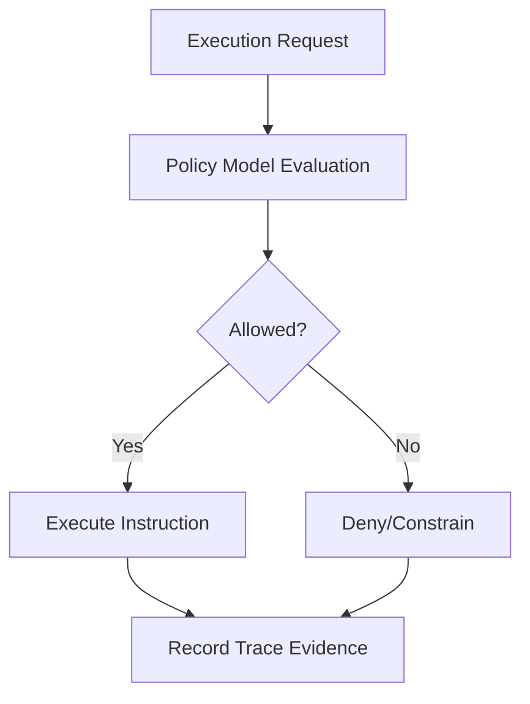
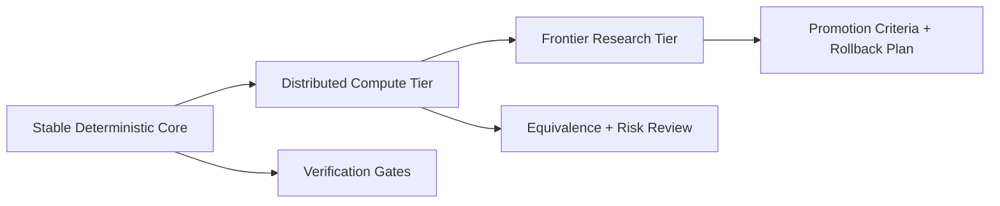

# The T81 Foundation — Definitive Technical Monograph

## Foreword

Scope snapshot date for this edition: **February 26, 2026**.
Determinism and release guarantees described in this book are bounded by the registry/DCP state at that date.

There are two ways to build systems.

One is to optimize for convenience — to move quickly, to approximate, to accept that the final bit may vary, that floating-point drift is tolerable, that compilers may reorder, that hardware will decide what “close enough” means.

The other is to insist that computation is not suggestion, but statement.

T81 belongs to the second path.

At its core, this project is not about ternary arithmetic, virtual machines, or policy engines — though it contains all of these. It is about **integrity of execution**. It is about drawing a boundary around a computational process and saying: inside this boundary, behavior is not incidental.

Determinism is often treated as a performance tradeoff or a debugging convenience. Here it is treated as a civilizational constraint. If two machines cannot agree on the outcome of the same program, then the computation was never truly defined — it was merely performed.

Balanced ternary, canonical serialization, software-defined math, trace logging, policy enforcement — these are not aesthetic choices. They are instruments in a single argument:

> A computation should be reproducible, auditable, and structurally honest.

Modern systems are layered with abstraction that hides state transitions behind optimizers, speculative execution, floating-point quirks, and implicit side effects. T81 attempts something different: to make every transition explicit, every representation canonical, every execution traceable.

It is an architectural experiment in constraint.

The system does not assume benevolent hardware.
It does not assume identical floating-point libraries.
It does not assume compilers behave the same across architectures.
It does not assume that execution without record is acceptable.

Instead, it encodes rules:

* State transitions must be definable.
* Data must have a single canonical form.
* Resource consumption must be accountable.
* Policies must be enforceable.
* Behavior must be replayable.

The result is not the fastest machine.
It is not the most flexible environment.
It is not designed to replace general-purpose scripting ecosystems.

It is designed to answer a narrower but more demanding question:

**Can a software system be constructed such that its behavior is provably invariant across space and time?**

This book exists to document that attempt.

Not as mythology.
Not as marketing.
But as a ledger.

Every subsystem described here — T81Lang, TISC, the T81VM, Axion, CanonFS, the determinism gates, the cognitive tiers — is part of a layered structure built around one invariant:

> Identical inputs must produce identical outputs, under explicitly defined rules.

Whether this architecture becomes widely adopted is secondary. What matters is that it has been made concrete, implemented, tested, and described with enough precision that it can be understood, verified, or challenged by others.

This volume is therefore both technical and philosophical.

It is technical because it describes a working system.
It is philosophical because it asserts that reproducibility is not optional in certain domains.

If the repository evolves, this book should evolve with it.
If the project ceases, this document should remain sufficient to reconstruct what was attempted and why.

In the end, T81 is not a claim of perfection.

It is a commitment to constraint.

And constraint, when applied deliberately, is a form of clarity.

---

## How to Read This Book

* **New to T81?** → Start with Part I, then Part II.
* **Implementer?** → Focus on Parts II and III.
* **Auditor?** → Read Parts III and IV carefully.
* **Researcher?** → Emphasize Parts IV and V.
* **Long-term Maintainer?** → Parts IV and V are critical.

---

## 7-Day Onboarding Path

Use this path when onboarding a new engineer, operator, or auditor from zero context.

Pilot script: [Onboarding Pilot Checklist](./ONBOARDING_PILOT_CHECKLIST.md)

| Day | Objective | Reading | Output Artifact | Completion Check |
| --- | --- | --- | --- | --- |
| 1 | Scope and language alignment | Chapters 1-2 | One-page scope summary | Can explain DCP vs governed non-DCP clearly |
| 2 | Runtime and data mental model | Chapters 3-4 | Architecture + data flow notes | Can trace one request from source to canonical artifact |
| 3 | Build and execution discipline | Chapters 5-6 | Reproducible build/run log | Can replay compile/run/trace on clean environment |
| 4 | Programming model competency | Chapter 7 | Three example programs | Can predict and verify behavior under fixed inputs |
| 5 | Verification and policy control | Chapters 8-9 | Mini audit packet | Can justify one claim with explicit evidence |
| 6 | Tiered scaling understanding | Chapters 10-11 | Tier classification worksheet | Can classify one workload and defend confidence level |
| 7 | Hardening and frontier thinking | Chapters 12-15 | Risk + continuity brief | Can state promotion requirements and rollback triggers |

### Day 7 Exit Criteria

1. Run one end-to-end workflow with captured evidence artifacts.
2. Produce one scoped assurance claim and one explicit non-claim.
3. Explain one policy denial and one determinism check result.
4. Present one promotion plan with risk boundaries.

---

## Cross-Chapter End-to-End Labs

These labs are designed to connect chapter knowledge into publish-grade onboarding outcomes.

### Lab A: Deterministic Baseline Pipeline

Chapters: 1 -> 3 -> 5 -> 6 -> 8

1. Define scope and guarantee language for target surface.
2. Build from clean environment and capture toolchain data.
3. Compile and run with trace enabled.
4. Execute reproducibility checks and summarize findings.

Expected artifacts:

- Build log
- Run/trace outputs
- Determinism gate result
- One-page assurance statement with explicit scope

### Lab B: Policy-Constrained Execution Comparison

Chapters: 2 -> 6 -> 7 -> 9

1. Implement a small T81Lang program with policy-sensitive behavior.
2. Execute under baseline policy and constrained policy.
3. Compare outcomes and traces.
4. Explain divergence with policy model language.

Expected artifacts:

- Program source
- Two policy profiles used
- Trace comparison note
- Root-cause explanation for allow/deny differences

### Lab C: Tier Classification and Promotion Plan

Chapters: 8 -> 10 -> 12 -> 13 -> 14 -> 15

1. Choose one advanced/distributed workflow.
2. Classify current tier and evidence maturity.
3. Identify determinism and adversarial risks.
4. Draft promotion criteria, rollback triggers, and continuity checks.

Expected artifacts:

- Tier classification table
- Risk register excerpt
- Promotion checklist
- Continuity drill outline

---

## Visual Maps

### Architecture Flow Map

### Policy Decision Flow

### Tier Promotion Map

---

## Navigation

<strong>Part I — Foundations</strong>

1. **[Introduction](./01_Introduction.md)**

   * [1.1 Scope and Definition](./01_Introduction.md#11-scope-and-definition)
   * [1.2 System Architecture](./01_Introduction.md#12-system-architecture)
   * [1.3 Verifiable Compute Mission](./01_Introduction.md#13-verifiable-compute-mission)
   * [1.4 Terminology](./01_Introduction.md#14-terminology)
   * [1.5 Verification Checklist](./01_Introduction.md#15-verification-checklist)

2. **[Core Principles and Invariants](./02_Principles.md)**

   * [2.1 The Determinism Invariant](./02_Principles.md#21-the-determinism-invariant)
   * [2.1.1 Determinism Surfaces and Attack Vectors](./02_Principles.md#211-determinism-surfaces-and-attack-vectors)
   * [2.2 Ternary Logic (Base-3)](./02_Principles.md#22-ternary-logic-base-3)
   * [2.3 Auditability and the Axion Trace](./02_Principles.md#23-auditability-and-the-axion-trace)
   * [2.4 The Nine Principles (Ethics Enforcement)](./02_Principles.md#24-the-nine-principles-ethics-enforcement)
   * [2.5 Verification Checklist](./02_Principles.md#25-verification-checklist)
   * [2.6 Formal Audit Matrix](./02_Principles.md#26-formal-audit-matrix)

<strong>Part II — The Deterministic Machine</strong>

3. **[T81VM Architecture](./03_Architecture.md)**

   * [3.1 Overview](./03_Architecture.md#31-overview)
   * [3.2 The Runtime Boundary](./03_Architecture.md#32-the-runtime-boundary)
   * [3.3 Memory Model](./03_Architecture.md#33-memory-model)
   * [3.4 The Instruction Set (TISC)](./03_Architecture.md#34-the-instruction-set-tisc)
   * [3.5 JIT Compilation (Trace-JIT)](./03_Architecture.md#35-jit-compilation-trace-jit)

4. **[Data Types and Serialization](./04_Data_Types_and_Serialization.md)**

   * [4.1 Primitive Types](./04_Data_Types_and_Serialization.md#41-primitive-types)
   * [4.2 T81Float and dmath](./04_Data_Types_and_Serialization.md#42-t81float-and-dmath)
   * [4.3 Tensors and Canonical Layouts](./04_Data_Types_and_Serialization.md#43-tensors-and-canonical-layouts)
   * [4.4 Canonical Serialization Rules](./04_Data_Types_and_Serialization.md#44-canonical-serialization-rules)

5. **[Installation and Build Verification](./05_Installation.md)**

   * [5.1 Prerequisites](./05_Installation.md#51-prerequisites)
   * [5.2 Building from Source](./05_Installation.md#52-building-from-source)
   * [5.3 Verifying the Build](./05_Installation.md#53-verifying-the-build)
   * [5.4 Troubleshooting](./05_Installation.md#54-troubleshooting)

6. **[CLI and API Usage](./06_Usage.md)**

   * [6.1 The T81 Command Line Interface](./06_Usage.md#61-the-t81-command-line-interface)
   * [6.2 Embedding T81 (C++ API)](./06_Usage.md#62-embedding-t81-c-api)
   * [6.3 Embedding T81 (Python API)](./06_Usage.md#63-embedding-t81-python-api)
   * [6.4 Debugging](./06_Usage.md#64-debugging)

7. **[Programming in T81Lang](./07_Programming_in_T81Lang.md)**

   * [7.1 Design Philosophy](./07_Programming_in_T81Lang.md#71-design-philosophy)
   * [7.2 Syntax Basics](./07_Programming_in_T81Lang.md#72-syntax-basics)
   * [7.3 Data Types](./07_Programming_in_T81Lang.md#73-data-types)
   * [7.4 Control Flow](./07_Programming_in_T81Lang.md#74-control-flow)
   * [7.5 Functions](./07_Programming_in_T81Lang.md#75-functions)
   * [7.6 Structures and Methods](./07_Programming_in_T81Lang.md#76-structures-and-methods)
   * [7.7 Axion Integration](./07_Programming_in_T81Lang.md#77-axion-integration)
   * [7.8 Examples](./07_Programming_in_T81Lang.md#78-examples)

<strong>Part III — Governance and Verification</strong>

8. **[Verification and Audit](./08_Verification_and_Audit.md)**

   * [8.1 Verification Methodology](./08_Verification_and_Audit.md#81-verification-methodology)
   * [8.2 Determinism Scope and Audit Matrix](./08_Verification_and_Audit.md#82-determinism-scope-and-audit-matrix)
   * [8.3 Reproducibility Gates](./08_Verification_and_Audit.md#83-reproducibility-gates)
   * [8.4 Failure Implication and Response](./08_Verification_and_Audit.md#84-failure-implication-and-response)

9. **[The Axion Safety Kernel](./09_The_Axion_Kernel.md)**

   * [9.1 Formal Definition](./09_The_Axion_Kernel.md#91-formal-definition)
   * [9.2 The Policy Model](./09_The_Axion_Kernel.md#92-the-policy-model)
   * [9.3 Instruction Interception](./09_The_Axion_Kernel.md#93-instruction-interception)
   * [9.4 The Audit Log (Trace)](./09_The_Axion_Kernel.md#94-the-audit-log-trace)
   * [9.5 Cognitive Promotion](./09_The_Axion_Kernel.md#95-cognitive-promotion)

10. **[Cognitive Tiers and Distributed Compute](./10_Cognitive_Tiers_and_Distributed_Compute.md)**

   * [10.1 The Cognitive Tier Model](./10_Cognitive_Tiers_and_Distributed_Compute.md#101-the-cognitive-tier-model)
   * [10.2 Distributed Compute (Tier 4)](./10_Cognitive_Tiers_and_Distributed_Compute.md#102-distributed-compute-tier-4)
   * [10.3 Trace-JIT and Advanced Runtime Paths](./10_Cognitive_Tiers_and_Distributed_Compute.md#103-trace-jit-and-advanced-runtime-paths)
   * [10.4 Infinite Forms (Tier 5)](./10_Cognitive_Tiers_and_Distributed_Compute.md#104-infinite-forms-tier-5)

11. **[Appendices](./11_Appendices.md)**

* [11.1 Boundary and Maturity Snapshot](./11_Appendices.md#111-boundary-and-maturity-snapshot)
* [11.2 Glossary](./11_Appendices.md#112-glossary)
* [11.3 Useful Links](./11_Appendices.md#113-useful-links)

<strong>Part IV — Formalization and Structural Hardening</strong>

12. **[Formal Semantics of TISC and T81VM](./12_Formal_Semantics.md)**

* [12.1 Operational Semantics](./12_Formal_Semantics.md#121-operational-semantics)
* [12.2 Algebraic Transition Function](./12_Formal_Semantics.md#122-algebraic-transition-function)
* [12.3 Canonicalization Rewriting System](./12_Formal_Semantics.md#123-canonicalization-rewrite-system)
* [12.4 Determinism Proof Sketches](./12_Formal_Semantics.md#124-determinism-proof-sketches)
* [12.5 Interpreter vs Trace-JIT Equivalence](./12_Formal_Semantics.md#125-interpreter-vs-trace-jit-equivalence)

13. **[Adversarial Modeling and Determinism Attacks](./13_Adversarial_Modeling.md)**

* [13.1 Threat Model](./13_Adversarial_Modeling.md#131-threat-model)
* [13.2 Compiler-Level Attacks](./13_Adversarial_Modeling.md#132-compiler-level-attacks)
* [13.3 VM and GC Attack Vectors](./13_Adversarial_Modeling.md#133-vm-and-gc-attack-vectors)
* [13.4 CanonFS and Hash Attacks](./13_Adversarial_Modeling.md#134-canonfs-and-hash-attacks)
* [13.5 Distributed Tier Time-Travel Attack](./13_Adversarial_Modeling.md#135-distributed-tier-time-travel-attack)
* [13.6 Determinism Breach Postmortem Template](./13_Adversarial_Modeling.md#136-determinism-breach-postmortem-template)

<strong>Part V — Continuity and Research Horizon</strong>

14. **[Continuity and Resilience](./14_Continuity_Resilience.md)**

* [14.1 The Cleanroom Protocol](./14_Continuity_Resilience.md#141-the-cleanroom-protocol)
* [14.2 Single Points of Failure](./14_Continuity_Resilience.md#142-single-points-of-failure)
* [14.3 Continuity Manifest](./14_Continuity_Resilience.md#143-continuity-manifest)
* [14.4 Immutable Formal Invariants](./14_Continuity_Resilience.md#144-immutable-formal-invariants)

15. **[Research Frontier](./15_Research_Frontier.md)**

* [15.1 Ternary Hardware Acceleration](./15_Research_Frontier.md#151-ternary-hardware-acceleration)
* [15.2 Formal Verification Paths](./15_Research_Frontier.md#152-formal-verification-paths)
* [15.3 CanonFS as a Merkle Substrate](./15_Research_Frontier.md#153-canonfs-as-a-merkle-substrate)
* [15.4 Deterministic AI Inference at Scale](./15_Research_Frontier.md#154-deterministic-ai-inference-at-scale)

