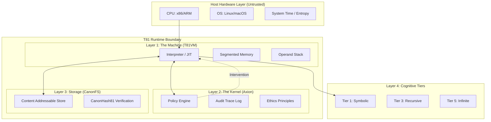

# Capítulo 1: Introducción

## 1.1 Alcance y Definición

**Estado: Implementado y Probado**

El proyecto **Fundación T81** implementa una arquitectura de máquina virtual determinista y nativa en ternario, diseñada para la computación verificable. A diferencia de los entornos de ejecución de propósito general que priorizan el rendimiento, la abstracción del hardware o la conveniencia del desarrollador, T81 prioriza la **reproducibilidad exacta a nivel de bit**, la **auditabilidad** y la **honestidad estructural**.

El sistema se define formalmente como una tupla $\mathfrak{S} = (\mathcal{M}, \mathcal{A}, \mathcal{C}, \Phi)$, donde:
- $\mathcal{M}$ es la **Máquina Virtual TISC**, un autómata basado en pila que opera en lógica ternaria balanceada.
- $\mathcal{A}$ es el **Kernel de Seguridad Axion**, un supervisor basado en capacidades que impone políticas en tiempo de ejecución.
- $\mathcal{C}$ es el **Sistema de Archivos Canónico (CanonFS)**, una capa de almacenamiento direccionable por contenido que asegura la resolución inmutable de artefactos.
- $\Phi$ es el conjunto de **Invariantes** que deben cumplirse para cualquier transición válida del sistema.

El axioma central de T81 es que la computación es una función determinista que mapea un estado inicial $S_0$ y una entrada $I$ a un estado final $S_n$ a través de una secuencia de transiciones discretas y bien definidas:
$$
\forall \text{hardware } H_1, H_2: \text{Exec}(S_0, I)_{H_1} \equiv \text{Exec}(S_0, I)_{H_2}
$$
Esta identidad debe mantenerse a través de diferentes arquitecturas de procesador (x86_64, ARM64, RISC-V), sistemas operativos y tiempo.

### 1.1.1 Invariantes Centrales

La arquitectura impone los siguientes invariantes no negociables:

1.  **Determinismo Estricto**: La ejecución de un programa válido TISC (Computadora con Conjunto de Instrucciones Ternarias) $P$ con entrada $I$ produce una secuencia de transición de estados $S_0 \to S_1 \to \dots \to S_n$ que es idéntica en todas las arquitecturas host compatibles. Esto impide el uso de unidades de punto flotante (FPU) del hardware host para cualquier operación que afecte el estado arquitectónico.
2.  **Nativo Ternario**: La arquitectura opera sobre lógica ternaria balanceada (trits $\in \{-1, 0, 1\}$), utilizando una pila aritmética personalizada (`dmath`) para evitar el no determinismo del punto flotante binario y para alinearse con la optimización de la teoría de la información de base 3.
3.  **Cumplimiento de Políticas**: Toda la ejecución está gobernada por el **Kernel Axion**, un supervisor basado en capacidades que impone políticas de seguridad (límites de recursión, límites de memoria, restricciones éticas) *antes* del retiro de instrucciones. La función del kernel $\alpha: (S, \text{Op}) \to \{\text{Allow, Deny}\}$ se evalúa para cada despacho de instrucción.
4.  **Honestidad Estructural**: El sistema no sintetiza información. Si un resultado es aproximado, se tipifica como tal. Si un proceso no termina, se categoriza en un nivel cognitivo superior (Nivel 5). El sistema rechaza la ejecución de "mejor esfuerzo" a favor del fallo explícito.

> **Ancla de Verificación**: El bucle de ejecución determinista se implementa en `src/vm/vm.cpp` (ver `Interpreter::step()`). Las primitivas aritméticas ternarias se definen en `include/t81/ternary.hpp` y `include/t81/core/T81Float.hpp`.

## 1.2 Arquitectura del Sistema

El stack T81 consta de cuatro capas principales, cada una con responsabilidades y límites de verificación distintos. La arquitectura está diseñada para minimizar la "Base de Computación Confiable" (TCB) tratando al hardware host como una entidad adversarial que proporciona ciclos crudos pero no corrección semántica.

### 1.2.1 La Máquina Virtual TISC (T81VM)

**Estado: Implementado y Probado**

La T81VM es un intérprete basado en pila para la ISA **TISC (Computadora con Conjunto de Instrucciones Ternarias)**. Gestiona un modelo de memoria segmentado diseñado para prevenir alias de punteros y desbordamientos de búfer por construcción.

El estado de la VM se define formalmente como una tupla $S = (R, PC, SP, M_{seg}, \Phi)$, donde:
*   $R$: El archivo de registros que consta de 81 registros de propósito general (`r0` a `r80`), cada uno almacenando un `T81Value` tipado.
*   $PC$: El contador de programa, apuntando a la siguiente instrucción en el segmento de Código.
*   $SP$: El puntero de pila, indicando la cima de la pila de operandos.
*   $M_{seg}$: Los segmentos de memoria (Código, Pila, Montón, Tensor, Meta).
*   $\Phi$: El registro de banderas de estado, codificando el resultado de la última comparación u operación aritmética ($\{<, =, >\}$).

Los segmentos de memoria son:
*   **Código**: Segmento de instrucciones de solo lectura. La modificación es imposible después de la carga.
*   **Pila**: Almacenamiento LIFO para variables locales y direcciones de retorno.
*   **Montón (Heap)**: Asignación dinámica para objetos complejos (Tensores, Gráficos). Gestionado por un recolector de basura determinista de Marcado y Barrido.
*   **Tensor**: Almacenamiento especializado para datos numéricos de alta dimensión, alineado a límites de 64 bytes para optimización SIMD (donde sea seguro).
*   **Meta**: Capacidades de reflexión e introspección, almacenando tablas de símbolos e información de depuración.

> **Referencia**: Ver `src/vm/vm.cpp`, struct `State`.

### 1.2.2 El Kernel de Seguridad Axion

**Estado: Implementado y Probado**

Axion actúa como un hipervisor para la T81VM. Intercepta cada despacho de instrucción para verificar el cumplimiento con la **Política** activa. A diferencia de los sistemas operativos tradicionales donde la seguridad es a menudo una verificación en el límite de la llamada al sistema (syscall), Axion impone verificaciones de capacidad de grano fino a nivel de *instrucción*.

Las políticas son conjuntos de reglas declarativas que restringen:
*   **Uso de Recursos**: Asignación total de memoria, profundidad máxima de pila, conteo de ciclos de instrucción.
*   **Flujo de Control**: Profundidad de recursión (Nivel 3), complejidad de ramificación (Nivel 2).
*   **Capacidades**: Acceso a llamadas del sistema de E/S, red, sistema de archivos, o funciones cognitivas de alto nivel.

Si una instrucción viola una política (por ejemplo, intentar `Recurse` cuando la política es `recursion_limit=0`), Axion emite un veredicto de `Deny` (Denegar). Esto causa que la VM se detenga inmediatamente con un `SecurityFault` (Fallo de Seguridad), asegurando que ninguna transición de estado no autorizada ocurra jamás.

> **Referencia**: La lógica de políticas se implementa en `src/axion/policy_engine.cpp` y `include/t81/axion/api.hpp`.

### 1.2.3 Sistema de Archivos Canónico (CanonFS)

**Estado: Implementación Parcial**

CanonFS es una capa de almacenamiento direccionable por contenido que garantiza la **inmutabilidad estructural**. Rechaza el concepto de rutas de archivo mutables. En su lugar, los objetos (pesos, código, datos) se identifican únicamente por su hash SHA3-256 (`CanonHash81`).

Cuando la VM solicita cargar un módulo o un modelo de tensor, proporciona un hash. CanonFS localiza el blob, verifica que su hash coincida con la solicitud, y solo entonces permite cargarlo en memoria. Este mecanismo asegura que los datos en memoria sean idénticos bit a bit al artefacto que fue firmado y publicado, eliminando ataques de "deriva de dependencias" y discrepancias de "funciona en mi máquina".

> **Referencia**: Implementado en `src/canonfs/` y definido en `spec/supplemental/canonfs-spec.md`. Actualmente soporta verificación básica de hash y carga.

### 1.2.4 Los Niveles Cognitivos

**Estado: Implementado (Niveles 1-5)**

T81 organiza la complejidad computacional en **Niveles Cognitivos**. Esta taxonomía permite al sistema limitar el "peligro" o "costo" de una computación. Un script aritmético simple no debería tener la capacidad de consumir recursos infinitos o realizar recursión no acotada.

*   **Nivel 1 (Simbólico)**: Aritmética básica, lógica y bucles de límite fijo. Determinista en tiempo $O(1)$ o $O(N)$. Seguro para todos los contextos.
*   **Nivel 2 (Reflexivo)**: Auto-inspección, captura de trazas y despacho dinámico.
*   **Nivel 3 (Recursivo)**: Recursión acotada y generación de pruebas. Capaz de expresar funciones recursivas generales pero sujeto a políticas de profundidad de pila.
*   **Nivel 4 (Distribuido)**: Transiciones de estado basadas en consenso, protocolos de chismes y fusión de estados entre nodos.
*   **Nivel 5 (Infinito)**: Series geométricas, formas no terminantes y candidatos al "Problema de la Parada". Permitido solo con privilegios explícitos de `InfExpand`.

> **Referencia**: La lógica de niveles se encuentra en `src/cog/`. Ver `src/cog/tier3/recursive.cpp` y `src/cog/tier5/infinite.cpp`.

## 1.3 Misión de Cómputo Verificable

La aplicación principal de T81 es el **Cómputo Soberano**: la capacidad de ejecutar código y verificar el resultado sin confiar en el operador del hardware. Al combinar aritmética estricta definida por software (`dmath`) con un registro de auditoría criptográfico (Traza Axion), T81 permite una nueva clase de aplicaciones donde la *integridad* de la computación es primordial.

### 1.3.1 Inferencia de IA Sin Confianza
En un mundo de modelos de IA opacos, T81 permite la **Inferencia Probable**. Un usuario puede ejecutar un modelo en un nodo remoto y recibir no solo la salida, sino una prueba criptográfica (la Traza Axion) de que:
1.  Se utilizó el modelo específico (identificado por `CanonHash81`).
2.  La entrada fue exactamente la especificada.
3.  El proceso de inferencia siguió las reglas deterministas de la aritmética T81.

### 1.3.2 Contratos Inteligentes y Consenso
La naturaleza determinista de T81 lo convierte en un sustrato ideal para la ejecución de contratos inteligentes. A diferencia de EVM o WASM, que dependen de la lógica binaria y a menudo luchan con el determinismo del punto flotante, T81 proporciona soporte nativo para matemáticas decimales (ternarias) de alta precisión, eliminando errores de redondeo en cálculos financieros.

### 1.3.3 Reproducibilidad Científica
La "Crisis de Reproducibilidad" en la ciencia es en parte una crisis de estabilidad computacional. Una simulación ejecutada en una supercomputadora en 2024 debería producir exactamente los mismos resultados en una computadora portátil en 2050. T81 garantiza esto abstrayendo la unidad de punto flotante del hardware y el tiempo del sistema, asegurando que la simulación sea un objeto matemático invariante.

## 1.4 Terminología

Los siguientes términos se utilizan con precisión a lo largo de esta monografía.

| Término | Definición |
| :--- | :--- |
| **Trit** | Un dígito en base-3: $\{-1, 0, 1\}$. El átomo fundamental de la lógica T81. |
| **Tryte** | Una secuencia de trits. Un Tryte estándar es de 4 trits ($3^4 = 81$ valores), típicamente empaquetado en un `uint8_t` para almacenamiento. |
| **TISC** | Computadora con Conjunto de Instrucciones Ternarias. La ISA de la T81VM. |
| **Axion** | El kernel de seguridad, cumplimiento de políticas y auditoría del runtime T81. |
| **CanonRef** | Una referencia canónica (hash SHA3-256) a un objeto inmutable en CanonFS. |
| **Promoción** | El acto de escalar privilegios o mover una computación a un Nivel Cognitivo superior. |
| **dmath** | Matemáticas Deterministas. La biblioteca de software que implementa aritmética ternaria exacta a nivel de bit y funciones trascendentales. |
| **Traza Verificable** | Un registro firmado criptográficamente de todas las transiciones de estado y verificaciones de políticas realizadas durante una ejecución. |
| **Honestidad Estructural** | El principio de que el sistema debe declarar explícitamente la naturaleza de sus resultados (exactos, aproximados, no terminantes) en lugar de ocultar la complejidad. |

## 1.5 Lista de Verificación

La siguiente lista de verificación define los criterios de aceptación para una implementación T81 compatible.

*   [ ] **Determinismo**: ¿La VM produce trazas idénticas en arquitecturas x86, ARM y RISC-V? (Verificado por `scripts/ci/t81lang_repro_gate.py`)
*   [ ] **Aislamiento**: ¿Axion intercepta correctamente las instrucciones prohibidas e impone límites de recursos? (Verificado por `tests/cpp/test_ethics.cpp` y `tests/cpp/test_resource_monitoring.cpp`)
*   [ ] **Persistencia**: ¿CanonFS recupera objetos por hash correctamente y rechaza datos corruptos? (Verificado por `tests/cpp/canonfs_driver_test.cpp`)
*   [ ] **Aritmética**: ¿Satisface `dmath` las identidades matemáticas de la lógica ternaria balanceada? (Verificado por `tests/cpp/ternary_arith_test.cpp`)
*   [ ] **Política**: ¿Restringen correctamente las limitaciones de Nivel que el código de nivel inferior ejecute opcodes de nivel superior? (Verificado por `tests/cpp/test_tier3_opcodes.cpp`)

## Nota del Autor para la Próxima Revisión

*   **Preguntas Abiertas**: La prueba formal de equivalencia entre la optimización de traza del compilador JIT y la función de paso del intérprete necesita ser rigorizada en la Sección 11.
*   **Figuras Sugeridas**: Un diagrama de secuencia que muestre la interacción entre el Intérprete, el Motor de Políticas Axion y el Registrador de Trazas durante un solo ciclo de instrucción sería beneficioso en la Sección 1.2.
*   **Referencias Cruzadas**: Asegurar que la "Frontera de Investigación" (Capítulo 14) esté actualizada para reflejar el progreso reciente en la implementación de Formas Infinitas de Nivel 5.

---
**Canonical Source**: /book (English)
**Source Version**: Phase 1 Expansion
**Last Synced**: 2026-02-23
**Translation Status**: Needs Update
---
