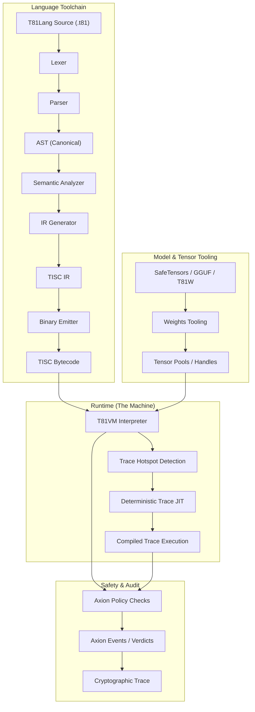

# Capítulo 3: Arquitectura T81VM

## 3.1 Visión General

**Estado: Estable**

La **Máquina Virtual T81 (T81VM)** es el motor de ejecución del stack T81. Impone una separación estricta entre compilación y ejecución, gobernada por contratos explícitos para el determinismo y la seguridad. La arquitectura se define por la interacción entre la Cadena de Herramientas del Lenguaje, el Runtime (VM) y el Kernel de Seguridad (Axion).

### 3.1.1 La Tubería de Ejecución

El flujo de un programa desde el código fuente hasta la ejecución verificada implica múltiples etapas de canonicalización y verificación.

## 3.2 El Límite del Runtime

**Estado: Implementado**

El límite entre el entorno host y el runtime T81 está rígidamente definido. El runtime actúa como un **sello hermético**.
- **Entrada**: Bytecode, Entradas Canónicas, Configuración de Políticas.
- **Salida**: Resultado Canónico, Traza de Auditoría, Error/Trampa.
- **Efectos Secundarios**: Estrictamente prohibidos a menos que la Política lo permita explícitamente (ej. `MetaWrite` o `Gossip`).

El contrato del runtime (`contracts/runtime-contract.json`) especifica exactamente qué entradas y salidas están permitidas, asegurando que ningún estado oculto (como variables de entorno o descriptores de archivo) se filtre al contexto de ejecución.

## 3.3 Modelo de Memoria

**Estado: Implementado y Probado**

La VM utiliza un **Modelo de Memoria Segmentado** para garantizar la seguridad de la memoria y prevenir el secuestro del flujo de control por construcción. A diferencia de los espacios de direcciones planos donde el código y los datos se entremezclan, T81 impone una separación estricta.

### 3.3.1 Definición Formal del Estado
El estado de la máquina en cualquier tic $t$ se define como una tupla $S_t = (\mathbf{R}, \mathbf{M}, \mathbf{K}, \mathbf{\Phi})$, donde:

*   **Registros ($\mathbf{R}$)**: Un banco de 243 registros de propósito general ($R_0 \dots R_{242}$). Cada registro contiene un valor de 64 bits tipado (carga útil entera o manejador) y un `ValueTag` correspondiente.
*   **Memoria ($\mathbf{M}$)**: Una colección de segmentos disjuntos.
*   **Pila de Control ($\mathbf{K}$)**: Una pila de marcos de llamada, gestionando la invocación de funciones y direcciones de retorno.
*   **Banderas ($\mathbf{\Phi}$)**: Banderas de estado $\{Z, N, P\}$ indicando el resultado de la última operación aritmética (Cero, Negativo, Positivo).

### 3.3.2 Segmentos de Memoria
La memoria se divide en regiones lógicas. Acceder a la memoria a través de límites de segmentos sin opcodes específicos es imposible.

| Segmento | Acceso | Propósito |
| :--- | :--- | :--- |
| **Código** | Solo Lectura | Almacena el flujo de instrucciones inmutable. El PC apunta aquí. |
| **Pila** | Lectura/Escritura | Almacenamiento LIFO para variables locales. Crece hacia abajo. |
| **Montón (Heap)** | Gestionado | Asignación dinámica para objetos complejos. Gestionado por GC. |
| **Tensor** | Gestionado | Pool especializado para objetos `T81Tensor`. Alineado para SIMD. |
| **Meta** | Solo Lectura | Datos de reflexión, tablas de símbolos y metadatos de depuración. |

### 3.3.3 Manejadores e Indirección
Para prevenir la corrupción de memoria y los ataques de aritmética de punteros, la VM utiliza **Manejadores Opacos**.
- Un registro no almacena un puntero crudo `0x7fff...`.
- En su lugar, almacena un manejador `TensorHandle(42)`.
- La VM resuelve `Index[42]` en el Segmento de Tensor a la ubicación de memoria real.
- Intentar acceder a `TensorHandle(43)` si solo existen 42 tensores resulta en un `Trap::SegFault` inmediato.

## 3.4 El Conjunto de Instrucciones (TISC)

**Estado: Implementado y Probado**

La **Computadora con Conjunto de Instrucciones Ternarias (TISC)** es el lenguaje nativo de la VM. Es una ISA orientada a pila con soporte especializado para lógica ternaria y operaciones cognitivas de alto nivel.

### 3.4.1 El Ciclo de Instrucción
Para cada instrucción, la VM realiza un ciclo riguroso:

1.  **Obtener (Fetch)**: Recuperar el opcode en `Code[PC]`.
2.  **Decodificar (Decode)**: Analizar operandos (registros, inmediatos).
3.  **Verificación de Política (Policy Check)**: El Kernel Axion evalúa $\alpha(S, \text{Op})$. Si es `Deny`, se lanza un `SecurityFault`.
4.  **Ejecutar (Execute)**: Realizar la transición de estado $S' = \delta(S, \text{Op})$.
5.  **Retirar (Retire)**: Incrementar `PC`, actualizar Traza y ejecutar Recolección de Basura si se cumple el disparador de asignación.

### 3.4.2 Categorías de Opcode
*   **Aritmética**: `Add`, `Mul`, `Div` (Ternario), `FAdd`, `FMul` (Soft-Float).
*   **Flujo de Control**: `Jump`, `Branch`, `Call`, `Ret`.
*   **Movimiento de Datos**: `Load`, `Store`, `Move`.
*   **Ops Cognitivos**:
    *   `Recurse`: Entrar en un ámbito recursivo (Nivel 3).
    *   `Reflect`: Instantánea del estado actual (Nivel 2).
    *   `Gossip`: Intercambiar estado con pares (Nivel 4).
    *   `InfExpand`: Instanciar una forma infinita (Nivel 5).
*   **Ops de Tensores**: `TensorAdd`, `TensorMul`, `MatMul`, `BroadCast`.

> **Referencia**: Ver `spec/tisc-spec.md` para la referencia completa del conjunto de instrucciones.

## 3.5 Compilación JIT (Trace-JIT)

**Estado: Experimental / Implementación Parcial**

Para reconciliar el conflicto entre "Determinismo Estricto" y "Alto Rendimiento", T81 emplea un **Trace JIT Determinista**.

### 3.5.1 El Proceso de Rastreo
1.  **Perfilado**: El intérprete cuenta las iteraciones del bucle. Cuando un bucle excede un umbral (`kHotThreshold`), desencadena el rastreo.
2.  **Grabación**: La VM entra en "Modo de Grabación", registrando cada opcode ejecutado y los *valores* de cualquier guardia (ramas).
3.  **Optimización**: La traza registrada se optimiza (plegado de constantes, eliminación de código muerto) *asumiendo* que las condiciones de guardia se mantienen.
4.  **Compilación**: La traza se compila a código máquina (o código enhebrado).

### 3.5.2 Equivalencia de Comportamiento
El JIT debe adherirse estrictamente al **Invariante de Equivalencia**:
$$
\text{Exec}_{\text{JIT}}(S) \equiv \text{Exec}_{\text{Interp}}(S)
$$
Si el código optimizado encuentra un estado donde una guardia falla (ej. falla una verificación de tipo), debe **Desoptimizar**—transferir el control de vuelta al intérprete en el punto exacto de la falla, reconstruyendo el estado completo del intérprete. Esto asegura que la optimización nunca altere la semántica o el resultado del programa.

> **Verificación**: `tests/cpp/jit_test.cpp` y `tests/cpp/jit_trace_equivalence_test.cpp` verifican que la ejecución JIT coincida exactamente con el intérprete para entradas aleatorias.

---
**Canonical Source**: /book (English)
**Source Version**: Phase 1 Expansion
**Last Synced**: 2026-02-23
**Translation Status**: Needs Update
---
