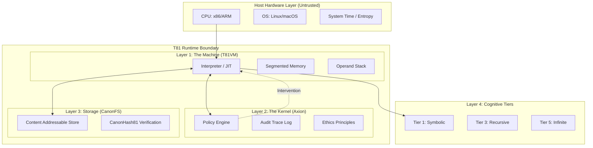

# Capítulo 1: Introdução

## 1.1 Escopo e Definição

**Status: Implementado e Testado**

O projeto **Fundação T81** implementa uma arquitetura de máquina virtual nativa ternária e determinística, projetada para computação verificável. Diferente de ambientes de execução de propósito geral que priorizam throughput, abstração de hardware ou conveniência do desenvolvedor, o T81 prioriza **reprodutibilidade bit-exact**, **auditabilidade** e **honestidade estrutural**.

O sistema é formalmente definido como uma tupla $\mathfrak{S} = (\mathcal{M}, \mathcal{A}, \mathcal{C}, \Phi)$, onde:
- $\mathcal{M}$ é a **Máquina Virtual TISC**, um autômato baseado em pilha operando em lógica ternária balanceada.
- $\mathcal{A}$ é o **Kernel de Segurança Axion**, um supervisor baseado em capacidades que impõe políticas em tempo de execução.
- $\mathcal{C}$ é o **Sistema de Arquivos Canônico (CanonFS)**, uma camada de armazenamento endereçável por conteúdo que garante resolução imutável de artefatos.
- $\Phi$ é o conjunto de **Invariantes** que devem ser verdadeiros para qualquer transição válida do sistema.

O axioma central do T81 é que a computação é uma função determinística que mapeia um estado inicial $S_0$ e uma entrada $I$ para um estado final $S_n$ através de uma sequência de transições discretas e bem definidas:
$$
\forall \text{hardware } H_1, H_2: \text{Exec}(S_0, I)_{H_1} \equiv \text{Exec}(S_0, I)_{H_2}
$$
Essa identidade deve se manter através de diferentes arquiteturas de processador (x86_64, ARM64, RISC-V), sistemas operacionais e tempo.

### 1.1.1 Invariantes Centrais

A arquitetura impõe os seguintes invariantes não negociáveis:

1.  **Determinismo Estrito**: A execução de um programa válido TISC (Computador de Conjunto de Instruções Ternárias) $P$ na entrada $I$ produz uma sequência de transição de estado $S_0 \to S_1 \to \dots \to S_n$ que é idêntica em todas as arquiteturas hospedeiras compatíveis. Isso impede o uso de unidades de ponto flutuante (FPU) de hardware para qualquer operação que afete o estado arquitetônico.
2.  **Nativo Ternário**: A arquitetura opera em lógica ternária balanceada (trits $\in \{-1, 0, 1\}$), utilizando uma pilha aritmética personalizada (`dmath`) para evitar o não-determinismo de ponto flutuante binário e para alinhar com a otimização da teoria da informação de base 3.
3.  **Política Aplicada**: Toda execução é governada pelo **Kernel Axion**, um supervisor baseado em capacidades que impõe políticas de segurança (limites de recursão, limites de memória, restrições éticas) *antes* da retirada da instrução. A função do kernel $\alpha: (S, \text{Op}) \to \{\text{Allow, Deny}\}$ é avaliada para cada despacho de instrução.
4.  **Honestidade Estrutural**: O sistema não sintetiza informações. Se um resultado é aproximado, ele é tipado como tal. Se um processo não é terminal, ele é categorizado em um nível cognitivo superior (Nível 5). O sistema rejeita execução de "melhor esforço" em favor de falha explícita.

> **Âncora de Verificação**: O loop de execução determinística é implementado em `src/vm/vm.cpp` (veja `Interpreter::step()`). As primitivas aritméticas ternárias são definidas em `include/t81/ternary.hpp` e `include/t81/core/T81Float.hpp`.

## 1.2 Arquitetura do Sistema

A stack T81 consiste em quatro camadas primárias, cada uma com responsabilidades distintas e limites de verificação. A arquitetura é projetada para minimizar a "Base de Computação Confiável" (TCB) tratando o hardware hospedeiro como uma entidade adversária que fornece ciclos brutos, mas não correção semântica.

### 1.2.1 A Máquina Virtual TISC (T81VM)

**Status: Implementado e Testado**

A T81VM é um intérprete baseado em pilha para a ISA **TISC (Computador de Conjunto de Instruções Ternárias)**. Ela gerencia um modelo de memória segmentado projetado para prevenir aliasing de ponteiros e estouros de buffer por construção.

O estado da VM é formalmente definido como uma tupla $S = (R, PC, SP, M_{seg}, \Phi)$, onde:
*   $R$: O arquivo de registradores consistindo de 81 registradores de propósito geral (`r0` a `r80`), cada um armazenando um `T81Value` tipado.
*   $PC$: O contador de programa, apontando para a próxima instrução no segmento de Código.
*   $SP$: O ponteiro de pilha, indicando o topo da pilha de operandos.
*   $M_{seg}$: Os segmentos de memória (Código, Pilha, Heap, Tensor, Meta).
*   $\Phi$: O registrador de flags de status, codificando o resultado da última comparação ou operação aritmética ($\{<, =, >\}$).

Os segmentos de memória são:
*   **Código**: Segmento de instrução somente leitura. Modificação é impossível após o carregamento.
*   **Pilha (Stack)**: Armazenamento LIFO para variáveis locais e endereços de retorno.
*   **Heap**: Alocação dinâmica para objetos complexos (Tensores, Grafos). Gerenciado por um coletor de lixo determinístico Mark-and-Sweep.
*   **Tensor**: Armazenamento especializado para dados numéricos de alta dimensão, alinhado a limites de 64 bytes para otimização SIMD (onde seguro).
*   **Meta**: Capacidades de reflexão e introspecção, armazenando tabelas de símbolos e informações de depuração.

> **Referência**: Veja `src/vm/vm.cpp`, struct `State`.

### 1.2.2 O Kernel de Segurança Axion

**Status: Implementado e Testado**

O Axion atua como um hipervisor para a T81VM. Ele intercepta cada despacho de instrução para verificar a conformidade com a **Política** ativa. Diferente de sistemas operacionais tradicionais onde a segurança é frequentemente uma verificação no limite da chamada de sistema (syscall), o Axion impõe verificações de capacidade granulares no nível da *instrução*.

Políticas são conjuntos de regras declarativas que restringem:
*   **Uso de Recursos**: Alocação total de memória, profundidade máxima de pilha, contagem de ciclos de instrução.
*   **Fluxo de Controle**: Profundidade de recursão (Nível 3), complexidade de ramificação (Nível 2).
*   **Capacidades**: Acesso a chamadas de sistema de E/S, rede, sistema de arquivos ou funções cognitivas de alto nível.

Se uma instrução viola uma política (por exemplo, tentar `Recurse` quando a política é `recursion_limit=0`), o Axion emite um veredito `Deny`. Isso faz com que a VM intercepte imediatamente com uma `SecurityFault`, garantindo que nenhuma transição de estado não autorizada ocorra.

> **Referência**: A lógica de política é implementada em `src/axion/policy_engine.cpp` e `include/t81/axion/api.hpp`.

### 1.2.3 Sistema de Arquivos Canônico (CanonFS)

**Status: Implementação Parcial**

O CanonFS é uma camada de armazenamento endereçável por conteúdo que garante **imutabilidade estrutural**. Ele rejeita o conceito de caminhos de arquivo mutáveis. Em vez disso, objetos (pesos, código, dados) são identificados unicamente por seu hash SHA3-256 (`CanonHash81`).

Quando a VM solicita carregar um módulo ou um modelo de tensor, ela fornece um hash. O CanonFS localiza o blob, verifica se seu hash corresponde à solicitação e só então permite que ele seja carregado na memória. Esse mecanismo garante que os dados na memória sejam idênticos bit-a-bit ao artefato que foi assinado e publicado, eliminando ataques de "deriva de dependência" e discrepâncias de "funciona na minha máquina".

> **Referência**: Implementado em `src/canonfs/` e definido em `spec/supplemental/canonfs-spec.md`. Atualmente suporta verificação básica de hash e carregamento.

### 1.2.4 Os Níveis Cognitivos

**Status: Implementado (Níveis 1-5)**

O T81 organiza a complexidade computacional em **Níveis Cognitivos**. Essa taxonomia permite que o sistema limite o "perigo" ou "custo" de uma computação. Um script aritmético simples não deve ter a capacidade de consumir recursos infinitos ou realizar recursão ilimitada.

*   **Nível 1 (Simbólico)**: Aritmética básica, lógica e loops de limite fixo. Determinístico em tempo $O(1)$ ou $O(N)$. Seguro para todos os contextos.
*   **Nível 2 (Reflexivo)**: Auto-inspeção, captura de rastreamento e despacho dinâmico.
*   **Nível 3 (Recursivo)**: Recursão limitada e geração de provas. Capaz de expressar funções recursivas gerais, mas sujeito a políticas de profundidade de pilha.
*   **Nível 4 (Distribuído)**: Transições de estado baseadas em consenso, protocolos de fofoca e fusão de estado entre nós.
*   **Nível 5 (Infinito)**: Séries geométricas, formas não terminais e candidatos ao "Problema da Parada". Permitido apenas com privilégios explícitos `InfExpand`.

> **Referência**: A lógica dos níveis está localizada em `src/cog/`. Veja `src/cog/tier3/recursive.cpp` e `src/cog/tier5/infinite.cpp`.

## 1.3 Missão de Computação Verificável

A aplicação primária do T81 é **Computação Soberana**: a capacidade de executar código e verificar o resultado sem confiar no operador do hardware. Ao combinar aritmética estrita definida por software (`dmath`) com um log de auditoria criptográfico (Trace Axion), o T81 permite uma nova classe de aplicações onde a *integridade* da computação é primordial.

### 1.3.1 Inferência de IA Trustless
Em um mundo de modelos de IA opacos, o T81 permite **Inferência Provável**. Um usuário pode executar um modelo em um nó remoto e receber não apenas a saída, mas uma prova criptográfica (o Trace Axion) de que:
1.  O modelo específico (identificado pelo `CanonHash81`) foi usado.
2.  A entrada foi exatamente como especificada.
3.  O processo de inferência seguiu as regras determinísticas da aritmética T81.

### 1.3.2 Contratos Inteligentes e Consenso
A natureza determinística do T81 o torna um substrato ideal para execução de contratos inteligentes. Diferente de EVM ou WASM, que dependem de lógica binária e frequentemente lutam com determinismo de ponto flutuante, o T81 fornece suporte nativo para matemática decimal (ternária) de alta precisão, eliminando erros de arredondamento em cálculos financeiros.

### 1.3.3 Reprodutibilidade Científica
A "Crise de Reprodutibilidade" na ciência é parcialmente uma crise de estabilidade computacional. Uma simulação executada em um supercomputador em 2024 deve produzir exatamente os mesmos resultados em um laptop em 2050. O T81 garante isso abstraindo a unidade de ponto flutuante de hardware e o tempo do sistema, garantindo que a simulação seja um objeto matemático invariante.

## 1.4 Terminologia

Os seguintes termos são usados precisamente ao longo desta monografia.

| Termo | Definição |
| :--- | :--- |
| **Trit** | Um dígito de base-3: $\{-1, 0, 1\}$. O átomo fundamental da lógica T81. |
| **Tryte** | Uma sequência de trits. Um Tryte padrão tem 4 trits ($3^4 = 81$ valores), tipicamente empacotado em um `uint8_t` para armazenamento. |
| **TISC** | Computador de Conjunto de Instruções Ternárias. A ISA da T81VM. |
| **Axion** | O kernel de segurança, aplicação de políticas e auditoria do tempo de execução T81. |
| **CanonRef** | Uma referência canônica (hash SHA3-256) para um objeto imutável no CanonFS. |
| **Promoção** | O ato de escalar privilégios ou mover uma computação para um Nível Cognitivo superior. |
| **dmath** | Matemática Determinística. A biblioteca de software que implementa aritmética ternária bit-exact e funções transcendentais. |
| **Rastreamento Verificável** | Um log assinado criptograficamente de todas as transições de estado e verificações de política realizadas durante uma execução. |
| **Honestidade Estrutural** | O princípio de que o sistema deve declarar explicitamente a natureza de seus resultados (exato, aproximado, não terminal) em vez de ocultar complexidade. |

## 1.5 Checklist de Verificação

A seguinte lista de verificação define os critérios de aceitação para uma implementação T81 compatível.

*   [ ] **Determinismo**: A VM produz traços idênticos em arquiteturas x86, ARM e RISC-V? (Verificado por `scripts/ci/t81lang_repro_gate.py`)
*   [ ] **Isolamento**: O Axion intercepta corretamente instruções proibidas e impõe limites de recursos? (Verificado por `tests/cpp/test_ethics.cpp` e `tests/cpp/test_resource_monitoring.cpp`)
*   [ ] **Persistência**: O CanonFS recupera objetos por hash corretamente e rejeita dados corrompidos? (Verificado por `tests/cpp/canonfs_driver_test.cpp`)
*   [ ] **Aritmética**: O `dmath` satisfaz as identidades matemáticas da lógica ternária balanceada? (Verificado por `tests/cpp/ternary_arith_test.cpp`)
*   [ ] **Política**: As restrições de nível impedem corretamente que códigos de nível inferior executem opcodes de nível superior? (Verificado por `tests/cpp/test_tier3_opcodes.cpp`)

## Nota do Autor para a Próxima Revisão

*   **Questões em Aberto**: A prova formal de equivalência entre a otimização de rastreamento do compilador JIT e a função de passo do intérprete precisa ser rigorizada na Seção 11.
*   **Figuras Sugeridas**: Um diagrama de sequência mostrando a interação entre o Intérprete, o Mecanismo de Política Axion e o Registrador de Rastreamento durante um único ciclo de instrução seria benéfico na Seção 1.2.
*   **Referências Cruzadas**: Garantir que a "Fronteira de Pesquisa" (Capítulo 14) seja atualizada para refletir o progresso recente na implementação de Formas Infinitas de Nível 5.

---
**Canonical Source**: /book (English)
**Source Version**: Phase 1 Expansion
**Last Synced**: 2026-02-23
**Translation Status**: Needs Update
---
