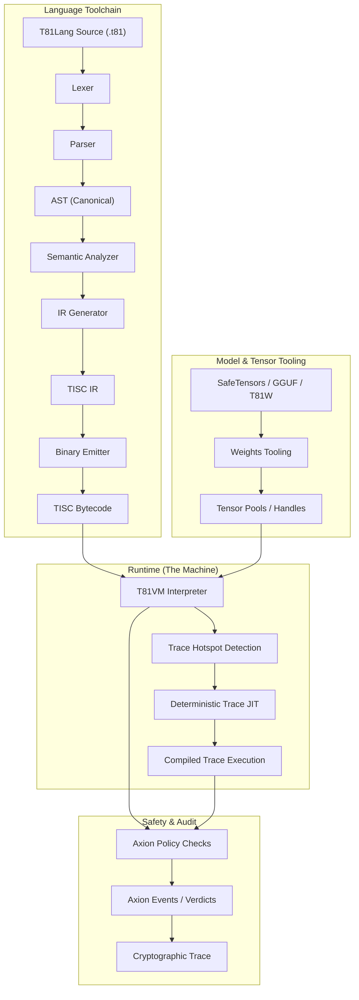

# Capítulo 3: Arquitetura T81VM

## 3.1 Visão Geral

**Status: Estável**

A **Máquina Virtual T81 (T81VM)** é o motor de execução do stack T81. Ela impõe uma estrita separação entre compilação e execução, governada por contratos explícitos para determinismo e segurança. A arquitetura é definida pela interação entre a Toolchain da Linguagem, o Runtime (VM) e o Kernel de Segurança (Axion).

### 3.1.1 O Pipeline de Execução

O fluxo de um programa desde o código fonte até a execução verificada envolve múltiplos estágios de canonicalização e verificação.

## 3.2 A Fronteira de Runtime

**Status: Implementado**

A fronteira entre o ambiente hospedeiro e o runtime T81 é rigidamente definida. O runtime atua como um **selo hermético**.
- **Entrada**: Bytecode, Entradas Canônicas, Configuração de Política.
- **Saída**: Resultado Canônico, Log de Auditoria, Erro/Armadilha.
- **Efeitos Colaterais**: Estritamente proibidos a menos que explicitamente permitidos pela Política (ex: `MetaWrite` ou `Gossip`).

O contrato de runtime (`contracts/runtime-contract.json`) especifica exatamente quais entradas e saídas são permitidas, garantindo que nenhum estado oculto (como variáveis de ambiente ou descritores de arquivo) vaze para o contexto de execução.

## 3.3 Modelo de Memória

**Status: Implementado e Testado**

A VM usa um **Modelo de Memória Segmentado** para garantir segurança de memória e prevenir sequestro de fluxo de controle por construção. Diferente de espaços de endereçamento planos onde código e dados são misturados, o T81 impõe separação estrita.

### 3.3.1 Definição Formal de Estado
O estado da máquina em qualquer tique $t$ é definido como uma tupla $S_t = (\mathbf{R}, \mathbf{M}, \mathbf{K}, \mathbf{\Phi})$, onde:

*   **Registradores ($\mathbf{R}$)**: Um banco de 243 registradores de propósito geral ($R_0 \dots R_{242}$). Cada registrador contém um valor de 64 bits tipado (payload inteiro ou handle) e uma `ValueTag` correspondente.
*   **Memória ($\mathbf{M}$)**: Uma coleção de segmentos disjuntos.
*   **Pilha de Controle ($\mathbf{K}$)**: Uma pilha de frames de chamada, gerenciando invocação de função e endereços de retorno.
*   **Flags ($\mathbf{\Phi}$)**: Flags de status $\{Z, N, P\}$ indicando o resultado da última operação aritmética (Zero, Negativo, Positivo).

### 3.3.2 Segmentos de Memória
A memória é dividida em regiões lógicas. Acessar a memória através das fronteiras dos segmentos sem opcodes específicos é impossível.

| Segmento | Acesso | Propósito |
| :--- | :--- | :--- |
| **Código** | Somente Leitura | Armazena o fluxo de instrução imutável. O PC aponta aqui. |
| **Pilha** | Leitura/Escrita | Armazenamento LIFO para variáveis locais. Cresce para baixo. |
| **Heap** | Gerenciado | Alocação dinâmica para objetos complexos. Gerenciado pelo GC. |
| **Tensor** | Gerenciado | Pool especializado para objetos `T81Tensor`. Alinhado para SIMD. |
| **Meta** | Somente Leitura | Dados de reflexão, tabelas de símbolos e metadados de depuração. |

### 3.3.3 Handles e Indireção
Para prevenir corrupção de memória e ataques de aritmética de ponteiro, a VM usa **Handles Opacos**.
- Um registrador não armazena um ponteiro bruto `0x7fff...`.
- Em vez disso, armazena um handle `TensorHandle(42)`.
- A VM resolve `Index[42]` no Segmento Tensor para a localização de memória real.
- Tentar acessar `TensorHandle(43)` se apenas 42 tensores existirem resulta em um `Trap::SegFault` imediato.

## 3.4 O Conjunto de Instruções (TISC)

**Status: Implementado e Testado**

O **Computador de Conjunto de Instruções Ternárias (TISC)** é a linguagem nativa da VM. É uma ISA orientada a pilha com suporte especializado para lógica ternária e operações cognitivas de alto nível.

### 3.4.1 O Ciclo de Instrução
Para cada instrução, a VM executa um ciclo rigoroso:

1.  **Buscar (Fetch)**: Recuperar o opcode em `Code[PC]`.
2.  **Decodificar (Decode)**: Analisar operandos (registradores, imediatos).
3.  **Verificação de Política (Policy Check)**: O Kernel Axion avalia $\alpha(S, \text{Op})$. Se `Deny`, levanta `SecurityFault`.
4.  **Executar (Execute)**: Realizar a transição de estado $S' = \delta(S, \text{Op})$.
5.  **Aposentar (Retire)**: Incrementar `PC`, atualizar Trace, e executar Coleta de Lixo se o gatilho de alocação for atendido.

### 3.4.2 Categorias de Opcode
*   **Aritmética**: `Add`, `Mul`, `Div` (Ternário), `FAdd`, `FMul` (Soft-Float).
*   **Fluxo de Controle**: `Jump`, `Branch`, `Call`, `Ret`.
*   **Movimento de Dados**: `Load`, `Store`, `Move`.
*   **Ops Cognitivas**:
    *   `Recurse`: Entrar em escopo recursivo (Nível 3).
    *   `Reflect`: Snapshot do estado atual (Nível 2).
    *   `Gossip`: Trocar estado com pares (Nível 4).
    *   `InfExpand`: Instanciar uma forma infinita (Nível 5).
*   **Ops de Tensor**: `TensorAdd`, `TensorMul`, `MatMul`, `BroadCast`.

> **Referência**: Veja `spec/tisc-spec.md` para a referência completa do conjunto de instruções.

## 3.5 Compilação JIT (Trace-JIT)

**Status: Experimental / Implementação Parcial**

Para reconciliar o conflito entre "Determinismo Estrito" e "Alto Desempenho", o T81 emprega um **Trace JIT Determinístico**.

### 3.5.1 O Processo de Rastreamento
1.  **Perfilagem**: O intérprete conta iterações de loop. Quando um loop excede um limite (`kHotThreshold`), ele aciona o rastreamento.
2.  **Gravação**: A VM entra no "Modo de Gravação", registrando cada opcode executado e os *valores* de quaisquer guardas (branches).
3.  **Otimização**: O trace gravado é otimizado (dobra de constantes, eliminação de código morto) *assumindo* que as condições de guarda se mantêm.
4.  **Compilação**: O trace é compilado para código de máquina (ou código threaded).

### 3.5.2 Equivalência Comportamental
O JIT deve aderir estritamente ao **Invariante de Equivalência**:
$$
\text{Exec}_{\text{JIT}}(S) \equiv \text{Exec}_{\text{Interp}}(S)
$$
Se o código otimizado encontrar um estado onde uma guarda falha (ex: uma verificação de tipo falha), ele deve **Desotimizar**—transferir o controle de volta para o intérprete no ponto exato da falha, reconstruindo o estado completo do intérprete. Isso garante que a otimização nunca altere a semântica ou o resultado do programa.

> **Verificação**: `tests/cpp/jit_test.cpp` e `tests/cpp/jit_trace_equivalence_test.cpp` verificam se a execução JIT corresponde exatamente ao intérprete para entradas aleatórias.

---
**Canonical Source**: /book (English)
**Source Version**: Phase 1 Expansion
**Last Synced**: 2026-02-23
**Translation Status**: Needs Update
---
