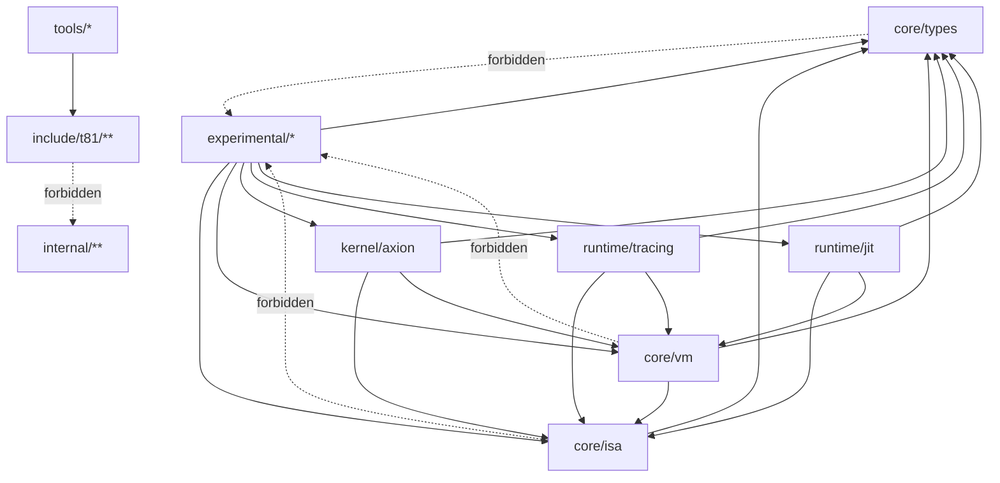

# Dependency Firewall

<!-- T81-TOC:BEGIN -->

## Table of Contents

- [Dependency Firewall](#dependency-firewall)
  - [Allowed Dependency Graph](#allowed-dependency-graph)
  - [Rules](#rules)
  - [Enforcement](#enforcement)
  - [Enforcement Escalation Plan](#enforcement-escalation-plan)

<!-- T81-TOC:END -->

This document is the normative structural dependency policy for the `t81-foundation` repository.

## Allowed Dependency Graph

## Rules

- `core/types` has no upward dependencies.
- `core/isa` may depend only on `core/types`.
- `core/vm` may depend only on `core/isa` and `core/types`.
- `kernel/axion` may depend on `core/*`.
- `runtime/*` may depend on `core/*`.
- `experimental/*` may depend on any layer, but `core/*` must not depend on `experimental/*`.
- `tools/*` may depend only on public headers under `include/t81/**`.
- Public headers under `include/t81/**` must not include `internal/**`.
- Relative includes that traverse into `internal/**` from public headers are forbidden.

## Enforcement

The following scripts enforce this firewall:

- `scripts/architecture/check_dependency_firewall.py`
- `scripts/architecture/check_legacy_paths.sh`

Both scripts must pass before merge for structural changes.

## Enforcement Escalation Plan

- Phase A: Informational (current).
- Phase B: Blocking on PRs.
- Phase C: Blocking on main branch only.
- Phase D: Blocking + required review.
