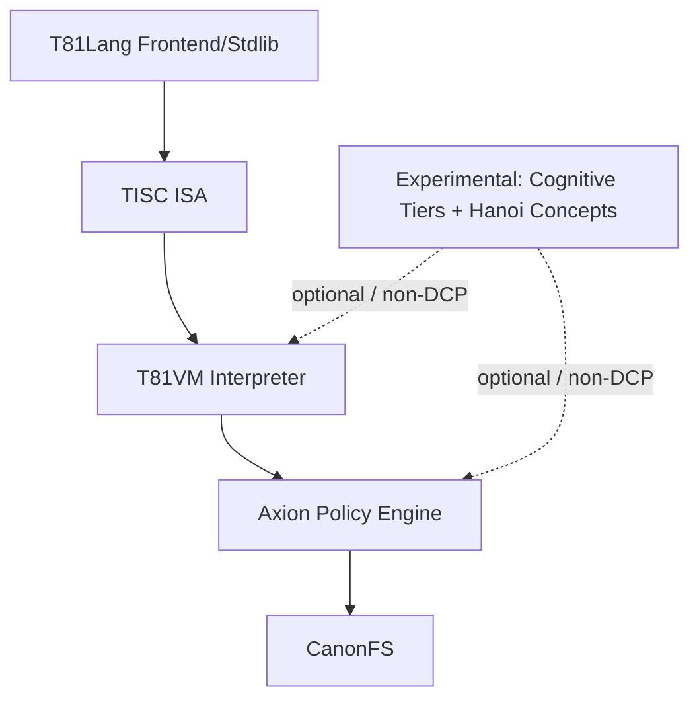
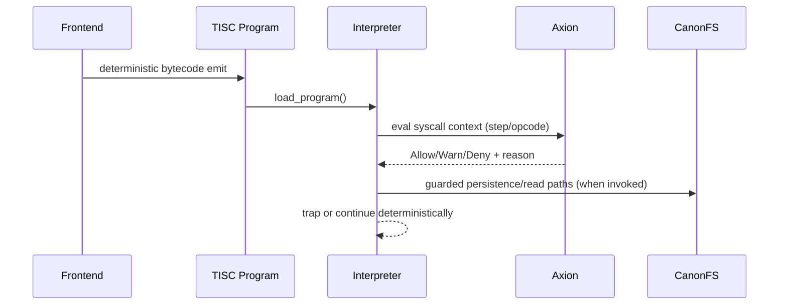

# T81 Architecture Overview

Status: Active  
Last Verified (UTC): 2026-02-26  
Maturity: Mixed (`Frozen` core, `Experimental` periphery)

> **Architecture File Style Guide**
> - Terminology mapping: "TISC ISA" -> `core/isa/`; "VM Interpreter" -> `vm/vm.cpp`; "Axion Governance Engine" -> `kernel/axion/`; "CanonFS" -> `fs/` + `include/t81/canonfs/`; "Experimental tiers" -> `experimental/`.
> - Link style: repo-relative markdown links to concrete files only.
> - Diagram conventions: GitHub-renderable Mermaid only.
> - Maturity labels: `Frozen`, `Stable`, `Experimental`, `Stubbed`.
> - Authority: `/spec` > `docs/architecture/OVERVIEW.md` > `/docs` > `/book`.

## Purpose

T81 is a ternary operating system for AI. This document is the canonical architecture snapshot of its implemented components, layer boundaries, and bounded determinism claim scope.

## Layer Cake

Diagram source: [`diagrams/overview-layer-cake.mmd`](./diagrams/overview-layer-cake.mmd)

## Current State by Layer

| Layer | Primary code | Primary spec | Maturity | Notes |
| :--- | :--- | :--- | :--- | :--- |
| Data types | `core/types/` | [`spec/t81-data-types.md`](../../spec/t81-data-types.md) | Frozen | Deterministic-core surface. |
| TISC ISA | `core/isa/` + VM decode/dispatch | [`spec/tisc-spec.md`](../../spec/tisc-spec.md) | Frozen | Opcode semantics/freeze governed. |
| VM interpreter | `core/vm/` | [`spec/t81vm-spec.md`](../../spec/t81vm-spec.md) | Stable | DCP includes interpreter path, not JIT. |
| Axion governance | `kernel/axion/` | [`spec/axion-kernel.md`](../../spec/axion-kernel.md) | Stable (bounded) | Policy verdicts integrated in VM step path. |
| CanonFS | `src/canonfs/` + `include/t81/canonfs/` | [`spec/supplemental/canonfs-spec.md`](../../spec/supplemental/canonfs-spec.md) | Stable (bounded) | Integrity controls implemented; claims remain bounded. |
| Experimental tiers/kernel concepts | `experimental/` | [`spec/cognitive-tiers.md`](../../spec/cognitive-tiers.md), [`spec/supplemental/hanoi-kernel-spec.md`](../../spec/supplemental/hanoi-kernel-spec.md) | Experimental / Stubbed | Not part of DCP guarantees. |

## Binary Host Execution Boundary

T81 is a **ternary semantic architecture executed on binary hardware**. This is an intentional design choice, not a compromise. The platform implements native ternary semantics through a binary substrate compatibility layer:

- **2-Bit Packed Trits**: Trits are packed using 2 bits per trit (0=N, 1=Z, 2=P), allowing 4 trits per byte, naturally aligning with binary storage.
- **SWAR Vectorization**: Operations on these packed trits use SIMD Within A Register (SWAR) techniques, delivering extreme performance on modern x86 and ARM processors without sacrificing ternary correctness.

## Key Invariants

1. Determinism claims are bounded to verified surfaces in [`DETERMINISTIC_CORE_PROFILE.md`](../product/DETERMINISTIC_CORE_PROFILE.md) and [`DETERMINISM_SURFACE_REGISTRY.md`](../governance/DETERMINISM_SURFACE_REGISTRY.md).
2. VM execution is policy-aware: interpreter dispatch and trace paths call Axion verdict evaluation before protected effects.
3. Fault behavior is explicit trap semantics, not undefined behavior (`include/t81/vm/traps.hpp` + VM dispatch checks).
4. Dependency boundaries are governed by [`DEPENDENCY_FIREWALL.md`](./DEPENDENCY_FIREWALL.md).

## Execution Summary

Diagram source: [`diagrams/governance-axion-sequence.mmd`](./diagrams/governance-axion-sequence.mmd)

## Indeterminate

- Full JIT/interpreter semantic equivalence status is not asserted here.
- Universal cross-platform bit-identity for all floating-point transcendental behavior is not asserted here.

## Evidence

- [`vm/vm.cpp`](../../vm/vm.cpp)
- [`include/t81/vm/vm.hpp`](../../include/t81/vm/vm.hpp)
- [`include/t81/vm/state.hpp`](../../include/t81/vm/state.hpp)
- [`kernel/axion/policy_engine.cpp`](../../kernel/axion/policy_engine.cpp)
- [`fs/persistent_driver.cpp`](../../fs/persistent_driver.cpp)
- [`docs/product/DETERMINISTIC_CORE_PROFILE.md`](../product/DETERMINISTIC_CORE_PROFILE.md)
- [`docs/governance/DETERMINISM_SURFACE_REGISTRY.md`](../governance/DETERMINISM_SURFACE_REGISTRY.md)
- [`docs/status/IMPLEMENTATION_MATRIX.md`](../status/IMPLEMENTATION_MATRIX.md)

## Acceptance Criteria

- Every non-trivial claim maps to at least one item in **Evidence**.
- Implemented vs experimental surfaces are explicitly separated.
- Diagrams render in GitHub Markdown (Mermaid).
- Determinism statements are bounded to DCP/registry language.
