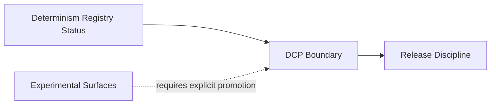

# Cross-Cutting: Capability Boundaries (DCP vs Non-DCP)

<!-- T81-TOC:BEGIN -->

## Table of Contents

- [Cross-Cutting: Capability Boundaries (DCP vs Non-DCP)](#cross-cutting-capability-boundaries-dcp-vs-non-dcp)
  - [Purpose](#purpose)
  - [Boundary Matrix](#boundary-matrix)
  - [Capability Graph](#capability-graph)
  - [CanonFS Capability Notes](#canonfs-capability-notes)
  - [Indeterminate](#indeterminate)
  - [Evidence](#evidence)

<!-- T81-TOC:END -->

Status: Active  
Last Verified (UTC): 2026-02-26

> **Architecture File Style Guide**
> - Terminology mapping: "DCP boundary" -> `docs/product/DETERMINISTIC_CORE_PROFILE.md`; "determinism status" -> `docs/governance/DETERMINISM_SURFACE_REGISTRY.md`; "CanonFS capability bits" -> `include/t81/canonfs/canon_types.hpp`.
> - Link style: repo-relative markdown links to concrete files only.
> - Diagram conventions: GitHub-renderable Mermaid only.
> - Maturity labels: `Frozen`, `Stable`, `Experimental`, `Stubbed`.

## Purpose

Summarize product/governance capability boundaries so architectural claims stay within verified surfaces.

## Boundary Matrix

| Surface | Boundary class | Claim level |
| :--- | :--- | :--- |
| Core types + ISA + VM interpreter | DCP-included | Verified/Freeze-governed deterministic claims |
| Canonical serialization and CI determinism gates | DCP-included | Verified/bounded by registry status |
| Trace-JIT, experimental tiers, hanoi, distributed | Non-DCP default | Experimental/reserved; no production deterministic guarantee |
| Broader runtime/perf/network timing | Out of determinism scope | Explicitly non-guaranteed |

## Capability Graph

Diagram source: [`../diagrams/capability-boundaries.mmd`](../diagrams/capability-boundaries.mmd)

## CanonFS Capability Notes

- CanonFS capability permissions are explicit bitmasks (`READ`, `WRITE`, etc.) in canonical types.
- Hook-driven deny paths can reject operations deterministically.
- These controls do not automatically imply full-system sandbox guarantees beyond documented boundaries.

## Indeterminate

- This document does not establish new promotion criteria beyond current governance docs.
- It does not classify every future extension path.

## Evidence

- [`docs/product/DETERMINISTIC_CORE_PROFILE.md`](../../product/DETERMINISTIC_CORE_PROFILE.md)
- [`docs/governance/DETERMINISM_SURFACE_REGISTRY.md`](../../governance/DETERMINISM_SURFACE_REGISTRY.md)
- [`docs/product/RELEASE_DISCIPLINE.md`](../../product/RELEASE_DISCIPLINE.md)
- [`include/t81/canonfs/canon_types.hpp`](../../../include/t81/canonfs/canon_types.hpp)
