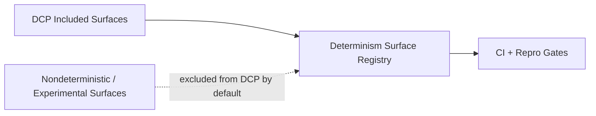

# Cross-Cutting: Determinism Boundaries and Gates

<!-- T81-TOC:BEGIN -->

## Table of Contents

- [Cross-Cutting: Determinism Boundaries and Gates](#cross-cutting-determinism-boundaries-and-gates)
  - [Purpose](#purpose)
  - [Boundary Model](#boundary-model)
  - [Verified/Bounded Surfaces](#verifiedbounded-surfaces)
  - [Determinism Gates](#determinism-gates)
  - [Non-DCP / Non-Guaranteed Areas](#non-dcp--non-guaranteed-areas)
  - [Indeterminate](#indeterminate)
  - [Evidence](#evidence)

<!-- T81-TOC:END -->

Status: Active  
Last Verified (UTC): 2026-02-26

> **Architecture File Style Guide**
> - Terminology mapping: "DCP" -> `docs/product/DETERMINISTIC_CORE_PROFILE.md`; "Registry" -> `docs/governance/DETERMINISM_SURFACE_REGISTRY.md`; "Repro ledger" -> `.github/workflows/repro-ledger.yml`.
> - Link style: repo-relative markdown links to concrete files only.
> - Diagram conventions: GitHub-renderable Mermaid only.
> - Maturity labels: `Frozen`, `Stable`, `Experimental`, `Stubbed`.

## Purpose

Define determinism claim boundaries, verification gates, and explicit non-DCP surfaces.

## Boundary Model

Diagram source: [`../diagrams/determinism-boundary.mmd`](../diagrams/determinism-boundary.mmd)

## Verified/Bounded Surfaces

- Verified core examples: TISC semantics, VM interpreter dispatch, canonical encoding, soft-float deterministic math.
- Partial surface example: compiler bytecode emission fixtures.
- Excluded by default: trace JIT equivalence, experimental tiers/distributed/hanoi.

## Determinism Gates

- CI checks in [`ci.yml`](../../../.github/workflows/ci.yml) and [`repro-ledger.yml`](../../../.github/workflows/repro-ledger.yml)
- Repro scripts:
  - [`scripts/ci/run_determinism_slice.sh`](../../../scripts/ci/run_determinism_slice.sh)
  - [`scripts/ci/t81lang_repro_gate.py`](../../../scripts/ci/t81lang_repro_gate.py)
  - [`scripts/ci/t3k_repro_gate.py`](../../../scripts/ci/t3k_repro_gate.py)
  - [`scripts/ci/check_tisc_freeze_integrity.py`](../../../scripts/ci/check_tisc_freeze_integrity.py)

## Non-DCP / Non-Guaranteed Areas

- Runtime performance/timing determinism
- Network ordering/latency determinism
- Full JIT equivalence (until promoted/verified)
- Experimental cognitive/hanoi/distributed surfaces

## Indeterminate

- This doc does not assert formal proof for every transitive dependency in the determinism chain.
- It does not redefine registry statuses; it summarizes current documented boundaries.

## Evidence

- [`docs/product/DETERMINISTIC_CORE_PROFILE.md`](../../product/DETERMINISTIC_CORE_PROFILE.md)
- [`docs/governance/DETERMINISM_SURFACE_REGISTRY.md`](../../governance/DETERMINISM_SURFACE_REGISTRY.md)
- [`docs/governance/DETERMINISM_THREAT_MODEL.md`](../../governance/DETERMINISM_THREAT_MODEL.md)
- [`.github/workflows/repro-ledger.yml`](../../../.github/workflows/repro-ledger.yml)
- [`.github/workflows/ci.yml`](../../../.github/workflows/ci.yml)
