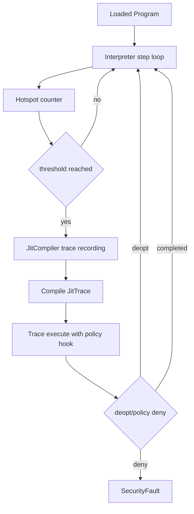

# Cross-Cutting: Execution Model

Status: Active  
Last Verified (UTC): 2026-02-26

> **Architecture File Style Guide**
> - Terminology mapping: "Interpreter" -> `vm/vm.cpp`; "Trace JIT" -> `runtime/jit/jit_compiler.cpp`; "Trace object" -> `include/t81/jit/jit.hpp`.
> - Link style: repo-relative markdown links to concrete files only.
> - Diagram conventions: GitHub-renderable Mermaid only.
> - Maturity labels: `Frozen`, `Stable`, `Experimental`, `Stubbed`.

## Purpose

Define the runtime execution pathways and their current maturity/guarantee boundaries.

## Execution Pathways

Diagram source: [`../diagrams/execution-model-flow.mmd`](../diagrams/execution-model-flow.mmd)

## Current Maturity

- Interpreter path: `Stable`, DCP-covered.
- Trace/JIT path: `Experimental`, non-DCP until equivalence promotion.
- Future native ternary execution profile: planned in spec/governance references, not current default runtime profile.

## Key Invariants

1. Interpreter and trace execution still pass through policy checks via hooks/callbacks.
2. Deopt transitions are explicit and deterministic in control flow.
3. Security denials terminate path via deterministic trap behavior.

## Indeterminate

- No claim here of full proof-level equivalence between interpreter and all JIT traces.
- This document does not establish performance guarantees.

## Evidence

- [`vm/vm.cpp`](../../../vm/vm.cpp)
- [`include/t81/jit/jit.hpp`](../../../include/t81/jit/jit.hpp)
- [`runtime/jit/jit_compiler.cpp`](../../../runtime/jit/jit_compiler.cpp)
- [`runtime/jit/README.md`](../../../runtime/jit/README.md)
- [`docs/product/DETERMINISTIC_CORE_PROFILE.md`](../../product/DETERMINISTIC_CORE_PROFILE.md)
- [`docs/governance/DETERMINISM_SURFACE_REGISTRY.md`](../../governance/DETERMINISM_SURFACE_REGISTRY.md)
