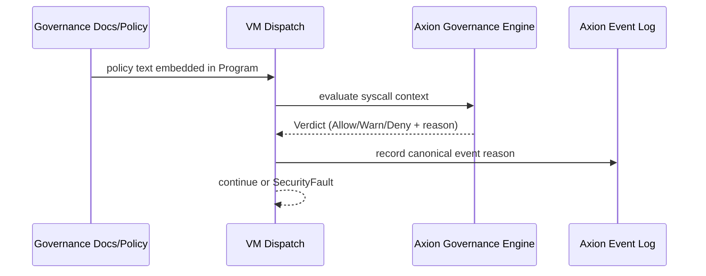

# Cross-Cutting: Governance and Axion Enforcement

Status: Active  
Last Verified (UTC): 2026-02-26

> **Architecture File Style Guide**
> - Terminology mapping: "Governance policy" -> `docs/governance/*`; "Axion policy engine" -> `kernel/axion/policy_engine.cpp`; "VM enforcement points" -> `core/vm/vm.cpp`.
> - Link style: repo-relative markdown links to concrete files only.
> - Diagram conventions: GitHub-renderable Mermaid only.
> - Maturity labels: `Frozen`, `Stable`, `Experimental`, `Stubbed`.

## Purpose

Describe how governance policy is translated into runtime enforcement and auditable verdict traces.

## Enforcement Path

Diagram source: [`../diagrams/governance-axion-sequence.mmd`](../diagrams/governance-axion-sequence.mmd)

## Enforcement Points

- Pre-dispatch instruction checks (`kStep`)
- Privileged/meta operation checks (`AxRead/AxSet/AxVerify`, meta events)
- JIT trace enter/exit/deopt checks
- CanonFS hook integration for read/write/publish/revoke paths

## Auditability Mechanisms

- Canonical `Verdict.reason` strings in VM/Axion event logs
- Governance CI checks for overclaim, freeze integrity, structure, and policy hygiene
- Repro ledger artifacts that capture trace/test outputs

## Indeterminate

- This document does not claim full formal verification of all policy decision trees.
- It does not claim complete semantic coverage for every future privileged opcode addition.

## Evidence

- [`kernel/axion/policy_engine.cpp`](../../../kernel/axion/policy_engine.cpp)
- [`kernel/axion/engine.cpp`](../../../kernel/axion/engine.cpp)
- [`core/vm/vm.cpp`](../../../core/vm/vm.cpp)
- [`kernel/axion/canonfs_hook.cpp`](../../../kernel/axion/canonfs_hook.cpp)
- [`docs/governance/`](../../governance)
- [`.github/workflows/ci.yml`](../../../.github/workflows/ci.yml)
- [`.github/workflows/repro-ledger.yml`](../../../.github/workflows/repro-ledger.yml)
