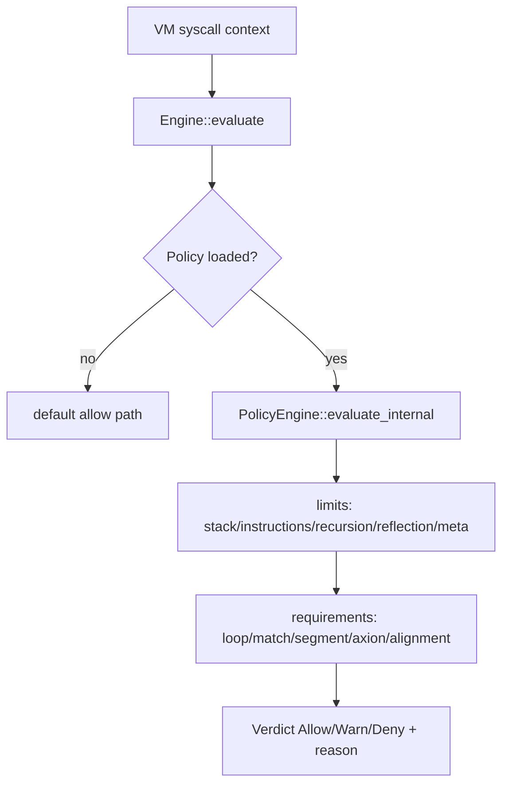

# Axion Layer (Governance Engine)

Status: Active  
Last Verified (UTC): 2026-02-26  
Maturity: `Stable` (bounded policy-governance surface)

> **Architecture File Style Guide**
> - Terminology mapping: "Axion Governance Engine" -> `kernel/axion/*.cpp`; "Policy model" -> `include/t81/axion/policy.hpp`; "Policy evaluation" -> `include/t81/axion/policy_engine.hpp`.
> - Link style: repo-relative markdown links to concrete files only.
> - Diagram conventions: GitHub-renderable Mermaid only.
> - Maturity labels: `Frozen`, `Stable`, `Experimental`, `Stubbed`.

## Purpose and Responsibilities

Provide deterministic allow/deny/warn governance decisions for VM syscall contexts and policy constraints (resource ceilings, loop/match/segment requirements, tensor hash allow-lists).

## Principal Data Structures and Interfaces

- `Engine` interface (`evaluate(SyscallContext) -> Verdict`)  
  [`include/t81/axion/engine.hpp`](../../../include/t81/axion/engine.hpp)
- `Policy` structure and parser/bytecode fields  
  [`include/t81/axion/policy.hpp`](../../../include/t81/axion/policy.hpp)
- `PolicyEngine` implementation  
  [`include/t81/axion/policy_engine.hpp`](../../../include/t81/axion/policy_engine.hpp), [`kernel/axion/policy_engine.cpp`](../../../kernel/axion/policy_engine.cpp)
- VM integration callsites  
  [`vm/vm.cpp`](../../../vm/vm.cpp)

## Internal Flow

Diagram source: [`../diagrams/axion-enforcement-flow.mmd`](../diagrams/axion-enforcement-flow.mmd)

## Key Invariants / Guarantees

1. Verdicts are deterministic for equal `SyscallContext` + policy.
2. Policy-deny conditions must produce canonical reason strings (consumed by VM trace/Axion logs).
3. Governance checks are integrated into VM instruction paths before protected effects.
4. Missing policy does not imply full sandbox guarantees; behavior remains bounded by configured engines and callsites.

## Principal Failure Modes and Handling

| Failure mode | Trigger surface | Handling |
| :--- | :--- | :--- |
| Policy parse failure | `parse_policy(...)` fails | VM may install deny-with-reason engine and trap guarded operations |
| Policy violation | limit/requirement not met | `VerdictKind::Deny` with canonical reason; VM returns `SecurityFault` |
| Unknown Axion bytecode op | policy bytecode decode path | deny with `"Unknown Axion opcode"` |
| Missing required trace evidence | loop/match/segment/alignment requirement unsatisfied | deterministic deny |

## Indeterminate

- This document does not assert formal proof of total policy completeness for all future opcode additions.
- It does not assert governance semantics for experimental tiers beyond current callsites.

## Evidence

- [`include/t81/axion/engine.hpp`](../../../include/t81/axion/engine.hpp)
- [`include/t81/axion/policy.hpp`](../../../include/t81/axion/policy.hpp)
- [`include/t81/axion/policy_engine.hpp`](../../../include/t81/axion/policy_engine.hpp)
- [`kernel/axion/policy_engine.cpp`](../../../kernel/axion/policy_engine.cpp)
- [`kernel/axion/engine.cpp`](../../../kernel/axion/engine.cpp)
- [`vm/vm.cpp`](../../../vm/vm.cpp)
- [`spec/axion-kernel.md`](../../../spec/axion-kernel.md)
