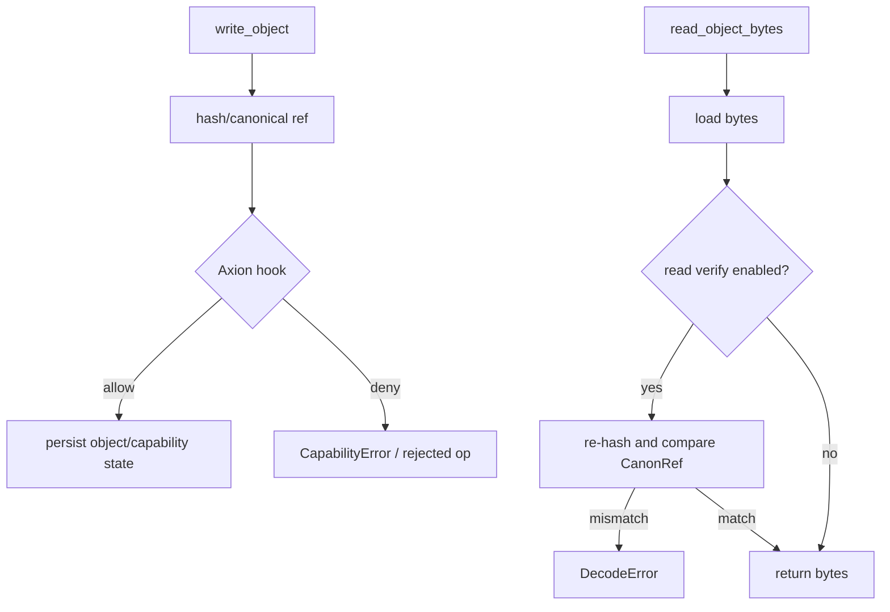

# CanonFS Layer

<!-- T81-TOC:BEGIN -->

## Table of Contents

- [CanonFS Layer](#canonfs-layer)
  - [Purpose and Responsibilities](#purpose-and-responsibilities)
  - [Principal Data Structures and Interfaces](#principal-data-structures-and-interfaces)
  - [Data Flow](#data-flow)
  - [Key Invariants / Guarantees](#key-invariants--guarantees)
  - [Principal Failure Modes and Handling](#principal-failure-modes-and-handling)
  - [Indeterminate](#indeterminate)
  - [Evidence](#evidence)

<!-- T81-TOC:END -->

Status: Active  
Last Verified (UTC): 2026-02-26  
Maturity: `Stable` (bounded persistence/integrity surface)

> **Architecture File Style Guide**
> - Terminology mapping: "CanonFS Driver" -> `src/canonfs/*`; "Canon types" -> `include/t81/canonfs/canon_types.hpp`; "Axion hook" -> `include/t81/canonfs/axion_hook.hpp`.
> - Link style: repo-relative markdown links to concrete files only.
> - Diagram conventions: GitHub-renderable Mermaid only.
> - Maturity labels: `Frozen`, `Stable`, `Experimental`, `Stubbed`.

## Purpose and Responsibilities

Provide content-addressed object storage with deterministic write/read behavior, capability publication/revocation, parity repair APIs, and optional Axion verdict hooks around filesystem operations.

## Principal Data Structures and Interfaces

- `Driver` abstract interface (`write/read/publish/revoke/repair`)  
  [`include/t81/canonfs/canon_driver.hpp`](../../../include/t81/canonfs/canon_driver.hpp)
- Canon object and reference types (`CanonRef`, `ObjectType`, capability structs)  
  [`include/t81/canonfs/canon_types.hpp`](../../../include/t81/canonfs/canon_types.hpp)
- Axion policy hook helpers  
  [`include/t81/canonfs/axion_hook.hpp`](../../../include/t81/canonfs/axion_hook.hpp), [`kernel/axion/canonfs_hook.cpp`](../../../kernel/axion/canonfs_hook.cpp)
- Drivers: in-memory and persistent  
  [`src/canonfs/in_memory_driver.cpp`](../../../src/canonfs/in_memory_driver.cpp), [`src/canonfs/persistent_driver.cpp`](../../../src/canonfs/persistent_driver.cpp)

## Data Flow

Diagram source: [`../diagrams/canonfs-dataflow.mmd`](../diagrams/canonfs-dataflow.mmd)

## Key Invariants / Guarantees

1. Object identity is content-addressed by canonical hash reference.
2. Read-path verification is enabled by default (diagnostic override via environment switch).
3. Driver APIs return explicit deterministic error enums (`Error`), not implicit failure states.
4. Axion hook evaluation can gate mutation/read operations when configured.

## Principal Failure Modes and Handling

| Failure mode | Trigger surface | Handling |
| :--- | :--- | :--- |
| `NotFound` | missing object/capability | explicit `Result<..., Error>` failure |
| `CapabilityError` | denied capability or hook decision | operation rejected deterministically |
| `DecodeError` | read-hash mismatch or decode failure | deterministic read failure |
| `ParityFailure` | repair path cannot restore expected data | explicit repair failure |
| `InvalidObject` | malformed object metadata/type | deterministic API error |

## Indeterminate

- This document does not assert full formal verification of all parity-repair recovery paths.
- It does not classify every CanonFS extension object type as DCP/non-DCP.

## Evidence

- [`include/t81/canonfs/canon_driver.hpp`](../../../include/t81/canonfs/canon_driver.hpp)
- [`include/t81/canonfs/canon_types.hpp`](../../../include/t81/canonfs/canon_types.hpp)
- [`include/t81/canonfs/axion_hook.hpp`](../../../include/t81/canonfs/axion_hook.hpp)
- [`src/canonfs/in_memory_driver.cpp`](../../../src/canonfs/in_memory_driver.cpp)
- [`src/canonfs/persistent_driver.cpp`](../../../src/canonfs/persistent_driver.cpp)
- [`kernel/axion/canonfs_hook.cpp`](../../../kernel/axion/canonfs_hook.cpp)
- [`spec/supplemental/canonfs-spec.md`](../../../spec/supplemental/canonfs-spec.md)
