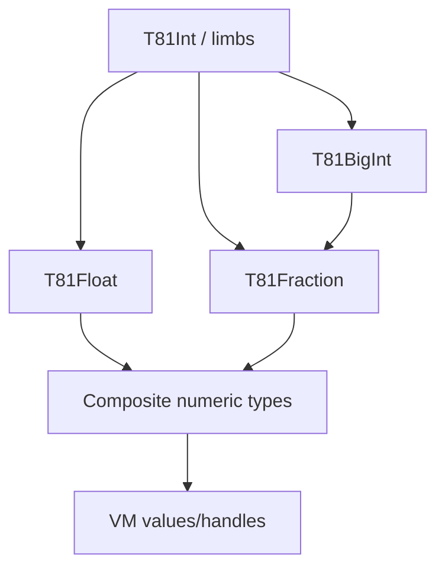

# Data Types Layer

<!-- T81-TOC:BEGIN -->

## Table of Contents

- [Data Types Layer](#data-types-layer)
  - [Purpose and Responsibilities](#purpose-and-responsibilities)
  - [Principal Data Structures and Interfaces](#principal-data-structures-and-interfaces)
  - [Internal Dependency Sketch](#internal-dependency-sketch)
  - [Key Invariants / Guarantees](#key-invariants--guarantees)
  - [Principal Failure Modes and Handling](#principal-failure-modes-and-handling)
  - [Indeterminate](#indeterminate)
  - [Evidence](#evidence)

<!-- T81-TOC:END -->

Status: Active  
Last Verified (UTC): 2026-02-26  
Maturity: `Frozen` (core canonical numerics), `Stable` (broader type library)

> **Architecture File Style Guide**
> - Terminology mapping: "Core data types" -> `core/types/` + `include/t81/types/`; "BigInt/Fraction/Float" -> `T81BigInt.hpp` / `T81Fraction.hpp` / `T81Float.hpp`.
> - Link style: repo-relative markdown links to concrete files only.
> - Diagram conventions: GitHub-renderable Mermaid only.
> - Maturity labels: `Frozen`, `Stable`, `Experimental`, `Stubbed`.

## Purpose and Responsibilities

Provide canonical ternary-native numeric/value representations used across ISA, VM, and language surfaces, with deterministic semantics for verified core paths.

## Principal Data Structures and Interfaces

- Core implementation module  
  [`core/types/README.md`](../../../core/types/README.md)
- Public type surface  
  [`include/t81/types/README.md`](../../../include/t81/types/README.md)
- Canonical numeric anchors  
  [`include/t81/types/T81BigInt.hpp`](../../../include/t81/types/T81BigInt.hpp), [`include/t81/types/T81Fraction.hpp`](../../../include/t81/types/T81Fraction.hpp), [`include/t81/types/T81Float.hpp`](../../../include/t81/types/T81Float.hpp)

## Internal Dependency Sketch

Diagram source: [`../diagrams/data-types-stack.mmd`](../diagrams/data-types-stack.mmd)

## Key Invariants / Guarantees

1. Canonical encoding/normalization rules are spec-governed for DCP-covered numeric surfaces.
2. Arithmetic errors map to explicit deterministic behaviors (trap/error representation), not undefined behavior.
3. Public stable headers are under `include/t81/**` governance boundary.
4. Determinism claims are bounded to verified core type surfaces, not every high-level type in the broad catalog.

## Principal Failure Modes and Handling

| Failure mode | Trigger surface | Handling |
| :--- | :--- | :--- |
| Non-canonical representation risk | malformed intermediate state | normalize/canonicalize routines in type implementations |
| Division by zero / invalid arithmetic | numeric operations | deterministic error/trap handling at VM/API boundary |
| Host-math variation (bounded) | float transcendental/division exceptions | explicitly scoped in determinism docs/profile |

## Indeterminate

- This layer doc does not classify every catalog type as DCP/non-DCP; it focuses on core deterministic contracts.
- It does not claim universal bit-identity for all host-math pathways.

## Evidence

- [`core/types/README.md`](../../../core/types/README.md)
- [`include/t81/types/README.md`](../../../include/t81/types/README.md)
- [`include/t81/types/T81BigInt.hpp`](../../../include/t81/types/T81BigInt.hpp)
- [`include/t81/types/T81Fraction.hpp`](../../../include/t81/types/T81Fraction.hpp)
- [`include/t81/types/T81Float.hpp`](../../../include/t81/types/T81Float.hpp)
- [`spec/t81-data-types.md`](../../../spec/t81-data-types.md)
- [`docs/product/DETERMINISTIC_CORE_PROFILE.md`](../../product/DETERMINISTIC_CORE_PROFILE.md)
- [`docs/governance/DETERMINISM_SURFACE_REGISTRY.md`](../../governance/DETERMINISM_SURFACE_REGISTRY.md)
