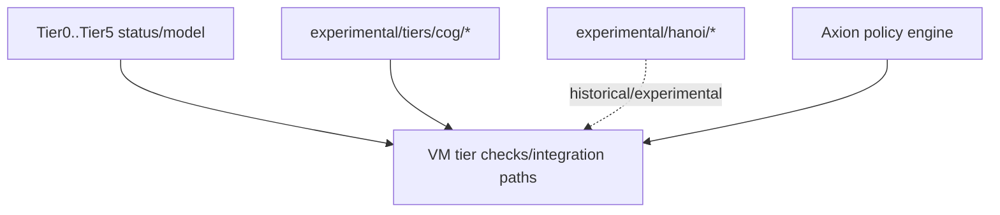

# Experimental Tiers and Hanoi Concepts Layer

Status: Active  
Last Verified (UTC): 2026-02-26  
Maturity: `Experimental` / `Stubbed`

> **Architecture File Style Guide**
> - Terminology mapping: "Cognitive tiers" -> `experimental/tiers/` + `include/t81/experimental/cog/`; "Hanoi concepts" -> `experimental/hanoi/`.
> - Link style: repo-relative markdown links to concrete files only.
> - Diagram conventions: GitHub-renderable Mermaid only.
> - Maturity labels: `Frozen`, `Stable`, `Experimental`, `Stubbed`.

## Purpose and Responsibilities

Provide non-DCP experimentation surfaces for cognitive-tier behavior and historical Hanoi kernel concept implementations without changing frozen core contracts.

## Principal Data Structures and Interfaces

- Tier identifiers/status  
  [`include/t81/experimental/cog/tier.hpp`](../../../include/t81/experimental/cog/tier.hpp)
- Tier implementation modules  
  [`experimental/tiers/`](../../../experimental/tiers)
- Hanoi experimental modules  
  [`experimental/hanoi/`](../../../experimental/hanoi), [`include/t81/experimental/hanoi/`](../../../include/t81/experimental/hanoi)

## Structural View

Diagram source: [`../diagrams/experimental-tiers-structure.mmd`](../diagrams/experimental-tiers-structure.mmd)

## Key Invariants / Guarantees

1. These surfaces are not part of DCP by default.
2. Core/frozen semantics must remain unaffected by experimental-tier evolution.
3. Promotions/enforcement interactions occur through explicit VM/Axion integration points.
4. Historical Hanoi spec/docs are archived/non-normative for current core behavior.

## Principal Failure Modes and Handling

| Failure mode | Trigger surface | Handling |
| :--- | :--- | :--- |
| Tier policy violation | tier limit exceeded / unauthorized promotion | deterministic `TierFault` / policy deny in VM |
| Experimental semantic drift | partial/stub implementation differences | bounded as non-DCP; requires governance promotion before stronger claims |
| Overclaim risk | treating experimental as production guarantee | bounded by DCP + determinism registry policy docs |

## Indeterminate

- This doc does not claim full functional completeness of tier/hanoi behavior.
- It does not assert production readiness for these experimental modules.

## Evidence

- [`experimental/tiers/README.md`](../../../experimental/tiers/README.md)
- [`experimental/hanoi/README.md`](../../../experimental/hanoi/README.md)
- [`include/t81/experimental/cog/tier.hpp`](../../../include/t81/experimental/cog/tier.hpp)
- [`core/vm/vm.cpp`](../../../core/vm/vm.cpp)
- [`spec/cognitive-tiers.md`](../../../spec/cognitive-tiers.md)
- [`spec/supplemental/hanoi-kernel-spec.md`](../../../spec/supplemental/hanoi-kernel-spec.md)
- [`docs/product/DETERMINISTIC_CORE_PROFILE.md`](../../product/DETERMINISTIC_CORE_PROFILE.md)
