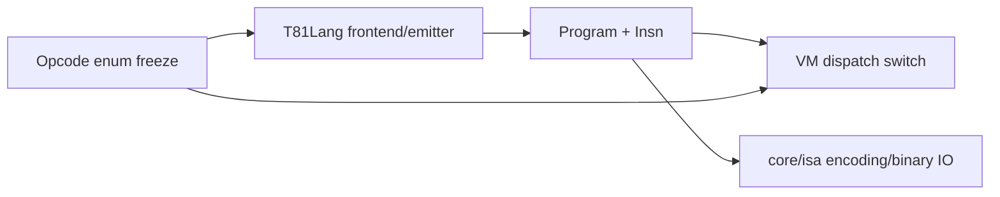

# TISC ISA Layer

<!-- T81-TOC:BEGIN -->

## Table of Contents

- [TISC ISA Layer](#tisc-isa-layer)
  - [Purpose and Responsibilities](#purpose-and-responsibilities)
  - [Principal Data Structures and Interfaces](#principal-data-structures-and-interfaces)
  - [Structural View](#structural-view)
  - [Key Invariants / Guarantees](#key-invariants--guarantees)
  - [Principal Failure Modes and Handling](#principal-failure-modes-and-handling)
  - [Indeterminate](#indeterminate)
  - [Evidence](#evidence)

<!-- T81-TOC:END -->

Status: Active  
Last Verified (UTC): 2026-02-26  
Maturity: `Frozen`

> **Architecture File Style Guide**
> - Terminology mapping: "Opcode set" -> `include/t81/isa/opcodes.hpp`; "Program format" -> `include/t81/isa/program.hpp`; "ISA runtime enforcement" -> `core/vm/vm.cpp`.
> - Link style: repo-relative markdown links to concrete files only.
> - Diagram conventions: GitHub-renderable Mermaid only.
> - Maturity labels: `Frozen`, `Stable`, `Experimental`, `Stubbed`.

## Purpose and Responsibilities

Define portable instruction semantics, opcode identity, and program-level operand encoding contract used by compiler output and VM execution.

## Principal Data Structures and Interfaces

- Opcode enum and names  
  [`include/t81/isa/opcodes.hpp`](../../../include/t81/isa/opcodes.hpp)
- Program and instruction representation (`Program`, `Insn`, literal kinds)  
  [`include/t81/isa/program.hpp`](../../../include/t81/isa/program.hpp)
- Binary emitter/encoding/IO implementations  
  [`core/isa/`](../../../core/isa)

## Structural View

Diagram source: [`../diagrams/tisc-isa-structure.mmd`](../diagrams/tisc-isa-structure.mmd)

## Key Invariants / Guarantees

1. Opcode identifiers and established semantics are freeze-governed.
2. Program decode/encoding surfaces must remain deterministic and reproducible.
3. Undefined/invalid instruction combinations map to deterministic traps rather than undefined behavior.
4. Architectural register window semantics (`R0..R80`) remain stable per spec/governance boundaries.

## Principal Failure Modes and Handling

| Failure mode | Trigger surface | Handling |
| :--- | :--- | :--- |
| Decode fault | invalid operand/register/immediate usage | VM returns `Trap::DecodeFault` |
| Security fault | privileged/guarded opcode denied by policy | VM returns `Trap::SecurityFault` |
| Freeze breach risk | opcode renumber/semantic drift | governance + CI freeze integrity checks |

## Indeterminate

- This document does not assert that every reserved/extended opcode family is fully implemented.
- Native ternary instruction-word profile transition is planned and not asserted as current default runtime profile.

## Evidence

- [`include/t81/isa/opcodes.hpp`](../../../include/t81/isa/opcodes.hpp)
- [`include/t81/isa/program.hpp`](../../../include/t81/isa/program.hpp)
- [`core/isa/README.md`](../../../core/isa/README.md)
- [`core/vm/vm.cpp`](../../../core/vm/vm.cpp)
- [`spec/tisc-spec.md`](../../../spec/tisc-spec.md)
- [`docs/governance/FREEZE_ENFORCEMENT.md`](../../governance/FREEZE_ENFORCEMENT.md)
