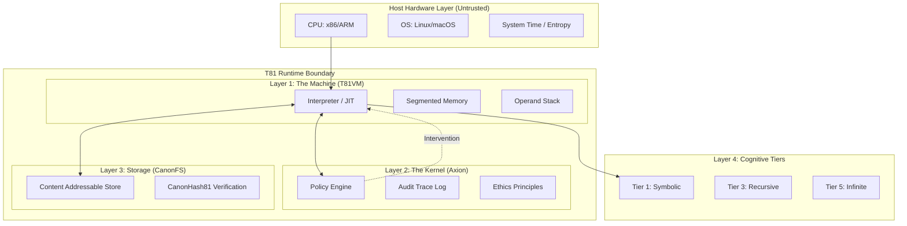

# 第 1 章：简介

<!-- T81-TOC:BEGIN -->

## Table of Contents

- [第 1 章：简介](#第-1-章：简介)
  - [1.1 范围与定义](#11-范围与定义)
    - [1.1.1 核心不变量](#111-核心不变量)
  - [1.2 系统架构](#12-系统架构)
    - [1.2.1 TISC 虚拟机 (T81VM)](#121-tisc-虚拟机-t81vm)
    - [1.2.2 Axion 安全内核](#122-axion-安全内核)
    - [1.2.3 规范文件系统 (CanonFS)](#123-规范文件系统-canonfs)
    - [1.2.4 认知层](#124-认知层)
  - [1.3 可验证计算使命](#13-可验证计算使命)
    - [1.3.1 去信任 AI 推理](#131-去信任-ai-推理)
    - [1.3.2 智能合约与共识](#132-智能合约与共识)
    - [1.3.3 科学可重复性](#133-科学可重复性)
  - [1.4 术语表](#14-术语表)
  - [1.5 验证清单](#15-验证清单)
  - [作者关于下一版本的说明](#作者关于下一版本的说明)

<!-- T81-TOC:END -->

## 1.1 范围与定义

**状态：已实现并测试**

**T81 Foundation** 项目实现了一个具备确定性的、原生三进制的虚拟机架构，专为可验证计算而设计。与优先考虑吞吐量、硬件抽象或开发者便利性的通用执行环境不同，T81 优先考虑**位精确的可重现性**、**可审计性**和**结构诚实性**。

该系统形式化定义为元组 $\mathfrak{S} = (\mathcal{M}, \mathcal{A}, \mathcal{C}, \Phi)$，其中：
- $\mathcal{M}$ 是 **TISC 虚拟机**，一个基于平衡三进制逻辑运行的栈式自动机。
- $\mathcal{A}$ 是 **Axion 安全内核**，一个基于能力的监督器，负责强制执行运行时策略。
- $\mathcal{C}$ 是 **规范文件系统 (CanonFS)**，一个内容寻址存储层，确保工件解析的不可变性。
- $\Phi$ 是 **不变量** 集合，对于系统的任何有效转换都必须成立。

T81 的核心公理是：计算是一个确定性函数，通过一系列离散的、定义明确的转换，将初始状态 $S_0$ 和输入 $I$ 映射到最终状态 $S_n$：
$$
\forall \text{hardware } H_1, H_2: \text{Exec}(S_0, I)_{H_1} \equiv \text{Exec}(S_0, I)_{H_2}
$$
此恒等式必须在不同的处理器架构（x86_64, ARM64, RISC-V）、操作系统和时间之间成立。

### 1.1.1 核心不变量

该架构强制执行以下不可协商的不变量：

1.  **严格的确定性**：在任何兼容的主机架构上，对输入 $I$ 执行有效的 TISC（三进制精简指令集计算机）程序 $P$，都会产生完全相同的状态转换序列 $S_0 \to S_1 \to \dots \to S_n$。这排除了使用主机硬件浮点单元 (FPU) 进行任何影响架构状态的操作。
2.  **原生三进制**：该架构基于平衡三进制逻辑（trits $\in \{-1, 0, 1\}$）运行，利用自定义算术栈（`dmath`）来避免二进制浮点数的非确定性，并与基数 3 的信息论最优性保持一致。
3.  **策略强制**：所有执行都由 **Axion 内核** 管理，这是一个基于能力的监督器，在指令退休*前*强制执行安全策略（递归限制、内存边界、伦理约束）。对于每个指令分派，都会评估内核函数 $\alpha: (S, \text{Op}) \to \{\text{Allow, Deny}\}$。
4.  **结构诚实性**：系统不合成信息。如果结果是近似的，它会被标记为近似。如果过程是不终止的，它会被归类为更高的认知层（第 5 层）。系统拒绝“尽力而为”的执行，而倾向于显式失败。

> **验证锚点**：确定性执行循环在 `src/vm/vm.cpp` 中实现（参见 `Interpreter::step()`）。三进制算术原语定义在 `include/t81/ternary.hpp` 和 `include/t81/core/T81Float.hpp` 中。

## 1.2 系统架构

T81 栈由四个主要层组成，每一层都有独特的职责和验证边界。该架构旨在通过将主机硬件视为提供原始周期但不提供语义正确性的对抗实体，来最小化“可信计算基”(TCB)。

### 1.2.1 TISC 虚拟机 (T81VM)

**状态：已实现并测试**

T81VM 是 **三进制精简指令集计算机 (TISC)** ISA 的栈式解释器。它管理着分段内存模型，旨在通过构造防止指针别名和缓冲区溢出。

VM 状态形式化定义为元组 $S = (R, PC, SP, M_{seg}, \Phi)$，其中：
*   $R$：寄存器堆，由 81 个通用寄存器（`r0` 到 `r80`）组成，每个存储一个带类型的 `T81Value`。
*   $PC$：程序计数器，指向代码段中的下一条指令。
*   $SP$：栈指针，指示操作数栈的顶部。
*   $M_{seg}$：内存段（代码、栈、堆、张量、元数据）。
*   $\Phi$：状态标志寄存器，编码最后一次比较或算术运算的结果 ($\{<, =, >\}$)。

内存段包括：
*   **代码 (Code)**：只读指令段。加载后无法修改。
*   **栈 (Stack)**：用于局部变量和返回地址的后进先出存储。
*   **堆 (Heap)**：用于复杂对象（张量、图）的动态分配。由确定性标记-清除垃圾收集器管理。
*   **张量 (Tensor)**：高维数值数据的专用存储，对齐到 64 字节边界以进行 SIMD 优化（在安全的情况下）。
*   **元数据 (Meta)**：反射和自省能力，存储符号表和调试信息。

> **参考**：参见 `src/vm/vm.cpp` 中的 `State` 结构体。

### 1.2.2 Axion 安全内核

**状态：已实现并测试**

Axion 充当 T81VM 的管理程序。它拦截每个指令分派，以验证是否符合当前活动的 **策略 (Policy)**。与操作系统通常在系统调用边界进行安全检查不同，Axion 在*指令*级别强制执行细粒度的能力检查。

策略是声明性的规则集，用于约束：
*   **资源使用**：总内存分配、最大栈深度、指令周期计数。
*   **控制流**：递归深度（第 3 层）、分支复杂度（第 2 层）。
*   **能力 (Capabilities)**：对 I/O、网络、文件系统系统调用的访问，或高层认知功能。

如果指令违反了策略（例如，当策略为 `recursion_limit=0` 时尝试 `Recurse`），Axion 会发出 `Deny` 裁决。这会导致 VM 立即陷入 `SecurityFault`，确保永远不会发生未经授权的状态转换。

> **参考**：策略逻辑在 `src/axion/policy_engine.cpp` 和 `include/t81/axion/api.hpp` 中实现。

### 1.2.3 规范文件系统 (CanonFS)

**状态：部分实现**

CanonFS 是一个内容寻址存储层，保证**结构不可变性**。它拒绝可变文件路径的概念。相反，对象（权重、代码、数据）仅由其 SHA3-256 哈希值 (`CanonHash81`) 标识。

当 VM 请求加载模块或张量模型时，它会提供一个哈希值。CanonFS 定位该 blob，验证其哈希值是否与请求匹配，然后才允许将其加载到内存中。这种机制确保内存中的数据与签名并发布的工件逐位相同，从而消除“依赖漂移”攻击和“在我的机器上可以运行”的差异。

> **参考**：在 `src/canonfs/` 中实现，并定义于 `spec/supplemental/canonfs-spec.md`。目前支持基本的哈希验证和加载。

### 1.2.4 认知层

**状态：已实现 (第 1-5 层)**

T81 将计算复杂度组织成 **认知层 (Cognitive Tiers)**。这种分类法允许系统限制计算的“危险”或“成本”。简单的算术脚本不应具有消耗无限资源或执行无界递归的能力。

*   **第 1 层 (符号)**：基本算术、逻辑和固定边界循环。在 $O(1)$ 或 $O(N)$ 时间内确定。对所有上下文安全。
*   **第 2 层 (反射)**：自检、追踪捕获和动态分派。
*   **第 3 层 (递归)**：有界递归和证明生成。能够表达一般的递归函数，但受栈深度策略的限制。
*   **第 4 层 (分布式)**：基于共识的状态转换、Gossip 协议和跨节点的状态合并。
*   **第 5 层 (无限)**：几何级数、非终止形式和“停机问题”候选项。仅在具有明确 `InfExpand` 特权时允许。

> **参考**：层逻辑位于 `src/cog/`。参见 `src/cog/tier3/recursive.cpp` 和 `src/cog/tier5/infinite.cpp`。

## 1.3 可验证计算使命

T81 的主要应用是 **主权计算**：即执行代码并验证结果，而无需信任硬件操作员的能力。通过将严格的软件定义算术 (`dmath`) 与加密审计日志 (Axion Trace) 相结合，T81 使得在*完整性*至关重要的新型应用成为可能。

### 1.3.1 去信任 AI 推理
在不透明 AI 模型的世界中，T81 允许 **可证明推理**。用户可以在远程节点上运行模型，不仅收到输出，还收到加密证明 (Axion Trace)，证明：
1.  使用了特定的模型（由 `CanonHash81` 标识）。
2.  输入与指定完全一致。
3.  推理过程遵循 T81 算术的确定性规则。

### 1.3.2 智能合约与共识
T81 的确定性本质使其成为智能合约执行的理想基质。与依赖二进制逻辑且经常在浮点确定性方面挣扎的 EVM 或 WASM 不同，T81 原生支持高精度十进制（三进制）数学，消除了金融计算中的舍入误差。

### 1.3.3 科学可重复性
科学中的“可重复性危机”部分是计算稳定性的危机。2024 年在超级计算机上运行的模拟应该在 2050 年的笔记本电脑上产生完全相同的结果。T81 通过抽象主机浮点单元和系统时间来保证这一点，确保模拟是一个不变的数学对象。

## 1.4 术语表

本专著中精确使用了以下术语。

| 术语 | 定义 |
| :--- | :--- |
| **Trit** | 一个三进制位：$\{-1, 0, 1\}$。T81 逻辑的基本原子。 |
| **Tryte** | 一系列 trits。标准 Tryte 为 4 trits ($3^4 = 81$ 个值)，通常打包到 `uint8_t` 中以便存储。 |
| **TISC** | 三进制精简指令集计算机。T81VM 的 ISA。 |
| **Axion** | T81 运行时的安全、策略强制和审计内核。 |
| **CanonRef** | 指向 CanonFS 中不可变对象的规范引用（SHA3-256 哈希）。 |
| **Promotion** | 提升特权或将计算移动到更高认知层的行为。 |
| **dmath** | 确定性数学。实现位精确三进制算术和超越函数的软件库。 |
| **Verifiable Trace** | 在执行期间执行的所有状态转换和策略检查的加密签名日志。 |
| **Structural Honesty** | 系统必须明确声明其结果的性质（精确、近似、非终止）而不是隐藏复杂性的原则。 |

## 1.5 验证清单

以下清单定义了兼容 T81 实现的验收标准。

*   [ ] **确定性**：VM 在 x86、ARM 和 RISC-V 架构上是否产生相同的追踪？（由 `scripts/ci/t81lang_repro_gate.py` 验证）
*   [ ] **隔离性**：Axion 是否正确拦截了被禁止的指令并强制执行资源限制？（由 `tests/cpp/test_ethics.cpp` 和 `tests/cpp/test_resource_monitoring.cpp` 验证）
*   [ ] **持久性**：CanonFS 是否通过哈希正确检索对象并拒绝损坏的数据？（由 `tests/cpp/canonfs_driver_test.cpp` 验证）
*   [ ] **算术**：`dmath` 是否满足平衡三进制逻辑的数学恒等式？（由 `tests/cpp/ternary_arith_test.cpp` 验证）
*   [ ] **策略**：层限制是否正确防止低层代码执行高层操作码？（由 `tests/cpp/test_tier3_opcodes.cpp` 验证）

## 作者关于下一版本的说明

*   **开放问题**：JIT 编译器的追踪优化与解释器步骤函数之间的等价性形式证明需要在第 11 章中严谨化。
*   **建议图表**：在第 1.2 节中，展示单个指令周期内解释器、Axion 策略引擎和追踪记录器之间交互的序列图将是有益的。
*   **交叉引用**：确保“研究前沿”（第 14 章）已更新，以反映第 5 层无限形式实现的最新进展。

---
**Canonical Source**: /book (English)
**Source Version**: Phase 1 Expansion
**Last Synced**: 2026-02-23
**Translation Status**: Needs Update
---
