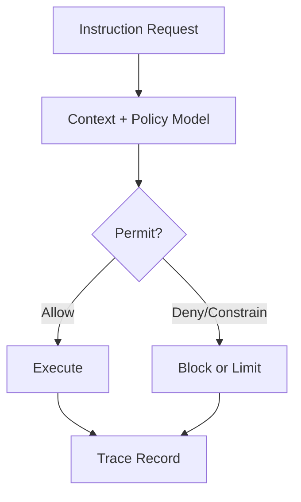

# Chapter 9: The Axion Safety Kernel

<!-- T81-TOC:BEGIN -->

## Table of Contents

- [Chapter 9: The Axion Safety Kernel](#chapter-9-the-axion-safety-kernel)
    - [Policy Enforcement Map](#policy-enforcement-map)
  - [9.1 Formal Definition](#91-formal-definition)
  - [9.2 The Policy Model](#92-the-policy-model)
  - [9.3 Instruction Interception](#93-instruction-interception)
  - [9.4 The Audit Log (Trace)](#94-the-audit-log-trace)
  - [9.5 Cognitive Promotion](#95-cognitive-promotion)
    - [Policy Lab Exercise](#policy-lab-exercise)
    - [Role-Based Learning Path](#role-based-learning-path)
    - [Worked Example](#worked-example)
    - [Hands-On Lab](#hands-on-lab)
    - [Cross-Chapter Continuity](#cross-chapter-continuity)
    - [Expected Outcomes](#expected-outcomes)
    - [Chapter Summary](#chapter-summary)
    - [Read Next](#read-next)

<!-- T81-TOC:END -->

Axion is the enforcement layer that turns policy intent into runtime behavior. Without a kernel like this, governance rules remain documentation rather than operational control.

For new users, Axion is best understood as a safety boundary that is explicit, inspectable, and auditable.

### Policy Enforcement Map

## 9.1 Formal Definition

Formally, Axion is a policy mediation component that sits between requested execution behavior and permitted execution behavior. It evaluates context and applies allow/deny/constraint outcomes according to defined rules.

The value of formality is predictability: policy behavior can be reasoned about before incidents occur.

## 9.2 The Policy Model

The policy model defines subjects, actions, resources, and constraints. In practice, this means execution decisions are based on explicit model elements rather than hidden runtime heuristics.

Onboarding rule: if a policy outcome surprises you, first verify model assumptions and input context before blaming runtime nondeterminism.

## 9.3 Instruction Interception

Instruction interception is the mechanism that lets policy participate in execution decisions. This is where governance meets machine semantics directly.

Teaching emphasis:

1. interception is intentional, not an error,
2. denied instructions can represent correct behavior,
3. trace evidence should explain why a decision was made.

## 9.4 The Audit Log (Trace)

Axion's audit log connects policy decisions to execution events. It gives teams a durable explanation path for "what was denied, what was allowed, and why."

This supports compliance, debugging, and post-incident analysis without relying on ambiguous recollection.

## 9.5 Cognitive Promotion

Cognitive promotion describes how more advanced execution capabilities can be introduced under controlled governance. Promotion is not automatic; it requires evidence and review.

A useful onboarding perspective is to treat promotion as a safety process, not a feature toggle.

### Policy Lab Exercise

Run a small program under two policy profiles:

1. baseline permissive profile,
2. constrained profile.

Then compare traces and produce a short explanation of behavioral differences. This exercise quickly builds intuition for policy-aware execution.

### Role-Based Learning Path

| Role | Focus In This Chapter | You Are Ready When |
| --- | --- | --- |
| New User | Interpret policy outcomes correctly | You can distinguish policy denial from runtime defect |
| Integrator | Design systems that cooperate with Axion controls | You can model one workflow with explicit policy checkpoints |
| Auditor | Validate policy-to-trace consistency | You can trace one deny/allow decision to model inputs |

### Worked Example

A feature appears unstable because behavior changes across runs. Analysis shows policy profile differences, not nondeterministic execution.

### Hands-On Lab

1. Run one program under two policy profiles.
2. Capture allow/deny differences from trace output.
3. Write a short explanation tied to model fields.

### Cross-Chapter Continuity

Run `Lab B: Policy-Constrained Execution Comparison` from [README](./README.md#cross-chapter-end-to-end-labs) after this chapter.

### Expected Outcomes

- You can treat Axion as a deterministic governance engine.
- You can diagnose policy-driven behavior confidently.

### Chapter Summary

You should now understand Axion as a runtime governance engine that converts policy declarations into enforceable, explainable outcomes.

### Read Next

Proceed to Chapter 10 for the cognitive tier model and distributed execution context.

<!-- chapter-nav-start -->

---

**Navigation**

- [Book Index](./README.md)
- [Previous: Chapter 8: Verification and Audit](./08_Verification_and_Audit.md)
- [Next: Chapter 10: Cognitive Tiers and Distributed Compute](./10_Cognitive_Tiers_and_Distributed_Compute.md)

<!-- chapter-nav-end -->
