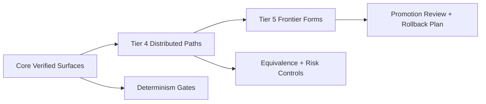

# Chapter 10: Cognitive Tiers and Distributed Compute

<!-- T81-TOC:BEGIN -->

## Table of Contents

- [Chapter 10: Cognitive Tiers and Distributed Compute](#chapter-10-cognitive-tiers-and-distributed-compute)
    - [Tier Progression Map](#tier-progression-map)
  - [10.1 The Cognitive Tier Model](#101-the-cognitive-tier-model)
  - [10.2 Distributed Compute (Tier 4)](#102-distributed-compute-tier-4)
  - [10.3 Trace-JIT and Advanced Runtime Paths](#103-trace-jit-and-advanced-runtime-paths)
  - [10.4 Infinite Forms (Tier 5)](#104-infinite-forms-tier-5)
    - [Tier Mapping Exercise](#tier-mapping-exercise)
    - [Role-Based Learning Path](#role-based-learning-path)
    - [Worked Example](#worked-example)
    - [Hands-On Lab](#hands-on-lab)
    - [Cross-Chapter Continuity](#cross-chapter-continuity)
    - [Expected Outcomes](#expected-outcomes)
    - [Chapter Summary](#chapter-summary)
    - [Read Next](#read-next)

<!-- T81-TOC:END -->

This chapter introduces the scaling model for advanced workloads while preserving governance and determinism discipline. The tier framework exists to prevent capability growth from outrunning assurance controls.

For onboarding, read tiers as maturity boundaries with explicit expectations, not as prestige labels.

### Tier Progression Map

## 10.1 The Cognitive Tier Model

The cognitive tier model organizes runtime capabilities by assurance maturity and governance readiness. Lower tiers prioritize stable core behavior; higher tiers introduce broader capability with more complex verification demands.

This helps teams answer an essential question: "What level of confidence can we responsibly claim for this execution surface today?"

## 10.2 Distributed Compute (Tier 4)

Distributed compute introduces coordination risk, timing variability, and broader failure modes. Tier 4 framing keeps these realities visible while defining controlled operating assumptions.

Onboarding guidance:

1. treat node-level consistency as a first-class concern,
2. verify artifact identity across participants,
3. separate deterministic claims from infrastructure noise.

## 10.3 Trace-JIT and Advanced Runtime Paths

Advanced runtime paths can improve throughput, but they also expand the equivalence burden. T81 treats optimization as valid only when behavior remains explainably aligned with deterministic boundaries.

A practical team habit is to pair performance measurements with equivalence evidence rather than treating them as separate tracks.

## 10.4 Infinite Forms (Tier 5)

Tier 5 concepts represent research-frontier capability where assurance claims are necessarily more conservative. The right posture is disciplined experimentation: explicit boundaries, explicit risk statements, explicit promotion criteria.

This prevents speculative capability from being misrepresented as production-certified behavior.

### Tier Mapping Exercise

Take one workload and classify it:

1. what tier it currently belongs to,
2. what evidence supports that classification,
3. what gaps block promotion.

This exercise aligns technical planning with governance reality.

### Role-Based Learning Path

| Role | Focus In This Chapter | You Are Ready When |
| --- | --- | --- |
| New User | Understand tier boundaries and assurance limits | You can classify one workload into the correct tier |
| Integrator | Plan promotion with explicit evidence gaps | You can produce a tier-promotion checklist for one feature |
| Auditor | Review distributed claims without overreach | You can flag claims that exceed current tier evidence |

### Worked Example

A team labels a distributed optimization as production-ready. Tier analysis shows missing equivalence evidence, so claim language is corrected to experimental Tier 4.

### Hands-On Lab

1. Choose one distributed workflow.
2. Identify tier, evidence, and unresolved risks.
3. Draft a promotion plan with pass/fail criteria.

### Cross-Chapter Continuity

Continue into `Lab C: Tier Classification and Promotion Plan` in [README](./README.md#cross-chapter-end-to-end-labs).

### Expected Outcomes

- You can couple scaling decisions to governance reality.
- You can prevent capability inflation in documentation.

### Chapter Summary

You should now see cognitive tiers as a governance-aware scaling model that keeps capability and assurance coupled.

### Read Next

Proceed to Chapter 11 for appendices that support practical interpretation and reference use.

<!-- chapter-nav-start -->

---

**Navigation**

- [Book Index](./README.md)
- [Previous: Chapter 9: The Axion Safety Kernel](./09_The_Axion_Kernel.md)
- [Next: Chapter 11: Appendices](./11_Appendices.md)

<!-- chapter-nav-end -->
