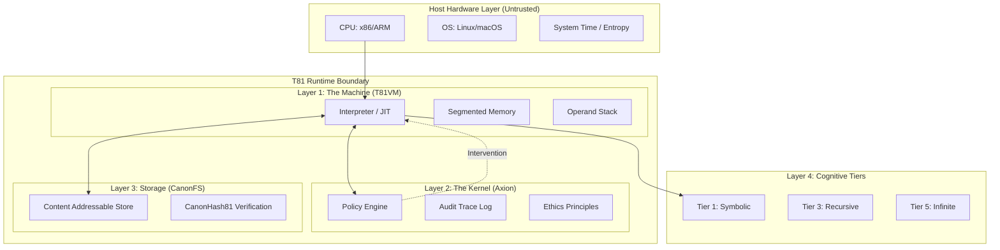

# Глава 1: Введение

<!-- T81-TOC:BEGIN -->

## Table of Contents

- [Глава 1: Введение](#глава-1-введение)
  - [1.1 Область применения и определение](#11-область-применения-и-определение)
    - [1.1.1 Ключевые Инварианты](#111-ключевые-инварианты)
  - [1.2 Архитектура системы](#12-архитектура-системы)
    - [1.2.1 Виртуальная машина TISC (T81VM)](#121-виртуальная-машина-tisc-t81vm)
    - [1.2.2 Ядро безопасности Axion](#122-ядро-безопасности-axion)
    - [1.2.3 Каноническая файловая система (CanonFS)](#123-каноническая-файловая-система-canonfs)
    - [1.2.4 Когнитивные уровни](#124-когнитивные-уровни)
  - [1.3 Миссия верифицируемых вычислений](#13-миссия-верифицируемых-вычислений)
    - [1.3.1 Инференс ИИ без доверия](#131-инференс-ии-без-доверия)
    - [1.3.2 Смарт-контракты и консенсус](#132-смарт-контракты-и-консенсус)
    - [1.3.3 Научная воспроизводимость](#133-научная-воспроизводимость)
  - [1.4 Терминология](#14-терминология)
  - [1.5 Чек-лист верификации](#15-чек-лист-верификации)
  - [Примечание автора для следующей редакции](#примечание-автора-для-следующей-редакции)

<!-- T81-TOC:END -->

## 1.1 Область применения и определение

**Статус: Реализовано и протестировано**

Проект **T81 Foundation** реализует архитектуру детерминированной виртуальной машины на базе троичной логики, разработанную для верифицируемых вычислений. В отличие от сред исполнения общего назначения, которые ставят в приоритет пропускную способность, аппаратную абстракцию или удобство разработчика, T81 ставит во главу угла **побитовую воспроизводимость**, **аудируемость** и **структурную честность**.

Система формально определяется как кортеж $\mathfrak{S} = (\mathcal{M}, \mathcal{A}, \mathcal{C}, \Phi)$, где:
- $\mathcal{M}$ — это **Виртуальная Машина TISC**, стековый автомат, работающий на сбалансированной троичной логике.
- $\mathcal{A}$ — это **Ядро Безопасности Axion**, супервизор на основе возможностей, обеспечивающий соблюдение политик во время выполнения.
- $\mathcal{C}$ — это **Каноническая Файловая Система (CanonFS)**, слой хранения с адресацией по содержимому, обеспечивающий неизменяемое разрешение артефактов.
- $\Phi$ — это набор **Инвариантов**, которые должны выполняться для любого валидного перехода системы.

Основная аксиома T81 заключается в том, что вычисление — это детерминированная функция, отображающая начальное состояние $S_0$ и входные данные $I$ в конечное состояние $S_n$ через последовательность дискретных, четко определенных переходов:
$$
\forall \text{hardware } H_1, H_2: \text{Exec}(S_0, I)_{H_1} \equiv \text{Exec}(S_0, I)_{H_2}
$$
Это тождество должно сохраняться на разных архитектурах процессоров (x86_64, ARM64, RISC-V), операционных системах и во времени.

### 1.1.1 Ключевые Инварианты

Архитектура обеспечивает соблюдение следующих не подлежащих обсуждению инвариантов:

1.  **Строгий детерминизм**: Выполнение валидной программы TISC (Ternary Instruction Set Computer) $P$ на входных данных $I$ производит последовательность переходов состояний $S_0 \to S_1 \to \dots \to S_n$, которая идентична на всех совместимых хост-архитектурах. Это исключает использование аппаратных блоков плавающей запятой (FPU) хоста для любых операций, влияющих на архитектурное состояние.
2.  **Нативная троичность**: Архитектура работает на сбалансированной троичной логике (триты $\in \{-1, 0, 1\}$), используя собственный арифметический стек (`dmath`) для избежания недетерминизма двоичных чисел с плавающей запятой и для соответствия информационно-теоретической оптимальности основания 3.
3.  **Принудительное соблюдение политик**: Все выполнение управляется **Ядром Axion**, супервизором на основе возможностей, который обеспечивает соблюдение политик безопасности (лимиты рекурсии, границы памяти, этические ограничения) *перед* завершением инструкции. Функция ядра $\alpha: (S, \text{Op}) \to \{\text{Allow, Deny}\}$ оценивается для каждой отправки инструкции.
4.  **Структурная честность**: Система не синтезирует информацию. Если результат приблизительный, он типизируется как таковой. Если процесс не завершается, он классифицируется в более высокий когнитивный уровень (Уровень 5). Система отвергает выполнение по принципу "лучших усилий" в пользу явного отказа.

> **Якорь верификации**: Цикл детерминированного выполнения реализован в `src/vm/vm.cpp` (см. `Interpreter::step()`). Примитивы троичной арифметики определены в `include/t81/ternary.hpp` и `include/t81/core/T81Float.hpp`.

## 1.2 Архитектура системы

Стек T81 состоит из четырех основных уровней, каждый из которых имеет четкие обязанности и границы верификации. Архитектура разработана для минимизации "Доверенной Вычислительной Базы" (TCB) путем отношения к аппаратному обеспечению хоста как к состязательной сущности, которая предоставляет сырые циклы, но не семантическую корректность.

### 1.2.1 Виртуальная машина TISC (T81VM)

**Статус: Реализовано и протестировано**

T81VM — это стековый интерпретатор для набора инструкций **Ternary Instruction Set Computer (TISC)**. Он управляет сегментированной моделью памяти, разработанной для предотвращения алиасинга указателей и переполнения буфера по построению.

Состояние VM формально определяется как кортеж $S = (R, PC, SP, M_{seg}, \Phi)$, где:
*   $R$: Регистровый файл, состоящий из 81 регистра общего назначения (от `r0` до `r80`), каждый из которых хранит типизированное `T81Value`.
*   $PC$: Счетчик команд, указывающий на следующую инструкцию в сегменте Кода.
*   $SP$: Указатель стека, указывающий на вершину стека операндов.
*   $M_{seg}$: Сегменты памяти (Код, Стек, Куча, Тензор, Мета).
*   $\Phi$: Регистр флагов статуса, кодирующий результат последней операции сравнения или арифметической операции ($\{<, =, >\}$).

Сегменты памяти:
*   **Код**: Сегмент инструкций только для чтения. Модификация невозможна после загрузки.
*   **Стек**: Хранилище LIFO для локальных переменных и адресов возврата.
*   **Куча**: Динамическое выделение памяти для сложных объектов (Тензоры, Графы). Управляется детерминированным сборщиком мусора Mark-and-Sweep.
*   **Тензор**: Специализированное хранилище для многомерных числовых данных, выровненное по границам 64 байта для SIMD-оптимизации (где это безопасно).
*   **Мета**: Возможности рефлексии и интроспекции, хранящие таблицы символов и отладочную информацию.

> **Ссылка**: См. `src/vm/vm.cpp`, структура `State`.

### 1.2.2 Ядро безопасности Axion

**Статус: Реализовано и протестировано**

Axion действует как гипервизор для T81VM. Он перехватывает каждую отправку инструкции для проверки соответствия активной **Политике**. В отличие от традиционных операционных систем, где безопасность часто является проверкой на границе системного вызова, Axion обеспечивает тонкую проверку возможностей на уровне *инструкции*.

Политики — это декларативные наборы правил, которые ограничивают:
*   **Использование ресурсов**: Общее выделение памяти, максимальная глубина стека, количество циклов инструкций.
*   **Поток управления**: Глубина рекурсии (Уровень 3), сложность ветвления (Уровень 2).
*   **Возможности**: Доступ к вводу-выводу, сети, системным вызовам файловой системы или когнитивным функциям высокого уровня.

Если инструкция нарушает политику (например, попытка `Recurse`, когда политика `recursion_limit=0`), Axion выдает вердикт `Deny`. Это вызывает немедленное прерывание VM с ошибкой `SecurityFault`, гарантируя, что несанкционированный переход состояния никогда не произойдет.

> **Ссылка**: Логика политик реализована в `src/axion/policy_engine.cpp` и `include/t81/axion/api.hpp`.

### 1.2.3 Каноническая файловая система (CanonFS)

**Статус: Частичная реализация**

CanonFS — это слой хранения с адресацией по содержимому, который гарантирует **структурную неизменность**. Он отвергает концепцию изменяемых путей к файлам. Вместо этого объекты (веса, код, данные) идентифицируются исключительно по их хэшу SHA3-256 (`CanonHash81`).

Когда VM запрашивает загрузку модуля или тензорной модели, она предоставляет хэш. CanonFS находит blob, проверяет, что его хэш совпадает с запросом, и только затем разрешает загрузку в память. Этот механизм гарантирует, что данные в памяти побитово идентичны артефакту, который был подписан и опубликован, исключая атаки через "дрейф зависимостей" и расхождения "работает на моей машине".

> **Ссылка**: Реализовано в `src/canonfs/` и определено в `spec/supplemental/canonfs-spec.md`. В настоящее время поддерживает базовую проверку хэшей и загрузку.

### 1.2.4 Когнитивные уровни

**Статус: Реализовано (Уровни 1-5)**

T81 организует вычислительную сложность в **Когнитивные Уровни**. Эта таксономия позволяет системе ограничивать "опасность" или "стоимость" вычислений. Простой арифметический скрипт не должен иметь возможности потреблять бесконечные ресурсы или выполнять неограниченную рекурсию.

*   **Уровень 1 (Символьный)**: Базовая арифметика, логика и циклы с фиксированными границами. Детерминировано за время $O(1)$ или $O(N)$. Безопасно для всех контекстов.
*   **Уровень 2 (Рефлексивный)**: Самоинспекция, захват трассы и динамическая диспетчеризация.
*   **Уровень 3 (Рекурсивный)**: Ограниченная рекурсия и генерация доказательств. Способен выражать общие рекурсивные функции, но ограничен политиками глубины стека.
*   **Уровень 4 (Распределенный)**: Переходы состояний на основе консенсуса, протоколы сплетен (gossip) и слияние состояний между узлами.
*   **Уровень 5 (Бесконечный)**: Геометрические ряды, нетерминируемые формы и кандидаты на "Проблему Остановки". Разрешено только с явными привилегиями `InfExpand`.

> **Ссылка**: Логика уровней находится в `src/cog/`. См. `src/cog/tier3/recursive.cpp` и `src/cog/tier5/infinite.cpp`.

## 1.3 Миссия верифицируемых вычислений

Основное применение T81 — это **Суверенные Вычисления**: возможность выполнять код и верифицировать результат, не доверяя оператору оборудования. Объединяя строгую программно-определяемую арифметику (`dmath`) с криптографическим журналом аудита (Axion Trace), T81 открывает новый класс приложений, где *целостность* вычислений имеет первостепенное значение.

### 1.3.1 Инференс ИИ без доверия
В мире непрозрачных моделей ИИ T81 позволяет осуществлять **Доказуемый Инференс**. Пользователь может запустить модель на удаленном узле и получить не только результат, но и криптографическое доказательство (Axion Trace), что:
1.  Была использована конкретная модель (идентифицированная по `CanonHash81`).
2.  Входные данные были точно такими, как указано.
3.  Процесс инференса следовал детерминированным правилам арифметики T81.

### 1.3.2 Смарт-контракты и консенсус
Детерминированная природа T81 делает его идеальной основой для выполнения смарт-контрактов. В отличие от EVM или WASM, которые полагаются на двоичную логику и часто испытывают трудности с детерминизмом плавающей запятой, T81 обеспечивает нативную поддержку высокоточной десятичной (троичной) математики, устраняя ошибки округления в финансовых вычислениях.

### 1.3.3 Научная воспроизводимость
"Кризис воспроизводимости" в науке — это отчасти кризис вычислительной стабильности. Симуляция, запущенная на суперкомпьютере в 2024 году, должна давать абсолютно те же результаты на ноутбуке в 2050 году. T81 гарантирует это, абстрагируя аппаратный блок плавающей запятой и системное время, гарантируя, что симуляция является инвариантным математическим объектом.

## 1.4 Терминология

Следующие термины используются точно на протяжении всей монографии.

| Термин | Определение |
| :--- | :--- |
| **Трит** | Цифра по основанию 3: $\{-1, 0, 1\}$. Фундаментальный атом логики T81. |
| **Трайт** | Последовательность тритов. Стандартный трайт состоит из 4 тритов ($3^4 = 81$ значений), обычно упакованных в `uint8_t` для хранения. |
| **TISC** | Ternary Instruction Set Computer (Архитектура набора команд). ISA для T81VM. |
| **Axion** | Ядро безопасности, принудительного соблюдения политик и аудита среды выполнения T81. |
| **CanonRef** | Каноническая ссылка (хэш SHA3-256) на неизменяемый объект в CanonFS. |
| **Promotion** (Продвижение) | Акт повышения привилегий или перемещения вычисления на более высокий Когнитивный Уровень. |
| **dmath** | Детерминированная математика. Программная библиотека, реализующая побитово точную троичную арифметику и трансцендентные функции. |
| **Verifiable Trace** (Верифицируемая Трасса) | Криптографически подписанный журнал всех переходов состояний и проверок политик, выполненных во время выполнения. |
| **Structural Honesty** (Структурная Честность) | Принцип, согласно которому система должна явно декларировать природу своих результатов (точные, приблизительные, нетерминируемые), а не скрывать сложность. |

## 1.5 Чек-лист верификации

Следующий чек-лист определяет критерии приемки для совместимой реализации T81.

*   [ ] **Детерминизм**: Производит ли VM идентичные трассы на архитектурах x86, ARM и RISC-V? (Проверяется `scripts/ci/t81lang_repro_gate.py`)
*   [ ] **Изоляция**: Корректно ли Axion перехватывает запрещенные инструкции и обеспечивает соблюдение лимитов ресурсов? (Проверяется `tests/cpp/test_ethics.cpp` и `tests/cpp/test_resource_monitoring.cpp`)
*   [ ] **Постоянство**: Корректно ли CanonFS извлекает объекты по хэшу и отвергает поврежденные данные? (Проверяется `tests/cpp/canonfs_driver_test.cpp`)
*   [ ] **Арифметика**: Удовлетворяет ли `dmath` математическим тождествам сбалансированной троичной логики? (Проверяется `tests/cpp/ternary_arith_test.cpp`)
*   [ ] **Политика**: Корректно ли ограничения уровней предотвращают выполнение опкодов высокого уровня кодом низкого уровня? (Проверяется `tests/cpp/test_tier3_opcodes.cpp`)

## Примечание автора для следующей редакции

*   **Открытые вопросы**: Формальное доказательство эквивалентности между оптимизацией трасс JIT-компилятора и функцией шага интерпретатора требует строгого обоснования в Разделе 11.
*   **Предлагаемые рисунки**: Диаграмма последовательности, показывающая взаимодействие между Интерпретатором, Движком Политик Axion и Регистратором Трасс во время одного цикла инструкции, была бы полезна в Разделе 1.2.
*   **Перекрестные ссылки**: Убедиться, что "Исследовательский Фронтир" (Глава 14) обновлен для отражения недавнего прогресса в реализации Бесконечных Форм Уровня 5.

---
**Canonical Source**: /book (English)
**Source Version**: Phase 1 Expansion
**Last Synced**: 2026-02-23
**Translation Status**: Needs Update
---
