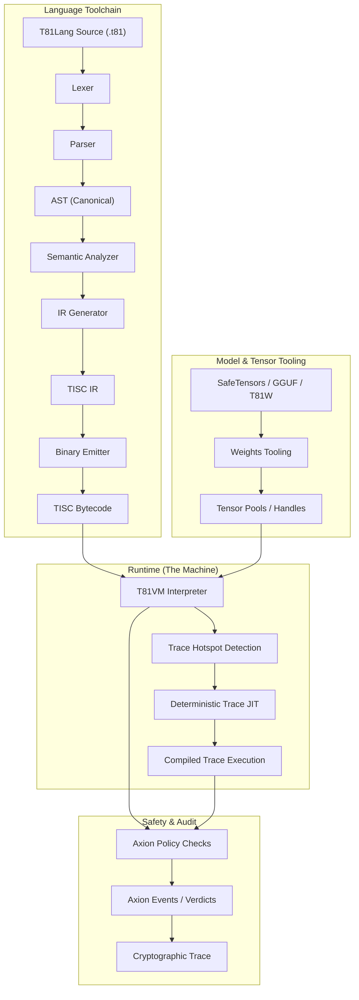

# Глава 3: Архитектура T81VM

<!-- T81-TOC:BEGIN -->

## Table of Contents

- [Глава 3: Архитектура T81VM](#глава-3-архитектура-t81vm)
  - [3.1 Обзор](#31-обзор)
    - [3.1.1 Конвейер выполнения](#311-конвейер-выполнения)
  - [3.2 Граница рантайма](#32-граница-рантайма)
  - [3.3 Модель памяти](#33-модель-памяти)
    - [3.3.1 Формальное определение состояния](#331-формальное-определение-состояния)
    - [3.3.2 Сегменты памяти](#332-сегменты-памяти)
    - [3.3.3 Хендлы и косвенная адресация](#333-хендлы-и-косвенная-адресация)
  - [3.4 Набор инструкций (TISC)](#34-набор-инструкций-tisc)
    - [3.4.1 Цикл инструкции](#341-цикл-инструкции)
    - [3.4.2 Категории опкодов](#342-категории-опкодов)
  - [3.5 JIT-компиляция (Trace-JIT)](#35-jit-компиляция-trace-jit)
    - [3.5.1 Процесс трассировки](#351-процесс-трассировки)
    - [3.5.2 Поведенческая эквивалентность](#352-поведенческая-эквивалентность)

<!-- T81-TOC:END -->

## 3.1 Обзор

**Статус: Стабильно**

**Виртуальная Машина T81 (T81VM)** — это движок выполнения стека T81. Она обеспечивает строгое разделение между компиляцией и выполнением, регулируемое явными контрактами на детерминизм и безопасность. Архитектура определяется взаимодействием между Инструментарием Языка (Language Toolchain), Рантаймом (VM) и Ядром Безопасности (Axion).

### 3.1.1 Конвейер выполнения

Поток программы от исходного кода до верифицированного выполнения включает несколько этапов канонизации и верификации.

## 3.2 Граница рантайма

**Статус: Реализовано**

Граница между средой хоста и рантаймом T81 жестко определена. Рантайм действует как **герметичное уплотнение**.
- **Вход**: Байткод, Канонические Входные Данные, Конфигурация Политик.
- **Выход**: Канонический Результат, Журнал Аудита, Ошибка/Ловушка.
- **Побочные эффекты**: Строго запрещены, если явно не разрешены Политикой (напр., `MetaWrite` или `Gossip`).

Контракт рантайма (`contracts/runtime-contract.json`) точно указывает, какие входные и выходные данные разрешены, гарантируя, что никакое скрытое состояние (например, переменные окружения или файловые дескрипторы) не просочится в контекст выполнения.

## 3.3 Модель памяти

**Статус: Реализовано и протестировано**

VM использует **Сегментированную Модель Памяти** для гарантии безопасности памяти и предотвращения перехвата потока управления по построению. В отличие от плоских адресных пространств, где код и данные перемешаны, T81 обеспечивает строгое разделение.

### 3.3.1 Формальное определение состояния
Состояние машины в любой тик $t$ определяется как кортеж $S_t = (\mathbf{R}, \mathbf{M}, \mathbf{K}, \mathbf{\Phi})$, где:

*   **Регистры ($\mathbf{R}$)**: Банк из 243 регистров общего назначения ($R_0 \dots R_{242}$). Каждый регистр хранит типизированное 64-битное значение (целочисленная полезная нагрузка или хендл) и соответствующий `ValueTag`.
*   **Память ($\mathbf{M}$)**: Коллекция непересекающихся сегментов.
*   **Стек управления ($\mathbf{K}$)**: Стек фреймов вызова, управляющий вызовом функций и адресами возврата.
*   **Флаги ($\mathbf{\Phi}$)**: Флаги статуса $\{Z, N, P\}$, указывающие результат последней арифметической операции (Ноль, Отрицательное, Положительное).

### 3.3.2 Сегменты памяти
Память разделена на логические регионы. Доступ к памяти через границы сегментов без специальных опкодов невозможен.

| Сегмент | Доступ | Назначение |
| :--- | :--- | :--- |
| **Код** | Только чтение | Хранит неизменяемый поток инструкций. PC указывает сюда. |
| **Стек** | Чтение/Запись | LIFO хранилище для локальных переменных. Растет вниз. |
| **Куча** | Управляемая | Динамическое выделение для сложных объектов. Управляется GC. |
| **Тензор** | Управляемая | Специализированный пул для объектов `T81Tensor`. Выровнен для SIMD. |
| **Мета** | Только чтение | Данные рефлексии, таблицы символов и метаданные отладки. |

### 3.3.3 Хендлы и косвенная адресация
Для предотвращения повреждения памяти и атак через адресную арифметику, VM использует **Непрозрачные Хендлы**.
- Регистр не хранит сырой указатель `0x7fff...`.
- Вместо этого он хранит хендл `TensorHandle(42)`.
- VM разрешает `Index[42]` в Сегменте Тензора в реальное местоположение памяти.
- Попытка доступа к `TensorHandle(43)`, если существует только 42 тензора, приводит к немедленному `Trap::SegFault`.

## 3.4 Набор инструкций (TISC)

**Статус: Реализовано и протестировано**

**Ternary Instruction Set Computer (TISC)** — это нативный язык VM. Это стековая ISA со специализированной поддержкой троичной логики и когнитивных операций высокого уровня.

### 3.4.1 Цикл инструкции
Для каждой инструкции VM выполняет строгий цикл:

1.  **Выборка (Fetch)**: Получить опкод по адресу `Code[PC]`.
2.  **Декодирование (Decode)**: Разобрать операнды (регистры, непосредственные значения).
3.  **Проверка политики (Policy Check)**: Ядро Axion оценивает $\alpha(S, \text{Op})$. Если `Deny`, вызывает `SecurityFault`.
4.  **Выполнение (Execute)**: Выполнить переход состояния $S' = \delta(S, \text{Op})$.
5.  **Завершение (Retire)**: Инкрементировать `PC`, обновить Трассу и запустить Сборку Мусора, если сработал триггер аллокации.

### 3.4.2 Категории опкодов
*   **Арифметика**: `Add`, `Mul`, `Div` (Троичная), `FAdd`, `FMul` (Soft-Float).
*   **Поток управления**: `Jump`, `Branch`, `Call`, `Ret`.
*   **Перемещение данных**: `Load`, `Store`, `Move`.
*   **Когнитивные операции**:
    *   `Recurse`: Войти в рекурсивную область (Уровень 3).
    *   `Reflect`: Снимок текущего состояния (Уровень 2).
    *   `Gossip`: Обмен состоянием с пирами (Уровень 4).
    *   `InfExpand`: Инстанцировать бесконечную форму (Уровень 5).
*   **Тензорные операции**: `TensorAdd`, `TensorMul`, `MatMul`, `BroadCast`.

> **Ссылка**: См. `spec/tisc-spec.md` для полного справочника набора инструкций.

## 3.5 JIT-компиляция (Trace-JIT)

**Статус: Экспериментально / Частичная реализация**

Чтобы примирить конфликт между "Строгим Детерминизмом" и "Высокой Производительностью", T81 использует **Детерминированный Trace JIT**.

### 3.5.1 Процесс трассировки
1.  **Профилирование**: Интерпретатор считает итерации цикла. Когда цикл превышает порог (`kHotThreshold`), запускается трассировка.
2.  **Запись**: VM переходит в "Режим Записи", логируя каждый выполненный опкод и *значения* любых охранных выражений (ветвлений).
3.  **Оптимизация**: Записанная трасса оптимизируется (свертка констант, удаление мертвого кода) в *предположении*, что условия охраны выполняются.
4.  **Компиляция**: Трасса компилируется в машинный код (или шитый код).

### 3.5.2 Поведенческая эквивалентность
JIT должен строго придерживаться **Инварианта Эквивалентности**:
$$
\text{Exec}_{\text{JIT}}(S) \equiv \text{Exec}_{\text{Interp}}(S)
$$
Если оптимизированный код встречает состояние, где охрана не срабатывает (напр., ошибка проверки типа), он должен **Деоптимизироваться** — передать управление обратно интерпретатору в точной точке сбоя, восстанавливая полное состояние интерпретатора. Это гарантирует, что оптимизация никогда не изменит семантику или результат программы.

> **Верификация**: `tests/cpp/jit_test.cpp` и `tests/cpp/jit_trace_equivalence_test.cpp` проверяют, что выполнение JIT точно соответствует интерпретатору для случайных входных данных.

---
**Canonical Source**: /book (English)
**Source Version**: Phase 1 Expansion
**Last Synced**: 2026-02-23
**Translation Status**: Needs Update
---
