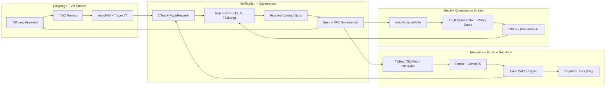
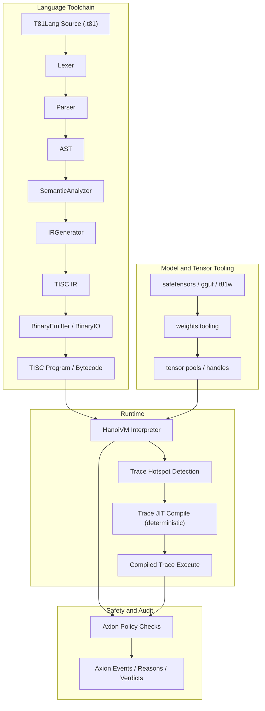

# T81 Foundation: Architecture Overview

This document maps the current T81 codebase architecture: build graph, runtime flow, verification surfaces, and cross-repo runtime boundary contracts.

**Status scope:** current `main` branch architecture as of February 17, 2026.

______________________________________________________________________

## 1. Guiding Principles

- **Spec semantics are authoritative:** `../../spec` defines normative behavior. If implementation diverges, resolve in favor of spec semantics.
- **Determinism first:** all compiler/runtime paths must preserve reproducible outputs and auditable traces, adhering to the Strict Determinism Profile (`../../spec/determinism-profile.md`).
- **Layered composition via CMake:** components are separated by responsibility and linked through explicit target dependencies.
- **Optimization without semantic drift:** interpreter, trace-JIT, SIMD, and tooling must preserve canonical behavior.

Applied examples:
- Determinism: cross-arch CI gates compare T81Lang and T3_K artifact hashes for stable replay guarantees.
- Layering: `t81_tool_cli` depends on frontend/TISC/VM facades rather than re-implementing runtime behavior.
- Spec authority: behavior changes route through `../../spec/` and RFC flow before becoming implementation contracts.

______________________________________________________________________

## 2. Build Graph (Authoritative Targets)

The authoritative build graph is `../../CMakeLists.txt`. It includes static libraries, interface libraries, executables, tests, optional Python bindings, and optional benchmarks.

| Target | Kind | Responsibilities | Depends On |
| --- | --- | --- | --- |
| `t81_core` | STATIC | Core numerics, VM runtime, JIT compiler, Axion engine, CanonFS, codecs, hashing/crypto, weights internals, Cognitive Tiers | (none) |
| `t81_io` | STATIC | Tensor/model I/O helpers | `t81_core` |
| `t81_c_api` | STATIC | C ABI surface for selected runtime/core functions | `t81_core` |
| `t81_lang_frontend` | STATIC | Lexer, parser, semantic analyzer (T81Lang frontend) | `t81_core` |
| `t81_isa` | STATIC | TISC IR/binary emitter, pretty printer, binary I/O, base81 TISC views | `t81_core` |
| `t81_vm` | INTERFACE | VM public facade target for consumers/tests | `t81_core` |
| `t81_llvm` | INTERFACE | LLVM-facing facade target (placeholder/adapter layer) | `t81_core` |
| `t81_tool_cli` | STATIC | CLI orchestration (compile/run/trace/repro/tools) | `t81_lang_frontend`, `t81_isa`, `t81_vm` |
| `t81` | EXECUTABLE | Main CLI entry point | `t81_lang_frontend`, `t81_isa`, `t81_vm`, `t81_tool_cli` |
| `t81_python` | MODULE (optional) | `pybind11` Python bindings | `t81_core`, `t81_lang_frontend`, `t81_isa`, `t81_vm` |
| `benchmark_runner` (subdir) | EXECUTABLE (optional) | Benchmark suite and docs benchmark generation pipeline | `t81_core`, `t81_lang_frontend`, `t81_isa`, `t81_vm`, Google Benchmark |

Notes:
- CMake defaults to `cxx_std_23`; a temporary compatibility lane remains available via `-DT81_USE_CXX23=OFF`.
- CMake is the only supported authoritative build surface in this repository.
- Build switches: `T81_BUILD_TESTS`, `T81_BUILD_EXAMPLES`, `T81_BUILD_BENCHMARKS`, `T81_BUILD_FUZZ_TESTS`.
- Optional external dependencies: `pybind11` (Python module) and Google Benchmark (`benchmarks/` target).

______________________________________________________________________

## 3. Concurrent Workstream View

The repository is developed as multiple active streams that share deterministic contracts and CI gates.



How to read this:
- `Language + VM` produces and executes deterministic bytecode.
- `Numerics + Runtime` defines canonical arithmetic/tensor behavior and policy enforcement.
- `Model + Quantization` produces reproducible model artifacts (`t81w` and GGUF/T3_K).
- `Verification + Governance` continuously validates all streams and feeds requirements back into implementation.

______________________________________________________________________

## 4. End-to-End Flow



Primary stages:
1. Frontend compiles `.t81` source to validated TISC IR.
2. TISC layer serializes IR to deterministic bytecode.
3. HanoiVM executes via interpreter, with trace-JIT on hot deterministic paths.
4. Axion enforces policy and records boundary/fault events for replay and audit.
5. Weights/tensor tooling feeds model tensors into runtime via canonical handles.

Failure boundaries:
- Lexer/parser/semantic failures stop before IR emission and surface diagnostics via CLI.
- VM/Axion faults are deterministic traps with auditable reason codes and trace events.

______________________________________________________________________

## 5. Determinism and Verification Plane

Architecture is enforced by automated gates, not just design intent:

- **Build + full test ritual:** CMake + CTest matrix in `../../CMakeLists.txt`.
- **Extended fuzz/property/Axion checks:** optional but standard pre-release validation.
- **Cross-arch reproducibility gates:** T3_K and T81Lang hash gates in CI.
- **Repro ledger workflow:** scheduled artifact generation for reproducibility evidence.
- **Runtime contract sync checks:** script-backed verification against runtime boundary pins.

Operational sources:
- `../reference/ci.md`
- `../how-to/system-integration.md`
- `../../.github/workflows/ci.yml`
- `../../.github/workflows/repro-ledger.yml`
- `../../scripts/ci/t3k_repro_gate.py`
- `../../scripts/ci/t81lang_repro_gate.py`
- `../../scripts/ci/check_architecture_targets.py`
- `../../scripts/ci/check_legacy_core_numeric_includes.py`
- `../../scripts/ci/check_legacy_core_numeric_type_usage.py`
- `../../scripts/ci/check_legacy_v1_numeric_includes.py`
- `../../scripts/ci/check_core_numeric_wrapper_thinness.py`
- `../../scripts/check-runtime-contract-sync.py`

| Gate / Tool | Purpose | Source |
| --- | --- | --- |
| Build + test ritual | Compile and run deterministic baseline suite | `../../CMakeLists.txt`, CTest |
| T3_K reproducibility gate | Validate cross-run/cross-arch reproducibility of T3_K artifacts | `../../scripts/ci/t3k_repro_gate.py` |
| T81Lang reproducibility gate | Validate deterministic compile/hash behavior | `../../scripts/ci/t81lang_repro_gate.py` |
| Architecture target sync gate | Check `ARCHITECTURE.md` target table against `../../CMakeLists.txt` | `../../scripts/ci/check_architecture_targets.py` |
| Legacy numeric include policy gate | Block new includes of compatibility-only `t81/core/{bigint,fraction}.hpp` | `../../scripts/ci/check_legacy_core_numeric_includes.py` |
| Legacy numeric type-usage policy gate | Block new source-level use of compatibility-only `t81::core::{BigInt,Fraction}` | `../../scripts/ci/check_legacy_core_numeric_type_usage.py` |
| Legacy v1 implementation include policy gate | Block new includes of migration-only `t81/core/{T81BigInt,T81Fraction}.hpp` | `../../scripts/ci/check_legacy_v1_numeric_includes.py` |
| Core wrapper thinness policy gate | Keep `../../core/types/{bigint,fraction}.cpp` adapter-only and block arithmetic implementation tokens | `../../scripts/ci/check_core_numeric_wrapper_thinness.py` |
| Runtime contract sync gate | Verify runtime boundary pin and policy coherence | `../../scripts/check-runtime-contract-sync.py` |

______________________________________________________________________

## 6. Runtime Contract Boundary

T81 uses an explicit cross-repo runtime semantics boundary:

- **`t81-foundation` owns:** normative semantics, language/ISA intent, architectural invariants.
- **`t81-vm` owns:** executable runtime compatibility artifacts and VM host ABI contract.
- **pinned contract marker:** `../../contracts/runtime-contract.json`.
- **Boundary policy document:** [`runtime-semantics-boundary.md`](runtime-semantics-boundary.md).

This split keeps semantic governance stable while allowing runtime implementation to evolve under explicit compatibility contracts.

______________________________________________________________________

## 7. Key Architectural Boundaries

- **Frontend vs Runtime:** `t81_lang_frontend` produces typed/validated IR; it does not execute programs.
- **TISC Format vs VM Execution:** `t81_isa` defines program representation; `t81_vm` executes it via interpreter and trace-JIT.
- **Core as substrate:** `t81_core` provides shared primitives/services (VM state, Axion, CanonFS, codecs, tensor numerics) and is the dependency root.
- **Policy vs performance:** Axion policy checks and trace logging remain mandatory across interpreter and compiled trace paths.
- **Model tooling vs execution:** `weights` tooling transforms/loads tensors; HanoiVM consumes handles without changing provenance semantics.

______________________________________________________________________

## 8. Numeric API Consolidation and Compatibility

The repository now treats canonical numeric types as the primary API and keeps
legacy core numerics as compatibility shims:

- Canonical path for new code:
  - `t81/bigint.hpp` (`t81::T81BigInt`)
  - `t81/fraction.hpp` (`t81::T81Fraction`)
  - `t81::v1` numerics for performance-oriented code paths
- Compatibility path (legacy callers):
  - `t81::core::BigInt` now delegates to canonical `t81::T81BigInt`
  - `t81::core::Fraction` formatting canonicalizes through `t81::T81Fraction`

Migration policy:
- Do not add new feature work to `t81::core::{BigInt,Fraction}`.
- Keep compatibility behavior stable until explicit removal RFC.
- Route new arithmetic/perf work through canonical headers and `t81::v1`.
- Treat `t81/core/{T81BigInt,T81Fraction}.hpp` as migration-only implementation
  headers and block new direct includes via CI policy gates.

______________________________________________________________________

## 9. Architecture Drift Controls

- **Target-table sync gate:** `scripts/ci/check_architecture_targets.py` verifies that this document's build-target table matches `CMakeLists.txt`.
- **Runtime boundary sync gate:** `scripts/check-runtime-contract-sync.py` verifies runtime contract pinning and policy documents are coherent.
- **Cross-arch reproducibility gates:** CI compares deterministic artifacts across architecture lanes for T81Lang and T3_K workflows.

These controls are required to keep architecture documentation operationally accurate rather than aspirational.

______________________________________________________________________

## 10. Near-Term Architecture Work (Open)

Architecture-level items are tracked in `../status/TASKS.md`. Current active streams:

- **Cognitive Tier Logic:** Implementing graph rewriting (T243) and reflective trace capture (T729).
- **Deterministic trace-JIT MVP hardening:** side-effect-free numeric/tensor hot-path compilation with Axion boundary checks.
- **BigInt performance path:** SIMD/Karatsuba-oriented multi-limb optimizations without changing canonical arithmetic semantics.
- **CanonFS scalability path:** higher-throughput persistence and retrieval while preserving deterministic traceability.
- **Distributed tensor path:** sharding/runtime orchestration for higher-rank tensor workloads under deterministic replay constraints.
- **Formal verification path:** proofs for core balanced ternary arithmetic primitives and policy-safety envelopes.

______________________________________________________________________

## 11. Glossary (Project Terms)

- **Axion:** safety/policy enforcement engine that emits deterministic verdicts and trace metadata.
- **CanonFS:** deterministic storage and retrieval substrate used by runtime/model tooling.
- HanoiVM / T81VM: deterministic virtual machine that executes TISC bytecode with 81 registers and Base-81 alignment.
- TISC: Ternary instruction representation and binary format executed by HanoiVM. Supports 81 registers (R0-R80) including the Axion System Window.
- **T3_K:** ternary quantization format/policy path used in model artifact workflows.
- **Cognitive Tiers:** Higher-order logic constructs (Symbolic, Reflective, Recursive, Distributed, Infinite) integrated into the VM.

______________________________________________________________________

## 12. Local Verification Ritual (Single-Threaded Safe Mode)

When host stability is constrained, run the required ritual in single-threaded mode:

```bash
cmake -S . -B build -DCMAKE_BUILD_TYPE=Release
cmake --build build --parallel 1
ctest --test-dir build --output-on-failure -j1
```

Optional extended suite (single-threaded):

```bash
ctest --test-dir build -R "fuzz|property|axion" --schedule-random -j1
```

______________________________________________________________________

## 13. Ownership Map

| Component | Directory | Primary Maintainers | Spec Authority |
| :--- | :--- | :--- | :--- |
| **T81Lang** | `../../lang/frontend/`, `../../include/t81/frontend/` | @t81dev | `../../spec/lang/` |
| **TISC** | `../../core/isa/`, `../../include/t81/isa/` | @t81dev | `../../spec/tisc/` |
| **HanoiVM** | `../../core/vm/`, `../../include/t81/vm/` | @t81dev | `../../spec/vm/` |
| **Axion** | `../../kernel/axion/`, `../../include/t81/axion/` | @t81dev | `../../spec/axion/` |
| **CanonFS** | `../../src/canonfs/`, `../../include/t81/canonfs/` | @t81dev | `../../spec/canonfs/` |
| **Cognitive** | `../../experimental/tiers/cog/`, `../../include/t81/cog/` | @t81dev | `../../spec/companion/t81-spec.md` |
| **Numerics** | `../../core/types/`, `../../include/t81/types/` | @t81dev | `../../spec/numerics/` |
| **CI/Scripts** | `../../.github/`, `../../scripts/` | @t81dev | `../reference/ci.md` |
